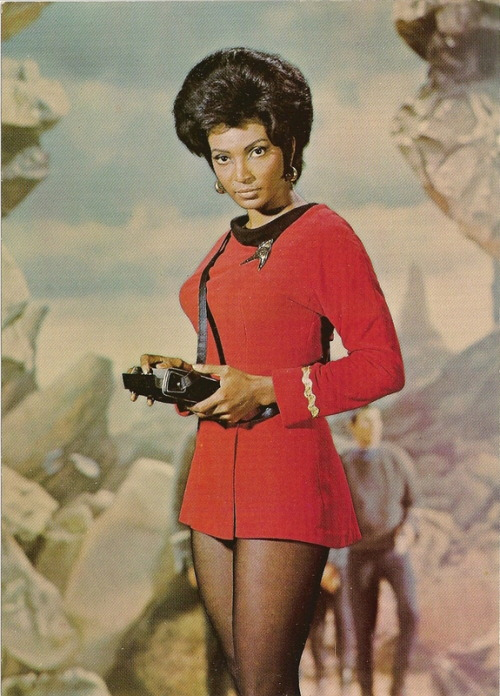

Uhura viene de la palabra suajili uhuru, que significa libertad. En el
mundo futurista de Gene Rodenberry, el creador de Star Trek, la
humanidad ha superado los prejuicios del racismo, el sexismo, y la
xenofobia. Por eso que al crear la tripulación de la nave estelar
Enterprise la pobló de gente de distintas nacionalidades, como un
navegante ruso, un mensaje claro en plena época de guerra fría.

Sin embargo, los ejecutivos de NBC se opusieron a que contratara a
Nichelle Nichols, la actriz que interpretaba al personaje de Uhura, como
miembro permanente de la exitosa serie de ciencia ficción, había temor a
molestar a los asociados de los estados del Sur Profundo.

Así que Gene Rodenberry se vio obligado a contratar a Nichols por
servicios diarios, aunque finalmente la actriz terminó ganando más
dinero que otros actores de la serie, todo este trato le pareció
humillante, y al finalizar la primera temporada había tomado la decisión
de dejar el programa. Pero fue un encuentro con Martin Luther King el
que la hizo cambiar su decisión. El reverendo le pidió que siguiera
interpretando aquel papel, porque era una inspiración al interpretar el
primer rol sin estereotipos de una mujer negra en televisión.

La actriz Whoopi Golberg, y la astronauta Mae Jemison han confesado
públicamente su inspiración en el personaje de Uhura. Cuando la serie
Star Trek fue cancelada en 1969, Nichols trabajó de voluntaria para la
NASA con el fin de reclutar personal femenino y perteneciente a
minorías. Entre las personas reclutadas por su trabajo están   Sally
Ride, la primera mujer astronauta norteamericana y a los primeros
astronautas afroamericanos Judith Resnik y Ronald McNair.

Lo que nos enseña esta historia es  que no se trata de \"mejorar la
raza", se trata de inspirar a otros a tener confianza en si mismo, a
superarse, y a superar las barreras que les impone la sociedad.
Necesitamos más modelos que nos ayuden a mejorar como personas. Eso se
llama educación, cultura, diversidad y es lo que hace grandes a las
naciones.

Foto
[vía](http://wilwheaton.tumblr.com/post/14173672444/deejaybird-uhura-comes-from-the-swahili-word)
