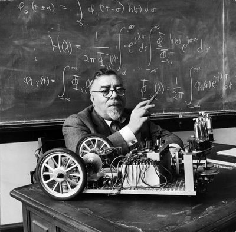

> "Nadamos contracorriente contra un torrente de desorganización, el
> que tiende a reducirlo todo al calor muerto del equilibrio y la
> monotonía\... Este calor muerto en física tiene una contraparte en la
> ética de Kierkegaard, quien señaló que vivimos en un universo
> moralmente caótico. En esto, nuestra obligación principal es
> establecer enclaves arbitrarios de orden y sistema\... Como la Reina
> Roja, no podemos quedarnos donde estamos sin correr tan rápido como
> podamos."\
> --Norbert Wiener, matemático, acuño el término cibernética

