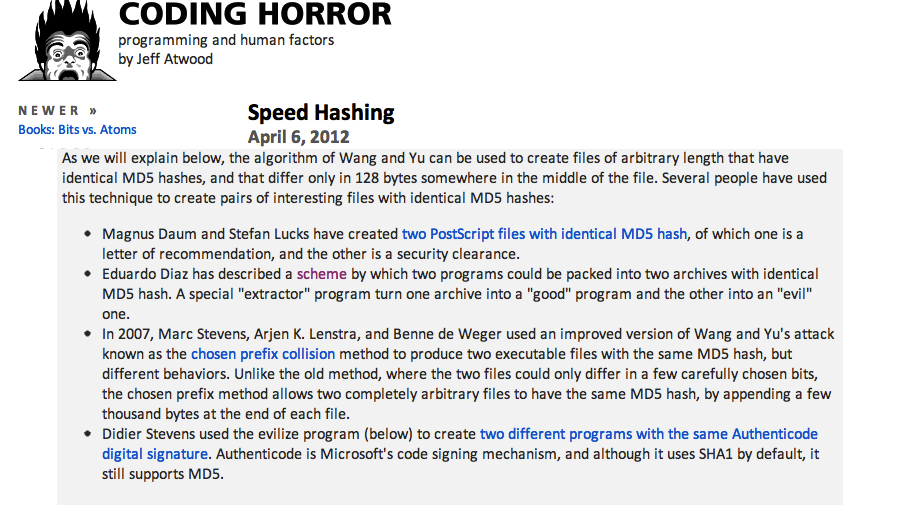

Hace unos días atrás Jeff Atwood, el autor del famoso blog [Coding
Horror](http://www.codinghorror.com)  menciona mi trabajo de de 2005
sobre [las colisiones de MD5](http://www.codinghorror.com/blog/2012/04/speed-hashing.html):

-   Eduardo Diaz has described
    a [scheme](http://www.codeproject.com/dotnet/HackingMd5.asp) by
    which two programs could be packed into two archives with identical
    MD5 hash. A special "extractor" program turn one archive into a
    "good" program and the other into an "evil" one.

Aparte de que me honra la mención, y el autobombo :),  hay dos cosas que
me gustaría comentar sobre [ese
post](http://www.codinghorror.com/blog/2012/04/speed-hashing.html).

La primera observación que quiero hacer es sobre el artículo de Atwood.
Él se concentra en la velocidad con que se pueden calcular hashes en las
máquinas actuales, sobretodo usando hardware disponible a través de los
procesadores gráficos, o GPU.

Verán, una GPU es un chip muy muy rápido que tiene capacidades de
procesamiento paralelo y es usado para despliegue de gráficos y video,
esto es muy útil para los juegos, por ejemplo.Para que perciban la
velocidad de una GPU la mejor demostración que conozco es este video en
vivo de Adam y Jaime, los mythbusters:



[CPU vs GPU](http://vimeo.com/1616258) from [Juan
Diez](http://vimeo.com/user483962) on [Vimeo](http://vimeo.com).

¿Les queda claro la capacidad de estos procesadores? Bueno, esa
capacidad que puede ser usada para generar efectos especiales o
desplegar cientos de naves espaciales flotando en el espacio, puede ser
usado para  calcular funciones de hash, como MD5.

¿Para que sirve todo eso? Para hacer maldades, como  tratar de
determinar las claves de los usuarios almacenadas en una base de datos,
o alterar la firma digital de un archivo.

El punto de Atwood es, en esencia, que los "chicos malos" tienen mucho
poder de cálculo en sus computadores personales, y lo que hay que buscar
son nuevos algoritmos de cifrado que sean complejos, tan complejos que
no puedan ser implementados en forma fácil en una GPU.

El problema es que el artículo de Atwood se concentra en un sólo aspecto
de las ataques a los algoritmos de hash, el ataque por fuerza bruta, y
mi prueba de concepto de 2005 no es un ataque de ese tipo, utiliza una
propiedad del algoritmo MD5 que es una falla de diseño. Si les interesan
los detalles técnicos  les sugiero leer [mi artículo en
CodeProject](http://www.codeproject.com/Articles/11643/Exploiting-MD5-collisions-in-C)
de 2005 en (en inglés). Lo importante es que no es necesario tener
acceso a hardware muy sofisticado para poder vulnerar el algoritmo MD5,
sólo es necesario ingenio y unas cuantas lineas de código. Siempre se
puede mejorar todo mediante el software.

La segunda observación parte del hecho de que este es un trabajo de 2005
y ya en ese año este problema de vulnerabilidad era conocido hacer rato.
Lo malo es que la comunidad tecnológica sigue ignorando estos
descubrimientos.

Por ejemplo, en [un reporte  de 2009](http://www.ief.es/documentos/recursos/publicaciones/revistas/cuadernos_formacion/08_2009/14.pdf)
Fernando Barraza informa que el sello digital usado en las facturas
electrónicas en México se basa en Md5 \[1\]. La factura electrónica
chilena usa SHA-1, un algoritmo que también presenta vulnerabilidades
conocidas hace años. Muchas circulares de algunas superintendencias en
nuestro país definen intercambios de información sensible que deben
"firmarse" digitalmente usando MD5.

MD5 sigue siendo usado como un hash válido en muchos sitios de descarga
o en administradores de contenido, como una forma de verificar la
integridad de los archivos. Así que en la práctica a nadie parece
 preocuparle el tema. Mi prueba de concepto puede ser usada para colocar
un troyano en un repositorio de distribución de software, y los usuarios
e incluso los administradores no lo notarían, por ejemplo.

"El mundo está parado en palitos",  afortunadamente parece que los
seres humanos somos en general buenas personas porque nadie ha usado los
esquemas descritos para vulnerar la seguridad de forma seria,  no es muy
reconfortante para los que nos preocupamos de la seguridad informática,
pero así están las cosas\...

\[1\] El reporte de Barraza se titula "La Factura Electrónica como
instrumento de control de las obligaciones tributarias de
los contribuyentes en América Latina", publicado por el Instituto de
Estudios Fiscales de España, en la página 63 se menciona el caso
mexicano. La descripción de MD5 es notable:

> MD5, que es una función hash de un solo sentido, tal que para
> cualquier entrada produce una salida compleja de 16 bytes denominada
> "digestión".
