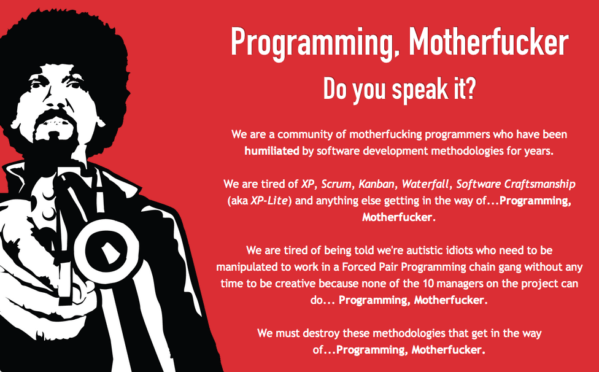

Ustedes dirán: "Eduardo, seguro que te encanta escribir, esa debe ser
tu verdadera pasión.". Y la verdad es que no están tan lejos, me gusta
escribir, y preparar estos posts es una de las actividades más
divertidas a las que me dedico, pero no, tengo una pasión mayor que
escribir: programar. Realmente es lo que más me gusta. No creo ser un
gran programador, pero creo estar sobre la media, y lo mejor es que sigo
aprendiendo, cada día.

Hace poco una colega me comentaba que había conocido a un joven que
estaba estudiando *"ingeniería informática"*, alguien le dijo: "que
bueno que estudias eso, podrías trabajar con nosotros para terminar las
aplicaciones que necesitamos!", la respuesta orgullosa del joven fue:
"¡no, no!, ¡ **yo ya no meto las manos**!".

Bueno, eso es lo que está mal en nuestra industria, esa maldita actitud
de "no querer meter las manos", como si fueran a ensuciarselas (hay
productos para limpiar los teclados, ¿sabían?).

Somos desarrolladores de software, ¡lo que hacemos es programar! Yo
estoy en un puesto ejecutivo y, a pesar de que por la "dignidad del
cargo" no debería hacerlo, "¡sigo metiendo las manos!".

¡Es como que me dijeran que un neuro cirujano que estudio 10 años no
operara! ¡O que un futbolista no metiera los pies!

El gran Edsger W. Dijkstra [lo dijo claramente](/blog/2010/01/la-disciplina-condenada.html):

> Así como la economía es conocida como "La Ciencia Miserable",\* la
> ingeniería de software debería ser conocida como "La Disciplina
> Condenada"**, condenada porque ni siquiera puede acercarse a su meta,
> dado que la misma es en sí misma contradictoria. La ingeniería de
> software, por supuesto, se presenta a sí misma como otra causa
> valiosa, pero es un colirio: si lee cuidadosamente su literatura y
> analiza lo que realmente hacen quienes se avocan a ella, descubrirá
> que la ingeniería de software ha adoptado como su estatuto \*"Cómo
> programar si usted no puede"**

Lo que pasa es que hay mucha gente que es incapaz de programar, y por lo
tanto deriva en la *ingeniería de software*, porque creen que con eso
compensan su ineptitud, y así la industria se ha llenado de ineptos. Y
por eso que hay crisis de software, y los desarrollos no salen, porque
la poca gente que es buena termina subvencionando a los malos. Hemos
construido nuestra crisis por ser buenas personas.

¡Ya basta de eso!, dejemos de aceptar la mediocridad, la ineptitud e
incompetencia. Partamos por el proceso de selección: si usted necesita
malabaristas, [pídale que haga malabares enfrente de
usted](http://www.lnds.net/blog/2010/12/como-contratar-malabaristas.html), antes
de contratarlos.

Lo otro son las metodologías. Veamos el ejemplo de
[Waterfall](http://en.wikipedia.org/wiki/Waterfall_model), por años se
ha enseñado este método como la manera tradicional de desarrollar
software, cuando en realidad el paper que la introduce  dice que en
realidad no se debe usar esta aproximación, porque no funciona. La mayor
parte de los libros de ingeniería de software ¡están basados en un error
de [comprensión de lectura](/blog/2011/11/comprensin-de-lectura.html)!

Y contra esta "metodología" se proponen las "nuevas metodologías". Y
vienen eternas discusiones de "ingeniería de software", que siguen
olvidando lo esencial, que **¡la única forma de desarrollar software es
programando, ctm! (\*)**

Así que es inevitable que algunos programadores se revelen y creen su
manifiesto en contra de todos los previos manifiestos, como este:
[Programming, Motherfucker](http://programming-motherfucker.com/), que
básicamente tiene la misma actitud que queremos transmitir cuando
decimos ¡Programa CTM! (\*)

Esto viene de un Manifiesto escrito por [Zed Shaw](http://zedshaw.com/),
un programador y músico, creador del [Web Server Mongrel para
Ruby](http://rubyforge.org/projects/mongrel/). Un personaje polémico,
con un [sitio web](http://zedshaw.com/) bastante cool :smile: [^1]

Muy en su estilo Zed Shaw escribe:

> "Estamos cansados de XP, Scrum, Kanban, Waterfall, Software
> Craftmanship (conocido también como XP-Lite) y todo lo demás que
> impida\... programar, ctm.(\*)"
>
> "Estamos cansados de que digan que somos unos idiotas autistas que
> necesitan ser manipulados para trabajar en cadenas de programación en
> parejas, de forma forzada, sin  tiempo para ser creativos porque
> ninguno de los 10 gerentes o administradores del proyecto pueden hacer
> lo que se debe: programar, ctm.(\*)"

La siguiente es la contrapropuesta de Shaw a los valores del 
[manifiesto ágil](http://agilemanifesto.org/iso/es/):

Ellos dicen Valorar\
They Really Value\
Lo que hacemos

Individuos e interacciones

*Toneladas de horas facturables*

**Programar, CTM**

Software funcionando

*Toneladas de pruebas sin sentido*

**Programar, CTM**

Colaboración con el cliente

*Desangrar a los clientes*

**Programar, CTM**

Respuesta al cambio

*Inestabilidad y negación plausible*

## **Programar, CTM**

No se ustedes, pero a mi me gusta esa actitud, capaz que termina
comprando una de sus
[poleritas](http://programming-motherfucker.com/buy.html)\...

## **Notas**

La coprolalia o lenguaje soez y procaz usado en este post es sólo con
fines académicos, ejem.

(\*) La sigla CTM corresponde a una grosería muy usada en Chile  y
también en Perú que corresponde a  "Concha de Tu Madre", o
"conchetumadre" o "conchetumare". Un equivalente, aunque sospecho
que no es usado de la misma manera en México sería "Chinga Tu Madre",
que tiene la misma sigla. Esta se ha popularizado en Twitter con
expresiones del tipo "Está temblando CTM!!", "Gooool CTM!", así que
la expresión tiene muchos usos, para expresar miedo, rabia, amenazar o
insultar. Imagino que se adapta bastante bien al uso motherfucker del
Manifiesto.

[^1]:  A Zed Shaw, al igual que a mi, no le gusta el lenguaje Ruby,
claro que él fue un poquito más allá, porque él realmente odia Rails, a
pesar de que ha ganado mucho dinero usando Ruby. Hace unos años escribió
un polémico artículo (un rant, en realidad), que tuvo que eliminar de su
sitio, aunque quedó una copia en la red (la que nunca olvida), acá está
por si les interesa: [Rails Is A Ghetto](http://www.zedshaw.com.sharedcopy.com/rants/51489cec9386f7c13f69b3a58cd50b02.html).
Por cierto, sus [ensayos](http://zedshaw.com/essays/) son interesantes,
y tiene varios [libros](http://learncodethehardway.org/) sobre
programación, espero que su actitud no los intimide.
