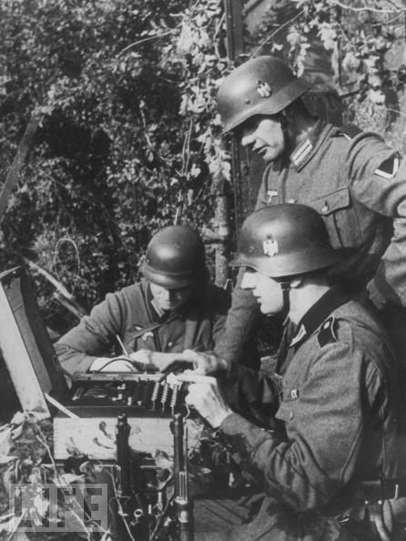

Quizás no lo sepan, pero Alan Turing e  Ian Fleming (el autor de las
novelas de Bond,  James Bond) trabajaron juntos.

Durante la Segunda Guerra Mundial Alan Turing dirigió el grupo Hut 8 en
Betchley Park, en la sede del  
[Government Code and Cypher School (GC&CS)](http://en.wikipedia.org/wiki/Government_Communications_Headquarters#Government_Code_and_Cypher_School_.28GCCS.29).
El grupo Hut 8 estaba encargado de descifrar los códigos secretos
creados con las máquinas Enigma  usadas por la marina alemana. Esta
famosa máquina, tenía un mecanismo de encriptación que se se consideraba
impenetrable en ese tiempo.

La fotografía muestra a tres soldados alemanes usando uno de estos
dispositivos.

La máquina Enigma es un dispositivo electromécanico. Desde el punto de
vista de la "interfaz de usuario", tiene un teclado donde se escribe
el mensaje en texto llano y  en la parte superior en un tablero luminoso
se enciende las luces con las letras que componen el texto cifrado. El
mecanismo es simétrico, de modo que para descifrar un texto se ejecuta
la misma operación, se escribe en el teclado el texto cifrado y en el
tablero luminoso se encienden las letras del texto desencriptado.

Un mecanismo de rotores y clavijas permiten configurar la máquina para
operar, esta disposición inicial corresponde a la **clave de
encriptación**. Estas claves, se cambiaban todos los días, y estaban
registradas en libros de claves que eran distribuidos en las distintas
unidades del ejército y la marina alemana.

No voy a describir el detalle del funcionamiento de Enigma, necesitaría
un artículo bastante extenso para explicarla. Pueden investigar más
detalles en [este artículo](https://es.wikipedia.org/wiki/Enigma_(m%C3%A1quina)) de
Wikipedia, aunque recomiendo la lectura del libro 
"[Los Códigos Secr3tos](http://amzn.to/MzGq3g)" de Simon Singh

Una primera versión de la máquina Enigma fue descifrada por la
inteligencia Polaca antes de que ese país fuera invadido por los
alemanes en septiembre de 1939. Los alemanes agregaron más complejidad a
la máquina, agregando nuevos rotores y clavijas. La cantidad de
combinaciones posibles para poder determinar la clave de encriptación
era astronómica.

Turing tenía la ventaja de su trabajo teórico ideando su famosa máquina
universal de cómputo. Cuando se  incorporó al equipo de descifradores de
Betchley Park pudo, en pocas semanas, idear un mecanismo capaz de
determinar las claves de las máquinas Enigmas usadas por el ejercito
Alemán. Su trabajo permitió diseñar unas máquinas llamadas Bombas, que
permitían calcular las claves en pocas horas.

Sin embargo, la máquina Enigma usada por la marina alemana era más
sofisticada, y además este grupo aplicaban"buenas prácticas", que
complicaban el descifrado. Por ejemplo, los criptoanalistas usaban
mensajes estereotipados para poder determinar "puntales", secuencias
de textos que podían ser "adivinados" que permitían facilitar el
trabajo de las bombas. Los marinos alemanes evitaban este tipo de
mensajes estereotipados.

Durante meses el equipo de Turing no podía avanzar en el descifrado de
los mensajes alemanes. Fue entonces que Ian Fleming sugirió la
[Operación Implacable](https://en.wikipedia.org/wiki/Operation_Ruthless).
Un plan que pretendía simular el aterrizaje forzoso de un bombardero
alemán, con la idea de que fuera rescatado por un barco alemán, con esto
se esperaba robar los libros de claves de los alemanes. Turing estaba
especialmente pendiente del éxito de esta operación, pues contar con
estos libros permitiría mejorar sus mecanismos de descifrado. Aunque la
Operación Implacable fue cancelada, finalmente se pudo obtener estos
libros en otros ataques a submarinos y barcos meteorológicos alemanes.

La información obtenida por estos equipos de criptógrafos configuró un
conjunto de datos de inteligencia conocidos como
[ULTRA](https://en.wikipedia.org/wiki/Ultra).

Ultra le otorgó un alto grado de confianza al mando aliado. Se ha
llegado a afirmar que Ultra permitió acortar la guerra en varios años.
De acuerdo al historiador David Kahn el desciframiento de Enigma "salvó
vidas. No sólo vidas aliadas y rusas, sino, al acortarla guerra también
vidas alemanas, italianas y japonesas. Mucha gente viva tras la segunda
guerra mundial no lo estaría si no hubiese sido por estas soluciones.
Esta es la deuda que el mundo debe a los descifradores, ése es el valor
humano culminante de sus triunfos."

Después de terminada la guerra los británicos capturaron miles de
máquinas Enigmas, las que regalaron a sus ex colonias, claro que nunca
les revelaron que estas máquinas eran totalmente transparentes a sus
criptoanalistas. Por años las ex colonias creyeron que la máquina enigma
era indescifrable. Es por esta razón que las contribuciones de Bletchey
Park estuvieron ocultas por más de 30 años. Es por esta razón que el
mundo no supo de la contribución de Turing durante su vida.

En 1952 Turing denunció un asalto a su propiedad, durante la
investigación reveló ingenuamente que mantenía una relación homosexual.
 La policía decidió detenerlo y acusarlo por "flagrante indecencia
contraria a la sección 11 del Acta de Enmienda de Ley Penal de 1885".
El proceso fue publicado en los periódicos y Turing fue humillado
públicamente. El gobierno británico le retiró sus acreditaciones de
seguridad, se le prohibió trabajar en proyecto relacionados con el
desarrollo del computador. Fue obligado a asistir a un siquiatra y
someterse a un tratamiento hormonal, que le afectó físicamente, quedó
impotente, obeso, desarrollo una ginecomastia (le crecieron pechos), y
desarrolló un profunda depresión. En 1954 se suicidó comiendo una
manzana envenenada con cianuro. El mundo perdió a una de sus mentes más
brillantes, y el salvador de miles, talvez millones de vidas, todo por
culpa de los prejuicios y la intolerancia.

Referencias:

1.  [Los Códigos Secretos](http://amzn.to/MzGq3g), Simon Singh,
    Editorial DEBATE.

2.  [The Code Breakers](http://amzn.to/KObEKa), David Kahn.

3.  [El Padre de la Computación](/blog/2012/06/el-padre-de-a-computacion.html)
