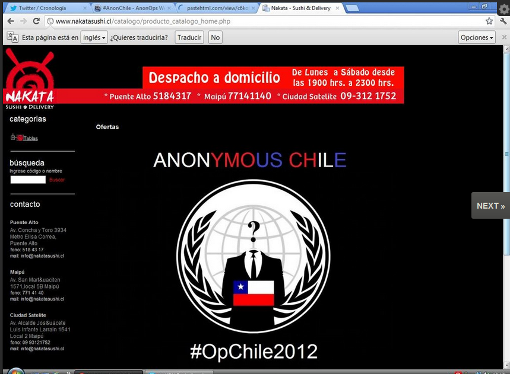

El [defacement](http://es.wikipedia.org/wiki/Defacement) de un Sushi Bar
en Puente Alto, uno de los puntos altos de la operación \#OpChile2012 de
Anoymous de ayer 30 de julio:

¿Cuál es el mensaje político detrás de esto?
