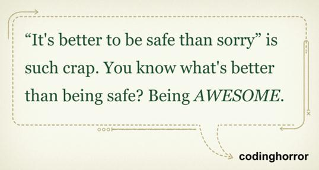

Fue [esta nota en wired enterprise](http://www.wired.com/wiredenterprise/2012/08/nasa-patch), sobre
el robot Curiosity y el patch al software que tuvieron que hacerle,
 reflexioné sobre algunas lecciones que la NASA nos puede dar.

Resulta que la fecha de lanzamiento de estas misiones está dada por el
momento en que Marte y la Tierra están  más cerca. Es obvio, al lanzar
la nave en ese momento se ahorra combustible, que es el elemento más
costoso de toda la misión. Por lo tanto todo debe prepararse para que
coincida con esa fecha, de lo contrario el lanzamiento se puede
postergar varios años más.

Sucedió en una misión anterior. El lanzamiento debía efectuarse junio,
pero el software de control del robot no estaría listo para esa
fecha. Sin embargo la fecha de arribo a Marte era enero del año
siguiente, así que el equipo de desarrollo tenía 6 meses más para
completar todo el software, realizando pruebas con los simuladores
disponibles acá en tierra.

¿Lanzarían ustedes al espacio un equipo que cuesta millones de dólares,
con una alta exposición mediática, sin tener el software controlador
listo, y debidamente probado? Pues en la NASA lo hicieron.

El plazo del lanzamiento de la misión no se corrió porque el software no
estaba totalmente listo, para la NASA el plazo es una característica
esencial del proyecto, ese feature no se negocia (en realidad lo
mandaron con una versión del software, la que se fue actualizando
parcialmente durante el vuelo).

Todo esto  me recuerda [una frase de Jeff Attwood](http://www.codinghorror.com/blog/2012/05/how-to-stop-sucking-and-be-awesome-instead.html):

En la NASA cuando toman esta decisión tan riesgosa y la resuelven quedan
como verdaderos héroes.

Ahora decimos que  todo esto que hacen en la NASA es
impresionante(awesone), pero la verdad es que para ser asombroso hay que
ser arriesgado.

La otra lección viene de esta última misión, en el Curiosity. Este rover
llevaba el software necesario sólo para aterrizar y operar los primeros
instantes en la superficie de Marte. Posteriormente, cuando el robot se
encontraba seguro en la superficie, se procedió a enviar el software
para el resto de la misión, lo que requirió borrar el software previo.

¿Por qué? Por que el Curiosity tiene una cantidad limitada de memoria,
así que esta restricción de infraestructura obligó a dividir la entrega
del software en dos fases, y fíjense que la primera fase fue desechada
totalmente después de que cumplió su misión (el aterrizaje).

La operación de ejecutar el paso a producción de este control de cambios
en el Curiosity es para matarlo a uno de los nervios. Consideren esto:
ejecutan una instrucción de carga del patch, presionan ENTER y ¡deben
esperar 28 minutos para obtener una respuesta desde Marte! Las
comunicaciones con el Rover Curiosity toman 14 minutos de ida y 14
minutos de vuelta.

La aplicación del patch del Curiosity tomó 4 días en total,
principalmente por el delay de las comunicaciones y porque se ejecutó un
plan muy meticuloso que asegurara que el robot no quedara inoperativo en
el proceso.

Todo eso es muy arriesgado, ¿pero saben qué? El resultado es
espectacular, y eso es muy importante.
