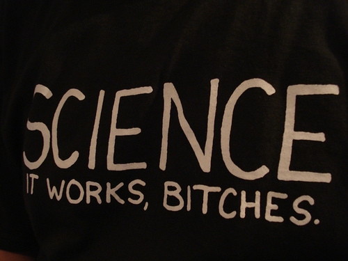

> "La ciencia es el gran antídoto contra el veneno del entusiasmo y de
> la superstición" -- frase que me regalaron los alumnos de ICCI de la
> UTEM

Durante la campaña presidencial del 2008 el entonces candidato Barack Obama
dijo:

>  "We\'ve seen just a skyrocketing autism rate. Some people are
> suspicious that it\'s connected to the vaccines. This person included.
> The science right now is inconclusive, but we have to research it."

> "Hemos visto un aumento disparado de las tasas de autismo. Algunas
> personas sospecha que está conectado con las vacunas. Esta persona
> incluida. La ciencia en este momento no es concluyente, pero tenemos
> que investigarlo."[^1]

Con este comentario Barack Obama[^2] refuerza un error superado hace
años y que está provocando un desastre de salud pública no sólo en
Estados Unidos, sino que en muchos paises donde los padres están dejando
de vacunar a sus hijos.

Todo este mito de que las vacunas causan autismo está basado en un
desprestigiado, por fraudulento, "estudio",  publicado en 1998 por
[Andrew Wakefield](http://en.wikipedia.org/wiki/Andrew_Wakefield), donde
basándose en una población de 12 individuos establece una conexión entre
vacunas y autismo. Aparte de que ha sido cuestionado su método y ha sido
acusado de fraude elaborado, la ciencia además no ha podido reproducir
sus resultados. En el año 2002 el New England Journal of Medicine
publicó un estudio realizado sobre un 537 000 individuos, donde no se
pudo encontrar ninguna relación entre autismo y vacunas.

Lamentablemente, la visión científica de la administración Obama sobre
las vacunas ha causado estragos, puesto que en 2009 las políticas de su
gobierno impidieron el uso de viales con multiples dosis para las
vacunas que previenen el H1N1, una práctica usada en Europa y otros
países. La razón era disminuir el uso del  thimerosal, un preservante
que según algunos grupos está vinculado a la aparición del autismo. Esto
sumado a otras políticas provocó una disminución de vacunas antigripales
y también de su efectividad[^3]. Se estima que en 2010 en los Estados
Unidos se infectaron de H1N1 unos 65 millones de personas, de las cuales
274 mil tuvieron que ser hospitalizadas, y murieron 12.470.[^4]

## ¿Es el progresismo más ilustrado científicamente? 

No se puede negar que es más frecuente encontrar en el conservadurismo una
mayor oposición a la ciencia, sobretodo en el conservadurismo religioso
norteamericano.

Negar la evolución, o el calentamiento global es parte habitual del
discurso ultra conservador norteamericano.

Pero no son los únicos movimientos políticos que tienen posiciones anti
científicas. Si les interesa el tema les recomiendo libros como [The
Republican War on Science](http://amzn.to/RShTP1). Pero el objetivo de
este post es otro.

Dado que el progresismo apoya estos hechos de la ciencia se suele
aceptar de que las posiciones progresistas son ilustradas en términos
científicos. Algo que no es cierto.

Pareciera ser que la posición progresista es usar la ciencia cuando
conviene a las ideas políticas e ignorarla totalmente cuando esta no
cuadra con las mismas.

## *Amicus Plato, sed magis amica veritas* 

De acuerdo a Alex Berezow y Hank Campbell, en su libro 
[The Science Left Behind](http://amzn.to/TWHg33), el pensamiento progresista con respecto a la ciencia se basa en cuatro mitos:

1.  Todo lo natural es bueno

2.  Todo lo que no sea natural es malo

3.  La ciencia sin restricciones y el progreso nos destruirá

4.  La ciencia sólo es relativa de todos modos

Los adherentes del primer mito se encuentran entre los que creen en la
homeopatía, la medicina natural, o en que es mejor salir a trotar
descalzos, porque así lo hacían nuestros antepasados, y por lo tanto es
bueno, sin considerar que por algo esos mismos ancestros inventaron los
zapatos.

El segundo mito es un corolario del primero. Según este cuando el hombre
interfiere con algo entonces esto ya no es natural. Noten como los
humanos, aceptados por el primer mito como naturales, han perdido
repentinamente toda su "naturalidad". Toda la inteligencia humana y
sus habilidad se convierte en algo malo. Para los progresistas del
segundo mito cualquier sustancia no natural, como una vacuna, aunque
salve millones de vida se ha vuelto algo repugnante.

Para los progresistas del tercer mito la ciencia y la tecnología son
inherentemente peligrosas. Por eso que estos se oponen a la energía
nuclear o al uso de alimentos modificados genéticamente[^5]. Estas
personas exigen que una nueva tecnología para ser adoptada sea 100%
segura, un estándar imposible de garantizar. Este tipo de personas
atacan a los conservadores que no creen en el calentamiento global, pero
atacan a la ciencia cuando esta entra en conflicto con sus ideas,
acusándola de venderse a la gran industria, o de planear destruir el
planeta.

Detrás de este tercer mito se esconde un paternalismo insoportable, la
idea de que es posible construir una utopía dictada por su ética
superior, ellos creen que saben lo que es bueno para todos nosotros. Si
las políticas energéticas estuvieran a cargo de ellos sólo los ricos
serían capaces de tener electricidad y lavadoras eléctricas.[^6]

El último mito es el más grave de todos. La idea de que todo es
relativo, esa peligrosa idea postmodernista. Para ellos la ciencia es
sólo una opinión más. Este relativismo pone a las ciencias blandas al
mismo nivel que las duras, la sociología o la economía tienen el mismo
peso relativo que la física o la química. Vale lo mismo la opinión de un
médico que recomienda una vacuna que lo que diga el Gurú de turno. Todo
esto erosiona el valor de la investigación objetiva.

## La lucha que importa

La lucha no debe ser entre izquierda vs derecha, conservadurismo vs
progresismo, la lucha que importa ahora en este mundo, para evitar que
se vaya por el desfiladero de la ignorancia, es la lucha por la ciencia.

Déjenme compartirles las palabras de [Mark
Anderson](http://www.stratnews.com/aboutmark.php), [citadas por David
Brin](http://davidbrin.blogspot.com/2012/09/the-case-for-scientific-nation-part-two.html),
sobre el valor de la ciencia. Anderson dice esto tras presenciar el
aterrizaje del Curiosity en Marte:

> Ciencia es Realidad. En un momento en que una grande y creciente
> fracción de la población en U.S.A. no "cree" en ciencia (como una
> realidad objetivamente probable), o peor, ha caido en la idea de que
> la ciencia es una elección en el menú de la realidad, la NASA nos ha
> dado una razón concreate para entender que la ciencia funciona, y que
> la ciencia no es una opción, no es una teoría, no es un item del menú,
> sino que represente el mejor esfuerzo de las mentes humanas en
> entender y dirigir la realidad objetiva.

Aquellos en la Tierra que creen que la ciencia es un futbol político
deberían tomar nota: no sólo están poniendo en peligro su reputación,
están poniendo en peligro el bienestar de sus electores, y hoy en día,
ponen en peligro al propio planeta.

Cualquier persona o partido que se burla de la ciencia debería ser
considerado por lo que es: una amenaza al bienestar y el futuro de todos
nosotros. Bajo la influencia de los propagandistas políticos, fanáticos
religiosos engañados, e imperios de radio y televisión realmente
peligrosos, demasiada gente ha sido llevada a creer que la ciencia es en
cierta manera una opción a opinar.

La ciencia es tan opcional como la gravedad. La ilusión ignorante es la
única opción real.

**Es tiempo que todos los habitantes de la Tierra reconozcan el valor de
la ciencia. Al hacerlo, encontraremos el piso común para estar de
acuerdo en las otras cosas importantes.**

**NOTAS**

[^1]: [Nota en The
Independent](http://www.independent.co.uk/news/science/scientific-illiteracy-all-the-rage-among-the-glitterati-1212406.html)

[^2]: El Senador McCain, el oponente de Obama en ese entonces, también
compartía la misma percepción errónea sobre las vacunas, al decir (ver
nota de arriba):  "It\'s indisputable that \[autism\] is on the rise
among children, the question is what\'s causing it," he said.
"There\'s strong evidence that indicates it\'s got to do with a
preservative in the vaccines." (Es indisputable que \[el autismo\] está
en alza entre los niños, la pregunta es qué lo está causando. Hay
fuertes evidencias que indican que tiene que ver con los preservantes en
las vacunas).

[^3]: [Junk Science Returns To White House](http://www.realclearmarkets.com/articles/2009/11/02/junk_science_returns_to_the_white_house_97481.html),
por Bill Frezza, noviembre 2009

[^4]: [Informe del CDC (Center for Decease
Control)](http://www.cdc.gov/h1n1flu/estimates_2009_h1n1.htm)

[^5]: He visto veganos anti transgénicos que comen felices empanadas de
soya (soja) en Chile, lo más probable es que esa soya venga de Argentina
donde el 97% es soya transgénica.

[^6]: Por favor vean este video de Hans Rosling
TED: [http://www.ted.com/talks/lang/es/hans*rosling*and*the*magic*washing*machine.html](http://www.ted.com/talks/lang/es/hans_rosling_and_the_magic_washing_machine.html)
