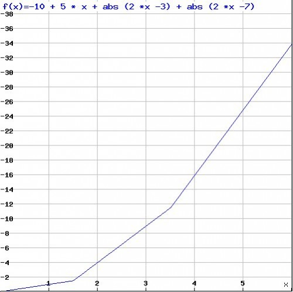

Tenemos una función, tal que:

-   para 0, retorna 0

-   para 1, retorna 1

-   para 2, retorna 4

-   para 3, retorna 9

-   para 4, retorna 16

-   para 5 ,retorna 25

¿Cuál es el valor para 6?

Muchos de ustedes dirán que el valor es 36, lo que sería valido si la
función fuera

> f(x) = x\^2

Pero, si les digo que el valor para 6 es 34, ¿qué pasa con lo que
asumieron?

Una función que satisface todas las sentencias anteriores y la necesidad
de que f(6) = 34 sería esta:

f(x) =-10 + 5 x + \|2 x -- 3\| + \|2 x -7\|

Cambia bastante el escenario, ¿verdad?

No podemos asumir a partir de un conjunto de valores particulares el
valor de la función para otro punto cualquiera, tal como queda claro con
este ejemplo.

Dijkstra tiene una frase famosa: "testing shows the presence, not the
absence of bugs" (los tests muestran la presencia, no la ausencia de
fallos).

Por su formación científica la frase de Dijkstra evoca [el principio epistemológico del falsacionismo](http://es.wikipedia.org/wiki/Falsacionismo), que dice que
basta un contraejemplo, o un experimento que contradiga las predicciones
de una teoría para refutarla.

El hecho de que sepamos que para 6, el valor de nuestra función es 34,
descalifica la asunción de que la función es cuadrática, pero tampoco
garantiza que la combinación linear que hemos propuesto sea la solución.

En un [reciente comentario](http://bertrandmeyer.com/2012/10/14/a-fundamental-duality-of-software-engineering/),
Bertrand Meyer nos confronta con la dualidad entre demostración y
ensayos (proof and testing).

> "En Ingeniería de Software la dualidad correspondiente está entre las
> demostraciones \[proofs\] y las pruebas o ensayos \[tests\], o
> (equivalentemente) entre especificaciones y casos de uso. Una
> especificación es como un "para todos": nos dice que debe pasar para
> todas las entradas previstas. Un test es como el \"existe algún\": nos
> dice que pasa para una entrada particular, y tal como en el cálculo de
> predicados es interesante como un mecanismo para refutar:
>
> -   Un test exitoso nos entrega poca información (cómo aprender el
>     valor para 5 cuando tratamos de adivinar la función).
>
> -   Un test no exitoso nos da información definitiva (como un valor
>     falso para un ∀): el programa definitivamente no es correcto.

Una prueba, o demostración, cuando es exitosa finaliza la discusión. En
la práctica, las pruebas pueden ser útiles en este caso, perso sólo si
aportan cubriendo asuntos no cubiertos por la prueba:

> -   Exactitud del compilador y la plaforma, si es que estas no han
>     sido demostradas correctamente
>
> -   Exactitud y corrección de las herramientas de prueba, dado que
>     muchas pruebas prácticas requieren soporte de software.
>
> -   Aspectos no cubiertos por la especificación, tipicamente en
>     desempeño y usabilidad
>
> No es adecuado usar los tests en lugar de la especificación. Las
> aproximaciones ágiles han causado bastante confusión. Una aguda
> revelación se ha perdido dentro de una práctica que puede ser
> perjudicial. La revelación es que la práctica del desarrollo de
> software ha mejorado con la práctica de las pruebas de regresión. La
> mala práctica es la de eliminar la especificación de requerimientos en
> favor de las pruebas.
>
> Hay una propiedad  que tienen las especificaciones y que se encuentra
> ausente en los tests, esa propiedad es la generalidad. Hay una
> relación asimétrica entre especificación y pruebas. Uno puede elaborar
> tests a partir de una especificación, pero no de la otra manera.
>
> Lo mismo pasa con casos de uso y requerimientos. Los casos de uso
> complementan los requerimientos, describiendo el comportamiento del
> sistema en una selección de casos importantes. Es un chequeo, para
> asegurar que los objetivos abstractos han sido definidos, y que se
> cubren los casos conocidos de interés inmediato. Pero depender de los
> casos de uso como requerimientos significa que obtendrás un sistema
> que satisface los casos de uso, y posiblemente no mucho más."[^1]

Es lo que nos pasa cuando accedemos a ciertos sitios web, en que de
repente notamos que se ha solucionado el problema para algunos casos
bastante limitados, y no para nuestras necesidades particulares.

Es el peligro de metodologías como [BDD (Behavior Driven Development)](http://en.wikipedia.org/wiki/Behavior-driven_development)
llevadas a su extremo. Si todo el desarrollo está guiado por unos
cuantos comportamientos (behaviors), podemos caer en un escenario peor
que aquel en que los casos de uso reemplazan los requerimientos.

Tendremos un escenario como el del desarrollador que cree que está
programando una función cuadrática, cuando en realidad la función era
algo mucho más complejo, tan complejo que la combinación lineal es sólo
una parte de toda la historia.

Las metodologías ágiles tienen la virtud de que se adaptan muy bien a un
ambiente exploratorio, en que estamos investigando un terreno
desconocido, donde probablemente el cliente y los usuarios no tienen
claro que es lo que se necesita. Pero no siempre es el caso. En la
medida de lo posible debemos buscar las abstracciones que nos permitan
generalizar el comportamiento del sistema. En los aspectos más
desconocidos, aún difusos, debemos explorar junto al usuario los
escenario posibles, y en esos caso herramientas como BDD, test
unitarios, casos de uso, prototipos, deben ser usadas juiciosamente.

Siempre debemos considerar que podemos encontrarnos en una situación en
que nuestra solución sólo abarca un aspecto de la realidad, como nuestra
aproximación de la función cuadrática, y por lo tanto debemos estar
concientes de la limitaciones de lo que asumimos y de sus costos.

[^1]: Adaptado del blog de Bertrand Meyer, [a fundamental duality of
software engineering](http://bertrandmeyer.com/2012/10/14/a-fundamental-duality-of-software-engineering)
