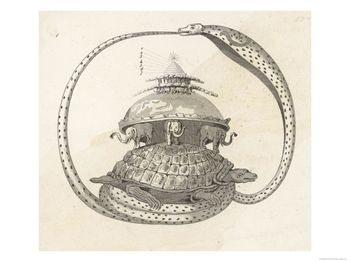
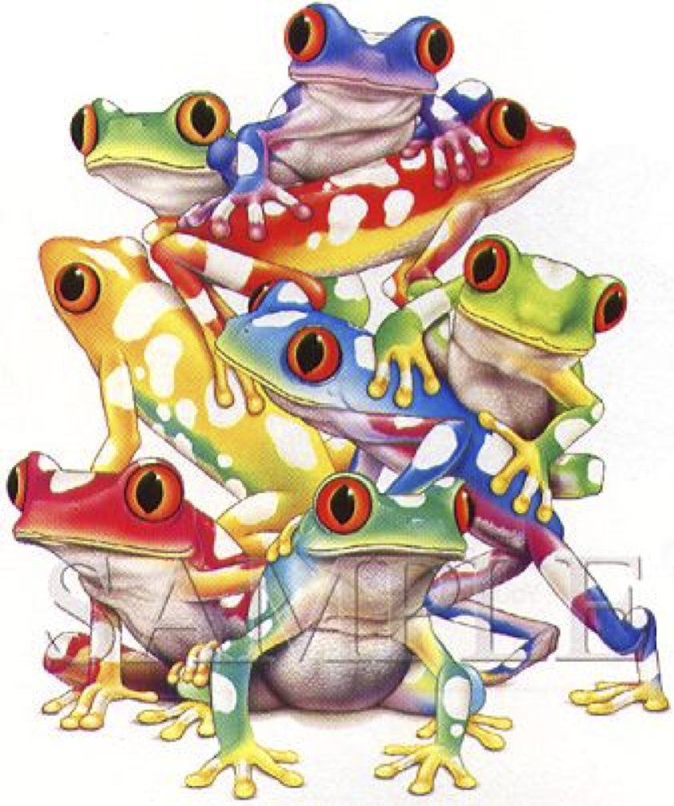

> Alan Kay crea Smalltalk e inventa el término "orientado al objeto".
> Cuando se le pregunta qué significa él replica que "los programas
> Smalltalk sólo son objetos." Cuando se le pregunta de que están hechos
> los objetos él responde, " de objetos".  Cuando se le pregunta de
> nuevo él dice "mire, todos son objetos todo el camino hacia abajo.
> Hasta que se encuentre con las tortugas." 
> -- [Una breve y disparatada historia de los lenguajes de programación](/blog/2010/05/una-breve-y-disparatada-historia-de-los-lenguajes-de-programacion.html),
> James Iry

En la cosmología Hindú el "Universo era un ente cerrado, contenido en
los anillos de Seshu, la cobra negra . En el fondo de todo había un mar
de leche rodeado completamente por esa serpiente. Una enorme tortuga
nadaba en el lácteo océano, sobre cuyo caparazón se apoyaban cuatro
elefantes (cada uno en un punto cardinal). Al mismo tiempo esos
elefantes sostenían sobre sus lomos a la Tierra. En su centro se formaba
una gran montaña central donde un gigantesco fuego giraba a su alrededor
ocasionando el día y la noche. Seshu, con un anillo superior contenía a
la bóveda celeste."[^1]

Mirándolo de cierta manera todas nuestra arquitecturas de sistemas con
todas sus capas tienen una estructura similar a estas exóticas
cosmologías, la diferencia es que a veces, pareciera que en vez de ser
una torre de sólidos animales, como tortugas y elefantes, lo que tenemos
es una torre llena de ranas dispuestas a saltar  en cualquier momento
:smile:

