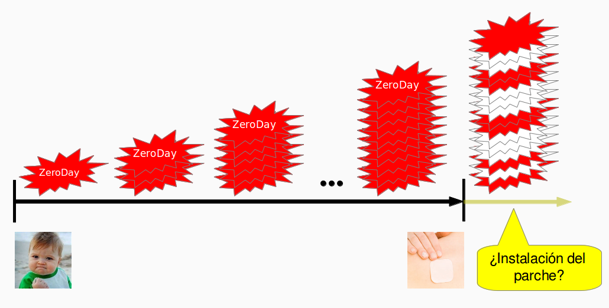
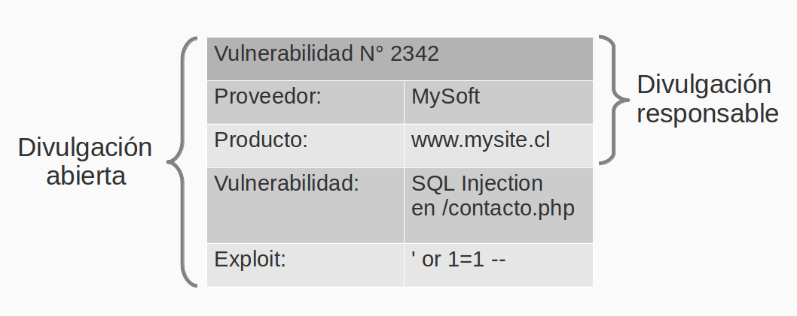

El siguiente post es de un notable "[villano invitado](/tags/villano-invitado/)", se
trata del experto en seguridad, y gurú en cervezas ;-),  
[Cristián Rojas.](http://injcristianrojas.github.com/about.html)

Esta nota nace de una conversación con Cristián en El Test Acido, la que
dado el formato del programa no pudimos profundizar, por eso le pedí a
Cristian que elaborara el tema en un artículo que ahora comparto con
ustedes.

Disclosure: No es llegar y hacerlo 
==================================

Por **Cristián Rojas**

Recientemente fui testigo (¿victima?) de la divulgación de una
vulnerabilidad en un conjunto de servidores UNIX distribuidos con NIS en
el cual tengo una cuenta de usuario. La vulnerabilidad consiste en que
mediante un comando cualquier usuario podría obtener la lista de todos
los usuarios del conjunto de servidores NIS con sus respectivos
verificadores de passwords. Muy a pesar que las passwords están
convertidas en verificadores utilizando
[crypt](http://unix.stackexchange.com/questions/8229/what-methods-are-used-to-encrypt-passwords-in-etc-passwd-and-etc-shadow),
como ocurre en todo sistema basado en UNIX, podría ocurrir que una clave
muy fácil (o basada en una palabra de diccionario) fuera descifrada
utilizando herramientas como [John The
Ripper](http://www.openwall.com/john/).

Sin embargo, el problema no está en la vulnerabilidad, sino en quién la
divulgó. El denunciante es otro usuario del sistema, quien mencionó que
no es primera vez que reporta la vulnerabilidad a través del foro.
Contacté en forma privada a los administradores del sistema y les
indiqué acerca del problema, el cual corrigieron al día siguiente, y
además les pregunté si habían recibido alguna comunicación en forma
privada por parte del denunciante, ante lo cual me respondieron que no.

Es muy probable que al divulgar la vulnerabilidad en el foro, el
denunciante debe haber sentido que hizo un bien a la comunidad de
usuarios del sistema. El problema es que al hacerlo, expuso
innecesariamente a los usuarios afectados a que sus cuentas fueran
vulneradas, o peor aún, [que otros servicios que usen éstos fueran
vulnerados
también](http://splm.blogspot.com/2011/11/guia-practica-para-el-manejo-de.html).
¿Malicia por parte del denunciante? Muy lejos de serlo. Ignorancia
quizás.

Modelos de (no) divulgación {#modelosdenodivulgacin}
---------------------------

Existen hoy en día 3 modelos de divulgación que puede seguir un usuario
al encontrarse con una vulnerabilidad de seguridad en un sistema
computacional, en una red o en un software.

El primer modelo es el de **No Divulgación**, en el cual quien encuentra
una vulnerabilidad simplemente se queda callado. Este modelo es
interesante porque, si quien encuentra la vulnerabilidad es
inescrupuloso, podría explotar la vulnerabilidad él sólo y profitar con
ello.  Nadie más se entera, ni el proveedor (con esta palabra me refiero
al Webmaster, Sysadmin, o desarrollador en caso de un software), ni
otros usuarios. El problema es que la vulnerabilidad seguirá existiendo,
y la información seguirá siendo expuesta o modificada ilícitamente, esto
es, hasta que alguien más se tropiece con la vulnerabilidad y la revele,
momento en el cual puede ocurrir uno de los otros dos modelos.

El segundo modelo es el de **Divulgación Abierta**, también conocido por
algunos como *Divulgación Irresponsable*, que consiste en que el
usuario, al encontrar una vulnerabilidad, la hace pública en su blog,
foros, etc., y publica todos los detalles al respecto: En qué
aplicación/sistema está, qué vulnerabilidad es y cómo explotarla. Al
hacer esto, permite que, por ejemplo, los investigadores en seguridad se
pongan a elaborar firmas nuevas para antivirus, los administradores de
sistemas se pongan en alerta y tomen medidas pseudo-mitigatorias
(workarounds), y los usuarios finales queden muy asustados. No sólo eso,
sino que mete presión a los proveedores para parchar sus sistemas o
software.

Hay 2 problemas con este tipo de divulgación. El primero de ellos
consiste en que al tener una vulnerabilidad no parchada y de la cual
todo el mundo está enterado, ocurre lo que se conoce como ataques *Zero
Day*, que son ataques contra sistemas los cuales no han sido parchados
contra esa vulnerabilidad, por lo tanto están completamente expuestos, y
lo seguirán estando hasta que salga un parche. Y de ahí surge el segundo
problema: El proveedor deberá apurar un parche y preocuparse de dos
cosas: Que el parche mitigue la vulnerabilidad y que no cause una
regresión. Además, el proveedor no podrá dormir 100% tranquilo, ya que
una cosa es lanzar el parche y otra muy distinta es que la gente lo
instale.

Un ejemplo claro de esto es el siguiente: Si Usted es un usuario de
Windows, ¿se ha preguntado alguna vez
qué es esta *Herramienta de eliminación de software malintencionado de
Windows* que llega a través de Windows Update, y por qué llega cada mes?
No es un antivirus. Es una herramienta que permite el parchado
automático de sistemas Windows contra gusanos como el Nimda o el SQL
Slammer, que fueron lanzados hace ya casi 10 años, sin embargo aún
causan estragos porque muchos sistemas Windows en el mundo están
desatendidos, y estos gusanos se siguen autoreplicando a través de la
red desde y hacia estos sistemas vulnerables.

¿Eso significa que estamos todos expuestos a vulnerabilidades, Zero Days
y gente que las divulga en forma abierta?

No necesariamente. Existe un modelo poco conocido (o poco utilizado)
conocido como **Divulgación Responsable**, el cual consiste en que el
denunciante contacta en forma privada al proveedor y le revela sólo a él
los detalles de la vulnerabilidad, mientras indica públicamente que la
aplicación tiene una vulnerabilidad.

## El diablo está en los detalles 

En ambos casos el denunciante publica la vulnerabilidad. ¿Dónde está la
diferencia? En los detalles que éste hace públicos al descubrir la
vulnerabilidad. En el caso de la divulgación abierta todos los detalles
son divulgados inmediatamente, mientras que en la divulgación
responsable el denunciante sólo se limita a decir "este sistema tiene
una vulnerabilidad", sin mencionar mayores detalles. De hecho, lo de
"responsable" se configura como una responsabilidad tanto para con el
proveedor, como para con los usuarios de la aplicación, ya que el
denunciante acuerda un plazo razonable con el proveedor para que éste
corrija la vulnerabilidad, tiempo después del cual el denunciante hará
públicos todos los detalles de ésta.

Lo que se recomienda es usar divulgación responsable. Incluso hay
organizaciones que [ofrecen dinero](https://www.google.com/about/appsecurity/reward-program/) como
motivación para reportar vulnerabilidades usando este modelo. Sin
embargo, no todo el mundo tiene esta posibilidad financiera. Pero ahora
tenemos claro cuáles son los modelos de divulgación y sabemos cómo
divulgar bien (y mal) las vulnerabilidades de seguridad de los sistemas
que usamos.

Sobre el Autor:

Cristián Rojas es Ingeniero Civil en Computación de la Universidad de
Chile. Actualmente se desempeña como especialista en monitoreo de
sistemas para Firenxis, y como consultor freelance en desarrollo de
software seguro y de politicas empresariales de seguridad de la
información.

También se desempeña en el campo de la docencia, participando como
profesor del módulo de Seguridad de Software en el Diploma de Postítulo
en Seguridad Computacional de la Facultad de Ciencias Físicas y
Matemáticas de la Universidad de Chile, y además como profesor de
pregrado en el curso CC5315: Seguridad de Software de la misma facultad.
