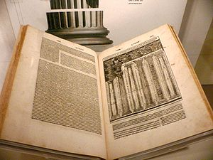
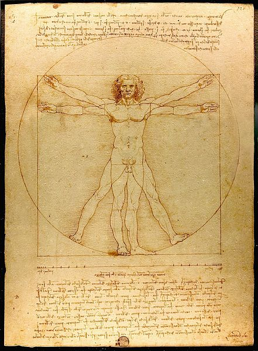

Arquitecto viene del griego arkhitekton, arkhi es jefe y tektonn
constructor. El arquitecto era el jefe de los constructores.

Aparte de Fidias, el famoso arquitecto griego, de la antigüedad
conservamos el trabajo de
[Vitruvio](https://es.wikipedia.org/wiki/Marco_Vitruvio), **arquitecto,
ingeniero y escritor** romano, quien escribió un tratado llamado "los
diez libros de arquitectura", que fue por siglos el único material que
tuvieron como base los arquitectos. Este libro fue fundamental en el
renacimiento y tuvo gran influencia sobre Leon Battista Alberti,
Leonardo Da Vinci y Miguel Angel. Es en este tratado que Vitruvio
establece las tres caracteristicas esenciales de toda estructura:
"utilitas, venustas y firmitas" (utilidad, belleza y firmeza).

Utilitas se refiere a la utilidad, debe resolver la pregunta de para qué
construimos cierta estructura o herramienta. Venustas es la belleza,
apreciamos la belleza de una construcción por nuestra naturaleza
deseamos usar cosas que sean bellas, agradables a nuestros sentidos y
apreciadas por nuestra mente. La firmeza tiene que ver con la solidez de
nuestra construcción, queremos que las cosas duren y resistan el uso que
les daremos. Para Vitruvio debía haber un equilibrio de estos tres
elementos, ninguno debería sobrepasar a los otros dos.

Lamentablemente el tratado de Vitruvio es lo único que hemos rescatado
en forma de teoría de la arquitectura romana, no tenemos certeza si este
era el mejor tratado del tema de su tiempo, es probable que no, algunos
críticos han observado que que vacila en cómo organizar el arte de la
arquitectura. Pero es interesante su aporte, pues parte de la práctica,
de la experiencia, según Vitruvio:

> "la arquitectura es una ciencia que surge de muchas
otras ciencias, y adornada con muy variado aprendizaje; por la ayuda de
que un juicio se forma de esos trabajos que son el resultado de otras
artes. La práctica y la teoría son sus padres. La práctica es la
contemplación frecuente y continuada del modo de ejecutar algún trabajo
dado, o de la operación mera de las manos, para la conversión de la
materia de la mejor forma y de la manera más acabada. La teoría es el
resultado de ese razonamiento que demuestra y explica que el material
forjado ha sido convertido para resultar como el fin propuesto. Porque
el arquitecto meramente práctico no es capaz de asignar las razones
suficientes para las formas que él adopta; y el arquitecto de teoría
falla también, agarrando la sombra en vez de la substancia. El que es
teórico así como también práctico, por lo tanto construyó doblemente;
capaz no sólo de probar la conveniencia de su diseño, sino igualmente de
llevarlo en ejecución." 

El mérito de Vitruvio está en esta definición de equilibrio entre tres
aspectos fundamentales de toda arquitectura: **Utilidad, Belleza y
Firmeza**.

Si lo aplicamos a nuestros diseños, cuando planeamos alguna aplicación,
o sistema, debemos considerar el consejo de Vitruvio.

Esa dialéctica entre lo bello versus lo útil está presente siempre
cuando discutimos sobre arquitectura, al punto que define grandes
periodos de la historia de la misma. Lo mismo pasa en arquitectura de
software, recién ahora estamos discutiendo el valor de la belleza,
entendiéndola tanto desde el punto de vista de las interfaces, hasta el
de la forma en que organizamos nuestro código.

Para mi la belleza surge de la combinación de los cuatro elementos
conque Vitruvio descompone en el orden arquitectónico ("relación de
cada parte con su uso), la disposición ("el trazado en planta, en
alzado y perspectiva"), proporción ("la concordancia de la obra entera
y sus partes" y distribución("el debido y mejor uso posible de los
materiales y de los terrenos, y en procurar el menor costo de la obra,
conseguido de un modo racional y ponderado").

Apreciamos una arquitectura que respeta estos cuatro elementos, pero es
obvio que en arquitectura de software esto tiene aplicación pero de un
modo distinto, aunque los aspectos fundamentales se preservan.

Para Vitruvio sus ideas de armonía arquitectónica están en concordancia
con lo que observamos en la naturaleza, y están presentes en la mayor de
todas las obras de esta: el cuerpo humano. Vitruvio describe las
proporciones del cuerpo humano las que son plasmadas años más tardes por
Leonardo Da Vinci, quien realiza un famoso dibujo aplicando las
proporciones descritas por este autor, es el famoso "Hombre de
Vitruvio", el que nos recuerda que finalmente la arquitectura debe
adecuarse a las necesidades de los seres humanos, que decía [Leon
Battista Alberti](http://es.wikipedia.org/wiki/Leon_Battista_Alberti).

