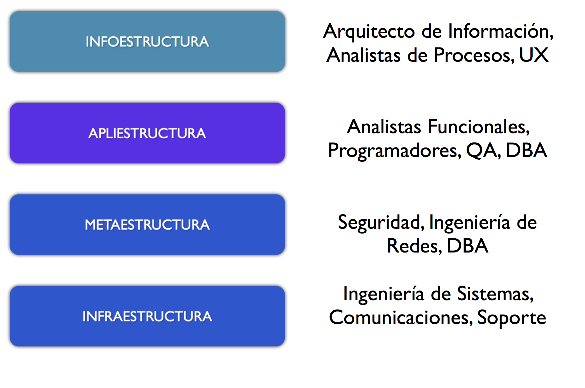

¡No se puede! ¿Cuantas veces hemos escuchado esa frase? ¡Esa maldita
frase!

Tienes listo tu desarrollo, la gente del área comercial o de procesos
está feliz, las pruebas han sido un éxito, va todo de acuerdo al
cronograma y cuando vas a sistemas para empezar a negociar fecha de paso
a producción te encuentras con el famoso "¡no se puede!"...

Cuando las fuerzas rebeldes necesitan de los Jedis, estos sólo ponen
problemas. ¡Ayúdame Obi Wan!, ¡No! es la respuesta inesperada.

Bueno, los desarrolladores estamos pagando culpas, porque hasta hace
unos años atrás teníamos la misma actitud con los usuarios. Porque
simplemente estábamos equivocados, acostumbrados a un proceso secuencial
lineal: levantar requerimientos, analizar, diseñar, construir, probar y
entregar. ¡Ay, si al pobre usuario se le ocurría cambiar de opinión! La
compilación era una acto sagrado, que tomaba tiempo, cada linea de
código era cuidadosamente pensada, meditada, producir 10 lineas de
código al día era la norma en aquella época. Si un usuario se nos
acercaba pidiendo un cambio, después de que había sido cerrado el
diseño, ¿qué cara poníamos? ¿cuál era nuestra respuesta?

¡No! No se puede! ¡Cómo se te ocurre pedirme eso! ¡Siempre no!

Pero, cambiamos. Nos adaptamos, comprendimos que estábamos engañados,
que el método de la cascada era toda una tomadura de pelo, [un error de
comprensión de
lectura](/blog/2011/11/comprensin-de-lectura.html), y
nos [volvimos ágiles](/blog/2009/09/que-es-agilidad.html).

Nuestra manera de desarrollar ahora es más rápida, somos más flexibles,
[release early - release often](http://en.wikipedia.org/wiki/Release_early,_release_often), [fail fast](http://en.wikipedia.org/wiki/Fail-fast), 
[worst is better](/blog/2010/05/peor-es-mejor.html), son
nuestros mantras ahora.

Acercarnos al negocio, aportar valor, somos parte esencial del negocio
actual, sabemos nuestro rol, estamos orgullosos de nuestro aporte como
desarrolladores, queremos hacer más cosas, mejores, más rápido, liberar
aplicaciones, incorporar nuevas tecnologías. Pero chocamos con la gente
de sistemas (operaciones). Es la lucha entre los devs y los ops.

> Developers and operations professionals are often at odds. Developers
> want to release software more frequently; operations professionals
> want to protect the stability of the infrastructure.

Tenemos metas y enfoques distintos. Si miran el diagrama de roles y
funciones en las capas de Hoff queda clara la razón.

Los devs estamos en las capas más cercanas a las necesidades del
negocio. Los ops están más cerca del fierro, del hardware.

> The last thing many application developers want to do is have a
> sit-down with the ops guys. Besides which, they don\'t understand.
> Sure, the ops guys efforts are critical to our applications because
> they have to run on something. But, developers should look to spend
> more of their time getting closer to the business, not getting closer
> to the hardware. I fully acknowledge that there is a need for quicker
> and less-rickety deployment processes.

La verdad es que no queremos preocuparnos de los detalles, de la
problemática de la infraestructura.

Hay gente que propone como solución algo llamado
[DevOps](http://en.wikipedia.org/wiki/DevOps). La idea es limar
asperezas entre devs y ops, logrando que trabajen en armonía.

Para entender estas diferencias entre dos bestias tan distintas como
devs y ops, voy a recurrir a 
[la conceptualización que hace Jeff Atwood](http://www.codinghorror.com/blog/2010/08/vampires-programmers-versus-werewolves-sysadmins.html),
en que compara a los devs(desarrolladores) con vampiros, y a los ops
(sysadmin) con hombres lobos.

> Los programadores son como vampiros. Permanecen frecuentemente
> despiertos toda la noche, pálidos como la muerte misma, y generalmente
> temerosos de exponerse a la luz de día. Y claro, se sienten (o al
> menos piensan de su código) que son inmortales.
>
> Los administradores de sistemas son como hombres lobo. Pueden parecer
> gente común y corriente, pero son increíblemente fuertes,
> prácticamente invulnerables a lo que podría matar a la gente común y
> corriente, y propensos a extrañas transformaciones durante un "apagón
> de luna". \...
>
> El arte de manejar vampiros y hombres lobos, me parece, es asegurar
> que no gasten su tiempo peleando entre ellos, sino que, usando sus
> poderes sobrenaturales logren una meta en común, que no podrían de
> otro modo. En mi experiencia, cuando los programadores y los
> administradores de sistemas pelean es porque están aburridos. No les
> has dado un trabajo suficientemente desafiante, uno que requiera el
> uso totalmente combinado de sus habilidades únicas para lograrlo.

Puede que tenga razón, miren este op gruñón, quizás sólo está aburrido,
y por eso dice tanto que no se puede, quizás sólo quiere un poco de
atención...

Otra posibilidad es aislar totalmente devs de ops. Es lo que propone
[gente como Mike Gualteri](http://blogs.forrester.com/mike_gualtieri/11-02-07-i_dont_want_devops_i_want_noops)

> But, I think DevOps is a step backward. Instead I
propose NoOps. The goal of NoOps is also to improve the process of
deploying applications. But, NoOps means that application developers
will never have to speak with an operations professional again. NoOps
will achieve this nirvana, by using cloud infrastructure-as-a-service
and platform-as-a-service to get the resources they need when they need
them. Of course, this is not just about getting virtual machine
instances. It is also about release management. Ops can run this public,
private, or hybrid infrastructure and give developers the tools they
need to responsibly deploy applications faster.

O Adrian Cockcroft, de Netflix, quien expone extensamente 
[en este post](http://perfcap.blogspot.com/2012/03/ops-devops-and-noops-at-netflix.html)
su posición sobre NoOps.

Esto es interesante, la idea es no tener que ver más la cara del gato
gruñón, que siempre dice que no se puede. La idea es aislarlo, así como
el gato de Schrödinger, dejarlo encerrado en una caja que llamamos
Cloud.

La meta de NoOps es, al igual que devops, mejorar el proceso de
despliegue de aplicaciones. Pero, en NoOps los desarrolladores ya no
hablan con los profesionales de operaciones. Es el nirvana, porque
flotamos en una nube. Mediante la infraestructura como servicio, o
plataforma como servicios, los desarrolladores adquiere los recursos que
necesitan en forma dinámica. Esto es más que crear instancias de
máquinas virtuales. Es administrar el proceso de despliegue y liberación
de las aplicaciones a producción. Ops se preocupa de correr, monitorear
y configurar esta infraestructura de nube (sea pública, híbrida o
privada), y de entregarle a los desarrolladores las herramientas que
necesitan para pasar a producción más rápidamente las aplicaciones, en
forma responsable, por supuesto.

Significa que los ops dejan en manos de los desarrolladores la decisión
de pasar a producción las aplicaciones, cuando ellos quieran, significa
empoderar al desarrollador. Liberarlo de tener que preguntar si se puede
o no se puede. Significa dar más valor al negocio, porque podemos
responder más rápido al cambio.

Esto es algo que necesitamos, así que amigos ops ¡pónganse las pilas!
Trabajemos para lograr esto, necesitamos su ayuda, estoy seguro que
estarán felices administrando, monitoreando, y preparando nuevas
herramientas que permitan el despliegue rápido de aplicaciones, sé que
se puede, se que sí se puede.

