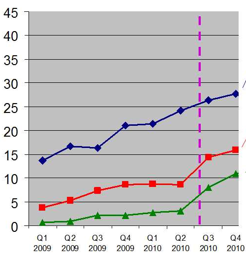
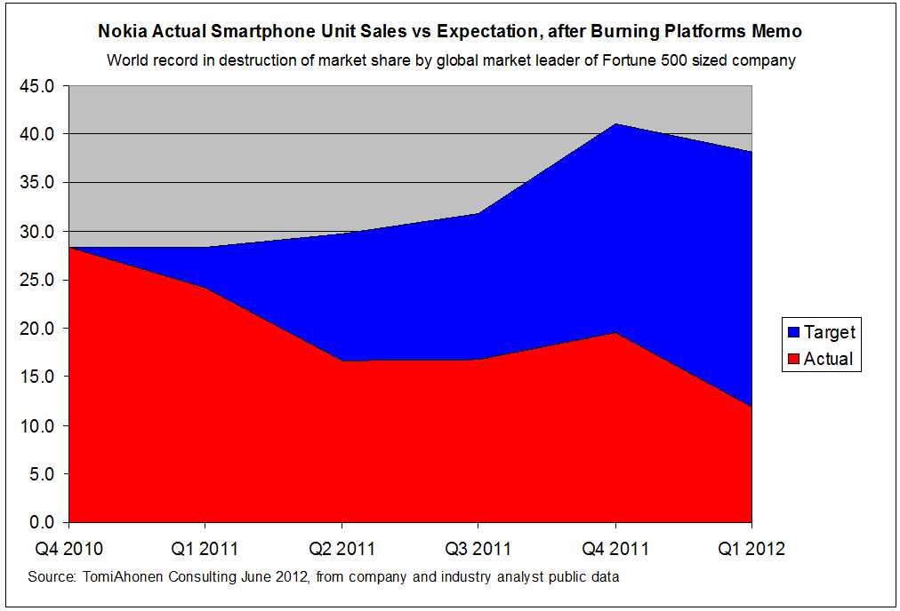
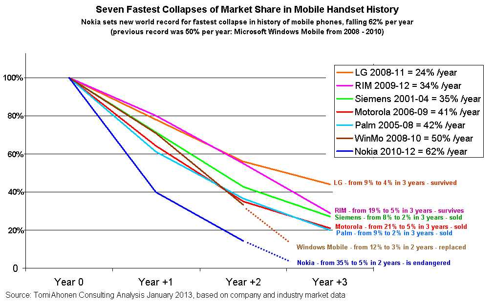

> "Si conoces a tu enemigo y te conoces a ti mismo, no temerás el
> resultado de cien batallas. Si te conoces a ti mismo, pero no a tu
> enemigo, por cada victoria lograda sufrirás una derrota. Si no te
> conoces ni al enemigo ni a ti mismo, sucumbirás en cada batalla."\
> -- Sun Tzu

El gráfico muestra los ingresos (revenue) de las divisiones de
Smartphones de tres grandes compañías, desde el primer trimestre de 2009
hasta el cuarto trimestre de 2010. ¿Cuál es Nokia?

# Orgullo Finés

Desde el 7 de diciembre de 1939 hasta el 8 de enero de 1940 las tropas
finesas y soviéticas se enfrentaron en la batalla de Suomussalmi. Al
coronel Hjalmar Siilasvuo de Finlandia se le encomendó la misión de
atacar al noveno ejército Sovietico dirigido por el general Mihail
Pavlovitz Duhanov, que había cruzado la frontera norte con la Unión
Soviética una semana antes. El noveno ejército ruso contaba con 45.000
efectivos, 90 tanques y fuerza aerea. Las tropas finesas no superaban
los 11.000. Sobre uno de los terrenos más helados del mundo, muy cerca
del círculo polar ártico.

A pesar de estar en desventaja numérica de 1 contra 4, y de no contar
con tanques ni fuerza aérea fue capaz de derrotar a las tropas rusas,
con una pérdidade 1.000 hombres, mientras que el ejército soviético
perdió 13.000 soldados (algunos afirman que fueron más) y fueron
capturados unos 2.100 prisioneros. En esta batalla los fineses
capturaron 43 tanques (al empezar la guerra Finlandia sólo contaba con
30 tanques en todo su ejército). No sólo eso, Soumussalmi fue capaz de
bloquear a la 44a división sovietica que venía a reforzar a las tropas
del general Duhanov.

Después de la batalla los soviéticos destituyeron al general Duhanov.
Uno de sus comandantes de división, el general Alexei Nikolajevitz
Vinogradov fue encontrado tan incompetente e inepto, que fue juzgado,
condenado y ejecutado cuatro días después de la batalla. Fue fusilado
junto a otros comandantes y oficiales sobre un lago congelado delante de
las tropas sobrevivientes de la batalla, el 11 de enero de 1940.

Comprenderán que para los fineses Suomussalmi es un héroe y realmente
merece ser considerado uno de los grandes estrategas de la historia,
capaz de derrotar a un adversario con mejor tecnología y cuatro veces
más recursos.

Tal como Steve Jobs puede ser considerado uno de los CEO más brillantes,
frente a uno de los peores Stephen Elop, en la batalla por el mercado de
los smartphones. Por eso que les duele tanto a los fineses que Nokia
haya perdido su liderazgo en esta industria. Tal como lo relata Tomi T.
Ahonen, autor y consultor nacido en Finlandia, quien se lamentó en un
[extenso post](http://communities-dominate.blogs.com/brands/2012/07/the-sun-tzu-of-nokisoftian-microkia-mirror-mirror-on-the-wall-whose-the-baddest-of-them-all-waterloo.html)
donde pide la cabeza de Elop, y con razón a mi parecer[^1].

## Nokia, nuestra plataforma se quema 

La linea punteada del gráfico anterior indica el momento en que Stephen
Elop asume como CEO de Nokia. En ese momento, entrando en el segundo
semestre de 2010, Nokia vendía más del doble que Apple. El iPhone fue
introducido en 2007, a inicios del 2010 iPhone aún estaba rezagado con
respecto a Nokia. En la historia sólo podemos encontrar una situación
similar (que un competidor venda el doble que su más cercano rival) sólo
si nos remontamos a 1915, cuando Ford vendía más del doble que GM.

Elop fue contratado para arreglar problemas de ejecución. Nokia
Corporation había tenido una mala gestión por parte de los CEO
anteriores, pero no la división de SmarthPhones. Esta división contaba
con una salud impecable como muestra el gráfico, y con ingresos que
duplicaban a sus competidores. Era un escenario soñado, la oportunidad
para construir un imperio en la industria de los smartphones.

Pero, ¿qué sucedio? Dejemos correr el reloj y veamos el mismo gráfico
unos trimestres después.

Recordemos, estamos viendo sólo la división de smartphones, que era la
joya de la corona de Nokia.

A fines de 2010 se produce el "efecto Elop".

Este impacto en ventas no fue el resultado de un producto fallido, ni
problemas inesperados, ni un cambio repentino en los gustos de los
consumidores. Ni desastres naturales, ni huelgas. Fue un memorandum, el
famos Burning Platforms Memo de Stephen Elop, cuyo texto he incluido al
final en las notas[^3].

¿Qué llevó a pensar a Elop que siendo el que más vendía smartphones en
2011 estaba condenado a perder el liderazgo de la industria?

En el memorandum Elop iguala la situación de Nokia a la de un hombre
atrapado en una plataforma petrolera en el mar del norte, en medio de la
oscuridad de la noche, rodeado por las llamas. El hombre decide saltar a
la oscuridad del mar.

Según Elop, Nokia estaba sobre una plataforma en llamas, en la completa
oscuridad e incerteza, a la compañía sólo quedaba saltar valientemente
al vacío.

Atención, en esa época las ventas de Nokia estaban en aumento, es
después del memo de Elop que estas empezaron a declinar.

Según Ahonen este es uno de los memoradum más costosos en toda la
historia de la administración.

Fue después de este memo que Nokia decidió abandonar Symbian y MeeGo
para optar por Windows Phone 7.

Recordemos que Stephen Elop era jefe de la división de negocios de
Office 2010 en Microsoft, que en marzo de 2011 recibió de Nokia 6
millones de dólares en bonos de "compensación por pérdidas de ingresos
de su anterior empleador", por encima de su salario anual de 1.4
millones de dólares.

Según Ahonen, toda la imagen del memo de Elop es un autoengaño.

En el primer trimestre de 2011 Nokia cayó más que Palm, Motorola,
Windows Mobile, Ericsson, Blackberry o cualquier otro fabricantes de
móviles en su peor momento.

En el momento que el memo apareció colapsó la confianza al interior de
Nokia, la confianza en los empleados de Nokia, y la de estos con el CEO.
El gran error de Elop, no confiar en su producto, en la tremenda
historia y capacidad que Nokia había demostrado hasta entonces.

De acuerdo a Ahonen, el memo de Elop le costó a Nokia 13 mil millones de
dolares en ventas en 12 meses (4,8 mil millones en utilidades) [^2].

La idea convencional es que iPhone mató a los smartphones de Nokia,
según Ahonen, y tiene datos para demostrarlo, cada año de existencia de
iPhone fue un año en que Nokia creció en ventas, hasta 2010. Desde que
apareció iPhone hasta el memo de Elop, Nokia vendió el doble de unidades
que iPhone. Nokia ganaba en tecnología, tenía una tienda de
aplicaciones, juegos, un buen sistema operativo, estaba innovando con
MeeGo, etc.

Todo eso se perdió, por culpa del que probablemente sea uno de los
errores en administración más grandes de nuestro tiempo.

Notas
-----

[^1]: [El análisis de Ahonen es de julio de
2012](http://communities-dominate.blogs.com/brands/2012/06/the-final-reckoning-of-burning-platforms-memo-damaged-nokia-by-wiping-out-13b-in-revenues-and-destro.html)
un blog extenso, pero muy detallado y lleno de información, del que
saqué los gráficos de este post.

También ver su nota del 7 de enero [sobre los siete grandes colapsos en
la historia de los
smartphones](http://communities-dominate.blogs.com/brands/2013/01/the-seven-biggest-collapses-in-mobile-handset-or-smartphone-history-this-is-part-3-in-the-nokia-disa.html)

[^2]: [Post sobre las pérdidas de Nokia](<http://communities-dominate.blogs.com/brands/2012/06/the-final-reckoning-of-burning-platforms-memo-damaged-nokia-by-wiping-out-13b-in-revenues-and-destro.html>)

[^3]: *The Burning Platform Memo*\
Este es el texto del memo enviado por Stephen Elop en febrero de 2011:\
*Hello there,\
There is a pertinent story about a man who was working on an oil\
platform in the North Sea. He woke up one night from a loud explosion,\
which suddenly set his entire oil platform on fire. In mere moments, he\
was surrounded by flames. Through the smoke and heat, he barely made his\
way out of the chaos to the platform's edge. When he looked down over\
the edge, all he could see were the dark, cold, foreboding Atlantic\
waters.\
\
As the fire approached him, the man had mere seconds to react. He could\
stand on the platform, and inevitably be consumed by the burning flames.\
Or, he could plunge 30 meters in to the freezing waters. The man was\
standing upon a "burning platform," and he needed to make a choice.\
\
He decided to jump. It was unexpected. In ordinary circumstances, the\
man would never consider plunging into icy waters. But these were not\
ordinary times - his platform was on fire. The man survived the fall and\
the waters. After he was rescued, he noted that a "burning platform"\
caused a radical change in his behaviour.\
\
We too, are standing on a "burning platform," and we must decide how
we are going to change our behaviour.\
\
Over the past few months, I've shared with you what I've heard from\
our shareholders, operators, developers, suppliers and from you. Today,\
I'm going to share what I've learned and what I have come to believe.\
\
I have learned that we are standing on a burning platform.\
\
And, we have more than one explosion - we have multiple points of\
scorching heat that are fuelling a blazing fire around us.\
\
For example, there is intense heat coming from our competitors, more\
rapidly than we ever expected. Apple disrupted the market by redefining\
the smartphone and attracting developers to a closed, but very powerful\
ecosystem.\
\
In 2008, Apple's market share in the \$300+ price range was 25 percent;\
by 2010 it escalated to 61 percent. They are enjoying a tremendous\
growth trajectory with a 78 percent earnings growth year over year in\
Q4 2010. Apple demonstrated that if designed well, consumers would buy a\
high-priced phone with a great experience and developers would build\
applications. They changed the game, and today, Apple owns the high-end\
range.\
\
And then, there is Android. In about two years, Android created a\
platform that attracts application developers, service providers and\
hardware manufacturers. Android came in at the high-end, they are now\
winning the mid-range, and quickly they are going downstream to phones\
under €100. Google has become a gravitational force, drawing much of the\
industry's innovation to its core.\
\
Let's not forget about the low-end price range. In 2008, MediaTek\
supplied complete reference designs for phone chipsets, which enabled\
manufacturers in the Shenzhen region of China to produce phones at an\
unbelievable pace. By some accounts, this ecosystem now produces more\
than one third of the phones sold globally - taking share from us in\
emerging markets.\
\
While competitors poured flames on our market share, what happened at\
Nokia? We fell behind, we missed big trends, and we lost time. At that\
time, we thought we were making the right decisions; but, with the\
benefit of hindsight, we now find ourselves years behind.\
\
The first iPhone shipped in 2007, and we still don't have a product\
that is close to their experience. Android came on the scene just over 2\
years ago, and this week they took our leadership position in smartphone\
volumes. Unbelievable.\
\
We have some brilliant sources of innovation inside Nokia, but we are\
not bringing it to market fast enough. We thought MeeGo would be a\
platform for winning high-end smartphones. However, at this rate, by the\
end of 2011, we might have only one MeeGo product in the market.\
\
At the midrange, we have Symbian. It has proven to be non-competitive in\
leading markets like North America. Additionally, Symbian is proving to\
be an increasingly difficult environment in which to develop to meet the\
continuously expanding consumer requirements, leading to slowness in\
product development and also creating a disadvantage when we seek to\
take advantage of new hardware platforms. As a result, if we continue\
like before, we will get further and further behind, while our\
competitors advance further and further ahead.\
\
At the lower-end price range, Chinese OEMs are cranking out a device\
much faster than, as one Nokia employee said only partially in jest,\
"the time that it takes us to polish a PowerPoint presentation." They\
are fast, they are cheap, and they are challenging us.\
\
And the truly perplexing aspect is that we're not even fighting with\
the right weapons. We are still too often trying to approach each price\
range on a device-to-device basis.\
\
The battle of devices has now become a war of ecosystems, where\
ecosystems include not only the hardware and software of the device, but\
developers, applications, ecommerce, advertising, search, social\
applications, location-based services, unified communications and many\
other things. Our competitors aren't taking our market share with\
devices; they are taking our market share with an entire ecosystem. This\
means we're going to have to decide how we either build, catalyse or\
join an ecosystem.\
\
This is one of the decisions we need to make. In the meantime, we've\
lost market share, we've lost mind share and we've lost time.\
\
On Tuesday, Standard & Poor's informed that they will put our A long\
term and A-1 short term ratings on negative credit watch. This is a\
similar rating action to the one that Moody's took last week. Basically\
it means that during the next few weeks they will make an analysis of\
Nokia, and decide on a possible credit rating downgrade. Why are these\
credit agencies contemplating these changes? Because they are concerned\
about our competitiveness.\
\
Consumer preference for Nokia declined worldwide. In the UK, our brand\
preference has slipped to 20 percent, which is 8 percent lower than last\
year. That means only 1 out of 5 people in the UK prefer Nokia to other\
brands. It's also down in the other markets, which are traditionally\
our strongholds: Russia, Germany, Indonesia, UAE, and on and on and on.\
\
How did we get to this point? Why did we fall behind when the world\
around us evolved?\
\
This is what I have been trying to understand. I believe at least some\
of it has been due to our attitude inside Nokia. We poured gasoline on\
our own burning platform. I believe we have lacked accountability and\
leadership to align and direct the company through these disruptive\
times. We had a series of misses. We haven't been delivering innovation\
fast enough. We're not collaborating internally.\
\
Nokia, our platform is burning.\
\
We are working on a path forward \-- a path to rebuild our market\
leadership. When we share the new strategy on February 11, it will be a\
huge effort to transform our company. But, I believe that together, we\
can face the challenges ahead of us. Together, we can choose to define\
our future.\
\
The burning platform, upon which the man found himself, caused the man\
to shift his behaviour, and take a bold and brave step into an uncertain\
future. He was able to tell his story. Now, we have a great opportunity\
to do the same.\
\
Stephen.*

