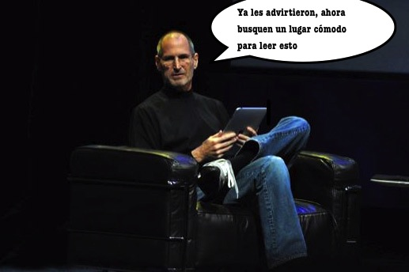
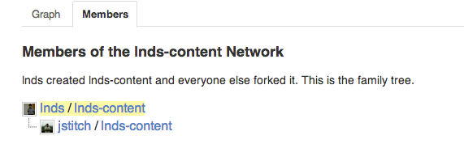
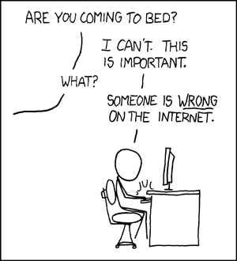
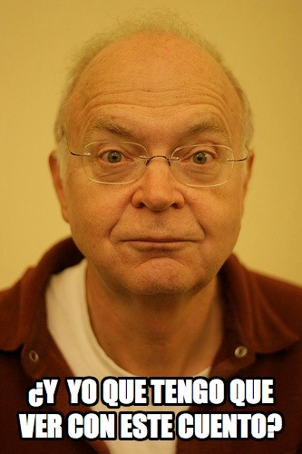
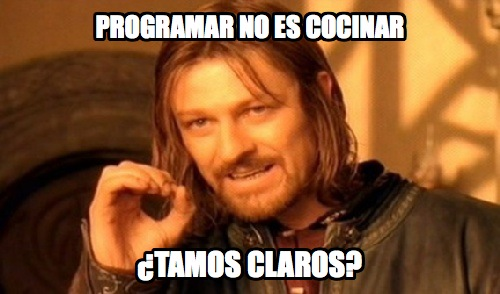
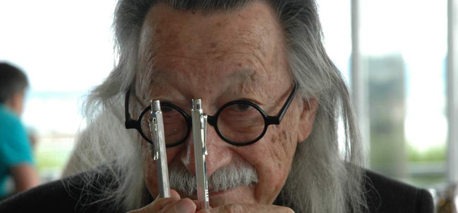
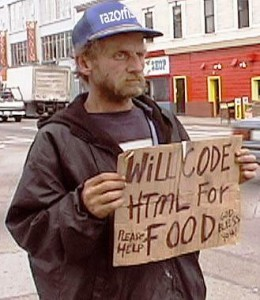

Este post es largo, quiero decir laaaaargo, porque tiene ambición, y
pretende decir muchas cosas importantes. Como dice el Chef Antoine de
New Orleans (citado por Fred Brooks en [The Mythical Man Month](http://amzn.to/zhUwYa)):

> "La buena cocina toma tiempo. Si le hacemos esperar, es
para servirle mejor, y complacerle" 

Si yo fuera ustedes me buscaría un buen sofá, un momento de tranquilidad
para leer esto, que en algunos momentos se puede poner bastante denso,
pero creo que vale la pena. Al menos decidí tomarme el tiempo adecuado
para escribirlo, con calma, con reflexión, como se debe hacer cuando las
cosas que hacemos consideramos que son importantes.

## **Comunidad** 

> "El hombre aislado no desarrolla ningún
poder intelectual. Es necesario que él esté inmerso en un ambiente...
Podría quizás hacer un poco de investigación por si mismo y lograr
algunos pocos descubrimientos... la búsqueda de nuevas técnicas debe ser
vista como algo realizado por la comunidad humana en su totalidad, más
que por individuos."\
-- Alan Turing

Yo escribo este blog para aprender. La preparación de un post me puede
tomar mucho tiempo en algunos casos. Me tomo el tiempo porque me gusta
aprender.

Cuando investigo encuentro cosas interesantes, descubro relaciones que
no sospechaba, la apertura de mente que esto produce es notable. Si me
pidieran un consejo sobre cómo mejorar , ya sea profesionalmente, o en
la vida sería: "escribe un blog, pero escríbelo bien", es decir,
investiga, preocúpate de que lo que digas es veraz, y que esté bien
argumentado. Preocúpate primero de lo **esencial**, que el tema sea
interesante, e investígalo con la mayor profundidad que puedas
dedicarle. También considera cuidadosamente lo **accidental**, como la
[ortografía](http://www.lnds.net/blog/2012/10/mala-hortografia.html) y
la redacción, en eso debo reconocer que tengo fallos, pero creo que la
solución se da en el tiempo.

Sólo practicando un arte se puede llegar a dominarlo, incluso en los
detalles accidentales.

Hace unos meses decidí que mis textos quedarían en [un repositorio
GitHub](https://github.com/lnds/lnds-content), de modo que cualquiera
pueda clonarlos y ayudarme a mejorar la calidad de mis post. Por
ejemplo, uno de mis lectores más antiguos, Javier Novoa
([\@jstitch](https://twitter.com/JaviStitch)), de México, encontró un
fallo en uno de mis artículos, y gentilmente decidió usar esta
herramienta para ofrecerme la corrección, mediante lo que se conoce como
un Pull Request. Finalmente el error lo descubrí y corregí en paralelo,
pero fue la primera vez en que se plasmó la iniciativa, la intención que
yo buscaba al publicar mis textos en GitHub, que ustedes me ayuden a
corregir su contenido. Este blog es opensource, lo que significa que
ustedes me pueden ayudar a mejorarlo y a enriquecerlo.

Algo tan personal, e individual como escribir un blog se enriquece con
la comunidad, uno no escribe para si mismo, sino que para que los otros
lo lean. Pero el blog tiene la ventaja que permite el debate, los
comentarios, y la interacción con otros autores. Cuando el cuadrito para
comentar se hace corto, tienes que recurrir a tu propio espacio y
escribir tu propio post respondiendo al otro. Al menos es lo que hago yo
en muchos casos.

Pero me parece que he dado un paso más, porque ahora además de comentar,
ustedes pueden ayudar directamente a mejorar la calidad de este blog.

## **La Naturaleza del Software**

La razón por la que ahora puedo "enriquecer" aún más el contenido de
este blog, con la ayuda de ustedes, es porque, después de todo, estas
palabras que escribo son software.

En una oportunidad por twitter alguien me comentó que ahora podría
remezclar mis textos y llevarlos a audio, usando tecnología
text-to-speech, y quien sabe, en un acto de creatividad máxima se podría
hasta musicalizar. ¡Eso sería notable!

Esa es la infinita plasticidad del software, uno de sus atributos que lo
hace tan fascinante, una de las creaciones más importantes del ingenio
humano.

El software es más que código. Si no se ha entendido eso, entonces se
produce una limitación muy importante. Hay muchas personas que producen
software sin ser conscientes de eso. El software ha permeado nuestras
vidas cotidianas sin darnos cuenta. Parece invisible, está dado. Nadie
reflexiona mucho sobre la naturaleza del software que corre en sus
móviles, o tablets. Esa es la gracia, y la desgracia al mismo tiempo. Es
ese impacto profundo que hemos logrado en las vidas de las personas, esa
transformación silenciosa, que es tan maravillosa y aterradora a la vez.

## **¿Qué es el software?**

> "¿Qué es el software? ¿Por qué profesionales y
científicos clásicos, para qué decir los "humanistas",
aprecian/usan/usufructuan del software pero desprecian la actividad y
sus profesionales? Argumentaré que se debe a que el software es primo
hermano de la cocina. Y esta gente lo intuye. La cocina es una actividad
cuyos productos son apreciados como pocos, pero cuya actividad y quienes
la desarrollan parecieran pertenecer a la oscura trastienda de lo
socialmente superfluo."

El texto citado fue publicado hace pocos días en el blog del
Departamento de Ciencias de la Computación de la Universidad de Chile,
bajo el título [El Goce Del Puro
Hacer](http://dccuchile.blog.terra.cl/2013/03/06/software-el-goce-del-puro-hacer/)
y escrito por Claudio Gutierrez académico de ese departamento.

En ese artículo desarrolla un argumento que trataré de resumir en los
próximos párrafos.

Motivado por la lectura del Gorgias de Platón, el autor pretende
explicar por qué la "intelectualidad clásica" usufructa del software,
pero desprecia esta actividad y a sus profesionales.

La hipótesis escogida es que "el software es primo hermano de la
cocina", y dado que, tal como se muestra en el diálogo de Platón, el
cocinar siempre ha sido menospreciado por los filósofos, entonces el
software es despreciado de la misma manera.

Es decir, el software es como la cocina, y lo que buscamos de la cocina
es placer (adulación). Pero hay adulación positiva, la realización de
los deseos, y adulación negativa que corresponde a la manipulación de
los deseos.

Los programadores, de acuerdo a Gutierrez, lo que hacen es satisfacer
los deseos de los usuarios mediante el software. A esto, el autor lo
llama la "adulación del hacer". Dado que autores tan prestigiosos como
Fred Brooks o Ivar Jacobson han fracasado en definir la naturaleza del
software, entonces nos quedamos con que esta consiste en la "adulación
del hacer".

Y esto constituye una doble falta a los ojos de la tradición, porque:
"Primero, al desarrollador de software no le importan las causas, la
naturaleza. No se ocupa del "bien", sino de lo que desea el usuario. Por
ello no constituye un arte; es adulación. Segundo, lo adulado por el
software, el hacer, al contrario del cuerpo o del alma, es algo que
nunca ha sido bien mirado."

¿Por qué no es bien mirado? Porque todos quieren obtener placer sin
hacer nada. Eso es lo que se le ofrece a las nuevas generaciones. Y
luego viene el epílogo que a mi personalmente me deja con una sensación
extraña:

> Terminemos: ¿sería posible un mundo sin software? Por
supuesto. Y sería un mundo más tranquilo, con haceres pausados y
rústicos. La gente no moriría de hambre ni de frío... pero sí de
aburrimiento. No habría nadie que nos adule en el hacer, que satisfaga
el insaciable placer del hacer.

Vamos a tratar de aclarar todo lo anterior, porque me parece que ya se
ha vuelto bastante confuso.

## **Filosofía y Cocina**

> "Tengo siempre la costumbre, cuando alguien habla, de
prestarle mi atención, especialmente cuando el que habla me parece
sabio, y en mi deseo de comprender lo que dice, averiguo, reexamino,
comparo lo que se dice, a fin de aprender. Si el que habla me parece de
poco valer, ni insisto en mis preguntas ni me intereso por lo que dice.
En esto reconocerás a los que yo considero sabios; encontrarás que soy
insistente sobre lo que dicen y que interrogo para aprender y sacar
provecho."\
-- Sócrates en el Diálogo de Platón "Hipias Menor" 

El primer problema es que no tenemos claro que es lo que el autor
entiende por software. De lo que se puede entender del texto creo
entender de que está hablando de la programación, más que del software
en sí. Y ahí creo que parte la confusión del argumento.

El otro problema, radica en la tesis que se nos presenta, que parece una
[petición de
principios](http://es.wikipedia.org/wiki/Petici%C3%B3n_de_principio). La
tesis, recordemos, es que la intelectualidad clásica usufructa del
software pero desprecia esta actividad.

En esencia el argumento va más a o menos así.

-   La intelectualidad clásica desprecia el software.
-   El software es como la cocina, porque es una adulación, no un arte.
-   La intelectualidad clásica se place en la adulación (como
    cualquiera), pero sin embargo la desprecia.
-   Luego la intelectualidad clásica desprecia el software.

La demostración se sostiene en la premisa de que el software es
adulación del hacer, y esta consiste en que el software se hace para
satisfacer los deseos del usuario.

Pero esa definición más parece un truco retórico (petición de
principios) y por esto creo que se cae el argumento (es notable el hecho
de que el Gorgias sea el diálogo sobre la retórica, y que en uno de sus
pasajes lo que trata de probar Sócrates es que la retórica no es más que
un truco, algo menor, no un arte y por lo tanto sea menos valiosa).

¿Y qué hay de malo con esa definición? Porque si ésta se sostiene,
aunque haya algún problema lógico formal con la exposición, el argumento
central puede salvarse.

## **El problema del cocinero**

Me gusta la cocina, y mucho. No me considero un cocinero, apenas me
aparezco por la cocina, es la verdad, pero de repente tomo mi wok y
preparo algo salteado, o alguna ensalada.

Del cocinar lo que me más me gusta es la experimentación, la mezcla de
sabores. Efectivamente cocinar es una actividad placentera, y
**sorprender** a los comensales es la gran recompensa, y por lo tanto lo
que buscamos al cocinar es adular, tal como dice Sócrates en el Gorgias.

Por otro lado las analogías de la programación y la cocina surgen de
manera natural. Ya les conté en [otra ocasión](/blog/2011/10/ensaladas-y-algoritmos.html)
como cocinar te da una visión especial de lo que significa abordar la
comprensión y programación de un algoritmo.

Y con todo eso, no puedo decir que mi profesión sea similar, o parecida
a cocinar, al menos no si la entendemos como simplemente adular al
usuario.

Podríamos discutir si la cocina más que una adulación, y al contrario un
verdadero arte. Al menos, en muchos aspectos parece serlo, y un chef
seguro que defendería ese punto.

Cuando la cocina va más allá de la simple técnica, y es [mucho más que
mezclar
ingredientes](/blog/2007/07/ratatouille-lecciones-de-ingenieria-de-s.html),
hace algo más que complacer al usuario en su requerimiento, y es el arte
del Chef el sorprendernos, no olvidemos eso. (Les recomiendo leer 
[mi reflexión sobre la película Ratatouille](/blog/2007/07/ratatouille-lecciones-de-ingenieria-de-s.html)
donde elaboro un poco más este punto, y refuerzo mi idea de que en
realidad el programar [es más parecido a hacer cine](/2005/08/desarrollar-software-es-como-hacer-una-pelicula.html)
que a cocinar).

Entonces, sólo si la cocina va más allá de complacer al usuario,
podríamos empezar a aceptar la comparación. Pero tratemos de aclarar
estos términos.

## **Dinning Philophers**

Hay un famoso problema en computación conocido como el problema de la
cena de los filósofos, planteado por Edsger Dijkstra para representar el
problema de sincronización de procesos en los sistemas operativos.
[Vease Wikipedia](https://es.wikipedia.org/wiki/Problema_de_la_cena_de_los_fil%C3%B3sofos)

Ese problemas nos permite recordar la vieja máxima que para filosofar
primero hay que tener la barriga llena. La filosofía requiere que
ciertas necesidades básicas estén cubiertas, si hasta
[Ciorán](https://www.akarru.com/blog/2011/03/cioran/) y los filósofos
estoicos tenían resuelto ese problema, se sabe que Diógenes, el más
pobre de los filósofos, tenía resuelto el problema con lentejas, y
¡pucha que son ricas las lentejas! Lo que me sugiere que este puede ser
un buen momento para preparse algún bocadillo antes de continuar ;-).

Así que sólo si hemos resuelto el problema básico de comer, nos
dedicamos a filosofar. Puede ser que por esa razón a los filósofos no
les ha interesado dedicarle mucho tiempo al problema de cocinar. Para
ellos eso es una cosa resuelta, ¿para que dedicarle más vueltas?

Pero la verdad es otra. Sucede que mi hermano es filósofo y vivimos
juntos en un pequeño departamento durante nuestra época de universidad.
Así que mientras él estudiaba, yo estaba expuesto a estos textos. Fue
ahí donde desarrollé mi gusto por los Diálogos de Platón, y el Gorgias
es un texto importante. Gorgias es el diálogo sobre la retórica (que
notable coincidencia). Es uno de los textos maduros de Platón, donde
plantea sus ideas, usando la voz de Sócrates, sobre la política y la
justicia, tema que profundizará en su famosa obra magna La República.

Hay un apartado del Gorgias que habla sobre la naturaleza de la
retórica, y si esta tiene que ver con la justicia y la política. En un
momento del diálogo la discusión se centra en determinar si la retórica
es un arte como afirma Gorgias. Sócrates niega esta posibilidad, y
argumenta que la retórica no es un arte como la considera Gorgias, sino
que una práctica, un truco, algo menor, "adulación" (y acá vienen los
problemas de las traducciones). Para sostener este punto, Sócrates usa
varias analogías, una de las más famosas es la de comparar la cocina con
la medicina.

Es importante también entender que los griegos consideraban la
frugalidad una virtud, de hecho encontraban decadentes a los persas, sus
eternos enemigos, por su lujo y exhuberancia gastronómica. Ser chef no
era buen negocio en la Grecia de Platón.

Aunque es un ejercicio un tanto ocioso, yo sostengo lo contrario que
dice Gutierrez, que si Platón viviera en este tiempo tendría que llegar
necesariamente a la conclusión que el software es el producto de un
arte, no una adulación, si es que su pensamiento es coherente con lo que
expone en el Gorgias. Allí está el
[Gorgias](http://es.wikisource.org/wiki/Gorgias_(Plat%C3%B3n%29) para
que puedan sacar ustedes sus propias conclusiones.

Pero para aclarar mi punto voy a citar a Donald Knuth que lo expone
bastante bien en su hermoso discurso sobre 
[el arte de la programación](/blog/2009/12/la-programacion-como-un-arte-parte-i.html).

> Si vamos a las raíces latinas, encontramos ars, artis
que significan "habilidad". Quizás es significativo que la palabra
griega correspondiente era τεχνη, la raíz de "tecnología" y "técnica".
\* (Esta es la palabra usada por Platón en el Gorgias, nota de E.D.)
>
> En nuestros días cuando alguien habla de "arte" probablemente piense
primero en las "finas artes" tales como la pintura y la escultura, pero
antes del siglo veinte la palabra era usada generalmente en un sentido
bastante diferente.
>
> En los tiempos medievales, las primeras universidades fueron
establecidas para enseñar las, así llamadas, "siete artes liberales" a
saber, gramática, retórica, lógica, aritmética, geometría, música y
astronomía. Noten que esto es bastante diferente de los currículos de
los colegios de artes liberales, y que al menos tres de las siete artes
liberales son componentes importantes de la ciencia de la computación.
En aquel tiempo, un "arte" denotaba a algo ideado por el intelecto
humano, en oposición a las actividades derivadas de la naturaleza o el
instinto; las artes "liberales" eran liberadas o libres, en contraste a
las artes manuales tales como arar. Durante la edad media la palabra
"arte" por si misma usualmente significaba lógica, la que usualmente
denotaba el estudio de los silogismos.

Tal como nos dice Knuth, hace rato que los filósofos clásicos definen el
arte como el producto del intelecto humano, comer es algo que viene del
instinto, y por lo tanto el cocinar por ser una actividad vinculada o
originada de una necesidad primaria, no puede ser considerada arte en el
sentido clásico del término.

Por lo mismo, no puede ser considerado el software algo menos que el
arte, ¡por la misma razón que expone Gutierrez en el último párrafo de
su artículo! Porque precisamente puede concebirse un mundo sin
programación, porque la programación surge como una actividad propia del
intelecto humano, más allá de las necesidades básicas o naturales. La
programación está más allá de la simple adulación o satisfacción del
placer. No es adulación en el hacer. El desafío intelectual nace de la
necesidad de resolver un problema mayor, tal como en la concepción
platónica la política nace del problema de buscar la justicia y la
verdad, la programación, y por ende el software, nacen de una necesidad
mayor aún, la de resolver un problema.

Y acá es preciso que agregue más palabras del discurso de Knuth:

> La Ciencia es conocimiento que entendemos tan bien que
se lo podemos enseñar a un computador, y si no podemos entender algo
completamente, es un arte tratar con él. Dado que la noción de un
algoritmo o programa de computador nos provee de una prueba
extremadamente útil de la profundidad de nuestro conocimiento sobre un
asunto dado, el proceso de ir desde un arte a una ciencia significa que
aprendemos cómo automatizar algo.

Así que no puedo aceptar que la programación es adulación en el hacer,
pues es más que eso, es un arte en el sentido clásico del término, y al
ser un objeto cuya raíz es el intelecto humano no puede ser comparado
con el cocinar, que nace de cubrir una actividad humana básica. En el
sentido clásico, el programar sería un arte liberal.

## **Bondad, Belleza y Verdad**

> El programador desarrolla un software que hace lo que
el usuario quiere. No existe un programa "bueno", "verdadero", "bello",
absoluto. Un buen software satisface deseos en el mundo del hacer. Nada
más. Muchas veces estos se confunden con los chatos deseos de los
empresarios: eficiencia, velocidad, economía. \-- Claudio Gutierrez, Op.
Cit.

Hay en el fragmento que acabo de citar muchas consecuencias que me
preocupan. Es sabido desde antiguo que no se puede cargar de virtudes
propias del ser humano a las cosas, o a los animales. Un cuchillo no es
culpable de un asesinato. Es el uso que hacemos de ellas y sus virtudes
estéticas las que nos hacen apreciarlas en mayor o menor medida.
Decimos, este cuchillo es bueno si cumple adecuadamente su función. Por
lo mismo, decimos que un un programa (no un software) es útil, o bueno.
La belleza del mismo es un atributo que dependerá del observador.

Una aplicación puede ser útil, y bella a la vez. Esa belleza puede ser
apreciada a distintos niveles y por distintas personas. Para un usuario
la belleza puede estar en la interfaz, en la fluidez y diseño de las
interacciones. Si la aplicación responde adecuadamente, resuelve el
problema, pero además es agradable de ver, será apreciada.

Pero un técnico puede apreciar la belleza de una aplicación a otros
niveles. En su arquitectura, el grado de acoplamiento, la elegancia en
el diseño de las APIs. Incluso se puede apreciar en 
[el estilo de programación](/blog/2011/09/poesia-caligrama-y-la-belleza-del-codigo.html).
Cómo diría Dijkstra, ["La Belleza es Nuestro Negocio"](http://amzn.to/WVVxdO)

El ingeniero apreciará la eficiencia, velocidad y economía de recursos.
Yo recuerdo que cuando estudié ingeniería nos hacían apreciar estos tres
aspectos, y no porque sean "chatos deseos de empresarios", es labor
del ingeniero usar los recursos de manera eficiente y económica. Parece
que eso ha cambiado en el discurso académico, ¿o será que ya no hay
ingenieros formando ingenieros, y se han olvidado las viejas virtudes de
esta noble profesión?

Si no hay bondad, belleza y verdad en el quehacer del profesional, y
sólo el deseo compulsivo de complacer, entonces ya no vale la pena
dedicarse a la profesión. Yo creo que esta idea es peligrosa,
desalentadora. Al menos no quiero dedicarme a una profesión que se vea
si misma de ese modo, no es por eso por lo que me he dedicado al hermoso
arte de la programación todos estos años.

## **El programador compulsivo**

Pero hay un riesgo con la programación, es una suerte de patología,
identificada por Joseph Weizenbaum hace muchos años atrás, y que si
seguimos y extrapolamos la visión de la "adulación en el hacer" nos
puede hacer caer directamente en esta trampa.

Porque de la adulación del hacer es fácil caer en el programar por el
simple placer que produce programar.

> El programador de computadoras, \[\...\] es el creador
de universos para los cuales es el único legislador. Así, también, es el
diseñador de cualquier juego. Pero universos de complejidad virtualmente
ilimitada pueden ser creados en la forma de programas computacionales.
Más aún, y este es un punto crucial, los sistemas así formulados y
elaborados actúan sus guiones programados. Sin chistar siguen sus leyes
y vívidamente exhiben su comportamiento obediente. Ningún dramaturgo,
ningún director de escena, ni emperador, no importa cuan poderoso, ha
jamás ejercido tal autoridad absoluta para ordenar un escenario o campo
de batalla y para comandar tales inquebrantables y cumplidores actores o
tropas.
>
> Uno debería sorprenderse si la observación de Lord Acton de que el poder
corrompe no fuera aplicable en un ambiente en el cual la omnipotencia es
tan fácilmente alcanzable. Aplica. Y la corrupción evocada por la
omnipotencia del programador de computadores se manifiesta en una forma
que es instructiva en un dominio mayor que el ambiente inmediato del
computador. Para entenderlo, tenemos que observar un desorden mental,
que aunque bastante antiguo, parece haberse transformado en un nuevo
tipo: la compulsión por programar.
>
> [En distintos centros de cómputo] brillantes jóvenes de aspecto
descuidado, a menudo con ojos rojizos y hundidos, pueden ser vistos
sentados en consolas de computadoras, con sus brazos tensos y esperando
para disparar sus dedos, listos para atacar a los botones y teclas en
los cuales su atención parece estar remachada como lo está el jugador
sobre los dados rodando. \[...\] Ellos trabajan hasta que prácticamente
desfallecen, veinte, treinta hora de una vez. Su alimento, si lo
disponen, llega a ellos: café, Coca Colas, sandwiches. Si es posible
duermen en sacos cerca del computador. Pero sólo por pocas horas, luego
vuelven a la consola.\[...\] Sólo existen, al menos cuando están
enganchados, a través y por las computadoras. Son vagos de los
computadores, programadores compulsivos. Son un fenómeno internacional.
>
> ¿Cómo puede distinguirse a un programador compulsivo de un programador
profesional dedicado que trabaja muy duro? Primero por el hecho de que
el programador profesional ordinario se dedica al problema a ser
resuelto, mientras que el programador compulsivo ve el problema
principalmente como una oportunidad de interactuar con el computador. El
programador común usualmente discutirá tanto su problema sustantivo como
los problemas técnicos con otros. Generalmente hará un trabajo
preparatorio largo, como escribir y diagrama, antes de trabajar con el
computador en si mismo. Sus sesiones con el computador pueden ser
comparativamente cortas. Incluso puede que deje que otros hagan el
trabajo en la consola. Desarrolla su programa de forma lenta y
sistemática. Cuando algo no funciona, puede pasar mucho tiempo lejos del
computador, considerando hipótesis cuidadosamente sobre las causas del
malfuncionamiento, y diseñando experimentos cruciales para probarlas.
\[...\] Es capaz, mientras espera los resultados del computador, de
atender otros aspectos de su trabajo, como documentar lo que ya ha
hecho. Cuando ha compuesto el programa que que pasa a producción, es
capaz de escribir una descripción razonable de este y cambiar su
atención a otras cosas. El profesional ve la programación como un medio
para un fin, no como un fin en si mismo. Su satisfacción viene de haber
resuelto un problema sustantivo, no de haber sometido al computador a su
voluntad."
>
> -- Joseph Weizenbaum, Science and the Compulsive Programmer, en Computer Power and Human Reason, 1976

Voy a repetir eso último porque es importante: **la satisfacción del
programador profesional viene de haber resuelto un problema sustantivo,
no de haber sometido el computador a su voluntad**.

Cuando Weizenbaum escribía la labor de programación profesional requería
de un mayor tiempo de reflexión alejada del computador a lo que se da
hoy. En la actualidad, la interacción con el computador es más
compulsiva que en 1976, porque tenemos compiladores más rápidos,
metodologías más ágiles. El peligro de compulsión es mayor en mi
opinión.

En su libro [Computer Power and Human Reason](https://amzn.to/ZcmD2i),
Joseph Weizenbaum advierte sobre los peligros de esta patología, y la
compara con otras ya conocidas, como la del jugador/apostador
compulsivo. Y tiene razón en muchas de sus preocupaciones. Es más,
sospecho que muchas corporaciones tecnológicas abusan de esta patología
para explotar a estos brillantes jóvenes. No es para nada coincidencia
que se les ofrezca tener el campus, la comida, y todas sus necesidades
cubiertas (incluso la recreación) en los mismos edificios donde
trabajan. Tampoco es coincidencia que los confites, bebidas energéticas
sean gratis en estos centros de programación, está estudiado que el
chocolate aporta nutrientes que afectan nuestro estado de ánimo y
bienestar (el [triptófano](https://es.wikipedia.org/wiki/Tript%C3%B3fano)
que regula la [serotonina](https://es.wikipedia.org/wiki/Serotonina)
conocida como la hormona del bienestar, la
[feniletilamina](https://es.wikipedia.org/wiki/Feniletilamina) un
neuromodulador que mejora el estado de ánimo, y la
[anandamina](https://es.wikipedia.org/wiki/Anandamida) que nos hace
sentir tranquilos y contentos).

Pues bien, el programador compulsivo estará de acuerdo con esta idea del
placer del puro hacer de la programación. Y no se si Claudio Gutierrez
está de acuerdo o no conmigo, porque no me queda claro si es una
preocupación para él, o es algo que encuentra positivo.

Finalmente creo que esta "patología" del programador compulsivo
termina expresándose en otro tipo de estado de ánimo, que exacerba una
necesidad natural del ser humano, que es el sentido de reconocimiento.

## **El Programador Emo**

> ¿Por qué profesionales y científicos clásicos, para qué
decir los "humanistas", aprecian/usan/usufructuan del software pero
desprecian la actividad y sus profesionales?

Todos necesitamos reconocimiento. Es una necesidad tan natural, que la
exigimos desde el momento en que lloramos por primera vez para demandar
la atención de nuestra madre.

Sin embargo, con el tiempo vamos madurando y reconociendo que no es
necesario andar exigiendo reconocimiento, que este llega sólo como fruto
de una tarea bien hecha. Ganamos en seguridad, y cuando ya estamos
maduros no andamos mendigando reconocimiento, sabremos que lo
obtendremos por la calidad de nuestras acciones.

Por eso cuando leo un texto como el citado al principio de esta sección
me molesto, porque cae en ese lugar común de muchos informáticos y que a
esta altura francamente me tiene bastante tostado.

Es esa actitud de "pobrecitos nosotros los informáticos, todos usan
nuestras creaciones, pero aún así somos ignorados por todo el mundo,
nadie nos quiere, todos nos odian, queremos comer gusanos...", como
dice una vieja canción infantil proto-emo de los ochenta.

Si esperas ser reconocido porque doblegaste la voluntad del computador,
entonces estás perdido, a nadie le va interesar eso, salvo quizás a
otros programadores compulsivos como tu mismo.

Pero si tu actividad es sustancial, si aporta al bienestar de la
humanidad, si tu aporte es valioso, bello, justo. Si resuelves una
necesidad, si rascas una comezón, si aportas realmente a otro ser
humano, el reconocimiento llegará.

Yo he sentido muchas veces la gratitud. Hace unos meses atrás conocí a
una mujer que supo que yo había escrito cierto programa hace varios años
atrás y que ahora ella estaba usando. Cuando nos presentaron se acercó a
mi me dio la mano y un abrazo, y me agradeció, pues encontraba que mi
programa era la solución más útil y práctica que había encontrado en
muchos años para su problema.

¿Puedo decir que mi actividad es despreciada por otros? No, porque tengo
muchos ejemplos y anécdotas similares que contar. ¿Que mayor
satisfacción es esa?

El problema no es que otros no aprecien a los informáticos y sus obras,
el problema creo yo es que los que se quejan de esa falta de
reconocimiento nunca han resuelto nada que realmente pueda ser
apreciado, o están en el lugar equivocado. Entonces, ¿de quién es el
problema?

