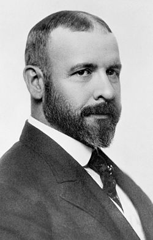

> It is the pervading
law of all things organic and inorganic, of\
all things physical and metaphysical,of all things human and all things
superhuman ---of all true manifestations of the head, of the heart, of
the soul--- that the life is recognizable in its expression, that form
ever follows function. This is the law.\
> -- Louis Sullivan, ["The Tall Office Building Artistically Considered"](http://es.scribd.com/doc/104764188/Louis-Sullivan-The-Tall-Office-Building-Artistically-Considered)

Para el arquitecto Louis Sullivan, admirador de los pensadores
racionalistas norteamericanos como Thoreau, Emerson, Whitman y Melville,
existía un sólo credo estético, con una regla simple "que no permite
excepciones", la "forma siempre sigue a la función".

Sullivan desarrolló el concepto de rascacielos con estructura de acero
en el Chicago de fines del siglo XIX. Las fuerzas de la economía y la
tecnología convergían en ese momento y había que diseñar algo nuevo,
fuera de los antiguos patrones escritos en viejos libros de
arquitectura. Para Sullivan si algo tenía que determinar la forma, esto
sería el propósito del edificio. La propuesta de Sullivan es que la
"forma sigue la función, versus el anterior credo de que "la forma
sigue al precedente". Hasta ese tiempo, la arquitectura se basaba en el
principio de que la arquitectura debía re utilizar las grandes formas de
la antigüedad.

Esto llevó a los arquitectos a buscar estilos arquitectónicos que no
fueran influenciados por la historia. La idea era expresar la verdadera
forma del edificio siguiendo un estricto apego a su funcionalidad. Al
grado de llegar a rechazar todo ornamento arquitectónico, reflejado en
el ensayo de Adolf Loos: ["ornamento y crimen"](http://en.wikipedia.org/wiki/Ornament_and_Crime).

Estos conceptos, llevaron al surgimiento de los 
[movimientos modernistas en arquitectura](http://en.wikipedia.org/wiki/Modern_architecture).

Loos proclamaba que la evolución de la cultura, el progreso, busca la
eliminación del ornamento en los objetos útiles. El ornamento provoca
que los objetos pierdan estilo, y por lo tanto se vuelven obsoletos. Por
esto que perder esfuerzo en el ornamento de un objeto es un crimen, pues
llevará al objeto a su obsolescencia. Los objetos útiles deben ser
simples, sin ornamentos, es la finalidad de esta propuesta.

Es muy interesante estudiar las discusiones y propuestas del diseño y la
arquitectura de fines del siglo XIX y principios del siglo XX, porque
pueden ser ilustrativas para el desarrollo de la arquitectura de
software en particular.

Aunque he sostenido que desarrollar software no es construir software,
en el sentido de que no se deben aplicar directamente las analogías de
construcción de edificios con el desarrollo de sistemas, es innegable
que el software requiere de un diseño previo.

Veamos que pasa si adoptamos una definición de arquitectura de software
acorde con estos conceptos de forma y función. Definamos por ahora que
de lo que trata la arquitectura de software es del estudio de la forma y
función de un sistema.

**Forma, es lo que el sistema es, función es lo que el sistema hace**.
¿Pero cómo lo hace? Cuando tratamos de entender cómo el sistema hace lo
que debe hacer, es que entramos a discutir sobre la estructura. La
estructura es el soporte a la forma, y la forma, como nos recuerda
Sullivan, sigue a la función.

Si les pido diseñar una silla, la forma está dada inmediatamente por la
función, que es permitir descansar el cuerpo de cierta forma precia. No
se puede hacer una silla totalmente vertical, pues queremos mantener a
la persona en cierta posición específica. Sin embargo, es relevante
preguntarse cómo esta silla sostendrá el peso, de que materiales debe
estar construida, cuáles son las fuerzas a la que se verán sometidos los
materiales, cual deberá ser la duración, cuanta gente podrá usar
potencialmente la silla, por cuanto tiempo, etc.

Lo mismo pasaría con un sistema informático. La función es lo primero
que debemos definir: Qué hace el sistema, a qué responde, para qué lo
hacemos. De esto sale la forma, y definida la forma debemos desarrollar
la mejor estructura que lo soporte.

Veamos las consecuencias de esto con un ejemplo práctico:

Queremos desarrollar un sistema que permita a las personas indicar donde
están y qué están haciendo en cada momento. Para esto los usuarios
ingresarán su "Estado", que corresponde a un mensaje breve que indica
qué está haciendo en cada momento relevante. La idea es que otros puedan
saber donde está y que está haciendo, pues es útil para coordinar las
tareas de un equipo. Para indicar su estado las personas no
necesariamente deberán tener acceso a un computador. Esa es la función.

Para cumplir esta función, permitiremos que los usuarios envíen sus
mensajes de estado a un sitio central, y permitiremos que cualquiera
pueda observar una linea de tiempo con los estados de cada uno de los
participantes del sistema. Las personas que usen este sistema podrán
elegir a quienes seguir, y podrán saber quienes les siguen. Esta es la
forma.

Y acá viene la discusión interesante de la arquitectura. Como queremos
acceso desde cualquier parte, permitiremos que los mensajes sean
enviados vía SMS, esto produce una limitación al mensaje de estado, que
para ser compatible con todos los sistemas de mensajería por celular de
la época, implica que el estado estará limitado a 140 caracteres.

Usaremos un sitio web para consultar la linea de tiempo de los demás
participantes, y para elaborar nuestras listas de usuarios que nos
interesa seguir, junto con consultar el estado de nuestros seguidores.

Con todo esto, podemos construir este sitio usando Ruby On Rails, en
poco tiempo, y podemos disponibilizarlo en la web. Lo llamaremos
Twitter.

Acá viene la diferencia fundamental con la arquitectura tradicional, esa
que se encuentra limitada por la fuerza de la gravedad. Porque Twitter
empieza a popularizarse, y empieza a ser usado para más que la función
inicial. Decimos que Twitter, el sistema, evoluciona, y requiere
adaptarse a los nuevos requerimientos, que surgen dinámicamente, porque
el software permite una mayor maleabilidad.

Hoy Twitter es una herramienta que cumple funciones diferentes a las
soñadas por sus creadores. Su arquitectura actual no es la misma que la
que tenía cuando inició. Seguramente en este momento hay una gran
preocupación en el equipo sobre la seguridad de las cuentas de twitter,
ya hemos visto como la apropiación indebida de una cuenta en twitter
[provocó una caída en la bolsa del índice Dow Jones](http://bigstory.ap.org/article/hackers-compromise-ap-twitter-account).
La arquitectura debe hacerse cargo de esos aspectos también.

Lo que empezó con Ruby On Rails y MySQL, ahora es una combinación de
muchos frameworks, lenguajes (ruby, scala y java principalmente) y de
bases de datos (relacionales y NoSQL). Soportando plataformas móviles y
toda clase de clientes y soportando miles de aplicaciones que aprovechan
su API.

Decimos que la arquitectura de Twitter ha evolucionado, y efectivamente
de eso se trata, de evolución permanente, es la gran diferencia que la
arquitectura de software presenta frente a la arquitectura tradicional.

Así que nuestra definición de arquitectura debe cambiar. La arquitectura
de software tiene que ver con la forma y la función de los sistemas, y
con la evolución de los mismos. Es por eso que decimos que desarrollamos
software y no que lo construimos, para dar cuenta de la naturaleza
dinámica de nuestras arquitecturas.
