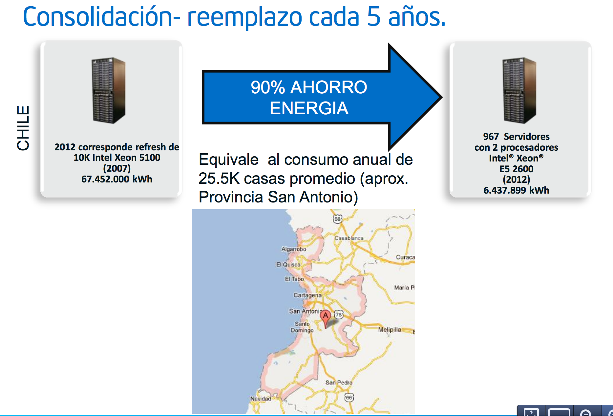
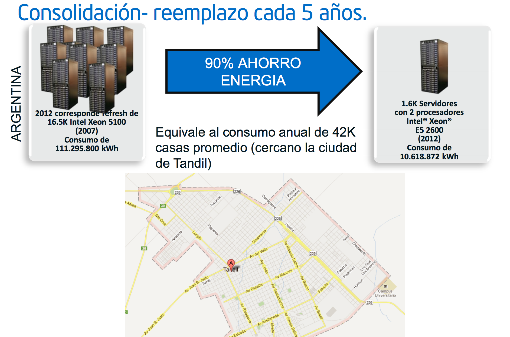

Hace unos días conversaba con un proveedor de servicios de datacenters
acá en Chile, me comentaba que lamentablemente no es posible tener
datacenters certificados
[Tier-4](http://en.wikipedia.org/wiki/Data_center#Data_center_tiers) en
nuestro país. La razón, en términos simples, porque contamos con sólo
una "carretera eléctrica" que suministra energía a los centros de
cómputo. Para alcanzar el máximo nivel de certificación de los
datacenters, la energía debe venir de dos fuentes independientes una de
la otra.

Todos percibimos la frágilidad de nuestra infraestructura energética, es
cosa de recordar los eventos post terremoto, y el gran corte de
electricidad que afectó a gran parte del país pocos meses después del
terremoto de 2010.

Lo cierto es que nuestra política energética como país nos está
perjudicando en el ámbito del desarrollo tecnológico, es muy difícil que
pretendamos desarrollar una industria de servicios de infraestructura a
nivel internacional con esta inmadurez en términos de gestión de las
necesidades energéticas.

Los datacenters modernos, de alta densidad y con tecnología green
consumen entre 800 a 1.200 watts/hora por metro cuadrado. Un datacenter
de unos 1.000 metros cuadrados, como los que ya existen en Chile, pueden
llegar a consumir el equivalente a lo que consumen unas 2.500 a 4.000
casas.

Pero esto es bastante eficiente. Debido a las nuevas tecnologías de
virtualización y alta densidad, estos datacenters son capaces de
sostener 10 veces más poder de cómputo que muchas tecnologías actuales.

A continuación voy a compartir con ustedes algunas imágenes provienentes
de una presentación de Intel del año pasado, en que presentaban sus
nuevas CPUs orientadas a servidores.

Lo que nos dice esta primera lámina es que en 2012 correspondía la
renovación 10.000 servidores Xeon 5100 que se encuentran en Chile, estos
servidores consumen anualmente el equivalente a lo que consumen todas
las casas de la Provincia de San Antonio.

Todos esos 10.000 servidores se pueden reemplazar por 967 servidores
Xeon E5 2600 y el consumo disminuye drásticamente ¡a un 10% de la
demanda actual!

Para el caso de Argentina, tenemos lo siguiente:

La cantidad de servidores que se tendría que reemplazar consumen el
equivalente de las casas de la ciudad de Tandil. Nuevamente, con el
cambio tecnológico podemos ahorrar el 90% de la energía.

En mayo de este año [Alejandro Barros](http://www.alejandrobarros.com/)
solicitó mediante ley de transparencia, el informe del impacto de la
medida de cambio de hora. En este [post de
Alejandro](http://www.alejandrobarros.com/cambio-de-hora-efectivamente-la-evaluacion-fue-light)
pueden ver un análisis de ese documento.

De acuerdo a esa minuta esta medida significó un ahorro estimado de 39
GWh (un cálculo aparentemente realizado con 
[lápiz en reverso de un sobre](https://en.wikipedia.org/wiki/Back-of-the-envelope_calculation),
porque no parece que existan mediciones concretas y evidencias de estos
resultados.

Pero aceptémos por un momento esas cifras como reales, según nuestras
autoridades modificar el horario de invierno ahorra 39 GWh, pues si
analizan la propuesta de Intel de reemplazar los servidores con más de 5
años de actualidad se obtienen 68 GWh anuales de ahorro, efectivos y
permanentes, sin las externalidades de cambiar la hora. Y ese estudio
sólo considera una parte de nuestro parque de servidores y computadores.

Hay dos problemas que he expuesto en este post, uno es que no existe una
política seria de generación y distribución de energía, que está
afectando el desarrollo de estándares de alta calidad en una industria
de servicio concreta: la prestación de servicios de infraestructura de
cómputo y tratamiento de datos (datacenters), hasta que no mejoremos
esto nuestros datacenters no podrán certificarse en el estándar más alto
(Tier-4).

El otro problema es que al parecer las autoridades no han tenido las
competencias adecuadas para analizar soluciones efectivas para mejorar
la eficiencia energética, yo les he mostrado el caso de mejoras que
puede realizar la industria TI, que con un esfuerzo moderado puede ser
más efectiva que las medidas actuales. Pero todo esto requiere que la
autoridad escuche a los especialistas, y no insista con soluciones que
tuvieron éxito hace 5 ó 6 décadas atrás, cuando la tecnología y el uso
de esta era muy distinto.
