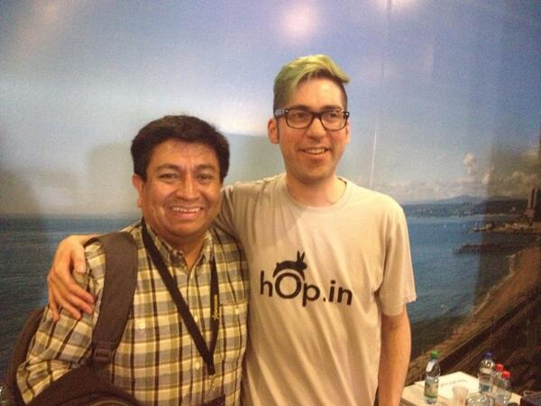

Este año participé en la StartechConf 2013, un verdadero honor para mi,
tengo que decir. No sólo tuve oportunidad de hacer mi presentación, sino
que pude conocer a varias personas con las que he compartido en mi
timeline en twitter, conocer a nuevos amigos y compartir con los
charlistas, como por ejemplo el "Sensei Jano Gonzalez"([\@janogonzalez](https://twitter.com/janogonzalez)).

La verdad es que me sentí muy contento estos dos días de la conferencia,
lo pasé muy bien y agradezco a los organizadores por permitirme
participar.

Más abajo les dejo mi presentación, mucho de lo que hablo en esta charla
ha sido cubierto en diversos posts en este blog.

Como referencia los temas cubiertos en mi charla corresponde a los
siguientes posts:

-   [Marte necesita mujeres](/blog/2013/09/marte-necesita-mujeres.html)
-   [Qué es programar](/blog/2012/05/que-es-programar.html)
-   [Expectativas](/blog/2013/03/expectativas.html)
-   [No se puede](/blog/2013/08/no-se-puede.html)
-   [Un Almuerzo en Lafayette Square](/blog/2012/03/un-almuerzo-en-lafayette-square.html)

La presentación está en Slideshare:
<https://www.slideshare.net/EduardoDiazCortes/creadores-de-universos-startech>



El video de mi presentación es este:


