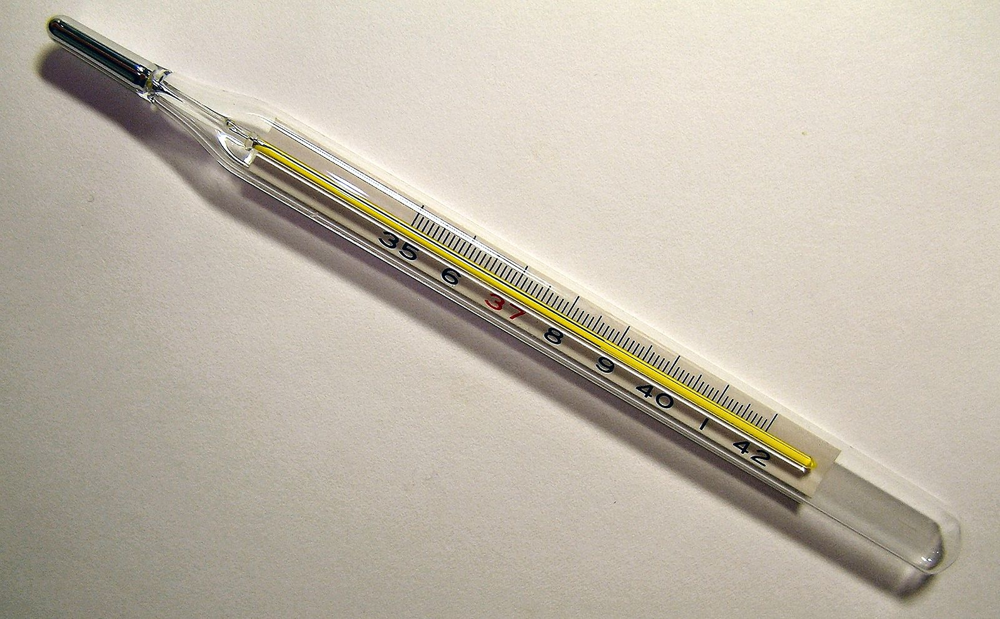
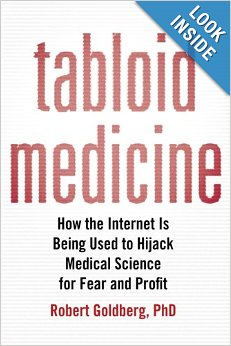
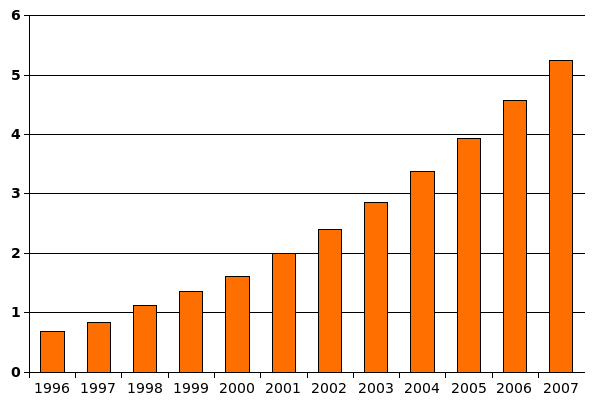
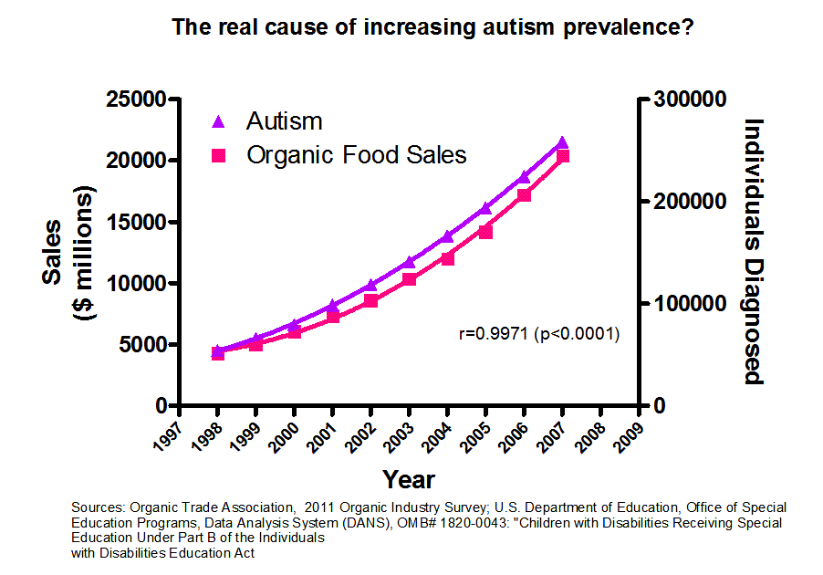

Mi hija menor tenía alrededor de un año de edad cuando cogió un
termómetro, lo mordió, y se tragó el contenido. Fue un lamentable
descuido nuestro el que dejó ese peligroso objeto a su alcance.

Por fortuna mi mujer detectó esta situación de inmediato, me llamó al
trabajo y acudimos lo más rápido posible a ver a su pediatra. El médico
ordenó unas radiografías en las que se observaban como las bolitas del
metal recorrían su tracto intestinal. Estábamos muy asustados y el
doctor desconcertado, pues no tenía claro qué hacer en este caso.

El mercurio es tóxico, aunque esto es algo que no se supo por largo
tiempo. Se dice que el emperador chino, que construyó la Gran Muralla,
en su aspiración por tener la vida eterna, consumía pequeñas cantidades
de este elemento y que fue esta dieta la que le llevó a la muerte antes
de cumplir cincuenta años. Entre los antiguos alquimistas se le
consideraba un elemento curativo y con propiedades místicas.

A los 40 grados Celsius el mercurio ya empieza a evaporarse. Es fácil
notar el efecto de dilatación del metal ante la temperatura en los
termómetros, y es por esta propiedad que se le usa en estos
instrumentos.

En forma de vapor es altamente nocivo. De hecho, si los vapores de
mercurio llegan al cerebro pueden causar serios daños neurológicos.
Además la exposición prolongada provoca pérdida de apetito, fatiga,
insomnio, cambios en el comportamiento, e incluso en la personalidad.
Además del cerebro, puede dañar los riñones, y pulmones. El daño es
mayor en los niños pequeños. Estamos hablando de grandes cantidades de
mercurio, o de exposición permanente y prolongada.

Su manipulación esta regulada en muchos países del mundo. Los dentistas,
por ejemplo, solían usar mucho mercurio en las amalgamas, lo que se ha
prohibido en muchos países, y la OMS ha recomendado desde 2009 su
eliminación gradual a nivel mundial. Hoy en día se prefiere el uso de
materiales cerámicos menos tóxicos. Por cierto, la cantidad de mercurio
contenida una amalgama es miles de veces la que existe en una vacuna con
timerosal.

Pero volvamos a mi hija, el tratamiento para deshacernos del mercurio en
su cuerpo consistió en acelerar la expulsión del metal de su cuerpo. El
pediatra nos recomendó ciertos alimentos y suplementos de fibra para
lograr que expulsara el tóxico. Estábamos atentos y angustiados, hasta
que un día bolitas plateadas aparecieron en un cagado pañal :smile:, y
volvió la tranquilidad.

¡Qué alivio más grande! No saben lo que sufren los padres por cualquier
cosa que le sucede a su pequeña.

¿Fue expulsado todo el mercurio de su sistema? Es poco probable, la
radiografía mostraba una gran cantidad de bolitas, y es casi seguro que
algo del contenido del termómetro fue absorbido por el cuerpo de mi
hija.

Pero ella se ha desarrollado con toda normalidad en estos doce años. El
otro día participó en 
[el taller de verano de Santiago Makerspace](http://stgomakerspace.wordpress.com/2014/01/10/peliculas-en-estreno-del-campamento-de-verano-maker-i/)
y aprendió como hacer cortos animados con stop motion. A sus doce años
nunca ha presentado ningún problema a nivel neuronal.

¿Autismo? Nada. Yo soy más autista que ella ;). Mi hija es una niña
tranquila, pero muy sociable, sale a andar en bicicleta, baila, canta,
lee, inventa cosas, dibuja muy bien, tiene dotes para representar, y es
la hija más dulce que un padre puede tener.

Menciono esto, porque aparte de estar orgulloso, tengo que comentarles
que además fue inoculada con vacunas preservadas con timerosal, de
acuerdo a los programas de salud de nuestro país. Como muchos niños,
miles, o millones en el mundo. Como yo mismo, y probablemente tú también
amigo lector.

¿A cuanto mercurio estuvo expuesta mi hija?

Para que hagamos comparaciones:

Un termómetro estándar tiene unos 700 miligramos de mercurio, en 0.005
mililitros de volumen a temperatura ambiente.

Una vacuna con timerosal puede tener entre 10 a 50 microgramos de esta
sustancia (que es un compuesto orgánico de mercurio).

700 miligramos de mercurio, la cantidad que tragó mi hija, corresponde a
700,000 microgramos de mercurio. Es decir, ¡mi hija se tragó una porción
entre 14.000 a 70.000 veces lo contenido en una vacuna con timerosal!
(En realidad más, porque el timerosal es un compuesto de mercurio, no
mercurio puro).

¿Ustedes le inyectarían al intestino de su hija 14.000 veces la cantidad
de mercurio que tiene una vacuna? Yo no.

OK, ella expulsó gran parte de lo que tragó, pero ¿cuantos miligramos
quedaron en su cuerpo? Recuerden que ella recibió además las vacunas
estándares de todos los niños de su edad.

Tuvieron suerte, me van a decir. "¡Agradece a Dios!", me dijeron una
vez. Y en parte tienen razón, que bueno que mi hija expulsó gran parte
del mercurio, pero si creyera toda la teoría que relaciona el autismo
con el timerosal, debería estar desconcertado, o creer que ella es la
excepción que confirma la regla.

Ojo, no estoy diciendo que un sólo caso demuestre que no hay correlación
entre timerosal y autismo, así que les pido que sigan leyendo con calma.

Fue por este incidente con mi hija que me puse a investigar sobre el
mercurio y el autismo. Así que llevo once, de los doce años de edad de
mi hija, leyendo algo de las supuesta conexiones entre el mercurio y el
autismo.

No crean que no me preocupé, claro que lo hice. En 2002 esto ya era
tema. En 2000 hubo miles de demandas relacionadas con el uso de
timerosal en las vacunas. En la época que le pasó el accidente a mi hija
esto ya era conocido, y discutido en internet, aunque también había sido
refutado, en 1999.

Pero el mito de que el timerosal causa autismo persiste. En 2011 en
"The Annals of Pharmacotherapy" se publicó lo siguiente:

> En 1998, el Dr. Andrew Wakefield, un gastroenterólogo británico,
> describió un nuevo fenotipo de autismo llamado "regressive
> autism-enterocolitis syndrome" (¿sindrome de enterocolitis autista
> regresiva?) gatillado por factores ambientales, como las vacunas
> contra la sarampión, paperas y la rubéola. La conexión especulativa
> entre vacunas y autismo disminuyó la confianza parental en los
> programas de salud pública de vacunación y creó una crisis de salud en
> Inglaterra e interrogantes sobre la seguridad de las vacunas en Norte
> América. Después de 10 años de controversia e investigación, el Dr.
> Wakefield fue encontrado culpable de mala conducta ética, médica y
> científica por la publicación de su artículo sobre autismo. Estudios
> adicionales mostraron que los datos presentados fueron fraudulentos.
> La supuesta conexión autismo-vacunas es, quizás, el engaño médico más
> dañino de los últimos 100 años.[^1]

"El engaño médico más dañino de los últimos 100 años".

Y el 15 de enero los diputados de mi país aprobaron una ley basada en
este mismo engaño. Una ley que prohibe el uso de timerosal en las
vacunas.

Pero, ¿qué es el timerosal?

Es un compuesto orgánico que contiene mercurio. Es un agente antiséptico
y antifúngico. Ha sido usado como preservante de vacunas desde 1930. Su
uso se aprobó después de un incidente en 1928, en que 12 de 21 niños
murieron al ser vacunados contra la difteria. Las vacunas estaban
infectadas con la bacteria estafilococo, debido a la mala calidad de los
preservantes usados en ese tiempo.

En aquella época se eligió el timerosal como preservante de vacunas
porque, a diferencias de otros compuestos usados en ese tiempo, éste no
reducía la potencia de la vacuna.

Así que al timerosal le debemos la vida casi todos nosotros, que fuimos
vacunados desde 1930 hasta ahora. De lo contrario, las vacunas habrían
sido las principales armas asesinas de niños de todos lo tiempos.

La polémica por el timerosal aparece después de que se publica el
artículo de Wakefield y también una especulación de Redwood y
Bernard[^2] basada en la similitud del envenenamiento por mercurio con
los síntomas de ciertas formas de autismo. Una y otra vez se ha probado
que el timerosal es inocuo si se usa en las dosis correctas.

En 2007, la editorial del New England Journal of Medicine dice lo
siguiente:

> La idea de que el timerosal causó el autismo ha dado lugar al
> desarrollo de una industria ca­sera de charlatanes que ofrecen falsas
> esperanzas, en parte en la forma de agentes quelantes de mercu­rio. En
> agosto de 2005, un niño autista de 5 años falleció de una arritmia
> causada por la inyección del agente quelante
> [EDTA](http://es.wikipedia.org/wiki/EDTA) (ácido
> etilendiaminotetraacético). A pesar de que la noción de que el
> timerosal causa el autismo ya ha sido descar­tada por bastantes
> excelentes estudios epidemioló­gicos, alrededor de 10.000 niños
> autistas en Estados Unidos reciben quelantes de mercurio cada año.

Lo terrible de toda esta idea de que el timerosal causa autismo, es que
los papás están envenenando a sus hijos con quelantes peligrosos, como
el EDTA, que puede dañar los riñones. ¡Todo por la ignorancia provocada
por esta horrible y estúpida teoría!

También este temor ha sido usado por charlatanes seudocientíficos para
esparcir sus ideas y profitar engañando a angustiados padres. Como lo
denuncia Robert Goldberg en su libro ["Tabloid Medicine - How the
Internet is Being Used to Hijack Medical Science for Fear and
Profit"](http://amzn.to/LkcHCo).

Así como la certeza del cambio climático está sostenida por la
publicación de miles de artículos científicos, la evidencia que descarta
la relación entre vacunas y autismo está respaldada por más de 1.000
artículos científicos.

Como el estudio de John R. Hughes, "A review of recent reports on
autism: 1000 studies published in 2007" que pueden leer desde este
[enlace](http://desafiandoalautismo.org/wp-content/uploads/2011/11/A-review-of-recent-reports-on-autism-08.pdf)
en el sitio [DesafiandoAlAutismo.org](http://desafiandoalautismo.org/).

Voy a aprovechar de citar a ese sitio, que contiene información de
orientación para padres y personas interesadas en este síndrome:

> Se ha argumentado que la vacuna contra sarampión, paperas, rubéola
> (MMR) o timerosal (un conservante que contiene mercurio utilizado en
> algunas vacunas), o ambos, fueron los responsables para una epidemia
> de autismo. Por lo que se refiere a MMR, la investigación
> epidemiológica ha sido consistentemente negativa con respecto a que la
> demanda (Rutter, 2008), siendo decisivas las pruebas en Japón que
> cuando MMR fue totalmente retirada, no hubo ningún efecto sobre el
> aumento general de la tasa de diagnóstico de autismo (Honda et al.
> 2005). La situación con respecto al timerosal es un poco más
> complicada en que no hay duda de que el mercurio es una neurotoxina
> comprobada. Sin embargo, los mismos tipos de investigaciones
> epidemiológicas tampoco han podido afirmar que esto haya dado lugar a
> una epidemia de autismo. En particular, la retirada de timerosal en
> las vacunas de todo Escandinavia, en un momento en que se continuaba
> su uso en el resto del mundo, ofrece pruebas convincentes en contra de
> la 'Epidemia'[^3].

Resumiendo, por un tiempo se planteó como hipótesis que las vacunas MMR
o el timerosal provocaron una epidemia de autismo, pero, al retirar este
compuesto en ciertos países, no varió la tasa de aumento del autismo,
todo siguió igual, en Dinamarca, Suecia, Noruega, Islandia y Japón. La
supuesta epidemia no desapareció al sacar el compuesto de circulación.

Por cierto, nos estamos sumando a estos países. ¡Que bueno!, dirán
algunos. Lo divertido es que el diputado Juan Luis Castro se vanaglorió
de esta "hazaña" y lo mostró como una gran innovación de nuestro país,
lo siento diputado, los países escandinavos y Japón lo hicieron antes,
sin tanta parafernalia[^4].

Pero no es tan bueno, como parece, porque reemplazar el timerosal
aumenta los costos de los planes de vacunación hasta 6 ó 7 veces. En
2009, el gobierno norteamericano decidió promover la vacunación masiva
para prevenir el H1N1, o gripe porcina, se requerían unos 120 millones
de dosis, pero se decidió que no se usara como preservante el timerosal.
Esta decisión provocó que sólo se pudieran adquirir 16 millones de
dosis. (Bueno, en todo caso, sabemos que el H1N1 
[no fue tan catastrófico como se sospechaba](/blog/2009/05/gripe-porcina-eso-es-todo-eso-es-todo-amigos.html),
de hecho, la gripe común sigue matando más gente).

Chile ha decidido, por ley, despilfarrar 6 veces más dinero de los
programas de vacunación, todo basado en un mito, especulaciones seudo
científicas y engaños descarados de médicos que fueron condenados.

Pero nuestros legisladores dicen que esto fue una decisión seria,
informada, e incluso innovadora. ¡Vacunas!

PS:

Acá hay un argumento más divertido (en contra de la idea de que no se
vacune a los niños):



Miren esta gráfica, que muestra el crecimiento de la cantidad de niños
con autismo por cada 1.000 niños, desde 1996 a 2007 (época de la
supuesta epidemia) en los Estados Unidos:

Compárenla con esta gráfica, que muestra una correlación entre autismo y
la venta de comida orgánica

¿Acaso esta gráfica demuestra que el aumento de alimentos orgánicos
causa autismo?[^5]

Por supuesto que no, correlación no implica causalidad. Y sin embargo
este es el argumento de los que relacionan timerosal con autismo.

# *Sobre el principio de precaución.*

Tomado de Wikipedia:

> "El principio de precaución o principio precautorio es un concepto
> que respalda la adopción de medidas protectoras ante las sospechas
> fundadas de que ciertos productos o tecnologías crean un riesgo grave
> para la salud pública o el medio ambiente, pero sin que se cuente
> todavía con una prueba científica definitiva de tal riesgo".

Este principio ha sido argumentado a favor de dejar de usar las vacunas.

Este principio me recuerda mucho la discusión que tuvimos sobre 
["la píldora del día después"](/2008/04/el-doctor-horacio-croxatto-y-la-pildora-del-dia-despues.html),
porque se planteaba que esta píldora podría ser abortiva, y ante esto, y
en base al principio de precautorio, debió haberse prohibido la
distribución de este anticonceptivo.

Otro problema es que olvidan que este principio debe ir acompañado de un
análisis de costos y beneficios. Nos puede pasar lo mismo que en Estados
Unidos con el suministro de vacunas. También podría generarse la
sospecha de a quien beneficia esta medida, se podría levantar la
sospecha de que quienes venden las otras vacunas sin timerosal están
contentas con esta medida. Pero, me preocupa más que estemos malgastando
recursos en base a este principio, siendo que el grado de incerteza es
demasiado bajo, hasta sospecho que es más bajo que en el caso de "la
píldora del día después".

## *Causas del autismo.*

En la actualidad la ciencia no tiene certeza absoluta sobre las causas
del autismo. Es un síndrome de amplio espectro, presentándose de
diversas formas. La causa más probable tendría relación con la
genética.
Pueden leer algo al respecto, aunque es un artículo de 2011, en
["Progresos en la comprensión del autismo"](http://desafiandoalautismo.org/progresos-en-la-comprension-del-autismo/)
en el sitio Desafiando al autismo.

Uno de los últimos libros que contiene información actualizada sobre el
espectro autista fue publicado por Temple Grandin en su libro ["The
Autistic Brain: Thinking Across the Spectrum"](http://amzn.to/1eTBWqf).
Lo notable es que Temple Grandin es autista, y aprendió a hablar a los
cinco años y llegó a obtener un Phd en ciencia animal. Ella publicó su
auto biografía, ["Thinking in Pictures, My Life with Autism"](http://amzn.to/1dErS5O), de la que incluso se hizo una película.

Notas
-----

[^1]: Tomado del sitio de The Annals of Pharmacotherapy, "The
Vaccine-Autism Connection: A Public Health Crisis Caused by Unethical
Medical Practices and Fraudulent Science"
<http://aop.sagepub.com/content/45/10/1302>

[^2]: Autism: a novel form of mercury poisoning. Hipótesis médica de 2001. Disponible en la US National Library of Medicine. Este texto ha sido refutado, por cierto. Una refutación se lee en el libro "Tabloid Medicine. How the Internet is being used to hijack Medical Science for Fear and Profit", publicado por Robert Goldberg, Phd. Disponible en Amazon <http://amzn.to/LkcHCo>.

[^3]: Progresos en la compresión del autismo, tomado del sitio
Desafiando al Autismo
<http://desafiandoalautismo.org/progresos-en-la-comprension-del-autismo/>

[^4]: Diario La Nación, "CHILE SERÁ EL PRIMER PAÍS QUE EXCLUYE EL
TIMEROSAL POR LEY"
<http://www.lanacion.cl/noticias/pais/salud/chile-sera-el-primer-pais-que-excluye-el-timerosal-por-ley/2014-01-15/184733.html>.
No sé si los otros países sacaron el timerosal por ley o por una acción
ejecutiva, ahí podría tener un punto el diputado.

[^5]: Tomado de <http://imgur.com/1WZ6h>. La discusión en Reddit es
entretenida
<http://www.reddit.com/r/skeptic/comments/14qbn9/rskeptic_i_was_practicing_graphpad_and_i_think_i/>
