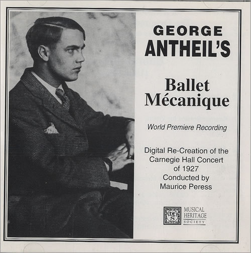

Una actriz escandalosa {#unaactrizescandalosa}
----------------------

Una joven mujer, montada en su caballo, se interna en el bosque. Por
unos instantes la perdemos de vista. A través de las ramas y follaje de
los árboles la vemos reaparecer corriendo desnuda para zambullirse en un
río.

Después la cámara nos muestra que las ropas de la joven están sobre el
lomo del caballo. El animal pasta tranquilo hasta que una yegua se asoma
por detrás de un cerco de madera unos metros más allá en un claro. El
caballo relincha y corre hacia la yegua, dejando abandonada a nuestra
protagonista.

Ella se da cuenta y grita llamando al animal, pero este no obedece.
Desesperada nada hasta la orilla y esta vez la vemos correr desnuda, la
cámara nos muestra su reflejo sobre el agua.

El corcel se ha acercado a la yegua, y cuando la muchacha los alcanza
huye otra vez, corriendo hacia la orilla de un camino donde trabaja una
cuadrilla de obreros. Los hombres espantan al animal, pero un trabajador
joven corre persiguiendo al caballo hasta que lo detiene y tranquiliza.

La chica observa todo esto escondida detrás de un arbusto, y así es como
el hombre la encuentra. Al principio ella trata de cubrirse y lo mira
asustada, mientras él sonríe, finalmente ella decide mirarlo desafiante.
El joven trabajador sonríe devolviéndole vestido y caballo.

Estas escenas son parte de la película de 1933, Éxtasis. La secuencia
descrita es la que produce el encuentro de los amantes. La posterior
escena, de su primer encuentro amoroso, tiene la particularidad de ser
la primera en el cine en que se representa un orgasmo femenino (en una
película no pornográfica).

Filmada en Checoslovaquia, tardó dos años en ser exhibida en Alemania,
debido a la censura. En Estados Unidos fue condenada por diversas
instituciones morales, incluyendo a la Iglesia Católica. En 1936 el
distribuidor norteamericano de la película empezó los trámites para
obtener el sello de aprobación del [Código Hays](http://en.wikipedia.org/wiki/Hays_code), pero sin éxito. Recién en
1940 la película fue exhibida sin el sello Hays de forma privada en
algunos casas culturales.

La protagonista era la hermosa joven austriaca Hedwig Kiesler, quien
llegaría a alcanzar fama internacional más tarde en Hollywood bajo el
nombre de Hedy Lamarr.

Hedy tenía dieciocho años cuando filmó Éxtasis. Aunque no era su primera
película, fue esta la que la hizo famosa a escala mundial y le aseguró
su llegada a la "Meca del Cine" años más tarde.

Al cumplir diecinueve Hedy contrajo matrimonio con Friedrich Mandl, un
importante empresario austriaco propietario de grande fábricas de
armamentos.

Mandl odiaba la película, pues sostenía que ésta explotaba a su mujer y
la expresión de su rostro durante el orgasmo simulado. Compró tantas
copias como pudo para impedir su exhibición pública. Después de casados,
le prohibió a su mujer seguir la carrera artística y salir de su enorme
mansión sin ser acompañada por él.

Sin embargo, el empresario usaba la belleza de su mujer como un medio de
mejorar sus negocios, en especial con los gobiernos fascistas de
Alemania e Italia. Se dice que la joven causó gran impresión sobre Adolf
Hitler durante una cena. Otra anécdota asegura que Mussolinni guardaba
una copia de Éxtasis, la que consideraba uno de sus bienes más
preciados.

La joven empezó a acompañar a su esposo a reuniones de negocios y
conferencias sobre armamento. Hedy era muy inteligente. Acostumbraba a
dar largos paseos con su padre, un rico banquero vienés, conversando
sobre ciencia y la naturaleza mecánica del mundo. Durante las
conferencias de armamentos prestaba mucha atención y aprendió cómo
funcionaban muchos de los mecanismos de las armas y municiones
desarrolladas en las fábricas de su esposo.

Pero Hedy quería huir. No sólo el matrimonio era tortuoso para ella,
además odiaba al régimen nazi, porque entre otras cosas sus padres eran
judios. Un día convenció a su esposo de que le permitiera usar todas sus
joyas durante una cena. Esa misma noche desapareció disfrazada como
sirvienta.

Llegó a Paris, donde contactó a Louis B. Mayer y obtuvo un contrato para
filmar películas para MGM, bajo la condición de que cambiara su nombre.
Mayer quería de algún modo desviar la atención de la censura (hasta
entonces ella era conocida en Estados Unidos como "the Ecstasy Lady").
Fue así como empezó una exitosa carrera en el cine norteamericano.

El hombre de los pianos
-----------------------

En junio de 1926 se realizó un exclusivo concierto privado en Paris. El
evento correspondía al estreno de una curiosa obra de corte
[dadaísta](http://es.wikipedia.org/wiki/Dada%C3%ADsmo), titulada
"Ballet Mécanique", que debía ser interpretada, entre otras cosas, por
una pianola, ocho pianos de cola, varios yunques, y el motor de
aeroplano.

La cacofonía del concierto desconcertó a los asistentes y varios de
ellos salieron indignados del teatro, causando disturbios en la calle.
La auspiciadora, una rica mujer norteamericana fue manteada por dos
princesas, tres baronesas y un duque.

El autor de tan escandalosa obra era George Antheil, un joven pianista y
compositor norteamericano de veintiséis años. Un lustro antes este joven
músico había arribado a Europa con la intensión de convertirse en un
afamado compositor y pianista ultra moderno. Logró un moderado éxito e
incluso en algunos conciertos sus obras se tocaban junto a las de
Stravinsky y Debussy.

Después del fiasco en Paris viajó a Alemania, donde logró estrenar su
primera ópera en 1930. Pero su música vanguardista no fue bien recibida
por los nazis y en plena depresión decidió retornar a su país natal.
Antheil viajó a Hollywood donde escribió partituras para diversos
realizadores, como Cecil B. DeMille, entre otros.

Aparte de la composición, Antheil escribió novelas de misterio, también
trabajó como reportero y crítico para revistas de música. Antes de la
Segunda Guerra Mundial participó en la Liga Anti Nazi de Hollywood
exhibiendo obras de artes censuradas por la Alemania de Hitler.

Además escribía una columna de consejos para parejas, la que se
distribuía en periódicos de a nivel nacional, junto con columnas
regulares en revistas como Esquire y Coronet. Se consideraba a si mismo
un experto en la "endocrinología femenina" y publicó una serie de
artículos sobre "cómo determinar la disponibilidad de una mujer basado
en los efectos glandulares en su apariencia". Incluso llegó a escribir
libros sobre el tema.

Fueron estos artículos y libros los que le permitieron conocer a Hedy
Lamarr.

La estrella de Hollywood quería consejos del experto sobre como mejorar
el atractivo de la parte superior de su torso. El pianista recomendó
extractos glandulares. Luego la conversación derivó en otras materias, y
en particular en los torpedos.

Torpedos
--------

Los torpedos radio controlados fueron desarrollados a fines de la
Primera Guerra Mundial. Pero su mecanismo de control y guía tenía varios
fallos. Una contramedida efectiva era enviar una señal de interferencia
en la misma frecuencia usada para dirigir el arma.

Lamarr conocía este efecto por su experiencia en las conferencias a las
que había asistido acompañando a Mandl, su ex esposo. Cuando supo de los
ataques de submarinos alemanes a barcos civiles, se obsesionó con
encontrar un modo de apoyar a los norteamericanos con su ingenio y
conocimientos sobre armamentos.

Hedy quería mejorar el mecanismo de control de los torpedos, y para esto
concibió la idea de transmitir una señal de guía en ráfagas cortas a
diferentes frecuencias. El código para la secuencia de frecuencias debía
ser idéntico tanto en el barco de control como en el torpedo. Cómo la
secuencia sería desconocida por el enemigo la transmisión no podría ser
bloqueada inundando el espectro con ruido. Por otro lado el tratar de
interferir todas las frecuencias posibles requeriría demasiada potencia.

La contribución de Antheil fue controlar el salto de frecuencia usando
un mecanismo similar al de una pianola. El conocía muy bien como operaba
pues había compuesto Ballet Mécanique para que fuera interpretado por
ocho pianos sincronizados.

Concibieron el dispositivo para que la señal saltara entre 88
frecuencias, tal como las 88 teclas que hay en un piano. En 1941, Lamarr
y Antheil firmaron la patente US2292387: "Secret Communication
System".

Aunque se hizo una presentación técnica a la marina de Estados Unidos el
invento enfrentó oposición y fue rechazado. Hay que reconocer que la
tecnología de ese tiempo no estaba preparada y recién en 1957 el
concepto fue adoptado y probado en el bloqueo a Cuba de 1962.

Se sabe que Hedy Lamarr quería unirse al National Inventors Council,
pero fue convencida de que podía aportar más vendiendo bonos de guerra.

Así que en 1942 recibe su linea más memorable "I am Tondelayo\..." en
la película White Cargo y se convierte en una de las chicas Pin Up
favoritas de los combatientes en el pacífico.

Redes Inalámbricas
------------------

El invento de Lamarr y Antheil es la base para las técnicas de
modulación de señales conocida como [Spread
Spectrum](http://en.wikipedia.org/wiki/Spread_spectrum) (espectro
ensanchado).

Esta técnica ha sido usada en el estándar para comunicaciones móviles
conocido como CDMA, del cual una variante, conocida como W-CDMA se usa
en el protocolo 3G. Los mismos principios son aplicados en Bluetooth y
en las redes WiFi.

La cuarta generación de redes inalámbricas, conocida como LTE, también
está basada en el mismo principio, y gran parte de su velocidad de debe
a que sus señales se esparcen por el espectro usando este cambio de
frecuencias.

El legado tecnológico de Lamarr y Antheil sólo fue reconocido en 1997
cuando la [Electronic Frontier Foundation le otorga el sexto premio
anual para los pioneros de la
tecnología](https://w2.eff.org/awards/pioneer/1997.php).\
Lamarr al enterarse exclamó "¡ya era hora!", y envió a su hijo a
recibir el premio en su representación. Antheil falleció en 1959, así
que ni siquiera pudo ver la aplicación práctica de su idea.

Lamarr falleció el año 2000 en su casa en Florida. Es probable que sea
más recordada por su espectacular belleza que por sus contribuciones
tecnológicas. "Mi rostro ha sido mi desgracia", dijo una vez, "es
como una máscara que no puedo retirar. La maldigo". Es probable que
expresara de ese modo su frustración por no ser aceptada como algo más
que una cara bonita, y no como una mujer con ideas originales y
efectivas.

