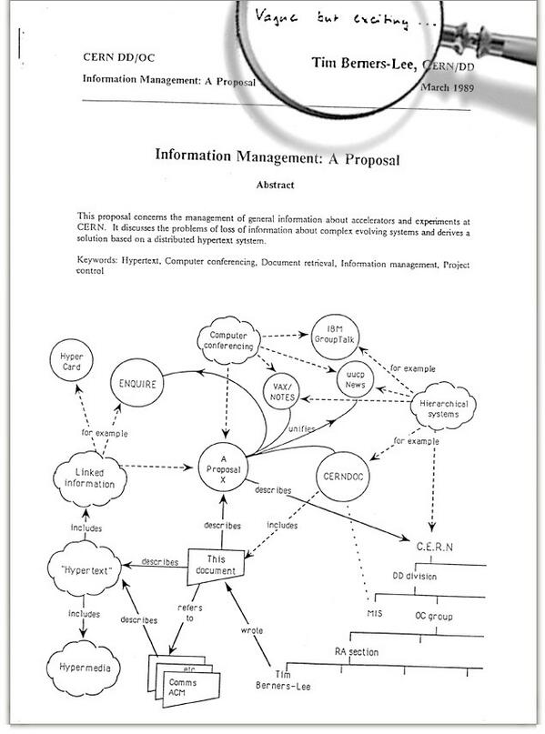

Mirando en Twitter como algunas personas recuerdan su experiencia con la
web a propósito del "cumpleaños 25" de esta, me propuse aclarar un par
de cosas.

Primero, mucha gente, incluidas algunas personas que deberían saberlo
mejor sobretodo por el cargo que ejercen, confunden la World Wide Web
con Internet.

Internet es mucho más antigua que la Web. Internet es un conjunto de
redes interconectadas que se caracterizan por usar el protocolo TCP/IP.

Si consideramos la especificación de este protocolo en el famoso
[RFC-675](http://tools.ietf.org/html/rfc675), como el punto de partida,
entonces la Internet nació en diciembre de 1974. Claro que su historia
se remonta a varios años antes.

Lo que se celebra en estos días es la fecha en que se hizo la primera
propuesta formal para crear la Web. Lo que Tim Berners-Lee ha mostrado
es el documento en que propone crear esta herramienta para compartir
información, la que llamó "Information Mesh".

Este documento es de marzo de 1989 y es lo que hoy todos llaman el
nacimiento de la Web, yo prefiero hablar de la **"Concepción de la
Web"**.

La Web es una aplicación construida sobre Internet.

El trabajo real empezó a fines de 1990, para diciembre de ese año ya
teníamos las herramientas básicas para operar la Web. Berners-Lee
también liberó por esa fecha el protocolo HTTP versión 0.9.

Todo esto lo construyó en una estación de trabajo NeXT dentro de las
instalaciones del CERN.

La Web se anunció al público el 6 agosto de 1991, en el newsgroup
alt.hypertext. Pero recién el 23 de agosto estuvo accesible.

Los primeros servidores empezaron a portarse desde la versión de
Berners-Lee en NeXT a otros sistemas operativos durante 1992. En 1993 ya
contábamos con Mosaic, el primer navegador web.

Mi primera experiencia con la Web fue probablemente a principios de
1993, cuando me pasaron un archivo tar e instalé Mosaic en una estación
Sun en el DCC de la Universidad de Chile, ese día pude ver como la Mona
Lisa se cargaba lentamente en la pantalla, no recuerdo de que sitio web.
También recuerdo haber visto el sitio web con el mapa de Chile que Pepe
Flores pubicó en ese tiempo, en el primer servidor web Chileno. Tampoco
recuerdo la fecha.

La verdad es que al principio no le presté mucha atención, salvo como
una curiosidad, y probablemente una manera de reemplazar a Gopher usando
una interfaz más gráfica. En esa época yo ya estaba trabajando y fuera
de la universidad internet era practicamente desconocida. Explicar qué
era la internet a ejecutivos de bancos u otras instituciones costaba
mucho en ese tiempo.

IRC, newsgroups, Gopher, Verónica, FTP eran las aplicaciones que
usábamos para encontrar información antes de la Web. Fuera de Internet,
era un caos, había cosas interesantes como algunos servicios de Email
muy bien pensados, o cosas exóticas como EDI (intercambio electrónico de
documentos), pero fue la Web la que permitió realmente dar un salto
enorme para compartir información.

Ese es el valor de la propuesta de Sir Tim Berners-Lee.

En la portada de la propuesta inicial de 1989, el evaluador Mike Sendall
anotó con su lapiz "vago, pero interesante", y vaya que resultó ser
una idea interesante. Así que eso es lo que celebramos, la concepción de
esta idea, el código llegó después ;).

