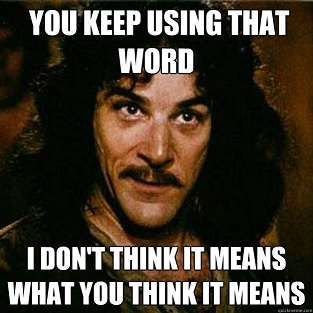

A estas alturas debería quedarles claro que 
[mi último post](/blog/lnds/2014/03/20/respeto/) fue bastante
**"catártico"**\...

O como se diga. Lo que pasó es que me sentí molesto por una discusión,
por dos discusiones en realidad, que llegaron al mismo final. Como sea,
igual yo también tengo algo de culpa por no aprender nunca la
lección\... En fin, al final para controlar mi enojo seguí el consejo de
uno de mis filósofos favoritos [Emile
Cioran](http://akarru.org/blog/2011/03/27/cioran/):

> "Escribir es un alivio extraordinario. Y publicar también. Esto les
> parecerá ridículo y, sin embargo, es muy cierto.\[\...\] Se desprende
> uno de todo lo que ama y sobre todo de todo lo que detesta de uno
> mismo. Iré más lejos, si no hubiese escrito, hubiera podido
> convertirme en un asesino. La expresión es una liberación. Les
> aconsejo que hagan el ejercicio siguiente: cuando odien a alguien y
> sientan ganas de liquidarle, cojan un trozo de papel y escriban que
> Fulano es un puerco, un bandido, un crápula, un monstruo. En seguida
> advertirán que ya lo odian menos. Es precisamente lo mismo que yo he
> hecho respecto de mi mismo. He escrito para injuriar la vida y para
> injuriarme. ¿Resultado? Me he soportado mejor y he soportado mejor la
> vida."

Así que eso es lo que hice, nada más, después de todo este es mi blog y
hago lo que quiero en él, y si quiero puedo usarlo como mecanismo de
**catarsis**.

Or whatever.

Sin embargo, debo hacerme responsable de mis dichos, y también mantener
un cierto grado de higiene mental en este ambiente virtual que he
construido.

Lo que pasa es que, aunque ustedes no lo notan, este blog recibe de vez
en cuando comentarios bastantes desagradables, que no aportan a la
discusión e incluso son provocadores, que si los aprobara convertirían
este sitio en un lugar poco grato.

Mantener un blog obliga a tener una política sobre los comentarios del
blog, pero he caido en cuenta que nunca les he contado cuál es mi
política sobre comentarios.

Así que vamos a resolver eso, acá están las reglas de moderación de este
sitio o al menos los criterios que he aplicado hasta ahora, los que
pueden cambiar más adelante, pero consideren esto como la "legislación
vigente" hasta ahora:

1.  Este blog usa [disqus](http://www.disqus.com/) como plataforma de
    comentarios, así que para emitir sus opiniones deben registrarse con
    ese servicio. Sugiero leer [sus términos de
    servicio](http://help.disqus.com/customer/portal/articles/466260-terms-of-service).
2.  No acepto comentarios anónimos, es bueno saber quién dice lo que
    dice y que se haga responsable. A veces acepto el nickname usado en
    alguna red social, pero esos casos los trato en forma particular.
3.  El comentario no debe fomentar el odio a las personas. Puedes estar
    en contra de mi ideas y exponer las razones por las que consideras
    que estoy equivocado o está equivocado cualquier otro comentarista,
    pero te pido que des un argumento, no acepto ataques personales a
    nadie, ni menos provocaciones. Mantengamos este espacio en armonía.
4.  La idea es que tu comentario aporte al debate. No hay problema si
    aportas con algún chiste, pero que sea ingenioso y sirva para
    distender el ambiente, pero si no aporta algo positivo, o es sólo
    una payasada no será aceptado.
5.  Tampoco acepto SPAM, es decir, ningún tipo de promoción de productos
    o sitios web. Cuando los comentarios vienen con muchos links se van
    automáticamente a la cola de moderación, porque podrían ser spam,
    así que toma un tiempo revisarlos, ten paciencia.
6.  Puedo cerrar los comentarios para un post en cualquier momento. En
    general trato de no hacerlo, pero a veces es necesario porque las
    discusiones están corriendo el peligro de no llevar a ninguna parte,
    o simplemente no tengo la capacidad para seguir moderando.
7.  El criterio final para rechazar un comentario es mío, y cuando lo
    haga no tengo porque darles ninguna explicación.

Esas son las reglas sobre comentarios en este blog.

Si he borrado un comentario tuyo y consideras que no tenía derecho a
hacerlo, intenta contactarme, no es tan difícil. Puede que la respuesta
siga siendo negativa, o que no te atienda nunca y quizás me odies por
eso, en ese caso te sugiero aplicar el consejo de Cioran: arma tu blog y
escribe cuanto me odias porque no publiqué tu comentario, capaz que al
hacerlo se te pase el enojo.
