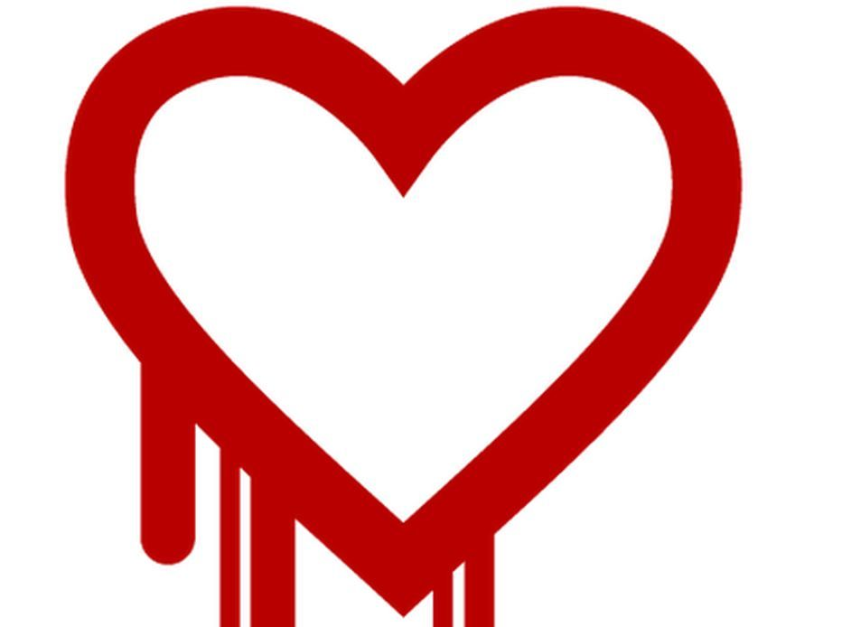

Este año ha empezado con una serie de alertas y descubrimiento de
vulnerabilidades que afectan la infraestructura de seguridad de la red,
como es un tema muy importante y contingente, he invitado a mi amigo
[Cristián Rojas](https://twitter.com/injenierobarsa) que nos de su
opinión como experto en seguridad. Este es su aporte:

2014, ¿el año de SSL/TLS? 
=========================

**por Cristián Rojas**

Parto agradeciendo a Eduardo por dejarme intervenir [una vez más](/2012/11/disclosure-no-es-llegar-y-hacerlo.html)
como *guest villain* en su blog, esta vez por un tema que tiene bastante
preocupada a la comunidad informática en su conjunto.

Esta semana se divulgó la existencia de una vulnerabilidad grave en el
código de la popular biblioteca criptográfica
[OpenSSL](https://www.openssl.org/), la cual causa la filtración de
información sensible desde servidores web HTTPS. Ésta vulnerabilidad,
junto a otras dos publicadas anteriormente pone sobre el tapete no sólo
el problema de las comunicaciones seguras, sino que otros aspectos
importantes respecto de la seguridad de nuestras aplicaciones.

Heartbleed
----------

La biblioteca OpenSSL es utilizada por una buena parte de los servidores
web en todo el mundo, ya que provee las capacidades criptográficas
requeridas para realizar conexiones seguras a sitios web. Una de sus
funciones, es la conocida como **Heartbeat**, diseñada para dar
capacidades Keep-Alive y evitar renegociaciones innecesarias (y a veces
inseguras) de sesiones SSL.

El error de programación mencionado, conocido como Heartbleed, es una
falta de chequeo de limites en la función ya mencionada, la cual
permite, mediante una petición de renegociación, la filtración de un
bloque de 64 KB de la memoria del servidor. Si un atacante hace
múltiples peticiones consecutivas, puede ir juntando pedazo a pedazo la
memoria completa del servidor, la cual podría incluir, entre otras
cosas, la *llave maestra*, que es nada más y nada menos que su llave
privada utilizada para desencriptar la información que intercambia con
los clientes que se conectan a él.

Al tener la llave maestra de encriptación, un atacante podría grabar
las
conversaciones entre el servidor y sus clientes, las cuales van
encriptadas en un principio, y posteriormente desencriptarlas. Es
bastante parecido al ataque teórico el cual se puede repeler con [la
implementación de Forward Secrecy](http://vimeo.com/80837142), excepto
que en este caso, en vez de que aparezcan 20 agentes pateando la puerta
de la sala de servidores invocando algún *Act* y exigiendo la entrega de
la llave maestra, un atacante externo puede obtener esa información, y
lo que es peor aún, sin dejar rastro alguno.

### Mitigación {#mitigacin}

Los administradores de servidores tienen pega. Lo primero que hay que
hacer sí o sí es parchar OpenSSL, sobre todo si es versión 1.0.1a hasta
1.0.1f. Otras versiones de la biblioteca no están afectadas.

Otro aspecto importante es que, al parchar la biblioteca, la pega no
está 100% hecha, ya que, perfectamente podría haberse ya filtrado, antes
del parchado, la llave maestra, por lo tanto, se requiere que el
servidor genere una llave nueva y se solicite un nuevo certificado SSL,
asociado a esa llave, para el sitio.

### La reacción de la prensa 

Lamentablemente, como suele ocurrir, la prensa reacciona ante estos
hechos desinformando a los usuarios, no por malicia, sino por ignorancia. Por
ejemplo, [un reporte de TeleTrece](http://www.13.cl/t13/tecnologia/falla-de-seguridad-en-internet-expone-millones-de-contrasenas-y-datos)
indica que los expertos (curiosamente, no especifican cuáles, ni de qué
institución) recomiendan cambiar las passwords de todos los servicios
online que\
uno usa.

El problema con esa aseveración es que nada asegura que algún atacante
ya haya obtenido la llave maestra de un servidor, con lo cual el cambio
de contraseña "recomendado por los expertos" será completamente
inútil, ya que el atacante podría, como se mencionó antes, grabar esa
sesión de cambio de contraseña, desencriptarla posteriormente, y con
ello obtener la contraseña nueva ingresada por el usuario como parte del
cambio.

Las otras vulnerabilidades {#lasotrasvulnerabilidades}
--------------------------

Muy a pesar de que la de Heartbleed puede ser la peor vulnerabilidad en
SSL que hayamos visto en un buen tiempo, no es la primera de este año.

### goto fail; {#gotofail}

Esta falla de implementación, descubierta a finales de febrero de este
año, es causada por un error en la implementación de SSL para sistemas
Apple (iOS y MacOSX), la cual causa que una conexión encriptada se
establece [*aún cuando la verificación del certificado digital que la
precede no ocurre*](http://nakedsecurity.sophos.com/2014/02/24/anatomy-of-a-goto-fail-apples-ssl-bug-explained-plus-an-unofficial-patch/),
y todo por escribir dos veces en lineas consecutivas [la tan odiada
instrucción `goto` en C](https://xkcd.com/292/).

### El bug GnuTLS {#elbuggnutls}

GnuTLS es una biblioteca que cumple la misma función que OpenSSL, pero
con [licencia GPL](https://www.gnu.org/licenses/gpl.html). Es utilizada por
varias aplicaciones GNU (como el proyecto
[GNOME](http://www.gnome.org)), en respuesta al hecho de que [la
licencia de OpenSSL no es compatible con la
GPL](https://en.wikipedia.org/wiki/GnuTLS#License_and_motivation).

Este caso particular, apareció una semana después que el del goto fail.
Aquí también está involucrada la instrucción `goto`, y [también implica la
validación de certificados que no deberían ser
validados](http://blog.existentialize.com/the-story-of-the-gnutls-bug.html).

¿Es Opensource realmente más seguro? {#esopensourcerealmentemsseguro}
------------------------------------

Mucha gente que defiende el opensource a brazo partido argumenta que es
mucho más seguro que el de código cerrado. El argumento es que su seguridad
radica en el hecho de que, como el código es abierto y la comunidad
puede revisarlo e identificar y mitigar vulnerabilidades mucho más
rápido. Sin embargo, el hecho de que la comunidad *lo pueda* revisar no
significa necesariamente que *lo vaya* a revisar.

Esto queda demostrado en el tiempo que demoran las vulnerabilidades en
ser\
descubiertas. En el caso de Heartbleed la vulnerabilidad estuvo en el
código 2 años sin que nadie la descubriera. Y la vulnerabilidad para
GnuTLS, de acuerdo con los reportes, estuvo ahí, *a vista y paciencia de
la comunidad*, [al menos desde el año 2005](http://www.reddit.com/r/netsec/comments/1zhjwh/certificate_verification_vulnerability_in_all/cftxbe5).

Tampoco sabemos si existe en los equipos de desarrollo de proyectos
opensource una cultura de desarrollo seguro, conocimientos de seguridad
o metodologías (como el [SDL](https://www.microsoft.com/security/sdl/default.aspx) por
ejemplo). 

La democratización del desarrollo de software abierto trae diversidad en
los conocimientos y el nivel de éstos, así que es difícil saber, a priori al
menos, si los desarrolladores que participan en estos proyectos tienen
conocimientos mínimos sobre seguridad.

El manejo de dependencias {#elmanejodedependencias}
-------------------------

Hace un tiempo, mi [antiguo mentor](http://pregrado.dii.uchile.cl/academico/jorge-aravena-salazar/)
en la universidad dijo una frase muy cierta: "Desarrollar software hoy
en día es como jugar al Lego". Un lenguaje aquí, un framework allá,
varias bibliotecas muy útiles, pero que salen de quizás dónde\... el
desarrollo de software moderno cada vez se parece más a armar un Lego o
un rompecabezas que armar la aplicación desde cero.

Y eso está muy bien. Las aplicaciones salen más rápido a la red (el\
Time-to-market es menor como dirían *los del management*), y son más
escalables y mantenibles. La abstracción es mayor. Sin embargo, no nos
preocupamos de si ése JAR que se bajó automáticamente a través de Maven
o esa gema que estamos usando como parte de nuestra aplicación hecha en
Rails hace su pega en forma segura. Y no tenemos por qué preocuparnos
tampoco. No vamos a estar mirando el código fuente de cada biblioteca,
framework o lenguaje que utilizamos. Pero sí debemos estar atentos. El
software evoluciona, y con él las amenazas y vulnerabilidades. Debemos
realizar catastros de qué software usamos como apoyo en nuestro
desarrollo, y en base a ese catastro, poner atención a los avisos de
seguridad de cada pieza de software que usamos, desde el sistema
operativo a la biblioteca más chica. Esto incluye, sobre todo en un
escenario como el actual, en el cual un pequeño error de programación
puede llevar a vulnerabilidades graves, a bibliotecas criptográficas
como OpenSSL.

**Sobre el autor:**

Cristián Rojas es Ingeniero Civil en Computación de la Universidad de
Chile.\
También es investigador asociado en el [CLCERT](http://www.clcert.cl) y
es profesor de Seguridad de Software en dicha casa de estudios. Cuenta
con la certificación CSSLP (Certified Secure Software Lifecycle
Professional) y es\
consultor en desarrollo seguro de aplicaciones. Para consultorías en
seguridad de aplicaciones lo pueden ubicar en su
[LinkedIn](http://www.linkedin.com/in/crirojas/es).
