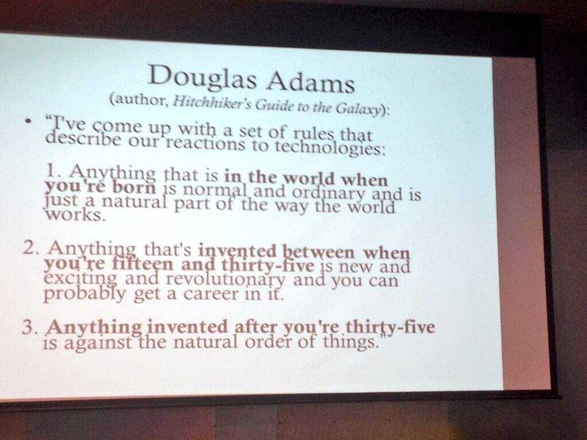

Douglas Adams, el autor de Hitchhiker\'s Guide to the Galaxy reflexionó
sobre nuestras reacciones con respecto a la tecnología:

> He llegado a establecer este conjunto de reglas que describen nuestra
> relación con la tecnología:
>
> 1.  Todo aquello que está en el mundo cuando naces es normal y
>     ordinario y es sólo un parte natural de la forma en que funciona
>     el mundo.
>
> 2.  Cualquier cosa inventanda cuando tienes entre quince y treinta y
>     cinco años de edad es nuevo, excitante y revolucionario y
>     probablemente desarrolles una carrera en eso.
>
> 3.  Cualquier cosa inventada después de que tienes treinta y cinco
>     años está en contra del orden natural de las cosas.

Via @annegalloway:


