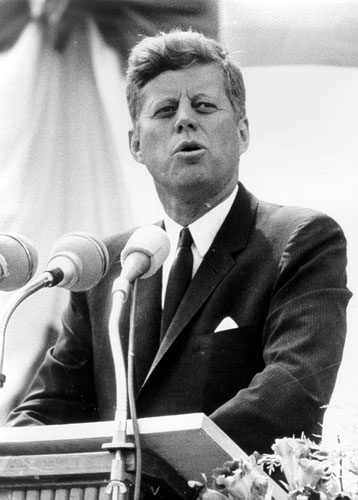

Recuerdo un partido de futbol entre dos selecciones nacionales, una de
ellas tenía un director técnico que llegó vestido con un elegante traje,
como suelen hacerlo los entrenadores europeos. El otro DT en cambio
llevaba un buzo deportivo. 

El estilo de dirección de cada uno también era diferente. Mientras el
primero se mantuvo sentado en la banca durante todo el partido, el
segundo pasó casi todo el match gritando y dando órdenes desde el borde
de la cancha. 

Desde el punto de vista del espectáculo, el equipo del DT
con buzo deportivo jugó mejor, un estilo más vistoso, de permanente
ataque, *"jogo bonito"*, como dicen los
brasileños.

Aunque en el rostro del DT de traje elegante la preocupación se reflejó
en varias ocasiones, su cara llevaba una sonrisa de satisfacción al
final, pues fue su equipo ganador. El de buzo se dirigió a los camarines
con la frustración en sus puños apretados.

Dos estilos de liderazgo, uno que define los objetivos y deja al equipo
realizar su labor, el otro más micro controlador. Pero acá
la actitud
pragmática del DT de traje, quien tiene muy claro que lo que importa es
meter goles,  es la que asegura el
éxito.

He escuchado discusiones sobre qué es  más importante si el proceso o
el resultado. Esa discusión no tiene sentido, el resultado es siempre
más importante que el proceso. El proceso está subordinado al
resultado. 

Cuando definimos un objetivo lo que hacemos es declarar primero el
resultado esperado.

Cuando se reflexiono sobre esto el ejemplo al que recurro con
frecuencia es el del mandato de Kennedy de enviar un hombre a la
luna:

> "I believe that this nation should commit itself to achieving the
> goal, before this decade is out, of landing a man on the Moon and
> returning him safely to the Earth."

> ¨Creo que esta nación debe comprometerse a alcanzar la meta, antes del
> final de esta década, de colocar un hombre en la Luna y devolverlo
> sano y salvo a la Tierra"

En este mandato Kennedy establece claramente el objetivo[^*], el que consta
de tres partes:

1. Qué se debe hacer: colocar un hombre en la luna
2. Cuándo se debe hacer, el plazo: al final de la década.
3. El criterio de calidad, o satisfacción: retornarlo de forma segura a
la Tierra.

¿Cuantas metas u objetivo mal definidos vemos?

Bromeando una vez decíamos que si el objetivo en Chile fura colocar un
hombre en el espacio, una vez que estuviera allí orbitando el presidente
preguntaría qué cuando retornaría el astronauta a la tierra, la
respuesta obvia sería: "¿volver? ¡A mi nadie me dijo que teníamos que
hacerlo volver a la tierra!"

Así que Kennedy, tiene la precaución de ser explícito al definir la
meta.

Eso es un error bastante común, yo lo he cometido varias veces, de
olvidar estas tres cosas. Seamos explícitos y claros con nuestros
objetivos, pero además no olvidemos que lo importante es lograrlos.
Debemos meter goles, jugar bonito es un *plus*, pero lo importante es
ganar al final.

Por supuesto, para lograr resultados es muy importante la composición
del equipo, pero eso es algo de lo que hablaremos
después.

[^*]: O el por qué, aunque también puede haber distinciones superiores,
como la misión y la visión que se encargan de definir claramente el por
qué y el para qué.
