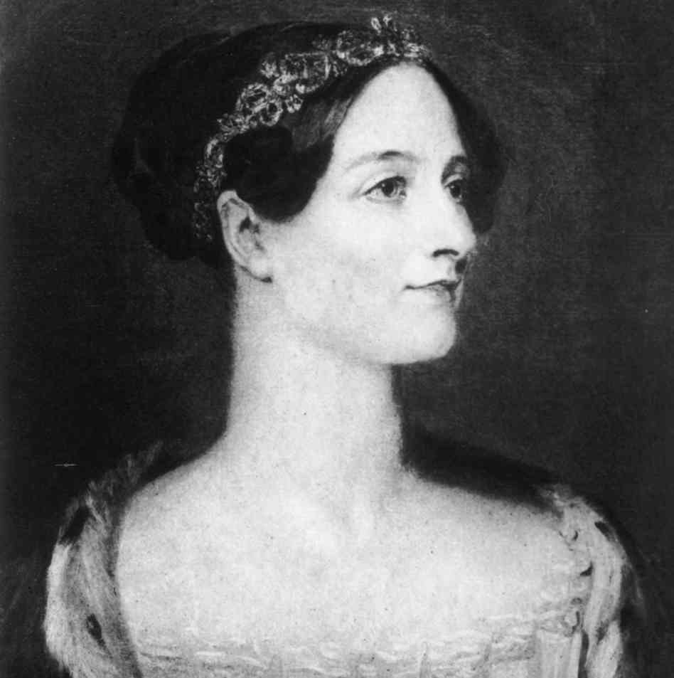

Supe de una joven cuyo padre le prohibió estudiar ingeniería informática
por ser una "carrera sólo para hombres". Por desgracia, esta
percepción errada sigue aferrada en la mente de muchas personas y peor
aún, en la mente de muchos de mis colegas.

Miren este gráfico, obtenido [del blog de Bob Martin (Uncle
Bob)](//blog.cleancoder.com/uncle-bob/2016/01/15/Manhandled.html), que
muestra la participación femenina en distintas carreras, incluyendo
computación.



Se observa con claridad la caída preocupante en la participación de
mujeres en ciencias de la computación.

¿Por qué pasa esto?

¿Qué hace que muchos colegas piensen que esta es una profesión sólo para
hombres?

Dirijo un equipo de trece personas, seis mujeres y siete hombres, eso no
ha sido por azar, hay una decisión conciente de mantener un equipo con
una distribución equitativa por género, es una decisión que tomé hace
años y que hasta ahora me ha dado buenos resultados.

Expliqué las razones hace años en [este otro post](/blog/lnds/2013/09/08/marte-necesita-mujeres), 
creo que es lo que debemos hacer. La informática no es un área de dominio
exclusivo de los hombres, nunca lo fue.



Esta fotografía se hizo famosa hace un par de años, es Margaret
Hamilton, directora del equipo de ingenieros de software que escribieron
[el código de la misión del Apolo 11](//github.com/chrislgarry/Apollo-11) 
que llevó a la tripulación,
dirigida por Neil Armstrong, sanos y salvos de ida y vuelta a la Luna,
tal como [lo comprometió el presidente Kennedy](/blog/lnds/2015/06/13/resultados-vs-procesos).

Estas fotografías son menos conocidas, corresponden a las mujeres que
realizaron los cálculos para varias misiones de la NASA.





Durante el proyecto Manhattan, un grupo de mujeres, 
[dirigidas por Richard Feynmann](/blog/lnds/2011/04/17/dos-hombres-y-una-maquina-universal),
operaron como computadoras humanas para realizar los complejos cálculos
para construir la bomba atómica. Esas mujeres posteriormente programaron
los computadores digitales que las reemplazaron.



Acá tenemos a Katherine Johnson, matemática y física afroamericana que
participó de este grupo de mujeres que calculaban y después programaron
para la NASA. En 2015 ella recibió la Medalla Presidencial
norteamericana de la Libertad de manos del Presidente Obama, en
reconocimiento.



Estas son las programadoras originales del Eniac, que muestran que las
mujeres estuvieron desde el principio involucradas en la computación.
Hay un documental sobre ellas, por si les interesa conocer más, en este
link:[ https://vimeo.com/ondemand/eniac6](//vimeo.com/ondemand/eniac6)



Y por último, Lady Ada Lovelace, 
[quien trabajó con Charles Babbage diseñando un computador en la primera mitad del siglo XIX](/blog/lnds/2012/06/17/el-padre-de-la-computacion).

¿De donde salió, entonces, esta idea estúpida de que la computación es
profesión sólo para hombres?
