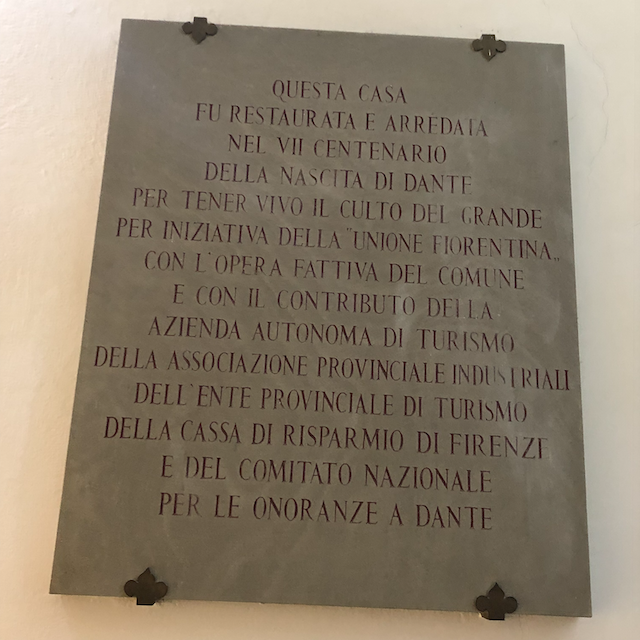
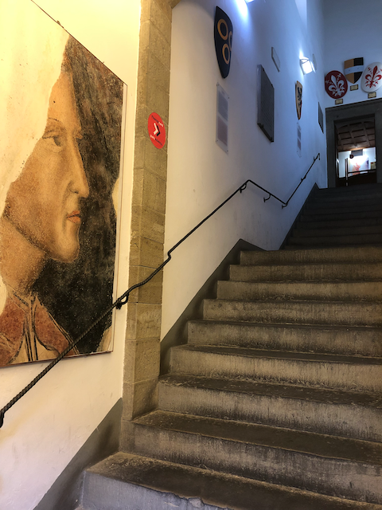

> _"Esta es una noche para recordar… ella es el comienzo de siempre" -- Dante_

Veintinueve de febrero. Cada cuatro años agregamos este día especial especial para poder ajustar nuestros calendarios y asegurar que las estaciones empiecen cuando se supone que deben.

Es casi seguro que más de algún sistema informático [ha fallado por manejar mal esta fecha](/blog/lnds/2012/02/29/bisiesto).

El tiempo es, de muchas formas, una mera convención. La órbita de la tierra alrededor del sol no toma 365 días, ni tampoco el día 24 horas. Podrían ser cualquier valor arbitrario. Nos reconforta tener estas convenciones. Los meses, los días, nos ordenan.

Aprovechemos entonces este día extra, para ordenarnos y marcar un nuevo inicio para este blog.

## Rutina

Steven Wilson escribe en [Routine](https://www.youtube.com/watch?v=sh5mWzKlhQY):

> _Routine keeps me in line
Helps me pass the time
Concentrate my mind
Helps me to sleep_

La rutina dice que el verano se acaba, llega el otoño. El año empieza en Chile en marzo. Todo se reactiva. Las clases comienzan, la gente vuelve de vacaciones. 

Pero hay épocas en que esta rutina se rompe. Y este 2020 no será para nada rutinario en Chile.

## Motivación

> _"Quien sabe de dolor todo lo sabe" -- Dante_

Y si la rutina, que nos ordena, que concentra nuestra mente, se pierde, ¿qué podemos hacer?

Me ha costado volver a escribir con periodicidad en este blog. 

Por mientras, estos últimos tres meses he dedicado parte de mi tiempo a migrar de plataforma todo el contenido escrito en estos [últimos quince años](https://lnds.net/blog/lnds/2020/02/02/el-decimo-quinto/). En este proceso he vuelto a leer muchos de esos escritos, y he descubierto cosas sobre mi mismo en el proceso. Algunas fueron sorpresas agradables, otras no me gustaron para nada. 

En 2006 [escribí](/blog/lnds/2006/08/21/motivacion/):

> Hace mucho que no escribo en este blog, ya casi dos meses. Es que no siempre estamos motivados, o tenemos problemas, o simplemente nos falta tiempo.
>
> Según la RAE la motivación es “un ensayo mental preparatorio de una acción para animar o animarse a ejecutarla con interés y diligencia”.
>
> Sin motivación, es muy dificil que podamos hacer algo bien, o con interés. Entonces la motivación es muy importante para que podamos “funcionar” como personas.
>
> Así cada uno busca un objetivo, y con este en mente se motiva para realizar alguna acción, con interés y diligencia.
Muchos de los que escribimos bitácoras, lo hacemos más por vanidad, que por otra cosa. Sentimos que tenemos algo valioso que aportar y lo escribimos.
>
> Como sea, hay momentos en que no encontramos motivación en lo que hacemos, ni en nada de lo que nos rodea. Es en esos momentos donde necesitamos ayuda, apoyo, paciencia, y también un remezón.
>
> Necesitamos de esas personas que nos digan que estamos mal, o que manifiesten preocupación por nosotros. Que sepan remecernos, decirnos lo que está mal, que sean capaces de perdonarnos, a pesar de los errores que cometemos, pero que estén ahí para indicarte cuando te estas equivocando.
>
> No es que quiera compartir con ustedes mis problemas, sólo quiero expresar que para los que no tenemos el don de la fe, existe en el amor una fuente para encontrar las energías necesarias para lograr la motivación. Y el amor surge del compartir con otros, aunque puedes amarte mucho a ti mismo, necesitamos recibir el amor de otros para poder vivir. En mi caso el amor de mi esposa, de mis hijos, amigos y familiares.
>
> Un religioso me dirá que Dios es Amor, puede ser.
>
> Lo importante es entrar en ese estado que te da la motivación. Esas ganas de emprender, trabajar, o hacer cualquier cosa. Ese estado que mejora tu concentración, te da más energías, que te permite decir que sí o que no dependiendo de lo que te pidan.
>
> Si quiero escalar una montaña, debo motivarme para asumir el estado mental que me permitirá llegar a la cima. Pero queda claro que debe haber una montaña para escalar.
>
> La motivación es importante, pero la motivación surge de las ganas, o la necesidad de hacer algo. Una meta, un objetivo.

Por otro lado, en febrero de 2019 escribí en [mi Patreon](https://www.patreon.com/posts/la-trampa-de-la-24998702) sobre la "trampa de la motivación".

> _"La motivación está sobrevalorada, lo importante es el compromiso: El compromiso te permite dar lo mejor cuando no estás motivado." - Del muro de Facebook de  Leonardo Jofré_
>
> El problema con motivar es qué es una forma de empujar a las personas a que hagan algo, que quizás no quieren hacer, porque no le encuentran sentido, o porque están interesados en otras cosas.

## Crisis

> _"A la mitad del viaje de nuestra vida,\
> me encontré en una selva oscura\
> por haberme apartado del camino recto."_
> -- Dante, "La Divina Comedia"



En septiembre de 2019 tomé unas largas vacaciones por Europa, muchas ideas de artículos surgieron en esas semanas que compartí con mi mujer recorriendo el viejo mundo. Pero no vieron la luz. Llegamos a Chile justo dos semanas antes del estallido social. Pero aparte de ese aspecto externo, me enfrenté a los errores que cometí como lider de mi equipo. Vino una crisis, sobre la que hablaré de seguro más adelante.

La vida está llena de crisis, sociales o personales. La forma en que las enfrentamos y superamos es la que nos muestra quienes somos. Es la prueba suprema. 

En 2006 atravesaba una crisis, a fines de 2019 también. Pero los contextos son distintos. Las formas de solucionarlas también. 

Este es un año en que estaremos expectantes. Sólo nos queda tratar de hacer lo mejor en nuestro micro cosmos personal y aportar en el cosmos social.

## Florencia

> _La raza humana se encuentra en la mejor situación cuando posee el más alto grado de libertad -- Dante_

En esas vacaciones que mencioné recién tuve la fortuna de visitar la casa del poeta florentino Dante Alighieri, uno de mis autores favoritos. Fue grande mi emoción, caminar por los escalones que el poeta pisó hace más de siete siglos. Conocer la capilla donde que su amada Beatrice Portinari visitaba (y donde ella se casó). Recorrer esas estrechas callecitas de Florencia.

Las palabras de Dante son inmortales. Porque Dante vivió tiempos complejos, de agitación política. Todos, si vivimos lo suficiente, enfrentaremos una época de grandes disturbios y conmoción social. Se neutral en esas épocas es cobardía moral, tal como nos recuerda Dante. Yo no soy neutral con lo que pasa en mi país, y en la medida que sea pertinente expresaré alguna opinión en este blog. No significa esto que cambiará el sentido de que acá se escribe.

## Organizando la escritura

> _Aquel que escucha bien, toma apuntes -- Dante_

Desde 2010 mantengo tres blogs: ["Akarrú"](https://www.akarru.com/), ["La Sombra de Dijkstra"](https://www.programando.org/) y este ["La Naturaleza del Software"](https://www.lnds.net/).

En estas últimas semanas, para retomar el hábito, la rutina de la escritura, publiqué algunos desafíos en ["La Sombra de Dijkstra"](https://www.programando.org/). 

En Akarrú publiqué [un pequeño homenaje a Neil Peart](https://www.akarru.com/blog/2020/01/11/neil-peart/), tras su fallecimiento. Hace dos semanas agregué un [pequeño relato de ciencia ficción](https://www.akarru.com/blog/2020/02/16/la-nina-relato/).

Poco a poco retomaré la rutina de escribir posts en este blog, a veces un aforismo, de vez en cuando un largo y documentado artículo técnico. Mis reflexiones más personale irán a ["Akarrú"](https://www.akarru.com/), todo lo que tenga que ver con tecnología, reflexiones sobre el arte de desarrollar software, y alguna que otra reflexión de tipo epistemológico, irán acá. Por último todo lo que tenga que ver con programación y arquitectura de software será publicado en ["La Sombra de Dijkstra"](https://www.programando.org/). 

## Empieza una nueva jornada

> _"Incipit Vita Nova"_

Cuando Dante desciende a los infiernos consigue la compañía de Virgilio, que lo orienta dentro de los círculos que componen el infra mundo, y que le explica lo que ve. Al ascender al cielo, la anfitriona es su amada Beatrice. 

El Vate Florentino transmite en su obra su larga reflexión sobre su propio crecimiento moral y ético, critica y nos transmite en modo alegórico las crisis que le tocó observar. Es un testigo de su tiempo y nos deja un relato de las bajezas y grandezas humanas que le toca observar. 

Estoy al inicio de una nueva jornada. Un reinicio donde me acompañan nuevos aliados. Hay ciclos que se cumplen, y necesitas formar nuevos equipos para asumir nuevos desafíos. Contextos diferentes.

## Contra la rutina

> _"Un poderoso fuego es solo la continuación de una pequeña chispa"_ -- Dante

La rutina no nos ordena. No calma nuestra mente. La canción homónima de Steven Wilson habla desde la perspectiva de una persona atormentada, que se refugia en la rutina porque le cuesta aceptar la terrible realidad a la que se vio expuesta. 

No es que me guste la rutina, aunque sí soy amigo de tener cierta disciplina, ritmo y rito para trabajar y abordar mi vida. 

Descubrí que en los primeros años de este blog habia un ritmo asombroso de publicación, aunque el contenido muchas veces era bastante pobre. En esa época los blogs eran la tendencia en "social media". Hoy usamos las redes sociales. Así que ahí volcamos mucho del contenido contingente. Pero en el 2005, o el 2006, era normal que se usaran los blogs para discutir sobre la coyuntura nacional.

## Objetivos 

> _"El secreto para que las cosas sean hechas está en hacerlas"_ -- Dante

Hoy hay muchas personas que usan Medium para publicar posts más extensos, para superar la barrera del espacio que imponen las redes sociales. Pero también ocurre que hay mucho contenido que es pura vanidad, o venta de humo. 

No es el objetivo de este blog, al menos no en esta época o contexto. Lo que yo espero aportar es contenido de calidad, desde mi experiencia, mi nivel de conocimiento. También uso este medio como un mecanismo para aprender, y mejorar. Cuando descubro algo me gusta expplicarlo para asegurarme que lo entiendo. Ese es objetivo principal de "La Naturaleza del Software", ese es el compromiso final. Es la idea que se mantendrá vigente en estos textos que vendrán. Vamos a avanzar. 

Recordemos a Dante, "el secreto para que las cosas sean hechas, es hacerlas". Así que acá estamos de nuevo. Vamos a volver a escribir.

Ritmo y Rito.

Una palabra tras otra, una idea y después la siguiente. 

