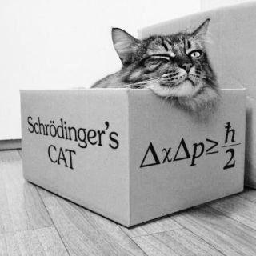

Hace poco me topé en Twitter con este gracioso post de la cuenta homenaje a Richard Feynmann:



(Mientras tanto, dentro de la caja, el gato de Schrödinger planea su venganza)

Si has estado bajo una roca, y no entiendes por qué el Gato de Schrödinger se ha vuelto un meme de la cultura pop, te 
explico a continuación de qué se trata.

En un momento de malvada creatividad, tras un largo intercambio epistolar con Albert Einstein, el físico austriaco Erwin Schrödinger propone el famoso experimento mental que lleva su nombre.

El concepto es el siguiente: se construye un sistema que consiste de una caja cerrada y opaca, en cuyo interior se encuentra un gato, una botella de gas venenoso y un dispositivo que contiene una partícula que podría desintegrarse en cualquier momento, un sensor es capaz de detectar esta desintegración y abrir la válvula que contiene el gas dentro de la botella[^1], matando al gato.



La paradoja que plantea Scrödinger es que a menos que abramos la caja y observemos su interior, el pobre gato se encuentra en un estado indeterminado, no está vivo ni está muerto. Diríamos que está en un estado oscilante, que los físico llaman superposición, es decir, podemos decir que hasta que no abramos la caja el gato está vivo y muerto a la vez.

¿Por qué ideó este vil experimento Schrödinger? ¿Para qué ganarse el odio de los gatos, verdaderos amos de este mundo?

Este experimento mental --no querido lector, nadie hasta donde sé, ha montado este disparate en un laboratorio-- fue pensado para abrir la discusión sobre las paradojas que plantea la mecánica cuántica en el entendimiento de nuestro mundo.



## La naturaleza de la realidad objetiva

Los físicos cuánticos han propuesto diversas interpretaciones para superar esta paradoja, y salvar la vida del micifuz.

La *interpretación de Copenhague*, nos dice que efectivamente el estado de salud del pobre felino es desconocido hasta que abramos la caja, en ese momento se produce lo que los físicos llaman *"el colapso de la función de onda"*, y recién en ese instante podemos saber si el minino sobrevive a tan cruel experiencia. Esta interpretación dice que es el observador el que modifica el estado del sistema, por el simple hecho de realizar la medición del estado de la misma. Y este hecho es irreversible e inevitable cada vez que observamos un fenómeno físico. La realidad entonces está siempre fluctuando, el mundo más allá de nuestros sentidos es borroso, difuso, no hay forma de conocer la realidad, y lo peor, es que cuando realizamos una observación la alteramos. Lo malo es que no podemos controlar el efecto de la observación. 

La otra interpretación es la de los "muchos mundos", propuesta por Hugh Everett en 1957. En un mundo el gato está muerto, en el otro está vivo, y cuando realizamos una observación es como si nuestra realidad se bifurcara, entramos a un mundo u otro. No nos damos cuenta, y cada universo vive al lado del otro, la "decoherencia cuántica" nos impide observar todos estos mundos.

Hay algunos que plantean que el colapso de la función de onda es real, objetivo, que realmente sucede, que no sólo es una hipótesis adhoc como lo plantea la interpretación de Copenhague. Es decir, hay una relidad objetiva allá fuera, aunque no la observemos. En esta postura no hay ramas que se abren, ni universos paralelos. El gato está objetivamente muerto o vivo, no depende de lo que observemos. La limitación está en nuestra capacidad para observar esa realidad.

Existe una interpretación relacional, que dice que los cambios dependen de las relaciones entre el observador y el sistema. Para el gato la función de onda ya colapsó, pero para un observador externo el sistema se encuentra en un estado de superposición, sólo cuando abre la caja el observador y el gato comparten la misma información.

Y así hay diversas maneras de elucubrar sobre este fenómeno. Esa es otra de las crueldades de Schrödinger, plantearnos un problema que no sabíamos que teníamos.

Todo esto ha dado paso a diversas especulaciones, científicas, filosófica y seudo científicas por supuesto. Como la idea de que podemos alterar la realidad con la fuerza de nuestro pensamiento.

## ¿Y si los humanos sómos computadores cuánticos?

El físico matemático inglés Roger Penrose ha planteado ideas polémicas, combinando conceptos de la teoría cuántica y el famoso teorema de Gödel[^2].

En esencia, Gödel demostró que hay afirmaciones que la mente humana es capaz de entender como verdaderas, aunque no es posible construir pruebas formales para validarlas. Las consecuencias de esta incompletitud de los sistemas formales (como la lógica o la matemática), son interesantes, y he escrito sobre esto antes, por ejemplo, sobre su impacto en el emprendimiento: https://lnds.net/blog/lnds/2016/08/30/toda-empresa-es-de-software-o-lo-sera/

Penrose es defensor de la hipótesis de la "Reducción Objetiva Orquestada",  y se basa en un modelo que establece que la conciencia se origina en un nivel profundo de actividades cuánticas dentro de nuestra neuronas.

En esencia, las ideas de Penrose plantean que nuestras neuronas funcionan como qubits y nosotros los seres humanos seríamos ordenadores cuánticos, cuyo comportamiento, lo que llamamos conciencia, es orquestado por lo que Penrose y Stuart Hameroff denominan micro túbulos.

La orquestación es un proceso mediante el cual proteinas asociados a los micro túbulos influyen u orquestan estados de reducción de los qubits, con esto se separan los estados superpuestos y nuestra mente obtiene una visión de la realidad objetiva.

Por otro lado, el argumento Penrose-Lucas[^3] establece que, dado que los humanos somos capaces de conocer la verdades de las declaraciones no demostrables de Gödel, el pensamiento humanos no es computable, al menos no en el sentido de los computadores que conocemos y apreciamos desde las ideas de Turing y Von Neumann.

De ser cierto el argumento Penrose-Lucas, habría que encontrar el mecanismo que explique esta ventaja de nuestra mente por sobre cualquier computadora construida en base a sistemas formales. 

Sin embargo, hoy en día es aceptado que la mayor parte de las leyes de la física son computables (es decir, algorítmicas), cómo [les he contado en otra ocasión](http://lnds.net/blog/lnds/2012/05/18/todo-es-software/)[^4].

Y acá viene la astucia de Penrose, para el físico el "colapso de la función de onda" es un proceso no computable.

En mecánica cuántica el comportamiento de las partículas se describe mediante "funciones de onda", que evolucionan de acuerdo a la... redoble de tambores... "ecuación de Schrödinger". Las funciones de ondas no estacionarias son combinaciones lineales de los estados de un sistema, a esto se le conoce como "superposición cuántica", cuando un sistema cuántico interactúa con un sistema clásico, se realiza lo que se llama "medir un observable", y el sistema parece "colapsar" a un estado aleatorio de ese observable desde un punto de vista clásico[^5].

Todas estas teorías de Penrose y Hameroff han sido objeto de diversas críticas, y hasta ahora se han defendido de cada una. Pero sigue siendo polémicas, y difíciles de demostrar. 

La teooría se basa en encontrar el sustrato adecuado para sustentar las ideas de Penrose, y este serían los micro túbulos. El cito esqueleto de las neuronas contiene ciertas estructuras que podrían ser los candidatos adecuados para que se ejecute este procesamiento cuántico requerido por las teorías de Penrose.

Roger Penrose escribió en la década de 1990 un muy interesante libro titulado "The Emperor's New Mind", aparte de ser un brillante libro de divulgación, es también una crítica a la posibilidad de crear una verdadera Inteligencia Artificial.



El argumento central de ese libro es que no es posible crear una real inteligencia artificial, porque los seres humanos tenemos una capacidad de más potente que la posible con sistemas computables. Es el argumento usando el Teorema de Gödel que expuse antes.

La solución que propone Penrose es que la mente humana tiene estas capacidades por capacidades que le da la mecánica cuántica, que es capaz de resolver problemas no computables. Pero el físico no tenía como explicar donde se podría producir estos cómputos cuánticos en nuestro organismo.

Tras leer el libro, y debido a su trabajo de investigación de las neuronas, Hameroff se acercó a Penrose e iniciaron una colaboración que ya lleva varios años, en búsqueda de ese sustrato que explique la teoría de Penrose.

Hay muchas críticas al planteamiento de Penrose, partiendo por su uso del teorema de Gödel que parece arbitrario, hasta algunas críticas más fundadas desde el mundo de la biología.

Cómo sea las ideas de Penrose no dejan de ser interesantes, y hay que consignar que hay algunos experimentos que muestran efectos de entrelazamiento cuántico en las neuronas, o de capacidades de computo a ese nivel en nuestro cerebro.

Quién sabe.

Quizás la respuesta a la computación cuántica esté en nuestros cerebros, o en los cerebros de los gatos, o quizás no.



[^1]: Esto fue escrito en 1935, apenas unos años antes de los horrores de las cámaras de gas que se usaron para matar masivamente a los judios en campos de concentración durante la Segunda Guerra Mundial. Paradójica coincidencia, considerando que Schrödinger huyó de Alemania en 1933 para evitar la persecución nazi que ya era incipiente.

[^2]: Una descripción muy somera del teorema de Gödel la puse en este artículo: https://lnds.net/blog/lnds/2010/11/09/la-paradoja-de-pinocho-y-el-origen-de-la-computacion/

[^3]: Se llama así porque tanto Roger Penrose, como filósofo "John Lucas" han expuesto este argumento de la superioridad de la mente por sobre los sistemas formales (o computables).

[^4]: Ver el argumento de Chaitin en este artículo: http://lnds.net/blog/lnds/2012/05/18/todo-es-software/.

[^5]: En rigor técnico lo que yo llamo estado, se llama eigenestado, y los observables son funciones, para los que tienen algo de formación matemática avanzada. Todo esto es complicado, lo sé.