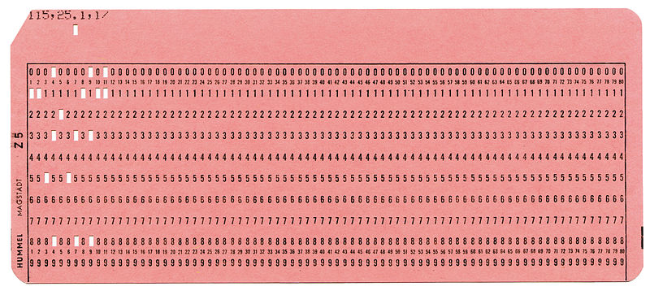

> _Do what you think is interesting, do something that you think is fun and worthwhile, because otherwise you won't do it well anyway._ -- Brian Kernighan

Unix es el sistema operativo más exitoso de la historia. Una variante de Unix se encuentra disponible en casi todos los dispositivos que se conectan a internet hoy. 

En efecto, si usas un teléfono Android usas como base el [Kernel de Linux](https://es.wikipedia.org/wiki/GNU/Linux), por otro lado si tu teléfono es un iPhone estás usando iOS, que tiene como base un kernel [XNU](https://es.wikipedia.org/wiki/XNU).  Ambos pertenecen a la familia de Unix.

Por otro lado, es muy probable que los servicios en internet a los que accedes sean soportados por servidores operando alguna variante de Unix o de Linux.

¿Cómo podemos explicar este éxito? 

Una forma es indagar en lo que nos cuenta una de las personas que estuvo involucrada en la creación de Unix.

## Brian Kernighan

La historia de Unix ha sido contada muchas veces, pero en octubre del año pasado se publicó una fuente definitiva del origen de este exitoso sistema operativo, relatada por alguien que estuvo involucrado directamente en su creación: Brian Kernighan.




Este investigador y pionero informático es reconocido, entre otras cosas, por su gran habilidad como divulgador y escritor.

Kernighan tiene una gran pluma y entre sus libros más vendidos se encuentra ["The C Programming Language"](https://amzn.to/2WNPj8G), que fue el que introdujo este importnate lenguaje de programación al mundo. Este trabajo fue co-escrito con el creador del lenguaje, [Dennis Ritchie](/blog/lnds/2011/10/13/dmr), y es uno de los mejores libros técnicos que he leido personalmente, además de serconsiderado un verdadero clásico. 

Es en este libro que se introduce al mundo el famoso programa ["Hello World"](https://en.wikipedia.org/wiki/%22Hello,_World!%22_program)


```c
main( ) {
        printf("hello, world\n");
}
```

Hay que notar que este programa aparece por primera vez en un memorandum interno de Bell Labs de 1974, escrito por el mismo Kernighan, titulado: ["Programming in C: A Tutorial"](https://www.bell-labs.com/usr/dmr/www/ctut.pdf). Hoy es una tradición el presentar un nuevo lenguaje de programación con este programa, y es también una buena práctica ejecutarlo la primera vez que probamos un nuevo lenguaje o entorno de programación.

Otro de los libros escritos por Kernighan, [que siempre recomiendo a los nuevos programadores](/blog/lnds/2007/07/12/la-practica-de-la-programacion), es [The Practice of Programming](https://amzn.to/2xrulC1).

Pero hablemos de ["UNIX: A History and a Memoir"](https://amzn.to/2WM44ZT), un texto publicado en octubre de 2019. Se trata de una memoria personal del autor sobre sus años en Bell Labs y el origen y la evolución de de Unix.


## Unix: A History and a Memoir


Hay varias anécdotas interesantes en este volumen. Se trata de un texto entretenido de lectura rápida, de no más de 190 páginas. 

En los primeros capítulos el autor nos introduce a Bell Labs y su cultura. Tal como el escritor dice, para entender Unix hay que entender a Bell Labs, cómo operaba y el ambiente creativo que este entorno proveía.

### Bell Labs

Fundado en 1925, los Laboratorios Bell fueron creados para fomentar la innovación en telefonía a través de la investigación científica. Durante la Segunda Guerra Mundial, Bell Labs prestó importantes aportes al gobierno norteamericano, no sólo en sistemas de comunicaciones, sino que en computadores de control de fuego, desarrollo del radar y criptografía.


En Bell Labs, por ejemplo, se desarrolló el transistor, un invento de [John Bardeen](https://es.wikipedia.org/wiki/John_Bardeen), quien recibiría el premio Nobel por este descubrimiento. 

Otros ganadores del Nobel, que trabajaron en Bell Labs fueron [Penzias](https://es.wikipedia.org/wiki/Arno_Allan_Penzias) y [Wilson](https://es.wikipedia.org/wiki/Robert_Woodrow_Wilson), quienes descubrieron accidentalmente la radiación de fondo generada por el Big Bang, trabajando en la mejora de antenas de telecomunicaciones.

Durante mucho tiempo AT&T, la empresa propietaria de Bell Labs, llegó a invertir el 2.8% de sus ingresos en investigación y desarrollo. De eso, el 0.3% se invertía en investigación básica. Esta inversión estable le daba libertad a los científicos contratados, que podían hacer investigación en áreas que no necesariamente reportaran beneficios de corto plazo, incluso en investigaciones que nunca tuvieran una aplicación práctica.

### Computación en Bell Labs

Entre los investigadores que destacaron en Bell Labs estaba Claude Shannon, el padre de la Teoría de la Información [(del que he hablado antes)](/blog/lnds/2011/04/23/tambores-parlantes). 

A principio de la década de 1960 se creó un grupo de investigación en computación. Y en 1967 Brian Kernighan se incorporó al Computing Science Research Center, bajo la guía de Doug McIlroy. 

Kernighan cuenta que tenía la suerte de estar muy cerca de varios próceres de área que tenían sus oficinas muy cerca a la suya. Entre los famosos investigadores que trabajaban en esa época estaba Richard Hamming, autor, entre otras cosas, del [famoso código de corrección de errores que lleva su nombre](/blog/lnds/2018/10/21/corrigiendo-errores), que permite que tengamos comunicaciones confiables de alta velocidad.

Fue Hamming quien impulsó a Kernighan a escribir. Para Hamming el entrenamiento de los programadores era deficiente, según el autor, expresaba su opinión sobre la capacidad de los programadores con la siguiente frase:

> _We give them a dictionary and grammar rules, and we say, 'Kid, you're now a great programmer.'_

Para Hamming la programación debería ser enseñada del mismo modo que se enseña la escritura. Debería existir una noción de estilo que separe el código bueno del código malo, y a los programadores se les debería enseñar a escribir bien y a apreciar el buen estilo.

Esta idea sirvió de incepción para el libro que Kernighan y Plauger publicaron en 1974: ["The Elements of Programming Style"](https://amzn.to/3dB1mfC).

[](https://amzn.to/3dB1mfC)

## Sistemas Operativos

[Una computadora](/blog/lnds/2018/12/09/que-es-un-computador) no es mucho más que una calculadora. Lo que ocurre es que son capaces de ejecutar millones de operaciones aritméticas por segundo.

Programar consiste en crear una secuencia de operaciones que ejecutará la computadora, usando lo que llamamos un lenguaje de programación. Por ejemplo, si queremos calcular el promedio de notas de un curso, un posible algoritmo sería:

    1. Reserva una sección de la memoria que llamaremos ACUMULADOR
    2. Cargar la nota de un alumno en una variable que llamaremos NOTA
    3. Suma el valor de NOTA en ACUMULADOR
    4. Incrementa un contador N en 1
    5. Repite los pasos 2 al 3 hasta que no queden más notas que leer
    6. Divide ACUMULADOR en N y almacenalo en PROMEDIO
    7. Imprime el valor PROMEDIO.

Esto debía ser expresado en un lenguaje entendible por la máquina algo como esto:

```
      dword acum
      dword nota
      dword n
      set acum 0
      set nota 0
      set n 0
  loop:
      load nota
      jz end
      add acum nota
      store acum
      inc n
      jmp loop
  end:
      div acum n
      print
```

En los primeros computadores esto se transcribía a tarjetas perforadas como la de la figura:




Típicamente cada tarjeta contenía una linea de código. También en estas tarjetas se almacenaban los datos.
En nuestro ejemplo, si habían 100 alumnos, habría una tarjeta por cada dato.
Estas tarjetas se entregaban a un operador quien cargaba tanto el programa como los datos en un lector de tarjetas, esta máquina se encargaba de leer las tarjetas y almacenarlas en la memoria del computador. Después el operador ejecutaba el programa, y el resultado normalmente quedaba impreso en papel. Después de un tiempo el programador pasaba a retirar el resultado solicitándoselo al operador.

Como pueden ver, esta forma de trabajar obligaba a que sólo un usuario podía ocupar el computador a la vez. A esta modalidad se le llama *"batch processing"*.

Por otro lado, cuando automatizamos esta labor aparece el concepto de Sistema Operativo. En cierta manera, el sistema operativo es el reemplazo del operador humano.

En 1964 uno de los sistemas operativos más innovadores era CTSS: ["Compatible Time Sharing System"](https://es.wikipedia.org/wiki/Compatible_Time-Sharing_System), desarrollado en el MIT.

En este sistema no era necesario usar tarjetas perforadas. Los programadores podían tipear sus programas en terminales que estaban conectados directamente, o por líneas telefónicas a un gran computador, el IBM 7094.

El sistema operativo dividía su atención entre los usuarios conectados, cambiando rápidamente de un usuario activo al otro, dando a cada usuario la ilusión de que tenía el computador a su entera disposición. Esto se
denominó *"time sharing"* (tiempo compartido), y era percibido en esa época como mucho más agradable y productivo que el _batch processing_.

CTSS fue tan exitoso y productivo que en 1965 el MIT decidió crear una versión mejorada que llamaron Multics, por Multiplexed Information and Computing Service.

## MULTICS

Multics sería un trabajo de gran envergadura, que requería la construcción de software bastante ambiciosos y del hardware que lo soportara. Así que el MIT llegó a un acuerdo con General Electric y Bell Labs, para apoyarlos en el proyecto.

El proyecto era demasiado ambicioso y cayó en el ["efecto del segundo sistema"](/blog/lnds/2012/01/14/album-conceptual), una trampa en que se pretenden arreglar todos los problemas del primer sistema, pero además incorporar las características favoritas de cada uno. El resultado es a menudo un sistema demasiado complicado con sobre ingeniería. En palabras de Sam Morgan fue un intento de "trepar demasiados árboles a la vez"[^1].

Media docena de investigadores de Bell Labs trabajaron en Multics, incluyendo a Doug McIlroy, Dennis Ritchie, Ken Thompson y Peter Neumann.

McIlroy estaba involucrado en el desarrollo del lenguaje PL/I que se usó para programar el sistema operativo.
Ritchie, que era un estudiante recién egresado de Harvard, trabajó en los laboratorios en los subsistemas de entrada y salida, al igual que Thompson.

Thompson describió su trabajo en Multic como _"una muesca en una enorme rueda y estaba produciendo algo que yo no quería usar"_[^2].

En 1969 Bell Labs decide retirar su apoyo al proyecto.

Multics fue finalizado eventualmente. De acuerdo a Kernighan fue usado y soportado hasta el año 2000. 

De todas maneras fue la fuente de varias ideas y una influencia, aunque sea por reacción, en la creación de Unix.

## Proto Unix

Después de la salida de Bell Labs del proyecto Multics, varios de los investigadores aún querían desarrollar un sistema operativo. Pero la administración no quería saber más de un proyecto de este tipo y no tenía interés en comprar hardware especial para una aventura como esta.

Uno de los más entusiasmados en continuar era Ken Thompson, quien compartía con otros colegas ideas en papel de posibles implementaciones.

Eventualmente Ken encontró un computador con poco uso, se trataba de un [DEC PDP-7](https://es.wikipedia.org/wiki/PDP-7).



Este era un computador construido en 1964 y en esa época ya se consideraba obsoleto, razón por la cual Thompson pudo disponer varias horas del mismo. Era una máquina con poca potencia, poseía una memoria de 16K bytes actuales (estaba organizada como 8K words de 18 bits).

El computador tenía una buena pantalla gráfica, y Thompson escribió un juego de [viaje espacial](https://en.wikipedia.org/wiki/Space_Travel_(video_game)) para esta máquina.



El PDP-7 tenía un periférico que representaba un desafío interesante. Se trataba de un disco cuya velocidad de rotación era demasiado rápida para el computador. Así que Ken Thompson desarrolló un algoritmo que maximizara el _througput_ de cualquier disco, incluyendo este en particular.

Pero para probar el algoritmo tenía que desarrollar un programa que llenara el disco con una gran cantidad de datos. Fue entonces que Thompson se dio cuenta que estaba a tres semanas de completar un sistema operativo.

El necesitaba crear tres programas, uno por semana: un editor, de modo que pudiera crear código, un ensamblador que pudiera convertir el código en lenguaje de máquina que corriera en el PDP-7, y un kernel, es decir un sistema operativo.

Justo en esa época la esposa de Thompson se tomó unas vacaciones de tres semanas, llevando al hijo de un año de ambos a visitar a sus abuelos paternos en California. Así que Ken tuvo tres semanas para dedicarlas para trabajar ininiterrumpidamente en este proyecto.

Esta historia se puede ver en una entrevista que Kernighan le hizo a Thomposon en mayo de 2019:




En 2003 Kernighan le preguntó via email sobre el origen de Unix a Thompson, y este respondió lo siguiente:



Lo que demuestra la consistencia de la historia.

## Unix

Y a partir del trabajo de Thompson se forma un pequeño grupo de usuarios dentro de Bell Labs de este proto sistema operativo. Se dice que el nombre UNICS surgió de estas conversaciones, y se suele atribuir el nombre a Kernighan, y sería una suerte de juego de palabras y parodia a MULTICS.

Mientras MULTICS sería "Mucho de Algo", UNICS significa a lo más "uno de algo", es decir, usar uni, en vez de multi. Otro rumor es que a los abogados de AT&T no les gustó la palabra UNICS por ser fonéticamente similar a Eunucs (eunucos) en inglés. Así que eventualmente se volvió UNIX. Como sea el nombre era una parodia a Multics, como apuntó Dennis Ritchie.

Después del éxito del sistema en el PDP-7, Ritchie y Thompson empezaron a hacer lobby para que se aprobara la compra de un PDP-10, un computador más poderoso. El PDP-10 tenía un costo de 500.000 dólares y su compra fue rechazada por la administración.

Pero DEC anunció la disponibilidad de un mini computador, el PDP-11 con un costo de 65.000 dólares. Así que el equipo solicitó la adquisición del modelo más barato, la que también fue rechazada.

En [^1] Sam Morgan expresa:

> El principio de administración acá es que contratas gente brillante y los introduces al ambiente, y les das direcciones generales del tipo de cosas que se requieren, y les das un montón de libertad.
Esto no significa que necesariamente le das todo el dinero que ellos quieran. 
Entonces ejercitas entusiasmo selectivo sobre lo que hacen.
Y si equivocadamente desalientas o fallas en responder a algo que posteriormente resulta ser bueno,
si es realmente una idea fuerte volverá.

El estar forzado a trabajar con restricciones puede ser bueno. En su charla al recibir el premio Turing en 1983 Ken Thompson escribió:

> Unix barrió en popularidad con el cambio a lo largo de la industria desde mainframes centralizados a minis autónomos. Sospecho que Daniel Bobrow[^3] estaría acá en vez de yo si él no hubiera tenido recursos para un PDP-10 y haberse conformado con un PDP-11.

La forma en que lograron la aprobación fue totalmente lateral.

Bell Labs elaboraba una enorme cantidad de patentes al año. Las que debían ser presentadas en un formato estandarizado con páginas con líneas numeradas. No existían sistemas en esa época que permitiera manejar este tipo de formatos. Así que el departamente de patentes estaba dispuesto a comprar hardware especial para eficientar su operación.

[Joe Ossana](https://en.wikipedia.org/wiki/Joe_Ossanna) propuso que el departamento de patentes compara la PDP-11 y el grupo Unix escribiría el software necesario para que ellos pudieran imprimir las aplicaciones de patentes en el formato requerido. Por supuesto nadie escribiría un sistema operativo, no señor :wink:.

Esta propuesta tuvo apoyo del centro de investigación acústica, que estaban interesados en aplicaciones de procesamiento de textos.

Así que la PDP-11 fue comprada, una máquina con 24 Kbytes de memoria principal y un disco con medio megabyte de capacidad.

Ken Thompson y Dennis Ritchie tradujeron y adaptaron el kernel de la PDP-7 a la PDP-11. Este kernel consumía 16 Kbytes de memoria, quedando 8 Kbytes para los programas de los usuarios.



Ossana escribió un programa llamado nroff ("New roff"), análogo al existente program Roff que se usaba para generar los archivos en el formato requerido para las patentes.

Hacia la mitad de 1971 se estaba usando Unix para generar las patentes de Bell Labs diariamente.

La experiencia fue tan exitosa que el departamento de patentes compró otro PDP-11 para que el equipo de Unix mejorara el sistema operativo.


## El entorno Unix

Unix fue creciendo poco a poco mediante la colaboración de varios investigadores de Bell Labs. 

Una de las innovaciones más importantes fue el concepto de pipes.

En 1964 Doug McIlroy propuso la idea de que se deberían conectar programas tal como se enganchan las mangueras de jardin.

Unix tenía la característica que la entrada y salida de cada programa ya estaba estandarizada. Por otro lado McIlroy le insistía a Thompson con la idea de estos conectores de mangueras, hasta que un día a Ken se le ocurre incorporar una llamada adicional al sistema, la que resultó bastante simple, dado que el mecanismo estándar ya existía. Esto es lo que se conoce como pipes (tuberías).

Un ejemplo es la siguiente sentencia, que sirve para saber cuantos archivos hay en un directorio:

    ls | wc 

`ls` es un comando que lista los archivos, uno por linea. `wc` (word count) es un programa que cuenta lineas.

El pipe se expresa con la barra vertical `|`, y lo que esta expresión dice es que el resultado de `ls` debe ser pasado al programa `wc` como entrada.

El potencial de esto permitió la cultura de Unix de crear muchos pequeños programas especializados en sólo una cosa a la vez, los que podían usarse para componer operaciones más complejas.

Para facilitar la mantención del sistema Dennis Ritchie construyó el lenguaje C. Pero junto con esto se incorporó una biblioteca estándar, la que permitía acceder a los servicios del sistema operativo.

Contando con C otros pudieron aportar con mini lenguajes, o lenguajes de scripting, como sh, o bash.
El mismo Kernighan junto a Al Aho y Peter Weinberger crearon el lenguaje [AWK](https://es.wikipedia.org/wiki/AWK) que permite operar sobre patrones.

En 1973, Steve Johnson y Al Aho crearon Yacc, un programa que facilita la creación de compiladores. Esto permitió que florecieran aún más lenguajes específicos dentro del entorno Unix lo que lo fue enriqueciendo.

Dado que Unix fue "vendido" como un proyecto para apoyar la generación de documentos, desde el principio contó con muchos programa de procesamiento de texto, como `roff` y `nroff`, posteriormente con la adquisición de una máquina de foto composición tipográfica, se creó `troff`.

En 1974 Lorinda Cherry creó el lenguaje `Eqn`, usando Yacc que permite escribir ecuaciones matemáticas. Este programa fue inspiración para el trabajo posterior de Donald Knuth en TeX de 1978.

De este modo, cuando alguien preparaba un texto con ecuaciones matemáticas podía hacer lo siguiente en Unix:

  eqn archivo | troff > typesett.output

Todos estos lenguajes son como antepasados de los actuales lenguajes de markup, como Markdown que uso para escribir este blog.

## La distribución de Unix

Toda esta explosión de lenguajes, comandos y utilitarios hizo de Unix un sistema útil y popular.

Además Unix fue distribuido en forma gratuita a las universidades, bajo un simple convenio. Este convenio incluía el acceso al código fuente del mismo. Esto permitió la elaboración de otras versiones derivadadas, como [BSD Unix](https://es.wikipedia.org/wiki/Berkeley_Software_Distribution).

Esto permitió que el sistema se difundiera en entornos comerciales, pues los graduados de informática querían seguir usando el mismo entorno que usaron mientras estudiaban.

Pero lo principal era la facilidad e innovación que giraba alrededor de Unix. Una cultura libre que se fue perdiendo con los avatares que sufrió AT&T en la década de 1980. 

Finalmente Unix fue vendido a Novell en 1992, la que posteriormente la vendió a [SCO](https://en.wikipedia.org/wiki/Santa_Cruz_Operation).

Pero Unix sobrevió en forma de múltiples derivados, como BSD, Minix y el más popular Linux.

La figura que encabeza este post muestra esta especie de árbol genealógico de Unix.

## Peor es mejor

En 1989 [Richard P. Gabriel](http://dreamsongs.com/) en su artículo [The Rise of Worse is Better](http://www.jwz.org/doc/worse-is-better.html) explica el éxito de la filosofía de Unix


En el ensayo Richard Gabriel plantea que existe un estilo de diseño de
software que el denomina el estilo MIT/Stanford (es decir, un estilo académico) que básicamente tiene las siguientes características:

* *Simplicidad:* el diseño debe ser simple, tanto en implementación como interfaz. Es más importante que la interfaz sea simple que la implementación.
* *Correctitud:* el diseño debe ser correcto en todos los aspectos observables. La incorrectitud simplemente no está permitida.
* Consistencia: el diseño no puede ser inconsistente. Se permite que un diseño sea ligeramente menos simple y menos completo para evitar incosistencia. La consistencia es tan importante como la correctitud.
* Completitud: el diseño debe cubrir tantas situaciones importantes como sea práctico. Todos los casos razonablemente esperados deben estar cubiertos.  A la simplicidad no se permite reducir excesivamente la completitud.

Como ven estas son características que se consideran buenas y positivas.

Por otro lado, la filosofía **Worse Is Better**, Peor es mejor, o estilo
New Jersey, en referencia a los Bell Labs, la cuna de C y Unix es
ligeramente diferente en los siguientes aspectos:

* *Simplicidad:* el diseño debe ser simple,tanto en implementación como interfaz. Es más importante que la implementación sea simplea que la interfaz. La simpliciddad es la consideración más importante en el diseño.
* *Correctitud:* el diseño debe ser correcto en todos los aspectos observables. Es ligeramente mejor ser simple que correcto.
* *Consistencia:* el diseño no debe ser demasiado incosistente. La consistencia puede ser sacrificada por la simplicidad en algunos casos, pero es mejor eliminar partes del diseño que tienen que ver con circunstancias menos comunes que introducir complejidad en la implementación o inconsistencias.
* *Completitud:* el diseño debe cubrir tantas situaciones importantes como sea práctico. Todos los casos razonablemente esperados deben estar cubierntos. La completitud puede ser sacrificada en favor de cualquier otra cualidad.

De hecho, la completitud puede ser sacrificada siempre que la
simplicidad de implementación esté amenazada. La consistencia puede ser
sacrificada para alcanzar completitud si se mantiene la simplicidad,
especialmente la inconsistencia de la interfaz no tiene valor.

Para mi esto se traduce en construir servicios, lenguajes, o programas simples que hagan bien una cosa, y disponer esto dentro de un entorno en que puedan acoplarse de una manera sencilla para brindar nuevos servicios más complejos.

Súmenle esto al precepto de administración de "entusiasmo selectivo", en que cuentas con equipos brillantes que son libres de innovar dentro de ciertas restricciones, y tendrás un entorno de innovación tan exitoso como lo fue Bell Labs en las décadas de 1960 y 1970.


[^1]: http://gromnitsky.users.sourceforge.net/lit/an-oral-history-of-unix/morgan.html

[^2]: ["UNIX: A History and a Memoir"](https://amzn.to/2WM44ZT), capítulo 2.

[^3]: Daniel Borrow fue el autor del [sistema operativo Tenex](https://en.wikipedia.org/wiki/TENEX_(operating_system)), escrito en un PDP-10 en 1969.