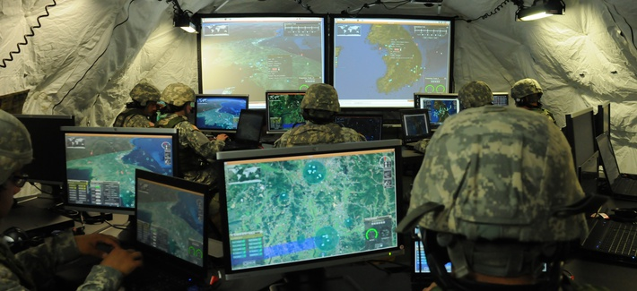

> "La máquina militar, el ejército y cuanto a el pertenezcan es en el fondo bien sencillo, y parece, por lo tanto, fácil de manejar. Mas reflexionando se ve que ninguna de sus partes está compuesta de una sola pieza; que todas están compuestas de individuos, cada uno de los cuales conserva en todas partes su propia fricción." -- Karl Von Clausewitz

El historiador y teórico militar Carl von Clausewitz siempre sintió revulsión de que una milicia popular, el ejercito revolucionario francés, hubiese derrotado a las fuerzas armadas de la monarquía alemana. A tal grado llegó este sentimiento que cuando vino la invasión a Rusia, por parte de Napoleón, se opuso a la postura oficial prusiana de apoyar a Francia, y solicitó la baja al ejército. Tras esto se trasladó clandestinamente a San Petesburgo, para ofrecer sus servicios al Zar Alejandro I, con la esperanza de liberar a Prusia de la dominación francesa.

Sus reflexiones tras las guerras napoleónicas las plasmó en una serie de manuscritos, que fueron publicados de manera póstuma por su esposa, tras la muerte del militar, debido al cólera, a los 51 años de edad.

De su teoría sobre abordar la estrategia y la táctica de la guerra, los elementos que más se destacan son los conceptos de Niebla de Guerra y Fricción, debido a su universalidad y vigencia.

## Niebla de guerra

El término acuñado por Clausewitz hace referencia a la confusión reinantes durante un conflicto bélico. Este fenómeno es una metáfora inspirada por la humareda provocada por los disparos de cañones y mosquetones, y por la polvareda generada por las cargas de caballería durante las batallas de aquellos tiempos, que no dejaba ver con claridad la evolución de la batalla[^1].

A lo que apunta Clausewitz es que durante la evolución del conflicto se produce mucha confusión debida a diversos factores como los retrasos, confusión, incertidumbre, etc, que dificulta la coordinación y planificación de las operaciones.

Gran parte de la labor de los estrategas modernos es minimizar los efectos de la niebla de guerra. En la actualidad se apoyan muchos procesos militares con tecnología, pero aún así es algo aún difícil de dominar.

## Demasiada información

Los teóricos militares han abordado el problema de la niebla de guerra mediante la incorporación de más información, de forma oportuna y de la manera más eficiente posible. Con ayuda de la tecnologías de información han desarrollado sistemas de comando, control, comunicaciones, computación, inteligencia, vigilancia y reconocimiento (C4ISR), sistemas COP (Common Operating Picture), que les dan la habilidad a los comandantes de visualizar en tiempo real todo aspecto del campo de batalla, incluyendo al enemigo.

Aún así, no garantiza el éxito de las operaciones de guerra. En 2004, durante la batalla de Fallujah las unidades de marina y del ejército norte americanos no podían comunicarse de forma efectiva[^2], como resultado, paradojalmente, del exceso de comunicaciones y del uso de los sistemas COP ocupados por ambos servicios militares para apoyar el desarrollo de la batalla [^3].

La necesidad de reportar hacia el mando operativo genera otro problema, el lider de pelotón lleva un computador que sirve para monitorear centralmente a su unidad. Esto le crea una dificultad adicional, puesto que debe controlar a su unidad y servir las demandas de la tecnología. Como ambas requieren su atención, ninguna la recibe totalmente.

Sumemos que los comandantes tienen una capacidad limitada de absorber tanta información. Ante esto la estrategia es engañar al comandante, la que es adoptada de forma astuta por combatientes irregulares, o populares, como diría Clausewitz.

## Fricción

El otro elemento que identificó Clasewitz es la fricción de guerra. 

Al problema de que cuesta tomar decisiones estratégicas o tácticas debido a la niebla de guerra, se le suma que cuesta que las órdenes emitidas se cumplan adecuadamente, por culpa del fenómeno de la fricción.

Clausewitz dice: "todo en la guerra es muy simple, pero la cosa más simple es dificil. Las dificultades se acumulan y terminan produciendo una especie de fricción". Y continua ilustrándonos que esta fricción afecta la oportunidad, resultando en efectos cuya determinación no es posible dado que son generados por la casualidad. Simplemente, "la fricción es la fuerza que hace que lo aparentemente simple sea dificultoso". [^4]

Clausewitz identifica ocho fuentes mayores de "gran fricción"[^5]:

- Conocimiento insuficiente del enemigo
- rumores (información adquirida por observación remota o espías)
- incerteza sobre la fuerza propia y posición
- la incerteza que causa que las tropas aliadas exageren sus propias dificutltades
- la diferencia entre las expectativas y la realidad
- el hecho de que el ejército propio nunca es tan fuerte como aparece en el papel
- las dificultades de mantener los suministros del ejército
- la tendencia a cambiar o abandonar planes bien pensados cuando se confrontan  con las imágenes físicas vívidas y la percepción del campo de batalla

Hay una cierta sobre posición y redundancia en esta lista, pero consideremos que es una obra completa y póstuma. 

## Ni los mejores planes salen cómo se espera

Lo importante es considerar que hay muchas causas y fuentes de este fenómeno, y que por otro lado es imposible llegar a conocerlo todo, porque tratar de controlar todo también genera más fricción.

En suma, si bien reconocemos el fenómeno de la niebla de guerra y de la fricción, lo importante es saber que estos fenómenos existen e impiden que el comandante pueda tomar decisiones totalmente informadas, y que sus órdenes no saldrán como él espera.

Esto, claro está, aplica también en otros escenarios de liderazgo, no sólo sirve para la guerra.

En este mismo momento, producto de la pandemia de COVID-19, estamos en un escenario de alta incertidumbre, donde tenemos muchas niebla de guerra.

¿Cómo lo hacían los mejores comandantes?

¿Cómo lo hacen los cuerpos irregulares?

Si revisan la historia, el fenómeno que irritaba a Clausewitz, y que lo llevó a analizar las estrateguas de guerra, es que los cuerpos irregulares, o populares, pueden llegar a ser más exitosos que los cuerpos profesionales con alto entrenamiento o incluso tecnología.

Es cosa de ver la historia de las guerras acometidas por Estados Unidos desde Vietnam hassta la fecha.

Los oponentes usan tácticas sencillas, sin una coordinación sofisticadas, muchas veces son células pequeñas que recurren a tácticas de guerrillas o guerra urbana. Sin mucha tecnología de comunicaciones, y mucho fanatismo o patriotismo, con la motivación de luchar por una causa que consideran justa, contra un adversario superior, lleno de tecnología.

Esto me recuerda la vieja discusión entre el modelo de gestión de Comando y Control, versus la gestión ágil o lean. 

La gestión vía Comando y Control topa con los fenómenos identificados por Clausewitz hace ya 200 años. Y lo que es peor, provoca mayor fricción, generando un círculo vicioso.

De seguro ustedes son capaces de identificar muchas fuentes de fricción en su trabajo, esas son parte de las causas de lo que en Lean llaman "Waste"[^6], esta identificación puede quizás ser el primer paso para mejorar.

[^1]: Wikipedia: ["Niebla de guerra"](https://es.wikipedia.org/wiki/Niebla_de_guerra)

[^2]: "The Relevance of Clausewitz’s Fog and Friction in a Digital Age Essay", en linea https://ivypanda.com/essays/the-relevance-of-clausewitzs-fog-and-friction-in-a-digital-age/, visitado el 26 de abril de 2020.

[^3]: Matt M. Matthews, "Operation Al Fajr: A Study in Arm and Marine Corps Joint Operations". Occasional Paper, (Fort Leavenworth, KS: Combat Studies Institute), 79. Citado en [^2].

[^4]:  Carl Von Clausewitz, C. On War. Ed. by Michael Howard and Peter Paret (Princeton: University Press, 1984). Citado en [^2].

[^5]: Barry D. Watts, "Clausewitzian Friction and Future War", revised edition, PDF online: https://apps.dtic.mil/dtic/tr/fulltext/u2/a427577.pdf

[^6]: Curiosamente en The Lean Way identifican ocho fuentes de Waste, del mismo modo que Clausewitz identificó ocho fuentes de fricción: https://theleanway.net/The-8-Wastes-of-Lean
