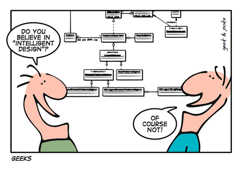

En estos días de pandemia, de trabajo remoto y cuarentena, junto con cambiar varios de hábitos, hemos compartido mucho más tiempo con nuestras familias. Lo que es el lado positivo de toda esta situación.

Entre esas actividades compartidas está el ver programas de televisión. Era muy raro que en mi casa prendieramos la TV para ver algún canal de cable, pero en estos días además de mantenernos informados, buscamos algo de distracción. 

Entre las alternativas más entretenidas están los programas de remodelación y construcción de Discovery Home & Health, que seguro muchos de ustedes conocen. Lo interesante es que de estos reality shows se pueden sacar algunas lecciones para el desarrollo de software, y hoy les quiero compartir algunas reflexiones al respecto. 

Me voy a centrar en tres programas: "Vívala o Véndala: Vancouver", "Las Renovadoras", y el más popular: "Hermanos a la Obra".

## Las aventuras y desventuras de Jill y Todd

"Vívala o Véndala: Vancouver" es parte de una franquicia de televisión, con diversas variantes que se desarrollan en distintas ciudades del mundo.



El concepto del programa es el siguiente: Una pareja tiene un dilema con respecto a su casa, no sabe si renovarla o venderla. Uno de los miembros de la pareja está más dispuesto a la venta, mientras que el otro prefiere remodelarla pues está apegado al hogar por todos los recuerdos y afectos.

Para ayudarlos a tomar una decisión se presentan dos personajes, que son los protagonistas del show. Un agente inmobiliario (Todd Talbot, en esta versión de la franquicia) que se encargará de mostrarles prospectos de casas que pueden adquirir. El otro personaje es un diseñador o diseñadora de interiores (Jillian Harris en este caso), que les hará una propuesta de remodelaciones y mejoras que deben abordar para darle más valor a su casa. Ambos protagonistas compiten por ver quien logra que la pareja se mantenga en su casa, u opte por venderla.

### Análisis de requisitos

El requerimiento de la pareja es resolver su dilema, vender la casa o remodelarla. En la pareja no saben qué hacer, pero para resolverlo el programa les hace una "trampa", los obliga a realizar una remodelación, con el incentivo de que eso aumentará el valor de la casa, con ese dinero extra pueden tomar la decisión de venderla. Así que en realidad la decisión es una: vender o no vender. 

El simil a un proyecto de software sería tomar la decisión entre modificar un sistema ya existente o adquirir uno nuevo. A diferencia de que hacen en el programa, no podemos realizar la mejora y luego vender nuestro software para poder comprar el nuevo, eso no lo he visto pasar nunca, y me parece un escenario irreal (pero uno nunca sabe).

Pero sí podemos hacer algo similar: realizar una prueba de concepto, o un prototipo[^1], para ayudarnos a decidir. La ventaja de los prototipos y las pruebas de conceptos es que son de rápida ejecución y de bajo costo.

Lo que vemos en el programa es que después de presentarnos a la pareja y su casa, los protagonistas, el agente inmobiliario y la diseñadora, visitan la casa solos y se hacen una idea de los problemas que llevan a la pareja a esta situación.

Luego los cuatro se reunen y realizan el **"levantamiento de requisitos"**[^2]. Estos son distintos, aunque complementario para cada uno de los protagonistas. Para la diseñadora es una lista de cosas a cambiar o reparar. Para el agente inmobiliario es una conjunto de características, que deben ser idénticas o mejores a las que ya tiene la casa, más algunas nuevas deseables.

Estos es importante y quiero que lo noten, así que insistiré. Las listas de requisitos son distintas, porque cada uno ofrece una solución distinta al **"desafío focal"**[^3] de la pareja, el que podríamos definir como "mejorar su nivel de vida y agrado con la casa que habitan". 

La solución de Todd, "comprar una casa nueva", plantea el desafío de encontrar una casa que les guste al nivel de abandonar su actual hogar a pesar de todas las ataduras emocionales que puedan tener con esta.
El desafío focal Jillian es que la pareja se quede en la casa después de las mejoras que va a realizar.

### Ejecución del proyecto

Teniendo la lista de requisitos clara empieza a desarrollarse el programa, y surgen los problemas, lo que genera el nudo dramático del show.

Todd es una persona alegre y muy optimista, busca casas y se las muestra de una manera simpática y agradable a la pareja. Es el que da el aspecto más divertido y de comedia del programa. Hay veces en que le cuesta convencer a los futuros compradores, que plantean una y otra vez objeciones, pero se hace cargo y va mediante "aproximaciones sucesivas" acercándose a la casa que la pareja busca. Su principal restricción es el presupuesto para compra. Pero se apoya en cierta manera del trabajo de Jillian, confía en que ella con su trabajo aumentará el valor de la casa, lo que lleva agua a su molino. 

Jillian aporta el drama. Ella se encuentra con los imprevistos. Maneja una reserva de emergencia para imprevistos, pero es típico del programa encontrarse con verdaderos desastres.



\
Inundaciones, termitas, la presencia de asbesto, instalaciones eléctricas o plomería defectuosas. Incidentes siempre hay, porque parten de una casa que ya tiene uso, y las casas requieren mantención. 
Hay veces en que los ocupantes de la casa no tienen idea de los problemas que su casa tiene. También hay casos en que los problemas los han provocado ellos mismos en el pasado, con renovaciones incompletas o mal ejecutadas.

Jillian tiene que darles las malas noticias, y siempre es criticada. Todo esto se exagera, por supuesto, después de todo estamos ante un "reality show". Pero sí se refleja mucho de lo que ocurre cuando decidimos hacer una mantención a nuestras casas.

Acá la solución clásica a los problemas que se presentan son las mismas. Ante un imprevisto, se recurre al fondo de emergencia, si con esto no se alcanza, se les pide más a los propietarios, si están de acuerdo, se avanza con el dinero extra. Si no, entonces se debe sacrificar alguna de las mejoras que pidieron. 

Esto es lo que en gestión de proyectos llamamos **"reducción de alcance"**. Si el presupuesto no alcanza, algo de la lista de requisitos debe descartarse. El cliente reclamará, y estará molesto, es obvio, pero acá viene la habilidad negociadora de Jill, quien como buena **"project manager"**, logra que el cliente acepte esta nueva realidad, producto de los imprevistos. Es habitual que compense el mal rato con alguna mejora extra, un toque de diseño en la entrega final.

### Entrega

El proyecto tiene un plazo. Si no han habido retrasos, los cuatro se juntan en la casa renovada. Que siempre luce espectacular. 

El programa nos recuerda lo que no pudo completar Jill, junto cona las casas que se le mostraron a la pareja por parte de Todd, con los pro y contra de cada una.

Todd se acerca a la pareja y les muestra el nuevo valor que ha alcanzado su casa tras las mejoras de Jill. Con esto ellos toman la decisión y se decide quien ganó.

He observado que las parejas tienden a vender mientras mayor es el valor agregado de la reparación. Pero la verdad es que no es fácil predecir la decisión que van a tomar, pero es un juego que hago, tratar de encontrar algún patrón que me indique cómo toman la decisión.

Es un programa entretenido y nos ha entregado algunos conceptos interesantes:

- La importancia de entender bien cual es el desafío focal y las necesidades de nuestro cliente.
- Que podemos replicar lo que hace Jill mediante prototipos o pruebas de concepto.
- Que si vamos a adquirir software, debemos revisar varias opciones y contrastar contra nuestra lista de requisitos. Ver en que medida nos acercamos a la satisfacción de esa lista con la más amplia cobertura.
- A gestionar los imprevistos que afectan nuestro prespuesto mediante el recorte de alcance.

Vamos al siguiente programa.

## La alegría de Las Renovadoras



Si algo caracteriza este segundo programa es la alegría y optimismo de Mina y su madre Karen. 

Todo parte de un proyecto que desarrolló la abogada Karen Laine, quien creó la empresa ["Two Chicks and a Hammer"](https://www.2chicksandahammer.com/), en conjunto con la hija de su primer matrimonio, "Mina Starksiak", en 2007.

La empresa se especializa en renovar casas abandonadas en los sectores de Fontain Square y Bates Hendricks en Indianápolis.

Fueron descubiertas por la cadena HGTV en 2014, y publicaron su primer piloto en mayo de 2015. Así nació "Good Bones", el reality que conocemos en Latino América como "Las Renovadoras".

Good Bones (buenos huesos), hace referencia a que ellas buscan y adquieren, casas cuya estructura es firme y resistirá una buena remodelación. A veces compran una casa abandonada por unos 4.500 dólares y pueden venderla en vario cientos de miles después de la renovación.

En software también tenemos arquitectura, y los "buenos huesos" son el diseño y la disposición de los componentes de nuestra arquitectura.

Nuestro software no debería decaer al grado tal que requiera ser retirado. Su retiro debería obedecer a razones de negocio u obsolescencia tecnológica.

El equivalente a lo que hacen Mina y Karen es más dificil de encontrar en desarrollo de software, pero lo más cercano es a la manera en que operan las StartUps.

Mina y Karen arriesgan su propio dinero, toman un proyecto en función de una visión más amplia, la renovación urbana de Indianápolis. Cada casa es un aporte a esa visión, y el dinero ganado se re invierte en el siguiente proyecto.

Otro simil sería la reducción de "deuda técnica"[^4]. 



### Reduciendo la deuda técnica

Podemos ver a cada casa que Mina y Karen recuperan, como una componente de nuestra arquitectura que requiere ser modificada. 

¿Pero cuales serían los "good bones"? 

Depende de la calidad de tu diseño. Si hay una buena modularización, la tendrás más fácil. Si no, tienes mucho trabajo (como tratar de enderezar el muro de la figura).

Cada módulo se relaciona con otro mediante una interfaz, algo que llamamos [API](/blog/lnds/2009/03/20/como-disenar-una-api/).

Hoy en día hay mucha gente que cuando hablamos de API piensa en endpoint usando el protocolo REST. Pero el concepto de API es muy antiguo, existe desde al menos la década de 1970.  Se consolidó en la década de 1980 con el surgimiento de la Programación Orientada al Objeto y el desarrollo de componentes.

Yo recuerdo cuando para poder programar aplicaciones para Windows 3.11 era necesario dominar la famosa API de  Windows. Con el tiempo se introdujeron conceptos como OLE y DDE que permitían modelar nuestros sistemas como conjuntos de componentes. Lo mismo pasaba con RPC y luego CORBA en otros ambientes. Esto alcanzó su peak en los noventa.

El diseño por componentes era visto como la forma adecuada de construir software.

La gracia de este diseño es que cada componente expone una API, que es utilizada por cualquier otra componente que quiera acceder a los servicios provistos. Ahí están los "good bones". Si al menos tienes esta separación puedes apoyarte en esto para reemplazar las componentes.

Si no tienes esa suerte, tendrás más trabajo. Ahí lo que debes hacer es llamar a Todd Talbot y pensar en comprar un nuevo sistema :smile:.

¿Qué podemos aprender de Las Renovadoras?

- Si trabajas en una StartUp, la visión compartida, centrarte en cumplir esa visión paso a paso. Tal como ellas están haciendo con Indianápolis.
- Si tienes código legado, busca los "good bones", esos elementos que sostienen tu arquitectura y que son rescatables, apóyate en ellos para mejorar tu arquitectura, o reducir la deuda técnica.

## Los Reyes de los programas de construcción



El programa más popular y exitoso en este género es "Property Brothers", de los gemelos Scott.

En realidad, son varios programas los que manejan a través de su productora. A estas alturas son dueños, junto a su tercer hermano, de un imperio multimedia, que incluye libros, videos, series web, varios programas de TV, eventos, lineas de productos, etc.

Los gemelos son muy famosos en Canada, su país de origen, y Estados Unidos y en estos momentos producen una serie sobre remodelaciones acompañados por celebridades que en el capítulo estreno tuvo la participación de Bradd Pitt.

Como son varios los programas que producen, cada uno tiene una estructura diferente, pero vamos a centrarnos en el más clásico de sus formatos.

Muchas veces sus clientes tienen un presupuesto que está muy por debajo de sus expectativas. Entonces los hermanos los llevan a visitar una casa, que por supuesto tiene todo lo que sueñan los clientes. Pero está muy por encima del dinero del que disponen.

Este ejercicio no es cruel, sirve para dos cosas, la no declarada es confirmar la lista de requisitos. La segunda es mostrarles que deben ajustarse al presupuesto, y para eso les ofrecen una alternativa: comprar una casa antigua más barata, y reservar una parte del presupuesto para remodelarla.

Después de visitar varias casas se quedan con un par de alternativas. Acá es donde Jonathan les muestra videos animados, que usan realidad virtual para mostrar cómo quedarán la casas tras la remodelación. Esto es crucial. La visualización es de alta calidad, con gran impacto visual y ayuda a los clientes a hacerse la idea de cómo quedarán la remodelaciones y tomar la decisión.

El proyecto inicia, y los clientes participan de la demolicion inicial. Pero eso es casi todo en lo que tendrán participación. Acá el control de proyecto es ferreo por parte de Jonathan. Es él quien propone el diseño, dirige al equipo y gestiona el presupuesto. Mantiene informados a los clientes, y es un excelente negociador, pero cede muy poco a los caprichos de sus clientes. 

Otro aspecto muy importante es que el plazo de remodelación es corto, y **se cumple**, rara vez he visto que se retrasen en algún proyecto. Es por eso que Jonathan no permite mucha participación de los clientes en el proceso, porque tienden retrasar el proceso o aumentar los costos con sus ideas.

En general la remodelación se centra en *ciertas partes de la casa*, no en toda. Siempre las que mas lucen, como la cocina, el comedor y la sala de estar. Mientras más presupuesto disponible, pueden abordar más habitaciones, pero en general es raro que remodelen toda la casa.

El simil que más se parece es lo que llamamos un **"Producto Minimo Viable"**[^5] (o [MVP](https://en.wikipedia.org/wiki/Minimum_viable_product) por sus siglas en inglés).

Un MVP es un producto final, pero con las características suficientes para satisfacer a algunos clientes. Nos permite tener una retroalimentación que podemos usar para el desarrollo futuro del producto.

Hay que tener cuidado con definir bien el MVP. Y para lograrlo hay diversas técnicas, como [Lean Inception](https://martinfowler.com/articles/lean-inception/), o [Design Sprint](https://www.gv.com/sprint/), o mediante la ejecución de un buen prototipo. Estas técnicas son similares a cuando Jonathan muestra sus videos de realidad virtual. 

Lo más importante cuando uno define un MVP: el cliente debe entender que no es todo, sino lo que es viable en el tiempo, presupuesto, y de acuerdo a los objetivos de negocio que queremos abordar.

### Constructores de alto desempeño

Una de las características más importantes de Hermanos a la Obra es la calidad del trabajo, el cumplimiento de plazos bastante exigentes, y la eficiencia en el uso de tecnología y heramientas.

La prolijidad de su trabajo es indiscutible. Alguien dirá que son actores, y todo es realizzado por otros, pero no, tanto Drew como Jonathan tenían quince años de experiencia remodelando casas antes de empezar el programa, además de estudios técnicos sobre construcción del Instituto Tecnológico de Alberta, y de administración en la Universidad de Calgary. Por supuesto que cuentan con equipos de alto nivel, tanto en diseño como en construcción, los que se destacan más en otros formatos del programa (por ejemplo, en las series en que los hermanos compiten en la remodelación de casas).

La conformación de equipos es relevante para obtener excelentes resultados. 

Un buen equipo es capaz de estimar de manera adecuada. En uno de los episodios un cliente les pregunta si no hay que reservar algo para contingencia, la respuesta de Scott es que el presupuesto siempre considera un margen de 10% para contingencias. Lo otro, es que un buen equipo cumple el plazo comprometido. No sólo eso, sino que además sorprende con la entrega. Todas las remodelaciones son aún mejores que las simulaciones mostradas.

Esa es la característica de equipos de alto desempeño. 

Eso se da con la experiencia, el compromiso, la buena relación, el humor o actitud positiva y sobretodo la mejora continua, que requiere de una práctica constante de la reflexión y la auto crítica. 

Estas son las cosas que debemos valorar de los hermanos Scott:

- Hay un proceso de incepción previo, que en el caso de los hermanos Scott consiste en visitar una casa que cumple todo pero a un costo superior. Después se muestran varios prototipos en 3D donde los clientes pueden decidir cuál opción tomar.
- Fíjense que al inicio del programa, mientras visitan las casas, en pantalla aparecen las características deseadas. Cuando finaliza el programa esas mismas características aparecen de nuevo en pantalla, indicando que se cumplió con lo esperado. Es la lista de requisitos, que ha sido refinada en la fase de incepción.
- El experto es el que define lo que se hará a nivel técnico. Después de la fase de incepción las visitas de los clientes son cada vez menos. De hecho sólo participan de modo activo en la fase de demolición inicial, después son invitados para validar ciertas decisiones. Hay algunos clientes más "intrusos" y en ese caso Scott sabe como distraerlos, con otras actividades.
- Hay veces que el presupuesto es tan estrecho que los hermanos Scott recurren al apoyo directo de los clientes para que realicen algunas labores, con esto se ahorran dinero. Eso lo puedes hacer también en tus proyectos. Hay veces en que puedes pedir apoyo a tus usuario para que realicen testing, ayuden con documentación, etc.

## Manos a la obra

Ahora que tienes algunos similes, puedes usarlos para dirigir algunas conversaciones sobre cómo mejorar tu forma de gestionar proyectos de software. Seguro que si miras algunos de estos programas se te ocurrirán varios símiles adicionales. Puedes usar esto para cambiar, mejorar tu proceso. Yo te mostré además algunos conceptos que son esenciales en el desarrollo moderno de software. Me sorprende que varias de las técnicas que menciono en este artículo no son conocidas por mucha gente de la industria. Es mi esperanza que al presentarlas de esta forma, se despierte la curiosidad por aplicarlas.

## Notas
---

  * Ilustración principal tomada de unDraw https://undraw.co/thankful
  * Imágenes y video de los programas tomadas de Discovery Home & Health Channel, usadas con fines pedagógicos mediante fair use.
  * Caricatura sobre diseño inteligente tomada de  Geek & Poke  http://geek-and-poke.com/ bajo CC-BY-3.0.
  * Imagen del muro tomada de este tweet: https://twitter.com/moonpolysoft/status/1263459227697246208?s=20. 

[^1]: "Una Prueba de Concepto" (PoC por sus siglas en inglés) es un mini proyecto que se realiza para probar si una idea puede desarrollarse. Se usa en la exploración de una nueva tecnología o herramienta. Un "Prototipo", por otro lado, es un modelo, con cierto nivel de interacción que nos muestra lo que será el producto final. Tiene poco diseño gráfico, baja resolución y precisión, acá lo que nos interesa es validar flujos por los que se moverá el usuario a un costo muy bajo. No es el resultado final, y no se reutiliza para realizar el producto final, no es más que una maqueta y debe realizarse al menor costo posible.

[^2] Un requerimiento es una petición para ejecutar algo, normalmente viene de una autoridad. Por otro lado un requisito es una cualidad, circunstancia o cosa que se requiere de algo. Así que lo que recibimos de nuestro cliente es un requerimiento que contiene una lista de requisitos. Hay mucha confusión con estos términos en el lenguaje informático, sobretodo en Chile, donde confunden requerimientos con requisitos.

[^3]: Si no sabes lo que es un desafío focal te invito a revisar este video de HBR: https://www.youtube.com/watch?v=ItzQ7_UwZo4 y luego la interpretación del problema y su desafío focal  https://www.youtube.com/watch?v=x-irzSZezsA que realizaron los amigos de [LeanSight](http://www.leansight.com/).

[^4]: Deuda técnica es un concepto introducido por Ward Cunningham en 1992: http://c2.com/doc/oopsla92.html. Una buena manera de definirlo la da Javier Garzas: "La deuda técnica es el coste y los intereses a pagar por hacer mal las cosas. El sobre esfuerzo a pagar para mantener un producto software mal hecho, y lo que conlleva, como el coste de la mala imagen frente a los clientes, etc.2" (https://www.javiergarzas.com/2012/11/deuda-tecnica-2.html).

[^5]: Un producto mínimo viable es justamente eso, un **mínimo viable**, ocurre que cuesta mucho que se entienda el concepto, muchos clientes o usuarios quieren todo en la primera entrega. En mi experiencia s muy dificil hacer entender este concepto.