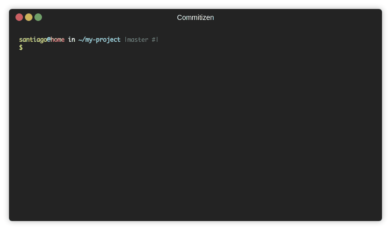

Asegurar la comunicación es uno de los desafíos más importantes cuando trabajamos en equipo, o en un proyecto de código abierto. Algo que ayuda es mantener una serie de estándares, o prácticas comunes que faciliten la comunicación y el entendimiento compartido.

Desde hace años las comunidades open source han adoptado una serie de prácticas muy sencillas, pero potentes, que ayudan a gestionar mejor su código. 

Entre estas hay algunas que me parece  deberían ser adoptadas por todo tipo de equipo de desarrollo.

## ReadMe First

En su artículo ["Readme Driven Development"](https://tom.preston-werner.com/2010/08/23/readme-driven-development.html) Tom Preston-Werner nos advierte:

> "Una implementación perfecta de la especificación incorrecta no vale nada. Por el mismo principio, una biblioteca bellamente diseñada sin documentación es casi igual de inútil. Si su software resuelve el problema equivocado o nadie puede descubrir cómo usarlo, algo muy malo está pasando."

La solución propuesta por el fundador de GitHub es sencilla. Antes de empezar nuestro trabajo debemos escribir un documento, llamado README (léeme). 

En este documento especificamos lo que se construirá. Es una descripción del proyecto y de su implementación en código. Es usual que acá se describan  las interfaces públicas y la forma de ocuparlas. Junto con otras consideraciones, como el modo de instalar el software, pasos para ejecutarlo, etc.

Lo normal es que este archivo se escriba en formato [markdown](https://en.wikipedia.org/wiki/Markdown), que es soportado por los servicios de gestión de código más populares, como GitHub o GitLab.

Pero, ¿por qué escribir este archivo antes de empezar a codificar?
El fundador de GitHub nos explica las ventajas de hacer esto:

> Al escribir el archivo README primero, obtienes algunas ventajas bastante significativas:
> - Lo más importante, te estás dando la oportunidad de pensar en el proyecto sin la sobrecarga de tener que cambiar el código cada vez que cambias de opinión sobre cómo se debe organizar algo o qué se debe incluir en la API pública. ¿Recuerdas esa sensación cuando comenzaste a escribir pruebas de código automatizadas y te diste cuenta de que detectaste todo tipo de errores que de otro modo se habrían colado en tu base de código? Esa es exactamente la misma sensación que tendrá si escribes el README para tu proyecto antes de escribir el código real.
> - Como subproducto de escribir un README para saber lo que necesitas implementar, tendrás una muy buena documentación frente a ti. También encontrarás que es más fácil escribir este documento al comienzo del proyecto cuando tu entusiasmo y motivación están en su punto más alto. Escribir un archivo README de forma retroactiva es un lastre absoluto, y seguramente se perderá todo tipo de detalles importantes cuando lo hagas.
> - Si está trabajando con un equipo de desarrolladores, obtendrás aún más valor de tu README. Si todos los demás miembros del equipo tienen acceso a esta información antes de que haya completado el proyecto, entonces pueden comenzar a trabajar con confianza en otros proyectos que interactuarán con tu código. Sin ningún tipo de interfaz definida, deben codificar en serie o enfrentar la reimplementación de grandes porciones de código.
> - Es mucho más simple tener una discusión basada en algo escrito. Es fácil hablar interminablemente y en círculos sobre un problema si nunca se pone nada en el texto. El simple hecho de escribir una solución propuesta significa que todos tienen una idea concreta sobre la que se puede discutir y repetir.

Y esa es la clave. Cuando trabajamos en equipo es relevante tener una visión compartida, y una de las mejores forma es compartiendo un documento, que podemos discutir. Discutir largamente haciendo círculos con las manos en el aire no cuenta como una visión compartida.

Hay equipos que escriben documentos más formales. Incluso hay metodologías dirigidas por el documento. A mí me parece esto último me parece un tanto extremo. Pero sí creo que es importante sentarse a pensar antes de construir, y dejar ese pensamiento plasmado en un escrito ayuda. Tú yo del futuro lo agradecerá.

## Mantener una bitácora de cambios

La bitácora de cambios, o changelog, es un archivo que describe todos los cambios importantes en un proyecto.
Hay un proyecto que describe una forma estándar de mantener una bitácora de cambios, se trata de  [Keep a Changelog](https://keepachangelog.com/en/1.0.0/)[^1].

La idea es muy sencilla, debes mantener un archivo llamado `CHANGELOG.md`, que se trata de un simple archivo en [markdown](https://en.wikipedia.org/wiki/Markdown)
que contiene todos los cambios valiosos, pero descritos de manera correlativa.

Este es un fragmento de un típico archivo `CHANGELOG.md`

    # Changelog
    All notable changes to this project will be documented in this file.

    The format is based on [Keep a Changelog](https://keepachangelog.com/en/1.0.0/),
    and this project adheres to [Semantic Versioning](https://semver.org/spec/v2.0.0.html).

    ## [Unreleased]

    ## [1.0.0] - 2017-06-20
    ### Added
    - New visual identity by [@tylerfortune8](https://github.com/tylerfortune8).
    - Version navigation.
    - Links to latest released version in previous versions.
    - "Why keep a changelog?" section.
    - "Who needs a changelog?" section.
    - "How do I make a changelog?" section.
    - "Frequently Asked Questions" section.

Todos los detalles de cómo gestionar este archivo están descritos en el sitio [Keep a Changelog](https://keepachangelog.com/en/1.0.0/), 
así que su lectura es recomendada para tener claridad de cómo escribir este archivo.

Pero notarán que el archivo marca las versiones según una notación, esta corresponde a Semantic Version, que es otra práctica que  voy a recomendar.

## Versionado Semántico

El versionado semántico es una convención para enumerar las versiones de nuestro software. 
Su definición se mantiene en el sitio [SemVer.org](https://semver.org). Y en principio es muy sencilla.

En SemVer usamos tres números para designar una nueva versión, estos números se separan con un punto, así que el formato es algo así:

    1.0.1

Al primer número le llamamos MAJOR, al segundo MINOR, y al tercero PATCH. Así que el formato es:

    MAJOR.MINOR.PATCH

- MAJOR: se incrementa cuando se agrega un cambio que es incompatible con versiones anteriores.
- MINOR: se incrementa cuando se agrega funcionalidad, pero sigue siendo compatible con versiones anteriores.
- PATCH: se incrementa cuando se corrigen errores en la versión vigente.

En el ejemplo anterior `1.0.1` podemos entender que corresponde a la versión 1.0 del producto; sin embargo, lleva una o varias correcciones a errores (bugs).

Por cierto hay varios detalles sobre cómo gestionar las versiones, pero la guía en el sitio es bien completa, y se encuentra  disponible en español también: https://semver.org/lang/es/

## Commits Convencionales

[Conventional Commits](https://www.conventionalcommits.org/) es una forma de escribir los mensajes cada vez que hacemos un commit en GIT de una forma estructurada.

La forma de un commit convencional es la siguiente:

    <tipo>[ámbito opcional]: <descripción>

    [cuerpo opcional]

    [nota de pie opcional]

El <tipo> puede ser al menos uno de estos:

- fix: en que documentamos una corrección
- feat: en que introducimos nuevas características al software
- BREAKING CHANGE: es un cambio que rompe la compatibilidad hacia atrás (y, por lo tanto, debería afectar el valor MAJOR).

Hay otros posibles tipos: chore, docs, style, refactor, perf, test y otros, que se describen en el sitio oficial de Conventional Commits.

Un ejemplo de un commit convencional[^2]:

    fix(core): corrige algunos errores de tipeo en el nombre de las clases

    Ver el issue #45 para más detalles

    Closes #45

## Automatizar todo lo anterior

Hay herramientas que permiten integrar los commits semánticos, con CHANGELOG.md y SemVer.

Una lista está descrita en el sitio de Semantic Commits: https://www.conventionalcommits.org/en/about/#tooling-for-conventional-commits

La idea es que al usar conventional commits ayudas a estas herramientas a determinar cuál es el siguiente número de versión 
que deberías generar para tu siguiente liberación (versión o release).

Además, estas herramientas mantienen actualizado el archivo CHANGELOG.md.

Mi favorita es una que se llama commitizen, hay dos implementaciones, una para node: https://github.com/commitizen/cz-cli, y otra para python: https://github.com/commitizen-tools/commitizen. 

Cuando la instalas y la configuras adecuadamente, la herramienta te ayuda a escribir tus commits, y después mantener
actualizado tu número de versión y CHANGELOG.md

## Un último tip

Yo siempre recomiendo publicar el número de versión en el "frontend" de las aplicaciones. 
A veces puedes crear una página  "about" que contenga un listado de todos los módulos, APIs, usadas, y obtener el "release number" de cada una (usando SemVer) y mostrarlo en pantalla.

Esta práctica ayuda mucho a verificar qué versión está instalada en producción y aclarar y resolver situaciones de fallo rápidamente.

Automatizar el versionado es sencillo utilizando algo como commitizen, pero además puedes hacer que tu herramienta de integración continua recoja esa información y la deje disponible en el siguiente `build` de tu aplicación.

[^1]: Está disponible en varios idiomas, este es el enlace a la documentación en español: https://keepachangelog.com/es-ES/1.0.0/

[^2]: Acá he incluido la frase `Closes #45`, que es muy útil si usas los [issues de GitHub](https://guides.github.com/features/issues/)

