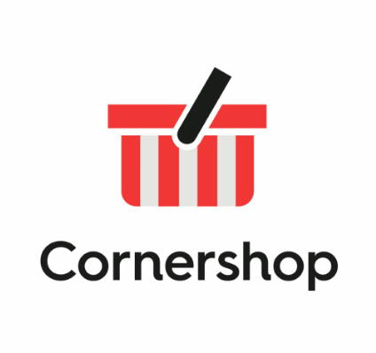

> It was an early morning yesterday\
> I was up before the dawn\
> And I really have enjoyed my stay\
> But I must be moving on\
> -- "Good by Stranger", Supertramp

El viernes fue mi último día de trabajo en Previred, fueron doce años, así que fui parte de esa organización más de la mitad de su vida. 

Nunca había estado tanto tiempo en un trabajo. Pasaron los años tan rápido y estaba tan entretenido en lo que hacía que no me di cuenta.

Consideren que este blog tiene poco más de quince años, así que gran parte de las reflexiones que he escrito en este espacio han estado en el contexto de mi trabajo en Previred.

Un resumen de mi experiencia la conté en los últimos artículo de la serie que llamé ["El fin de la agilidad"](/blog/lnds/2019/03/17/el-fin-de-la-agilidad/). 

> Like a king without a castle\
> Like a queen without a throne\
> I'm an early morning lover\
> And I must be moving on\

Tomar una decisión así no es fácil. Después de todo en estos doce años de trabajo, formé equipos, ayude a mejorar procesos, a implantar prácticas de desarrollo, incluso tuve que fusionar equipos que venían de distintos estilos de trabajo. Tuve mucha libertad durante bastante tiempo para realizar innovaciones y me acompañaron grandes profesionales. Logramos cambios asombrosos y casi insospechados.

Pero quienes me conocen saben que soy muy inquieto en términos intelectuales y profesionales.

> Now I believe in what you say\
> Is the undisputed truth\
> But I have to have things my own way\
> To keep me in my youth

Todo tiene su límite o su fin. Llegan los momentos en que ya no sientes la misma armonía ni las motivaciones que sentías. Las organizaciones mutan, evolucionan, no siempre en corcondancia con tus ideas individuales.

Alguien escribió que las corporaciones son seres vivos con conciencia propia. Mal que mal en nuestra legislación las dotamos de personalidad. Son organismos cuya mente colectiva sigue ciertas directrices y  esas directrices cambian.

En los últimos dos años me senti desgastado, cansado y a veces aburrido. Pero no se trata de que se haya convertido en un lugar desagradable para trabajar. Nunca diré eso de Previred. Tampoco es que haya estado exento de problemas y disputas, creo que ese aspecto está todo dentro de lo normal de cualquier organización humana. 

Sólo ocurre que llega un momento en que no te sientes alineado con el resto de la dirección de la organización.

Es ahí cuando empiezas a quejarte, y les he contado antes lo que opino [sobre quejarse](/blog/lnds/2012/03/15/filoctetes/). La organización tiene su verdad, y yo tengo la mia, y como dice SuperTramp, tengo que hacer las cosas a mi modo, para mantener mi juventud.

>Like a ship without an anchor\
>Like a slave without a chain\
>Just the thought of those sweet ladies\
>Sends a shiver through my veins

A veces sin proponertelo la solución se presenta a tu puerta, como una generosa oferta. Como un lindo desafío. Una jornada de ricas aventuras, de nuevos derroteros. Quieres ser parte de algo grandioso, algo que admires. Algo nuevo por descubrir, porque ya trazaste el mapa de un territorio totalmente explorado.

Quieres abrirte camino como esos exploradores portugueses del siglo XVI, que se aventuraban a abrir nuevas cartografías de territorios desconocidos y míticos. Quieres ir en busca del unicornio o la mítica quimera.

> And I will go on shining\
> Shining like brand new\
> I'll never look behind me\
> My troubles will be few

Así que hace unas semanas atrás tuve una conversación muy relevante para el resto de mi vida profesional. Partió con un mensaje directo, a uno de los grandes ingenieros de software chileno, Osvaldo Mena. Esas conversaciones decantaron en la decisión de integrarme a sus filas, en "la hermosa travesía de entregar paltas".

Así es, me uno al equipo de Cornershop.

> Sweet devotion (Goodbye, Mary)\
> It's not for me (Goodbye, Jane)\
> Just give me motion (Will we ever)\
> To set me free (Meet again)\
> In the land and the ocean (Feel no sorrow)\
> Far away (Feel no shame)\
> It's the life I've chosen (Come tomorrow)\
> Every day (Feel no pain)

Hoy necesito rejuvenecer. Desafiarme. Encontrar una nueva playa donde plantar mi bandera, donde quemar mis naves, tomar mis pertrechos y adentrarme a explorar.

Estaré en nuevos desafíos muy interesantes, seguro que les contaré sobre esto. Me uno a un gran equipo y a un gran proyecto. Estoy feliz, me siento libre y motivado. Espero estar a la altura.

> Goodbye, stranger, it's been nice\
> Hope you find your paradise\
> Tried to see your point of view\
> Hope your dreams will all come true\
>
> Go and believe it\
> I've got to go

