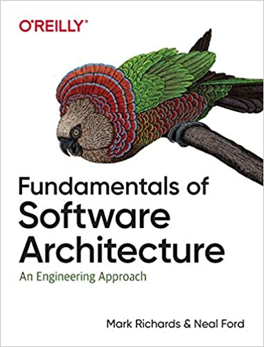
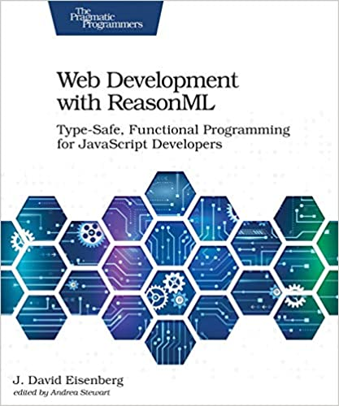

Leer es muy importante para mi. Leo mucho y sobre distintas cosas. También como muchos lectores compro libros que quedan ahí almacenados acumulando polvo, o ocupando espacio en mi kindle. Desde hace años uso el servicio [Good Reads](https://www.goodreads.com) para llevar un seguimiento de los libros que leo, y aprovecho de calificarlos, pero soy muy malo para escribir reseñas de los mismos, algo que debería hacer pues es la idea de esa aplicación, que también funciona como red social.

Por otro lado quiero mantener la disciplina de escribir, y las reseñas son un buen ejercicio. Así que mataré dos pájaros de un tiro, escribiré las reseñas acá, para quienes no tienen acceso a [Good Reads](https://www.goodreads.com), y luego trataré de copiarlas allá. Esto también me permite tener una ayuda memoria de esos libros y quizás pueda aportar información a quienes busquen algo para leer. 

Así empezaré una nueva sección en este blog con un post mensual, en que incluiré los libros que haya leido en el periodo. Como enero ya pasó incluiré esta vez los de enero y febrero. 

# Enero 2021

- ["Escuadrón"](https://amzn.to/37W4Zf4), de Brandon Sanderson (Skyward en inglés), ciencia ficción militar. Una pieza entretenida y liviana. Sigue el esquema clasico del sub género. Los humanos se encuentran confinados en un planeta y apenas sobreviven. Pero deben defenderse de extra terrestres que bombardean el planeta con cierta periodicidad. La protagonista, Spensa, es una joven adolescente,  hija de un piloto que fue abatido por sus propios compañeros, y lleva el estigma de ser hija de un cobarde, y por esto se le niega la posibilidad de entrar a la academia de pilotos, algo que ella quiere a toda costa. Por supuesto logra superar esos obstáculoy logra entrar a la academia, no lo pasa bien, pero descubre algo muy especial y termina salvando el día al final del día. Sanderson escribe muy bien, es un autor famoso por sus sagas de fantasía, y la creación del universo Cosmere. Este libro tiene mucho de guiño a Robert Heinlein y algo a Orson Scott Card. Es entretenido, ágil, ligero, pero no está a su mejor nivel. Igual logra engancharte al final con un buen clif hanger para que leas la continuación.

- ["Estelar"](https://amzn.to/3szfAEo), de Brandon Sanderson (Starsight en inglés), la continuación de Escuadrón. Acá salimos del mundo de la anterior novela y la protagonista espía a los extra terrestres que mantienen a los humanos sometidos en el planeta Detritus. Entendemos el por qué el resto del universo teme a los humanos, y aparecen otros misterios. La protagonista con una ayuda de personajes bien especiales resuelve estos misterios y lucha por detener esta guerra. Casi lo logra, pero nuevamente tenemos un buen enganche para la tercera parte de la saga, que por desgracia no ha salido aún. Está mejor que la primera parte, aunque repite el esquema de academia del espacio, pero muestra gran imaginación en la concepción de algunas razas extra terrestres. Así que quedé esperando a la tercera parte que sale este año. (Sanderson mantiene informado a sus fans de sus proyectos en su sitio web: https://www.brandonsanderson.com, lo que se agradece). 

- ["Fake news de la antigua Roma: Engaños, propaganda y mentiras de hace 2000 años"](https://amzn.to/3r0xboB), Nestor F. Marqués González. Histiria antgua. Llegué a este libro por un hilo en twitter. Esperaba algo más liviano, pero se nota el estilo académico del autor, que insiste en colocar largos párrafos en latín (con su traducción, por supuesto). De todas maneras aporta al cuestionar y aclarar varios asuntos sobre los romanos o sus emperadores que no son ciertos, sino que frutos de mal entendidos posteriores, o de frentón fake news creadas por sus enemigos (como los cristianos). Destaca el relato del verdadero rol de Nerón en el incendio de Roma, la verdadera historia de la conveersión de Constantino, algunos datos interesantes sobre Augusto y César. También expplica cómo los mitos sobre el origen de Roma servían a la propaganda política imperial. Critica a varios autores, sobre todo a Robert Graves, cuyos libros sobre Claudio quedan en duda tras este libro. Para el aficionado a la historia antigua puede que el libro sirva para revisar algunos hechos. En ese sentido este libro puede ser refrescante y apoyar el pensamiento crítico. Pero me habría gustado una presentación un poco más ligera. Me parece que si no eres un friki de la historia romana, como yo, dificilmente vas a terminar este libro.

- ["Fundamentals of Software Architecture: An Engineering Approach"](https://amzn.to/3r4X86c), Mark Richards. Muy buena guia para quienes quieren aprender de que se trata la disciplina de la arquitectura de software, y un buen refresco y actualización para quienes llevamos practicándola de manera más o menos oficiosa. Para mi ha sido un refresh necesario y la recomiendo porque da una buena guía para una seria de técnicas, patrones y métodos modernos para diseñar sistemas de información. Muy útil.

- ["Architecture Patterns with Python"](https://amzn.to/3bIOdAZ), Harry J.W. Percival & Bob Gregory. Un buen libro, pero no me satisface del todo. Creo que es un buen complemento a "Micro Services Patterns" de Chris Richardson (que leí el año pasado), pero enfocado en llevar estos patrones a Python, principalmente Flask. Super técnico, con ejemplos en código, es una buena guía, pero no siento que me haya aportado nada nuevo, salvo el entender como aplicar ciertas cosas de Java a Python, lo que me será muy útil en mi trabajo actual. A propósito, una de las cosas que me agradan de mi nuevo trabajo es que tenemos acceso completo a estos libros de O'Reilly en forma digital, lo que pienso aprovechar muy bien.

# Febrero 2021

- ["La Vieja Guardia"](https://amzn.to/3bOygZY), John Scalzi. Ciencia ficción militar, otra vez. Pero con un giro. Acá los soldados son reclutados entre los mayores de 75 años de la Tierra, para ser parte de la Fuerzas de Defensa Coloniales. Es la primera de una saga famosa de Scalzi. De este autor he leido antes Red Shirts, una novela parodia a Star Trek, muy recomendable (aunque no tan graciosa como anuncian). Pero esta novela me gustó, mucho más que Escuadrón. Así que en la cola de libros están las que le siguen. El autor tiene un estilo muy dinámico, y seguro que estas novelas terminarán en una película o serie de TV en Netflix o Amazon. 

- ["Agujeros negros y tiempo curvo: El escandaloso legado de Einstein"](https://amzn.to/3dQL4lt), Kip S. Thorne. Este científico tuvo notoriedad pública  hace unos años por asesorar a Christopher Nolan en la película Interestellar. Thorne tiene el premio Nobel por su contribución en la construcción del detector de ondas gravitacionales LIGO. El libro es de 1994, así que a esas alturas LIGO era un proyecto en sus primeras etapas y se estaba más de 20 años de la primera fotografía a un agujero negro, pero es batante entretenido. Me salté varias secciones más técnicas y profundizaciones, ocurre que en mi época de estudiante tuve que leer el libro de Stephen Hawking "La historia del tiempo", para salvar el curso de física moderna, así que este libro no me aporta cosas especialmente nuevas sobre estos temas, y tampoco es que fuera  a entenderlas :p. Me interesaron más las anécdotas y la pequeña historia, como el desaire de Eddington a Chandrasekhar (¿habría algo de racismo?), las curiosas apuestas entre Thorne y Hawking, o las aventuras con los científicos rusos en plena guerra fría. Curioso que el proyecto LIGO, aunque sale mencionado, no destaca tanto en este libro, siendo que fue por lo que terminó recibiendo el Nobel. Llegué a este libro por [esta recomendación](https://www.youtube.com/watch?v=NT3BqfQd7cU) del científico y YouTuber Javier Santaolalla. El libro es bueno, pero me gustaría leer algo más moderno sobre el tema, en particular sobre la historia tras la famosa fotografía de 2019, así que si algún lector de este post tiene un dato, se lo agradeceré.

- ["Web Development with ReasonML: TypeSafe Functional Programming for JavaScript Developers"](https://amzn.to/3uGeVTt), J David Eisenberg. Me costó terminar este libro, lo empecé el año pasado y recién lo terminé este año. Es que es denso, y aunque OCaml es un lenguaje de programación hermoso, debo reconocer que la programación front no es lo que más me atrae. Tampoco el enfoque de este libro, que es aburrido como manual, en realidad es eso, un manual detallado. Los que no son nerds dirán que peude tener de entretenido un libro sobre un lenguaje de programación, pero sí se puede. Hay libros notables como los de Kernighan o el "Learn you a haskell". No lo recomiendo, aunque sí recomiendo investigar sobre ReasonML.

Y esta es la primera lista, a fines de marzo agregaremos más libros leidos con sus breves reseñas. Si tienen recomendaciones de lecturas, son bienvenidas.

Aprovecho de comentarles que estoy escribiendo un nuevo libro técnico y que ya pueden empezar a leer porque es una serie que estoy publicando en mi blog ["La Sombra de Dijkstra"](https://www.programando.org), se trata de ["El Camino del Backend Developer"](https://www.programando.org/category/backend-developer/), los invito a leerlo.