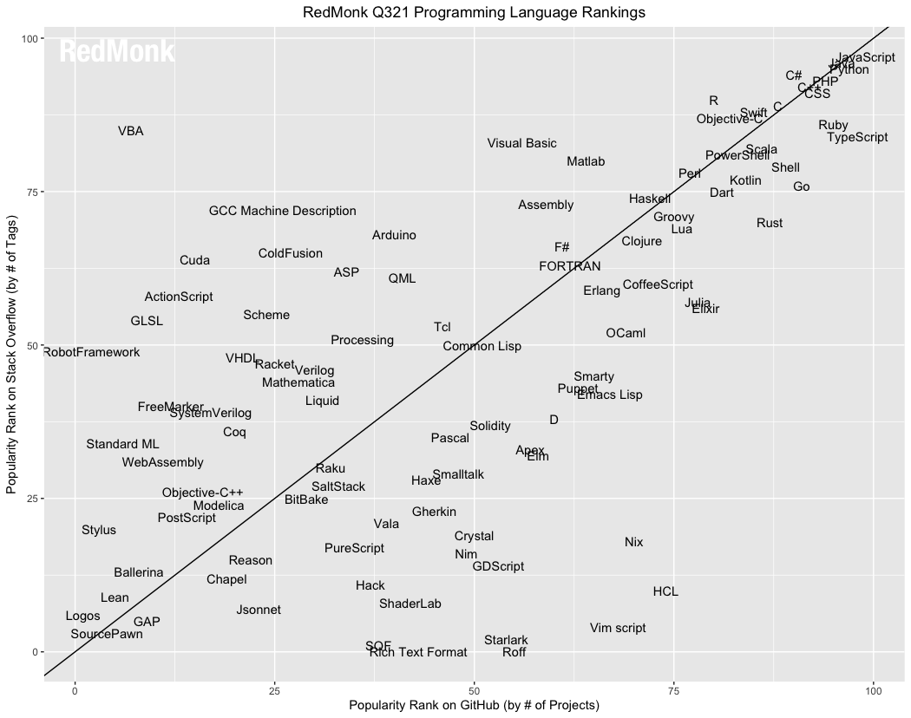

Recientemente encontré este tweet:



> (JavaScript is difficult to learn but easy to master.
> Python is easy to learn but difficult to master)

Y en cierta medida es bastante cierto. Al menos en lo que respecta a Python.

Resulta que Python tiene una sintaxis muy sencilla y se puede aprender en pocas horas, pero hay montones de detalles que se van aprendiendo a lo largo de los años. 

## Familias de lenguajes

Un lenguaje no sólo comprende su gramática y sintaxis, sino que comprende elementos como la semántica de cada sentencia, el modelo de memoria, el modo en que se ejecuta, el tipo de paradigma que implementa, etc.

Hay personas que creen que todos los lenguajes se parecen, lo que no es cierto, por supuesto. Aunque hayan similaridades, estas se deben a la evolución de los lenguajes. 

Existen varias familias de lenguajes, por ejemplo, la [Familia ALGOL](https://en.wikipedia.org/wiki/Generational_list_of_programming_languages#ALGOL_based), de la cuál derivaron importantes lenguajes como [Pascal](https://en.wikipedia.org/wiki/Pascal_(programming_language)), [Modula](https://www.modula2.org), [Oberon](http://www.projectoberon.com), [Simula](http://www.simula67.info) y desde estos [C](https://www.iso.org/standard/74528.html), que formó su propia familia que incluye a [C++](https://isocpp.org), [C#](https://docs.microsoft.com/en-us/dotnet/csharp/), [Java](http://oracle.com/java/), [Rust](https://www.rust-lang.org) y [Python](https://www.python.org), entre muchos otros.

Por otro lado la [Familia Simula](https://en.wikipedia.org/wiki/Generational_list_of_programming_languages#Simula_based) es la raiz de muchos de los lenguajes orientados a objeto, desde Smalltalk hasta Ruby. Y a esta familia pertenece [Objective C](https://developer.apple.com/library/archive/documentation/Cocoa/Conceptual/ProgrammingWithObjectiveC/Introduction/Introduction.html) y [Swift](https://swift.org), los lenguajes usados en los sistemas operativos de Apple.

Otra familia importante es [LISP](https://en.wikipedia.org/wiki/Generational_list_of_programming_languages#Lisp_based), una de las más antiguas y nobles, cuyos descendientes llegan hasta [Racket](https://racket-lang.org) y [Clojure](https://clojure.org), pasando por el destacado [Scheme](http://www.scheme-reports.org).

Otra familia funcional es [ML](https://en.wikipedia.org/wiki/Generational_list_of_programming_languages#ML_based), y entre sus herederos encontramos a [OCaml](https://ocaml.org), [Haskell](https://www.haskell.org) y también [Rust](https://www.rust-lang.org).

Pero hay cruces entre familias, por ejemplo, [Scala](http://www.scala-lang.org) tiene raices en la familia ML y en la familia ALGOL (a través de Java). O [JavaScript](https://www.ecma-international.org/publications-and-standards/standards/ecma-262/) que tiene ancestros en SmallTalk a través de [Self](https://selflanguage.org), y por supuesto de ALGOL a través de C.

Wikipedia tiene una lista bastante extensa de la genealogía de varios lenguajes de programación: https://en.wikipedia.org/wiki/Generational_list_of_programming_languages

Aunque no lo parezca, conocer esta genealogía resulta bastante útil. Si lo tuyo son los lenguajes funcionales, puedes elegir entre la familia LISP o la familia ML, y la gran diferencia estará dada por la sintaxis. Notarás que Elixir tiene una sintaxis muy distinta a Clojure, pero puedes abordar los problemas de la misma forma, siguiendo el paradigma funcional.

Por otro lado, notarás que JavaScript y Java comparten cierta sintaxis similar, esto porque tienen la misma raiz, que proviene de la influencia de C++, pero son lenguajes cuyo modelo de implementación del paradigma orientado al objeto es bastante distinto. Porque JavaScript tiene la influencia de Self y Scheme.

Así que no basta con conocer la sintaxis, son esos detalles adicionales los que te ayudarán a lograr la maestría en estos lenguajes.

## ¿Qué lenguajes aprender?

La popularidad de un lenguaje es importante si quieres dedicarte profesionalmente a programar en algún lenguaje. Debes evaluar qué es lo que usa el mercado, en Chile, por ejemplo, hay mucho uso de Java, JavaScript, C# en los ambientes corporativos, y en las startups es fuerte el uso de Python, JavaScript, Ruby y PHP.

Si quieres ir a la segura, JavaScript es una buena alternativa, con eso cubres el mundo front y backend.

Si te interesa el mundo de la ciencia de datos, considera que más importante que el lenguaje de programación, es el dominio de las matemáticas, en particular de la estadística. Pero de todas maneras en este dominio SQL, Python y R son importantes.

La mayoría de los programadores no se moverán más allá de los lenguajes mencionados. Pero en mi opinión vale la pena aprender otros lenguajes porque estos te pueden ayudar a mejorar como programador.

## Rankings de Lenguajes

De todas maneras, para tratar de responder esta pregunta, existen varios sitios que intentan crear un ranking de los lenguajes de programación. .

### TIOBE

El TIOBE INDEX: https://www.tiobe.com/tiobe-index/ puede ser uno de los rankings más conocidos.

Para el año 2021 coloca estos lenguajes en los top 10:

1. C
2. Python
3. Java
4. C++
5. C#
6. Visual Basic
7. JavaScript
8. PHP
9. Assembly Language
10. SQL

El problema con este índice es que se basa principalmente en búsquedas en sitios como Google, Bing, Yahoo!, Wikipedia, Amazon, YouTube y Baidu.

C es un lenguaje que muy pocos programadores usan comparados con JavaScript y PHP, entonces ¿por qué está en primer lugar? Probablemente porque dominarlo requiere más consultas. Del mismo modo, parece muy rara la aparición de Visual Basic y Assembly.

### RedMonk

Redmonk usa una metodología más completa que TIOBE, hace un análisis de repositorios en GitHub y preguntas en StackOverflow.

La metodología de Redmonk se describe en el informe anual: https://redmonk.com/sogrady/2021/08/05/language-rankings-6-21/

Para el año 2021 los top 10 son:

1. JavaScript
2. Python
2. Java
4. PHP
5. CSS
5. C++
5. C#
8. TypeScript
9. Ruby
10. C
11. Swift

Notarán el problema de incluir CSS como un lenguaje de programación, por eso que he incluido a Swift en la lista.

### StackOverflow

El sitio StackOverflow realiza una encuesta que analiza diversos aspectos de los desarrolladores que usan este servicio. Desde la demografía hasta los sueldos. Esta encuesta es muy interesante y la puedes leer en detalle acá: https://insights.stackoverflow.com/survey/2021.

No hay un ranking de lenguajes como tal, pero preguntan por las tecnologías más usadas y si filtramos por lenguajes de programación tenemos:

1. JavaScript
2. Python
3. SQL
4. Java
5. TypeScript
6. C#
7. C++
8. PHP
9. C
10. Go

## Cómo aprender y practicar un nuevo lenguaje 

Ya sea porque quieres abrirte oportunidades en un nuevo mercado, o porque quieres mejorar y lograr la maestría en algún lenguaje, hay varios sitios que te permiten practicar a través de la resolución de ejercicios. Te voy a recomendar algunos a continuación:

### EulerProject

Web: https://projecteuler.net

Este es el sitio más sencillo de todos los que te voy a mostrar. Acá la idea es resolver un desafío usando cualquier lenguaje de programación. Normalmente lo que debes hacer es responder una pregunta, a veces esta respuesta es un simple número, pero para llegar a determinarlo deberás implementar algún algoritmo.

- Ayuda/Comunidad: sólo después de resolver un ejercicio se te revelan los conceptos detrás del desafío. Hay foros para dicutir cada desafío que puedes consultar después.
- Lenguajes: cualquiera, porque no importa como determinas la respuesta, aunque es usual publicar el código con la solución en los foros.
- Para qué sirve: para desafiar tu comprensión de algoritmos, mejorar en habilidades matemáticas, si te gusta resolver puzles lógicos o matemáticos

### CodeWars

Web: https://www.codewars.com

Este sitio tiene una interfaz más completa. De hecho entrega un IDE online y tiene un sistema de ranking basado en el ranking que se usa en el juego de Go. Presenta diversos desafíos y al resolverlo vas ganando "honor" y mejorando en tu ranking.

- Ayuda/Comunidad: Tiene un modo de entrenamiento, y también un foro por cada desafío. Implementa desafíos y "katas", y puedes ver el nivel de dificultad antes de abordarlo. Puedes ver soluciones de otras personas antes de publicar la tuya, pero si haces eso no agrega puntajes a tu perfil.
- Lenguajes: la lista es de alrededor de 45 lenguajes. 
- Para qué sirve: mejorar el dominio de un lenguaje. Mejorar en resolución de algoritmos. Prepararte para una entrevista técnica.
- Características adicionales: sistema de ranking. Tu defines al registrarte tu nivel de experiencia, que va desde aprendiz hasta senior. El sitio es propiedad de [Qualified](https://www.qualified.io/) que provee servicios a Empresas y a Educadores. Así que participar en este sitio puedes ser contactados por reclutadores a los que ellos ofrecen servicios.

### Exercism

Web: https://exercism.org/

Este sitio lanzó su versión 3 el 1 de septiembre de este año. Es un sitio muy orientado a enseñar los detalles de cada lenguaje a través de ejercicios sencillos, pero que pueden ser bastante reveladores. Es mi sitio favorito para practicar.

- Ámbito: aprender a programar, aprender nuevos lenguajes, dominar un lenguaje
- Ayuda/Comunidad: Tiene dos modos: aprendizaje o entrenamiento. En el modo de aprendizaje puedes solicitar la ayuda de un mentor. Puedes iterar varias veces tu solución. Después de enviar tu primera iteración de la solución puedes revisar las soluciones de la comunidad, lo que te permite mejorar aprendiendo de otros.
- Para qué sirve: para aprender desde cero. Dominar las caracterísitcas propias del lenguaje. Aprender un nuevo lenguaje.
- Características adicionales: tiene un ranking donde vas obteniendo puntos por resolver ejercicios, o participar de diversas formas en la comunidad, ya sea como mentor, reportando o resolviendo errores, o ayudando a mejorar el sitio (que es opensource). También incluye insignias que se van revelando a medidad que participas en el sitio. También se puede donar al sitio para ayudar a soportar su operación.

Personalmente participo como mentor en los tracks de Clojure y Rust. Me gusta mucho este sitio por el sentido comunitario que tiene. Si quieres dedicar parte de tu tiempo a ayudar a otros a aprender a programar, o mejorar en sus habilidades, este sitio es una buena y positiva forma de hacerlo.

Hay más sitios, como [HackerRank](https://www.hackerrank.com/) por ejemplo, donde puedes participar en desafíos, e incluso en procesos formales de entrevistas. Si tienes algún sitio favorito te invito a que lo compartas comentando este post.
