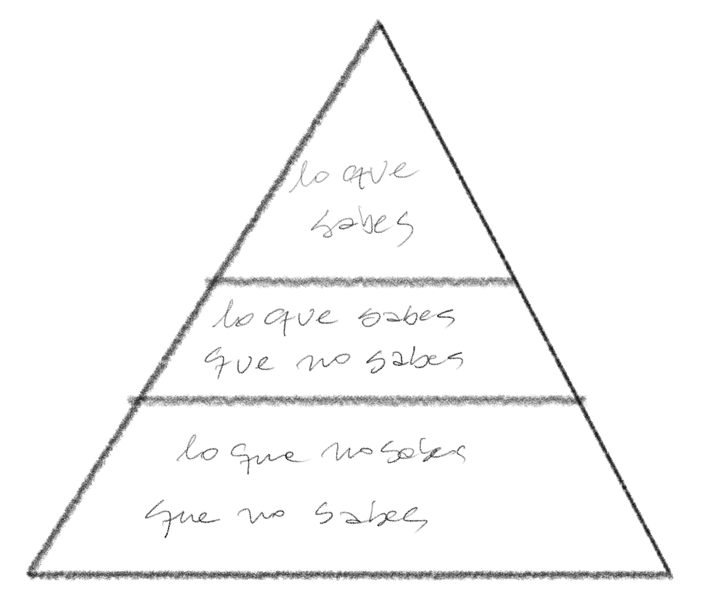

> As we know, There are known knowns.\
> There are things we know we know.\
> We also know\
> There are known unknowns.\
> That is to say\
> We know there are some things\
> We do not know.\
> But there are also unknown unknowns,\
> The ones we don\'t know\
> We don\'t know.
>
> Como sabemos, Hay conocimientos conocidos.\
> Hay cosas que sabemos que sabemos.\
> También sabemos\
> Que hay conocimientos desconocidos.\
> Es decir\
> Sabemos que hay cosas\
> Que no sabemos.\
> Pero hay también desconocidos desconocimientos,\
> Aquellos que no sabemos\
> Que no los sabemos
>
> -- [Donald Rumsfeld](http://www.slate.com/id/2081042/)

No sé si hubo alguna época gloriosa en que era posible saberlo todo sobre la computación, quizás algunos nobles padres fundadores de nuestra disciplina, como Turing o Von Neummann tuvieron ese privilegio, pero incluso así lo dudo.

En su charla de aceptación del Premio Turing de 1972, Dijkstra escribe:

> "Haremos un mejor trabajo de programación, siempre que abordemos la tarea con una plena apreciación de su tremenda dificultad, siempre que nos ciñamos a lenguajes de programación modestos y elegantes, siempre que respetemos las intrínsicas limitaciones de la mente humana y abordemos la tarea como unos *Muy Humildes Programadores*"[^1].

# La Pirámide del Conocimiento 

Imaginen que todo el conocimiento técnico del mundo se pudiera acumular en la siguiente pirámide:

Como individuos podemos seguir el consejo de Rumsfeld y clasificar nuestros conocimientos en tres categorías:

- **Cosas que sabes**: que incluyen a las tecnologías, frameworks, lenguajes y herramientas que usas en el día a día de tu trabajo. Por ejemplo, Python o JavaScript que son lenguajes que probablemente usas y conoces muy bien. Quizás [Django](https://www.djangoproject.com) o [React](https://reactjs.org).
- **Cosas que sabes que no sabes**: que corresponden a aquellas tecnologías de las que has oido pero de las que tienes poca o ninguna experiencia. Por ejemplo, puedes que hayas oido hablar de [Clojure](https://clojure.org), o [Elm](https://elm-lang.org), pero no has programado nunca en esos lenguajes. A lo mejor [Yew](https://yew.rs/docs/en/) o [Hoplon](https://hoplon.io).
- **Cosas que no sabemos que no sabemos**: que es la parte más amplia de la pirámide, que incluye todas esas tecnologías, frameworks y lenguajes que podrían ser la solución perfecta para el problema que quieres resolver, pero, por desgracia, no sabes que existen.

Pero más que desesperarnos este concepto nos sirve para dimensionar nuestra ignorancia, y por ende guiar nuestros esfuerzos e incluso el desarrollo de nuestra carrera profesional.

Cuando empezamos vamos recorriendo la punta de esta pirámide, profundizando conocimientos técnicos y de paso vislumbrando todo lo que nos falta por abordar. Vamos desarrollando experiencia y pericia. Sin embargo, esta punta de la pirámide, no sólo se convierte en las cosas que conoces y dominas, sino que también es todo ese conocimiento que debes mantener fresco. Porque "nada es estático en el mundo del software"[^2].

Esto nos lleva al siguiente diagrama, que describe nuestra amplitud y profundidad de conocimiento:

## El conocimiento por roles

Si somos **desarrolladores de software** nuestro objetivo, como programadores, es aumentar la profundidad de nuestro conocimiento. Pero si eres **arquitecto de software** notarás que cada vez te centras en tener una mayor amplitud de conocimientos, sin necesariamente aumentar en la profundidad técnica. 

La razón de esto es que el arquitecto de software debe tomar decisiones que tienen que asumir las capacidades y limitaciones técnicas de los recursos con que cuenta, para satisfacer nuevas necesidades que demanda el negocio. En este sentido una amplitud de conocimiento sobre la variedad de soluciones posibles es algo valioso, aunque eso signifique un sacrificio en el grado y pericia (o expertise) que se gana sobre algún tópico específico.

Muchos desarrolladores experimentan dificultades al momento de realizar una migración hacia el rol de arquitectos. Pues si bien como arquitecto tu visión se amplía, en cuanto al rango de soluciones que puedes proponer, fallas al tratar de lograr la maestría en cada una de las tecnologías que propones. 

Un arquitecto no puede ser experto en todas las tecnologías y por ende debe aceptar que en el detalle profundo es ignorante. Es por eso que mantiene un rol de acompañamiento con los que realmente se convierten en especialistas en cada área (el equipo de desarrollo). El arquitecto moderno no se desliga totalmente del proceso de desarrollo, pero no es parte esencial de la construcción, aunque recibe mucha retro alimentación de sus colegas programadores.

## ¿Full stack?

Por otro lado, esta pirámide nos ayuda a resolver una dilema que surge una y otra vez: ¿qué es un desarrollador full stack?

Tal como dije al principio de este artículo, no creo que haya habido un momento en que alguien tuviera todo el conocimiento técnico sobre computación. Es decir, no creo que el nivel de amplitud y profundidad haya llegado a ser total. Aunque el tamaño de la pirámide de seguro era más pequeño en otros tiempos.

Pero consideremos estudiemos un poco mejor qué sería un "full stack developer". 

Primero habría que definir es qué es el stack. ¿Se refiere al stack tecnológico? ¿O se refiere a las capas de la arquitectura? En este último caso, la alusión es hacia el conocimiento técnicos desde la capa de persistencia hasta el front. En el primer caso, hay tantos stacks tecnológicos como soluciones de software existen.
Así que el concepto es confuso. 

También se usa para describir a un desarrollador que tiene conocimiento de todo.
Pero como hemos visto, es imposible tener conocimiento de todo, o tienes un conocimiento muy amplio pero poco profundo, o muy profundo pero poco amplio, porque no tienes el tiempo suficiente para explorar la pirámide del conocimiento técnico con toda la dedicación que un puesto como este requeriría. 
Es decir, un Full Stack debería ser alguien que domina toda la pirámide del conocimiento, lo que me parece imposible.

Podrías ser full stack en un stack tecnológico específico, como LAMP, o un framework como Ruby on Rails o Django. O puedes dominar SQL, Java, Javascript, HTML, CSS y construir una aplicación web completa usando servlets. Pero hoy en día serías considerado un dinosaurio por hacer esto.

Por otro lado, es muy dificil que puedas dominar todas las tecnologías o ponerte al día en lo último en frameworks front reactivos. No digo que no podrías llegar a conocerlos, pero dominarlos, imposible.

Por ejemplo, yo tengo conocimientos generales que van desde el diseño con microprocesadores, hasta como operar un cluster Kubernetes, o desde construir una [CPU  usando sólo puertas NAND](https://www.programando.org/blog/2013/06/01/desafio-junio-codigo-de-maquina/) hasta configurar una aplicación cloud nativa usando la metodoogía de [los doce factores](https://12factor.net/). Pero aún así no podría llamarme un desarrollador full stack, porque si bien mi conocimiento es amplio, no es tan profundo. Por otro lado, este conocimiento amplio viene por el simple expediente de que llevo muchos años programando y estudiando diversas tecnologías, puesto que me he dedicado a la arquitectura más que al desarrollo de software, en mi vida profesional y ya soy bastante viejo. Eso de que el diablo sabe más por viejo que por diablo es muy cierto. Aún así sigo aprendiendo, y no tengo idea cuanto de esa pirámide he recorrido (esa es la terrible paradoja de los "unknowns unknowns").

Si dibujaramos esto de otra forma, tendríamos una gran T, donde la barra horizontal indica nuestra amplitud de conocimientos y la vertical nuestro nivel de especialización.
Cada uno de nosotros en su carrera ha recorrido esta pirámide de una forma distinta, formando su propia T, como si fueran túneles horadando una gran montaña de conocimiento. 

Yo digo que no existe el desarrollador Full Stack. Lo que existen son ingenieros y arquitectos que recorren esta gran montaña o pirámide del conocimiento técnico desde la superficie hasta las profundidades de nuestra ignorancia. O como diría Sting, con algo de resonancia con Dijkstra, somos humildes mineros y por lo tanto, "We work the black seam together..."



Que tengan un gran año nuevo...

[^1]: "The Humble Programmer", 1972 Turing Award Lecture, Edsger W. Dijkstra, EWD340 https://www.cs.utexas.edu/~EWD/transcriptions/EWD03xx/EWD340.html
[^2]: "Fundamentals of Software Architecture: An Engineering Approach",  Marck Richards & Neal Ford, capítulo 2, en el que está basado gran parte de este artículo.
