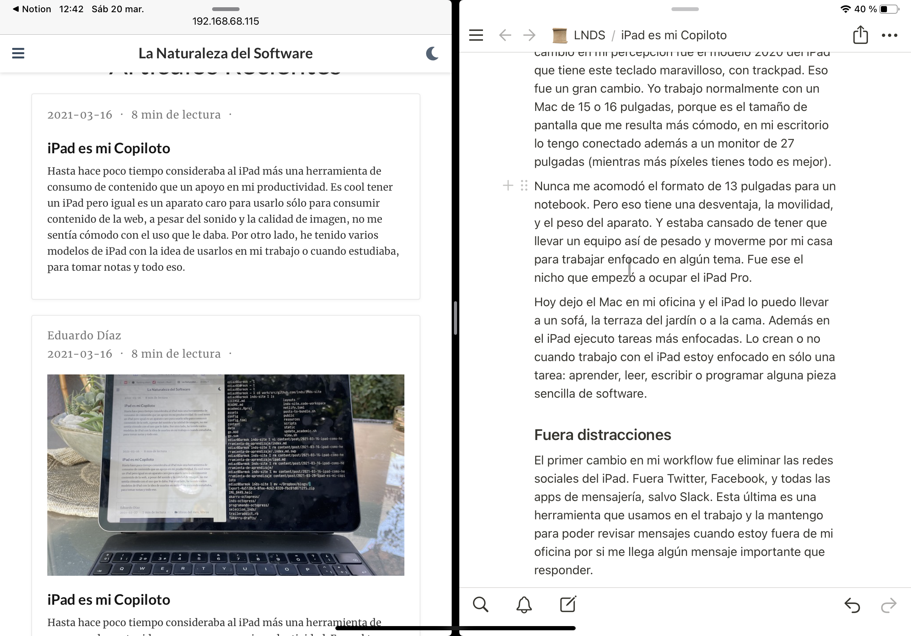
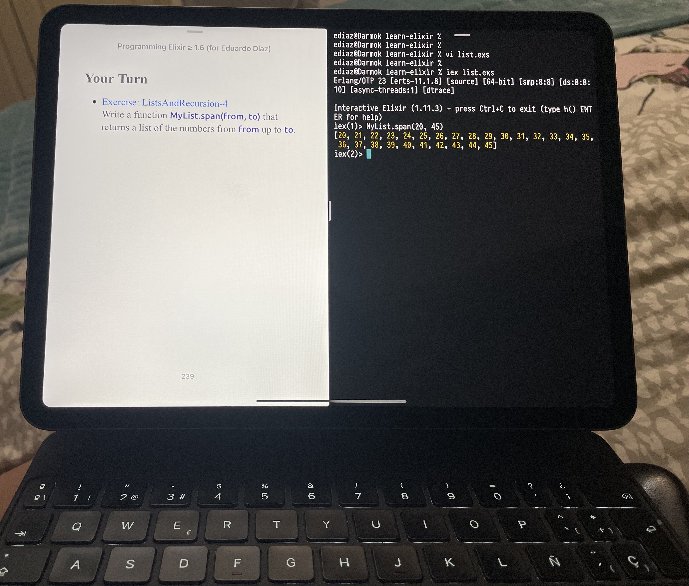
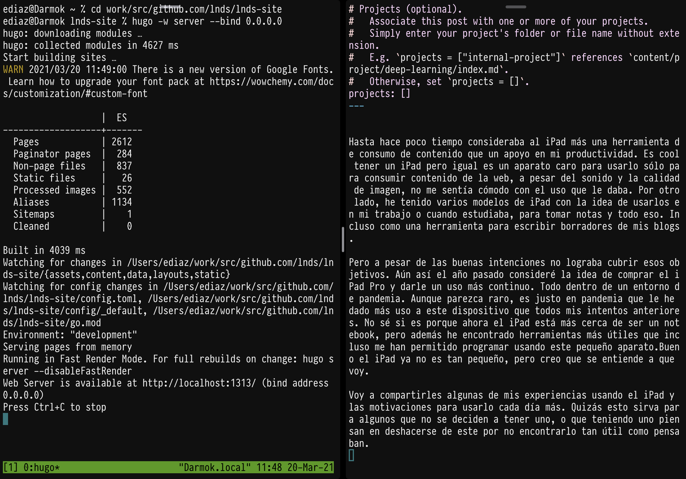
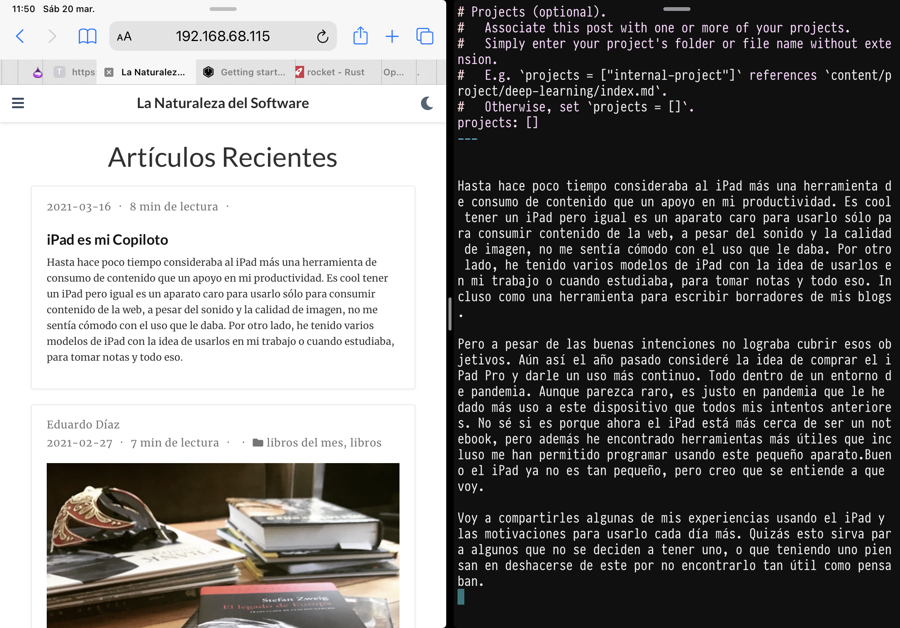

Hasta hace poco tiempo consideraba al iPad más una herramienta de consumo de contenido que un apoyo en mi productividad. Es cool tener un iPad pero igual es un aparato caro para usarlo sólo para consumir contenido de la web, a pesar del sonido y la calidad de imagen, no me sentía cómodo con el uso que le daba. Por otro lado, he tenido algunos modelos previos del iPad con la idea de usarlos en mi trabajo o cuando estudiaba, para tomar notas y todo eso. Incluso como una herramienta para escribir borradores de mis blogs.

Pero a pesar de las buenas intenciones no lograba cubrir esos objetivos. Aún así el año pasado consideré la idea de comprar el iPad Pro y darle un uso más continuo. Todo dentro de un entorno de pandemia. 

Aunque parezca raro, es justo en pandemia que le he dado más uso a este dispositivo que todos mis intentos anteriores. No sé si es porque ahora el iPad está más cerca de ser un notebook, pero además he encontrado herramientas más útiles que incluso me han permitido programar usando este pequeño aparato. Bueno, el iPad ya no es tan pequeño, pero creo que se entiende a que voy.

Voy a compartirles algunas de mis experiencias usando el iPad y las motivaciones para usarlo cada día más. Quizás esto sirva para algunos que no se deciden a tener uno, o que teniendo uno piensan en deshacerse de este por no encontrarlo tan útil como pensaban.

Una de las primera razones por las que sucedíó este cambio en mi percepción fue el modelo 2020 del iPad que tiene este teclado maravilloso, con trackpad. Eso fue un gran cambio. Yo trabajo normalmente con un Mac de 15 o 16 pulgadas, porque es el tamaño de pantalla que me resulta más cómodo, en mi escritorio lo tengo conectado además a un monitor de 27 pulgadas (porque mientras más píxeles tienes todo es mejor). 

Nunca me acomodó el formato de 13 pulgadas para un notebook. Pero ese formato tiene una ventaja, la movilidad, y el peso del aparato. Y estaba cansado de tener que llevar un equipo así de pesado y moverme por mi casa para trabajar enfocado en algún tema. Fue ese el nicho que empezó a ocupar el iPad Pro.

Hoy dejo el Mac en mi oficina y el iPad lo puedo llevar a un sofá, la terraza del jardín o a la cama. Además en el iPad ejecuto tareas más enfocadas. 

## Fuera distracciones

El primer cambio en mi workflow fue eliminar las redes sociales del iPad. Fuera Twitter, Facebook, y todas las apps de mensajería, salvo Slack. Esta última es una herramienta que usamos en el trabajo y la mantengo para poder revisar  si me llega algún mensaje importante que responder.

No eliminé Netflix ni YouTube, ni otras apps de streaming, porque el iPad tiene una pantalla y unos parlantes espectaculares y a veces veo contenido en este, y porque sigo manteniendo esa función para distraerme en mi tiempo libre. Tampoco tengo juegos. La mayor parte del software instalado son herramientas de productividad.

## Foco

En el iPad sólo tienes una app activa a la vez, y si bien hay multi tasking este no resulta práctico más allá de tener dos apps visibles en pantalla dividida. Y eso no es malo, al contrario, es el secreto que te permite usar el iPad como una herramienta para enfocarte en una tarea.

Qué cosas hago en el iPad?

- Escribir, ideas y notas tanto para el trabajo como para mis blogs
- Investigar, navegando en internet o revisando libros
- Leer y estudiar, libros o blogs, aprender sobre nuevas tecnologías o tendencias
- Programar, accediendo en forma remota a mis PC[^1] o a algún servidor en la nube.

## Herramientas Que uso

### Notas

Para tomar notas uso la app de Apple que viene pre instalada, y [Notion](https://www.notion.so/). Esta es una herramienta que usamos mucho en el trabajo, pero es muy buena para organizar tus ideas y sobretodo para organizar investigación o preparar posts para mi blog (como este).

La herramienta pre instalada de Apple permite dibujar y tiene un mecanismo que corrige las figuras geométricas lo que es muy útil para alguien que dibuja tan mal como yo. Como hago clases he usado un par de veces la posibilidad que te da Zoom de conectar el iPad, para usarlo como si fuera una pizarra en clases remotas.

### Lectura

Aparte de la Kindle App y Books de Apple, uso una herramienta muy útil para mejorar mi experiencia de lectura. Se trata de [ReadWise](https://readwise.io[]) que te permite organizar las notas o cuando subrayas textos en tu Kindle on las apps de lectura. También tengo instalada la app de  O’ Reilly pues ahora tengo acceso a su servicio online gracias a mi trabajo.

### Programar y aprender nuevas tecnologías

Esta es la parte más interesante. He usado el iPad para aprender nuevos lenguajes, frameworks o tecnologías. Un workflow típico es tener la pantalla dividida como muestro en la imagen. En el lado izquierdo tengo el libro o página web que estoy estudiando y en el lado derecho abro la aplicación Blink.

[Blink](https://blink.sh) es una shell, terminal y cliente ssh que nos permite acceder a cualquier servidor. Tengo mis PCs abiertos de modo que puedo acceder a ellos via SSH o MOSH. Como estoy en la casa prefiero usar SSH porque la latencia es insignificante y mantener las cosas simples. Para servidores remotos a veces instalo [MOSH](https://mosh.org).

¿Qué MOSH?

Es un protocolo que mejora la experiencia de conexión remota por sobre lo que te da SSH. Les dejo un video que introduce este protocolo y lo recomiendo si están moviéndose mucho con su iPad o si quieren acceder a servidores remotos. Este video explica de qué se trata:



Cuando uso Blink en el host al que me conecto tengo VIM y TMUX que son herramientas que permiten trabajar con tranquilidad de forma remota. He aprendido a re apreciar VIM, que como saben [es uno de mis editores favoritos](https://lnds.net/blog/lnds/2012/04/05/el-mejor-editor-de-texto-de-todo-el-mundo-mundial/).

Otro utilitario que uso es [Mocha WOL](https://apps.apple.com/es/app/mocha-wol/id422625778), una aplicación simple que sirve para “despertar” a algún PC cuando está inactivo. 

Si usas MacOS debes habilitar el acceso remoto a los mismos y asegurar que los filtros de firewall no bloqueen puertos importantes. Es fácil, por ejemplo si levantas una aplicación Dango debes asegurarte el binding al address 0.0.0.0. En ese momento MacOS te preguntará si quieres recibir conexiones entrantes, aceptas y a partir de ese momento quedará configurada una regla para que puedas acceder a tu sitio desde tu iPad. Por supuesto debes saber la IP del servidor o PC al que accedes. Muchos routers tienen la posibilidad de dejar fija la IP de los dispositivos, así que es algo que es bueno considerar para facilitarte la vida. Blink mantiene una lista de los servidores comunes a los que accede así que ahí puedes aprovechar de colocar las IP de los PC locales a los que accederás.

### Blogging

Uso [Hugo](https://gohugo.io) para publicar los blogs que mantengo tengo habilitada esa aplicación y el puerto que este ocupa cuando pruebas. Y este es el flujo de trabajo más complicado cuando uso el iPad (yo diría que más que programar).

Mi workflow para bloguear desde el iPad sería así:

- Escribo el borrador en Notion, normalmente de una tirada, o a lo largo de varios días. Mantengo un área en Notion específica para blogging.
- Dejo reposar el texto en Notion, por uno varios días.
- Cuando estoy listo para publicar vuelvo al texto, lo leo de nuevo, lo edito, elimino cosas, corrijo redacción y ortografía
- Exporto el texto a Markdown
- Inicio una sesión ssh a mi PC donde levanto Hugo y copio el contenido en la carpeta que corresponde[^2] y reviso en el browser el contenido. La imagen de abajo muestra como se ve.
- Los últimos toques los hago en Blink usando Vim. Si son muy extensos vuelvo a Notion (porque ahí puedo revisar mejor la ortografía) y repito. Estos últimos toques son detalles menores y cosas como agregar los tags y categorías. Para mi Notion es el borrador, el texto en producción queda en GitHub.
- Acá viene lo más complicado que es la incorporación de imágenes. Blink tiene varios bugs con scp y termino con complicados malabares para mover imágenes hacia el PC donde tengo los fuentes de mi blog.
- Hago commit y push del texto a la rama principal del repo en GItHub del blog.
- Tengo configurado [Netlify](https://www.netlify.com) como mi servicio de publicación. En este mediante un proceso automatizado las páginas son convertidas a HTML estático y ustedes pueden leerlo.

No les voy a mentir, esto lo hago pocas veces. Lo que realmente aplico es escribir en Notion y terminar de preparar el post en mi PC, porque es mucho más rápido y sencillo. Pero les conté cómo se puede hacer si usas una herramienta como Hugo y no quieres abandonar el iPad.

Este workflow de blogging puede resultar excesivamente complicado para el 99.9% de las personas que quieren publicar su blog, pero si les gusta este tipo de contenido, entonces les contaré más adelante cómo pueden bloguear de mil formas más sencillas que la descrita recién. 

Usar Hugo me acomoda y agrada, además que es una forma más hacker de bloguear y eso es cool 😎. Pero no es para todos.

### Reflexiones y aprendizajes

La pandemia aparte de cambiar muchos de nuestros hábitos y costumbres, nos ha entregado a cambio más tiempo libre. Esto nos da la oportunidad de aprender nuevas cosas y para eso considero que una herramienta como el iPad es de gran ayuda.

Al eliminar aplicaciones que distraen, e instalar soluciones de productividad consigues un mayor foco en tus objetivos. Sumado al factor de movilidad. Hoy puedo trabajar o estudiar en la terraza de mi jardín, un sofá o incluso en la cama. El iPad permanece en el tope de mi velador mucho más tiempo del que solía estar. Es una gran herramienta para tomar apuntes rápidos. O guardar ideas para futuros post. Preparar clases, o leer con un café algún documento del trabajo. Creo que la clave está en que es una herramienta que te permite enfocarte aún más que en un PC. De este modo es como este versátil dispositivo se ha convertido en mi actual copiloto.

[^1]: Tengo 2 PCs, uno es el MacBook de 16 que me entregaron en el trabajo y un Mac Mini con Chop M1 que adquirí hace poco, del que probablemente hable en un futuro artículo

[^2]: Bloguear con Hugo puede ser mucho más fácil, hay varias herramientas útiles para hacer esto una experiencia más simple, pero me gusta usar este workflow porque es como programar.
