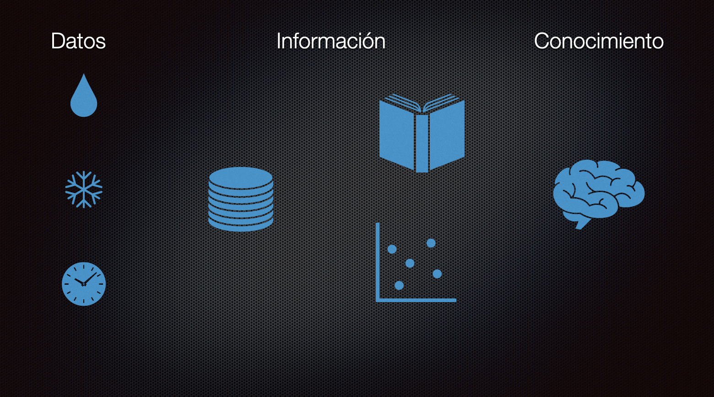
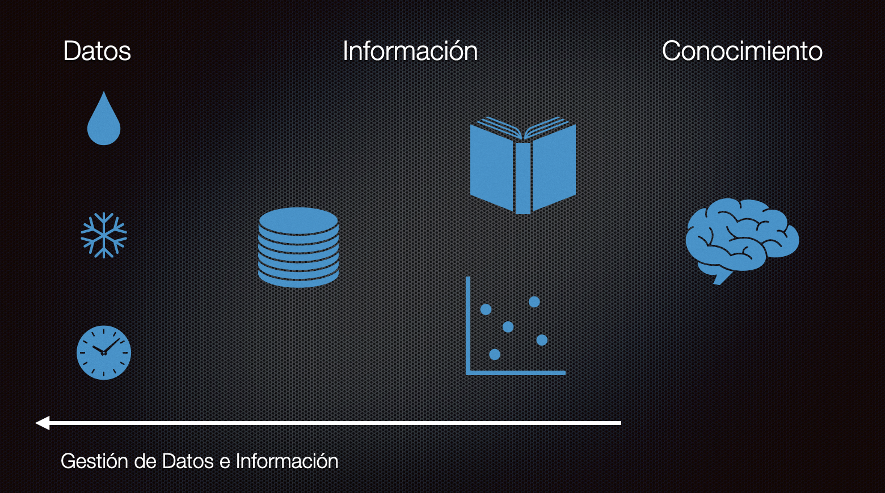

Hay una historia, probablemente apócrifa[^1], que dice que Federico II de Prusia advertido de las virtudes de la papa, el tubérculo traido desde América, ordena que sus súbditos las planten y se alimenten con estas. La gente obedece la orden de su emperador pero al comer las plantas enferman. Es entonces que el gobernante se da cuenta del error y decide ayudarlos explicándoles cómo se debía consumir correctamente la patata. 

Puede que la realidad fuera otra. El hecho es que había una hambruna y se consideraba que la papa era una forma de salvar a Europa de la inanición. Hay historias que dicen que Federico obligó a los campesinos a sembrarlas a riesgo de perder las orejas si no lo hacían.

También se dice que en Francia había reticencia de consumirlas y que un noble decidió plantarlas y colocar guardias armados para que vigilaran las plantas. Cuando consiguió mucha expectación retiró a los guardias y la gente se escabulló a los sembradíos, llevados por la curiosidad. Pronto se percataron de que lo que estaba sembrado era el tubérculo que tanto rechazaban. El razonamiento del pueblo fue que si las papas merecían este cuidado era porque debían ser algo bueno y sabroso, y así se popularizaron[^2].

Como sea, tenemos esta idea de que la papa salvó a Europa del hambre. Y puede que sea cierto. Pero no es el punto de este post. Quiero volver a la idea del emperador de Prusia dando la orden de que el pueblo siembre papas y se alimente con ellas.

Notarán que una orden así es muy imprecisa, y puede dar origen a que la gente se alimente mal, se pierda precioso alimento e incluso se enfermen. 

Pasa lo mismo cuando implantamos una política o queremos introducir una tecnología nueva. No basta con decir "implanten DevOps", por ejemplo. De alguna forma hay que introducir el conocimiento necesario al equipo y validar si este nuevo conocimiento tendrá alguna utilidad.

De este modo surge el problema de la gestión del conocimiento.

## Conocimiento e Información

Cuando se aborda la gestión de conocimiento muchos confunden conocimiento con información y planifican basados en distinciones inadecuadas. Cuando consideras que la gestión del conocimiento se trata sólo de dar acceso a la información eres como el emperador descuidado que simplemente reparte papas a su población.

¿Cuáles son las estrategias que se emprenden cuando se habla de gestión del conocimiento?

Una estrategia típica es: instalar una herramienta de gestión documental. Entonces las empresas instalan algo como Confluence (si son avanzadas), Notion o si son más tradicionales Sharepoint. Y con esto sólo han repartido papas.

Otros reflexionan sobre esto y deducen, acertádamente, que no sólo es adquirir herramientas, se trata de organizar su uso. Entonces establecen políticas y reglas editoriales. Estas herramientas se llenan de plantillas estándares y todos documentan siguiendo estas guías, todo se ve muy bien organizado y se puede acceder a la información relevante. Esto es mejor. Pero aún así siguen organizando información, no conocimiento.

Para entender sobre qué es realmente gestionar conocimiento vamos a recurrir a esta relación lógica:

    Información(Datos) + Conocimiento => Decisiones

En la figura de arriba he puesto los tres aspectos que debemos gestionar cuando gestionamos conocimiento.

Los datos son el estrato más bajo de lo que debemos gestionar. Los datos vienen del entorno, o son producidos por nuestras construcciones. La forma inicial que inventamos en informática para organizarlos son las bases de datos.

La información se obtiene del análisis de esos datos. Es un nivel superior, que incluso se puede empaquetar en algoritmos. La mayor parte de las organizaciones logran gestionar bien estas dos primeras capas:

Pero el conocimiento tiene que ver con saber qué hacer con la información. Y esta es la parte más dificil y pocas organizaciones logran dominar bien este estadio de desarrollo.

## El conocimiento está en las personas

Lo primero que debemos entender es que el conocimiento no se puede almacenar en sistemas de información, porque el conocimiento está en las personas. Entonces la gestión del conocimiento es también gestión de personas, y por lo tanto es parte de la labor de los líderes.

Pero, ¿para qué gestionar el conocimiento?

La respuesta tradicional es que es el conocimiento es la llave para la innovación. Alguien más ambicioso puede decir que "conocimiento es poder". Lo importante es  entender que no puedes pensar en términos egoistas cuando se trata del conocimiento, es es un grave error. El conocimiento adquiere más fuerza cuando es compartido. 

Hace unos años hablé sobre los conceptos de inteligencia potencial e inteligencia cinética (Ver ["Sobre la inteligencia del coyote"](https://lnds.net/blog/lnds/2012/04/17/sobre-la-inteligencia-del-coyote/)), este post es tributario de aquel, así que recomiendo leerlo. La diferencia es que acá les hablaré de cómo administrar eso que llamé inteligencia potencial en aquel post, y que en suma es el conocimiento.

## Gestión de conocimiento y desarrollo de software

Veamos que ocurre en muchas empresas. Cuando se gestiona el activo más importante que es el código fuente de las aplicaciones, ocurre esto:

Muchos creen que con tener el código en un repositorio Git compartido la gestión del código es completa. Eso es gestión de bajo nivel, o falta de gestión. Lo que es peor, aún en pleno siglo XXI hay empresas que ni siquiera tienen repositorios de código fuente distribuidos, ¡ni siquiera saben qué son los gestores de código!

Si no gestionas el conocimiento te encontrarás con cosas como esta:

Ese es un gran comentario, ¡incluso  tiene una métrica!

Si no te convences que la gestión de conocimiento es importante, entonces establece una métrica de cuánto te cuesta el on boarding, cuanto te cuesta en esfuerzo para avanzar en tus proyectos la falta de gestión del conocimiento.

## Las Técnicas de Dreydstadt

Déjenme contarles otra historia, o más bien volver a contarles esta historia[^3]:

En 1940 Alemania era el país lider en óptica, con fábricas como la de Carl Zeiss en Jena y Ernst Leitz en Wetzlar. No había nada mejor fuera de Alemania, y esto era crucial para desarrollar instrumentos ópticos usados, por ejemplo, en los bombardeos de precisión. 

Es por esto que el ejercito alemán consideraba a la óptica como uno de sus recursos estratégicos. Los militares alemanes creían que a los aliados les tomaría una generación preparar “artesanos ópticos” capaces de producir visores de bombardeo de alta calidad como los de ellos.

A principios de 1940 Estados Unidos contaba con un prototipo de visor de bombardeo de calidad, el “Norden”, desarrollado por el ingeniero holandés Carl Norden. Lo malo es que no contaban con una industria óptica que pemitiera producir los miles de visores necesarios para las necesidades de la guerra.

De acuerdo a Peter Drucker, en esa época el jefe de la división Cadillac de General Motors, Nicholas Dreystadt aceptó el contrato de defensa para la producción en serie del visor de bombardeo Norden. Todo el mundo sabía que esta labor requería de mecánicos con un alto grado de habilidad. Durante la guerra no había gente para emplear, menos mecánicos de alto nivel.

Estas son las palabras de Drucker en sus memorias:

> "La única mano de obra que se encontraba disponible en Detroit eran viejas prostitutas negras. 
> Ante el horror de todos Nick Dreystadt contrató a 2.000 de ellas.
> [...]
>  Muy pocas de estas mujeres podían leer y el trabajo requería seguir largas instrucciones. “No tenemos tiempo para enseñarles a leer”, dijo Nick, “y pocas aprenderán de todas maneras.” Así que fue al mesón de trabajo y por si mismo construyó una docena de visores. 
>
> Cuando supo cómo hacerlo, tomó una cámara y filmó el proceso. Montó los cuadros de la película separadamente en un proyector y los sincronizó con un diagrama de flujo, en el cual una luz roja se encendía para mostrarle a la operadora lo que ya había hecho, una luz verde para indicarle lo que tenía que hacer a continuación, y una amarilla para mostrarle lo que tenía que revisar antes de tomar el siguiente paso. 
>
> Este es el procedimiento estándar actual para un proceso masivo de ensamblado; fue Dreystad quien lo inventó. En pocas semanas estas operarias analfabetas y no calificadas fueron produciendo un mejor trabajo que los mecánicos altamente calificados habían hecho antes."

Hoy en día se considera que hay mucho sesgo en el relato de Drucker. Tampoco hay claridad de la cantidad de mujeres afro americanas que fueron contratadas, pero sí es efectivo que Dreystadt inventó una técnica para capacitar a obreros y obreras con poca calificación, e incluso analfabetos, usando películas y técnicas de producción en cadena. Por desgracia también es cierto que estas mujeres perdieron sus empleos en favor de los veteranos que volvieron de la guerra. 

A pesar de lo polémico de la historia de Dreystadt lo que nos queda es que con la adecuada gestión del conocimiento podemos alcanzar logros impresionantes. Pero acá está la clave para la gestión del conocimiento, y vamos a revisarla a fondo.

## El modelo de Nonaka y Takeuchi

A fines de la década de 1980 y principios de la década de 1990, los investigadores japoneses Ikujuro Nonaka e Hirotaka Takeuchi publicaron una serie de artículos sobre administración, que se hicieron famosos al publicarse en Harvard. Entre estos textos estaban las primeras descripciones del proceso SCRUM[^4] y un artículo muy relevante para el tema que nos preocupa: "The Knowledge-Creating Company", publicada en la revista "Harvard Business Review" en 1991.

En este artículo los autores proponen un modelo de gestión de conocimiento que describiré apoyándome en este gráfico:

Los autores parten reconociendo que el conocimiento está en las personas, entonces lo que hay que lograr es un método de trabajo que permita la transferencia de  conocimiento entre ellas.

Entonces partimos con que el conocimiento de una persona es tácito y queremos que también sea tácito para otros. La forma en que se logra esto es mediante la sociabilización. Compartiendo experiencias, o viviéndolas juntos.

Después lo que queremos es que ese conocimiento tácito sea explícito. Acá es cuando externalizamos nuestro conocimiento compartiéndolo con todos y empezamos a elaborar conceptos que resuman nuestro conocimiento, y nos permitan compartirlo de forma fácil con los demás y los que recién llegan, un ejemplo de esto son las metáforas.

Cuando combinamos conocimiento explícito con otro conocimiento explícito estamos generando nuevo conocimiento. Esto es lo que se conoce como conocimiento sistemático, este es un punto crítico en la gestión del conocimiento. Acá es cuando creamos nuevas cosas, como productos o nuevas tecnologías.

La última fase es internalizar el nuevo conocimiento. El nuevo conocimiento generado de la combinación se convierte en nuevo conocimiento tácito para los miembros de la organización. Y con esto empieza un nuevo ciclo.

Resumamos todo. La primera etapa del conocimiento es cuando transmitimos conocimiento entre personas (tácito-tácito). La segunda etapa es cuando externalizamos conocimiento (tácito-explícito). La tercera etapa es la combinación de conocimiento explícito (explícito-explícito). La etapa final es cuando volvemos a internalizar el nuevo conocimiento adquirido (explícito-tácito).

Todo este ciclo se repite una y otra vez generando una espiral donde el conocimiento va creciendo cada vez más.

Para Nonaka y Takeuchi una organización generadora de conocimiento se preocupa de:

- Adquirir y generar nuevo conocimiento
- Difundir el conocimiento a toda la organización
- Incorporar lo aprendido en nuevas tecnologías

Otra forma de ver esto es mediante este diagrama:

En una empresa, por ejemplo, tenemos requisitos que vienen del mercado. Para abordar esto es bueno contar con expertos que nos aportan el conocimiento tácito que tienen ellos que nos permiten entender estos requisitos. Mediante socialización este conocimiento empieza a ser compartido e internalizado por todos, entonces viene la fase de la creación de conceptos, es cuando exteriorizamos ideas que pueden resolver esta necesidad. Al exteriorizar o establecer un nuevo concepto hay que justificarlo. Superada esa etapa construimos arquetipos que nos permiten combinar el conocimiento anterior con el nuevo conocimiento. Y distribuimos este conocimiento, el que se traduce en nuevos productos, que van al mercado y nuevo conocimiento que es internalizado por los miembros de la organización.

## Creación de conocimiento y desarrollo de software

Apliquemos esto al desarrollo de software, y me parece que un meme es la mejor forma de verlo:

Una organización creadora de conocimiento es fuerte. A pesar de que el conocimiento está en las personas, la organización no pierde ese conocimiento, porque ha creado mecanismos que permiten que todos compartan e internalicen el conocimiento.

¿Cómo lograrlo en la práctica?

Esto requiere voluntad y mucho trabajo. Porque tal como hemos mostrado este es un proceso en espiral de mejora continua.

Por cada fase en la gestión del conocimiento hay una serie de acciones, técnicas  o herramientas que se pueden utilizar, acá van algunos ejemplos de las mismas:

- Sociabilizar
  - Pair Programming
  - Reuniones de equipo
  - Charlas de pasillo
  - Chat, Slack, Team, Telegram, etc
  - Show and Tell
  - Retrospectivas, prospectivas, lecciones aprendidas
  - Auto crítica, pedir ayuda, entregar ayuda
- Externalizar
  - Meetups/Webinars
  - Charlas, inducciones
  - Videos, documentos, procedimientos, manuales
  - README, CHANGELOG, TODO
  - Cursos, Libros
  - Herramientas ALM (Jira, Clubhouse, Space, Gitlab, GitHub)
  - Herramientas para gestión documental (Notion, Confluence, Sharepoint, Wikis)
- Combinar
  - Diseño de Servicios
  - Nuevos Productos/Servicios
  - Análisis de Requisitos
  - Experiencia de Usuario
  - Planning, Estimation Poker
  - Diseños y Arquitecturas
  - Bloques de Construcción 
  - Guías de Desarrollo
  - Documentación del Proyecto
  - Manuales de Uso
  - Planes estratégicos
- Internalizar
  - Revisión de Pares
  - Inspecciones de Código
  - “Mejores prácticas”
  - Egoless programming
  - Guías de Estilo
  - Historial de estimaciones
  - Bancos de Prueba
  - DevOps/NoOps/GitOps
  - Reducción de Deuda Técnica
  - Mejora continua, Ciclo de Demming, Teoría de Restricciones de Goldratt

Tal como Nonaka y Takeuchi indican, esto es esencial para sostener una empresa u organización moderna. 

Así que sería bueno empezar ya.

¿Cómo? Bueno, una forma es leer este artículo, difundirlo, combinarlo e internalizarlo en tu propia organización :wink:.

[^1]: O quizás me la inventé de un recuerdo construido, porque me parece que esta historia sale mencionada en esa serie de dibujos animados "Érase una vez el hombre" que vi cuando niño.

[^2]: Hay versiones de esta historia en que reemplazan al noble francés por el propio Federico II.

[^3]: Originalmente hablé sobre Dreydstadt en este post: ["Las técnicas de Dreystadt"](https://lnds.net/blog/lnds/2009/11/14/las-tecnicas-de-dreystadt/).

[^4]: En un artículo titulado "The New New Product Development Game".
