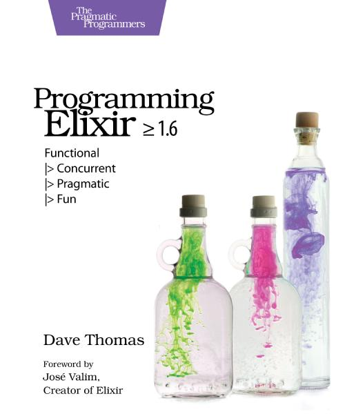
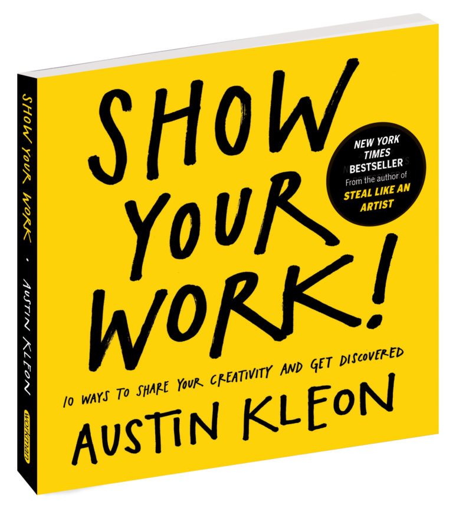

Tal como [prometí](/blog/lnds/2021/02/27/libros-del-mes/), al final de cada mes publicaré los libros que he leido en el periodo. Así que sin mayores trámites acá van los libros del mes de marzo de 2021.

## The Murderbot Diaries

En realidad son 4 libros:

    - All Systems Red
    - Artificial Condition
    - Rogue Protocol
    - Exit Strategy

Son libros breves y de fácil lectura (novelas cortas) que son parte de esta serie de la escritora Martha Wells. Se trata de una saga en estilo cyber punk/espacial. 

Son bien entretenidos, con algo de humor negro y muy ágiles. Aunque en cierta forma son como un ejercicio de la autora para introducirse en el mundo de la ciencia ficción, pues al parecer ella ha desarrollado su carrera escribiendo fantasía. Llegué a esta serie a través de una recomendación de mi hijo y me gustaron bastante. Hay algunos detalles que como informático no puedo dejar pasar, por ejemplo, la idea de "hackeo" es muy del estilo de lo que se ven en series de TV gringas o películas de hollywood, lo que no me gusta en realida. Sólo en el último libro la autora le da un poco más de sentido a las hazañas del protagonista. Lo otro es que el protagonista es un Robot, pero eso es un problema, porque uno se imagina que una IA operará con una velocidad de pensamiento bien distinta a lo que se percibe en el relato, así que en este punto hay que suspender un poco la lógica (y los conocimientos tecnológicos) para poder aceptar a este personaje. Fuera de eso, funciona bastante bien. No sé por que a veces me acordé de [Ash](https://en.wikipedia.org/wiki/Ash_(Alien)), el androide en Alien, aunque  Murderbot (así se llama el protagonista) es bien distinto (quizás es más como Terminator), pero hay semejanzas en el hecho de que pertenece a una corporación, por ejemplo. También, no tengo claro por qué, me recordó algo a las novelas de [Rudy Rucker](https://en.wikipedia.org/wiki/Rudy_Rucker), como que hay algo de influencia ahí. 

Muy recomendables y voy a leer prontamente el quinto libro que ya es una novela hecha y derecha, a ver como evoluciona este personaje y se desarrolla su mundo.

## Kings of Crypto

Este libro de Jeff John Roberts cuenta la historia de Coinbase, la startup que se convirtió en uno de los exchanges de criptomonedas más importantes. Cuenta cómo tomaron una estrategia polémica y establecerse como puente entre el mundo de los acivistas de las criptomonedas, Wall Street e incluso el gobierno de Estados Unidos. Es muy ágil y permite a quien no sepa nada de Bitcoins y criptomonedas entender este mundo. Además explica muy bien y en términos simples cómo opera blockchain y Ethereum en particular. A mi me permitió aclarar algunas dudas que tenía de todo este mundo, del que soy bien escéptico. Pero después de leer este libro me pico el bichito por meter las manos en Ethereum y los Smart Contracts, pero será algo que postergaré cuando tenga más tiempo.

## Programming Elixir: Functional |> Concurrent |> Pragmatic |> Fun

[Dave Thomas](https://en.wikipedia.org/wiki/Dave_Thomas_(programmer)) es el co autor del, a estas alturas clásico, ["The Pragmatic Programmer"](https://pragprog.com/titles/tpp20/the-pragmatic-programmer-20th-anniversary-edition/), además de ser uno de los firmantes originales del Manifesto Ágil. Es un autor bien prolífico e incluso fundó su editorial "The Pragmatic Bookshelf" que ha editado varios libros bien buenos.

Este libro introduce este Elixir, una suerte de dialecto de Erlang, aunque con una sintaxis bien interesante. Uno de los lenguajes más interesantes del último tiempo y del que pretendo escribir bastante más adelante (las razones las explicaré en futuros artículos).

Buen libro introductorio, bien escrito y práctico. Lo recomiendo para quienes quieran aprender Elixir.

## Show Your Work!

De Austin Kleon. Este libro me lo habían recomendado hace tiempo y viendo un youtuber famoso que también lo recomendó decidí leerlo de una vez. Es de esos libros con consejos para el desarrollo de tu presencia en la red, o como dicen los expertos: "personal marketing".

Si escribo este blog es porque quiero que lo lean. Entonces es natural buscar consejos sobre cómo promover mi trabajo en línea. Pero este libro no es un libro que te proponga trucos o técnicas para lograr el éxito en tu blog. En realidad da algunos consejos bastantes atinados y honestos sobre cómo abordar tu proceso creativo y difundirlo de una manera que genere interés legítimo en tus potenciales lectores o followers. 

Al final todo tiene que ver con la pasión que pongas en lo que haces, así que probablemente no encuentres nada nuevo en este libro, pero sirve leer estas cosas de vez en cuando para reflexionar tus estrategias de promoción, pero a la vez de crecimiento personal. 

## La Máquina Diferencial

Esta es una ucronía co escrita por William Gibson y Bruce Sterling. Esta es una de las primeras novelas del sub genero Steam Punk. Nos muestra un mundo en que [Charles Babbage](https://lnds.net/blog/lnds/2011/10/18/desde-siempre/) tiene éxito en crear su máquina computadora, y [Ada](https://lnds.net/blog/lnds/2009/01/17/la-primera-analista-de-sistemas/) es la respetada hija de Lord Byron, quien no la ha abandonado e incluso es el primer ministro de Gran Bretaña. 

Es un thriller, con reminiscencias a las obras de Julio Verne. La novela se sostiene en  una conspiración que me pareció algo artificiosa, pero tiene una vuelta de tuerca al final que es interesante. Es fascinante pensar cómo sería todo si las computadoras se hubieran creado cien años antes de que Turing estableciera su primer modelo teórico de computación. Gibson y Sterling se lucen en esta novela, la que recibió el premio Nébula en 1991. Muy recomendable. 

Y tú, ¿qué libros has leido este mes? ¿Me recomiendas alguno?

Nos vemos el mes que viene.