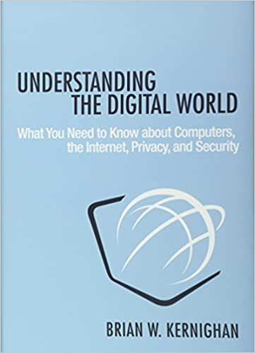

Me [comprometí](/blog/lnds/2021/02/27/libros-del-mes/) a llevar este registro de los libros leidos en el mes, y me salté abril, así que vamos a recuperarnos con este post.

El hecho de escribir estas reseñas me ayuda a sintetizar y recordar lo leido. Puedes leer para aprender, para pasar un buen momento, pero también, al menos en mi caso, para enseñar. Este año por primera vez estoy enseñando a alumnos de pregrado, así que  hay varias lecturas que he escogido para mantener mis conocimientos vigentes en el ámbito de ciberserguridad e ingeniería de software, que eso el ámbito donde principalmente me ha tocado enseñar. Así que vamos con la lista.

# Abril 2021

## Understanding the digital world

De Brian Kernighan, me gusta como escribe Kernighan, pero este no es su mejor libro. La lectura en este caso fue bastante diagonal, me salté varias secciones. Es un libro basado en un curso que Kernighan dicta en Princeton. Es un curso para personas que no vienen del mundo tecnológico, y encuentro que no podría haber mejor profesor que Kernighan para este tópico, siendo el autor un testigo presencial del desarrollo de varias de las tecnologías más importantes del último siglo.
Es por eso que para mi este libro no tuvo grandes aportes, pero lo recomiendo para quien no sabe mucho de tecnología y quiere tener un conocimiento básico de cómo funciona la tecnología.

Link en Amazon: https://amzn.to/3vCvwaT

## Humble Pi: When Math Goes Wrong

De Matt Parker, el youtuber conocido por el canal Stand-up Maths, compré este libro después de ver [esta charla que realizó en Google](https://www.youtube.com/watch?v=34detVy-Hiw) donde habla de grandes errores matemáticos. Y de eso se trata este libro, de errores matemáticos, o ingenieriles donde las matemáticas se vieron involucradas. Matt es muy divertido en su canal de Youtube, en sus presentaciones y el libro es muy entretenido. Varios de los errores algorítmicos que menciona los conocía porque es algo a lo que soy aficionado, leer sobre bugs catastróficos. Pero yo no conocía en detalle el error de PacMan, así que fue super interesante leer la historia. Tiene momentos muy divertidos, por algo estuvo en los primeros lugares de ranking de lectura en Inglaterra.

Link en Amazon: https://amzn.to/3fvkLl7

## Web Application Security: Exploitation and Counter Measures for Modern Web Applications

De Andrew Hoffman. Un libro para estar actualizado sobre los tipos de vulnerabilidades más comunes en el desarrollo de aplicaciones web modernas. El libro es reciente, publicado a fines del año pasado. Para mi el principal aporte de este libro es la estrategia para analizar sitios web en búsqueda de vulnerabilidades. El libro explica las principales vulnerabilidades que presentan los sitios webs, cómo explotarlas y por supuesto cómo defenderse y evitarlas en nuestro código. Muy práctico y recomendable.

Link en Amazon: https://amzn.to/3hZ0C8O

## The War of Art

De Steven Pressfield. Este libro no me gustó mucho, aunque debo reconocer que la primera y última parte del mismo son potentes. Es un libro cortito, un manifiesto para quien se quiera dedicar al arte de escribir, aunque creo que aplica a muchas cosas más. Para mi lo valioso está en la primera parte del libro, donde habla de la "Resistencia", que es la manera que tiene el autor para referirse a la procrastinación. Esa parte es muy poderosa, con imágenes potentes y al menos a mi me resonó de formas insospechadas. Pero después se vuelve místico, derivativo, algo iluminado, hay gente que puede que le guste, pero a mi esa parte me chocó. 

Link en Amazon: https://amzn.to/3c4Ha6E

# Mayo 2021

## Ready Player Two

De Ernest Cline, tenía que leerlo, a pesar de que Cline me decepcionó mucho en Armada. No es que Ready Player One sea un graaaan libro, pero tiene tantas referencias a la cultura pop que me son cercanas, que me gustó mucho ese libro, así que quería ver que más tenía para ofrecer. Y la primera parte del libro me sorprendió gratamente, un autor más maduro, con algunas reflexiones interesantes sobre lo que pasaría en un mundo donde todos decidieramos vivir en una realidad virtual. Hay algunas especulaciones interesantes ahí. Luego se mete en una historia que repite el esquema del libro anterior, hay que resolver los enigmas de un juego, claro que ahora la apuesta es mayor y más peligrosa. El final transhumanista del libro no me gustó mucho, y se nota que Cline quería cerrar de una esta saga, y la verdad es que está bien, creo que si explota más lo que muestra en la primera parte de este libro, Cline podría volverse un autor de ciencia ficción más interesante y profundo, y no sólo un autor de novelas para pasar el rato.

Link en Amazon: https://amzn.to/3yQIi7S

## Refactoring at Scale: Regaining Control of your Codebase

De Maude Lemaire. Un libro que encontré investigando para una clase donde hablaría de refactoring. El aporte de Lemaire, una ingeniera en Slack, está en que nos muestra casos reales de refactoring a escala masiva (nada menos que en Slack). Los libros clásicos de refactoring hablan de la escala pequeña, funciones a lo más clases o módulos. Pero, ¿qué pasa cuando tienes una base de código de millones de líneas de código, mantenida por cientos o a veces miles de desarrolladores? Es un problema que nunca pensé que me toparía en mi vida, pero que justamente ahora es parte de mi trabajo. Esta guia me parece un aporte importante en este tópico, muy recomendable. Es un libro también editado a fines del año pasado.

Link en Amazon: https://amzn.to/34teMqR

## Las Brigadas Fantasma

De John Scalzi, la segunda parte de la saga de la [Vieja Guardia](https://lnds.net/blog/lnds/2021/02/27/libros-del-mes/#febrero-2021). Esta vez es una historia que involucra a un soldado de las brigadas fantasma, que se mencionan en la primera novela de la saga. El protagonista de la primera parte no aparece, pero sí su interés romántico, la Teniente Jane Sagan, aunque ella no es la protagonista. Hay menos acción que en La Vieja Guardia, pero una intriga interesante, e introduce los elementos que serán centrales en la tercera parte de la saga. A mi me gustó mucho los aspectos sobre la transferencia de la conciencia a cuerpos clonados, acá elabora un poco más los conceptos que introduce en la primera parte, pero brillan más en el libro que sigue.

Link en Amazon: https://amzn.to/2TorBjH

## La Colonia Perdida

De John Scalzi, pasó que cometí un error y lei este libro antes que las Brigadas Fantasma, pero no importó mucho. Este libro me gustó mucho y encontré que Scalzi está en un buen momento como narrador en este. Hay aún menos acción bélica, pero el desarrollo de una intriga a nivel galáctico que lo pone a la altura de las obras de Asimov, como Fundación. Encontré que la pluma de Scalzi alcanza su punto más alto en este libro. Puede ser también que el personaje centrarl es como un alter ego de Scalzi. Es muy divertido y tiene una trama más política que los libros anteriores de la saga. A muchos no les gusta porque quizás prefieren la acción bélica, pero a mi me pasa al revés, además que encuentro que hay más humor y el estilo del escritor en este libro se me hace más agradable. 

Link en Amazon: https://amzn.to/3wHgctM

Esas son las mini mini reseñas de lo leido en estos dos últimos meses, ya volveremos con la serie sobre entropía de software. Si tienen libros que me recomienden los espero en sus comentarios.
