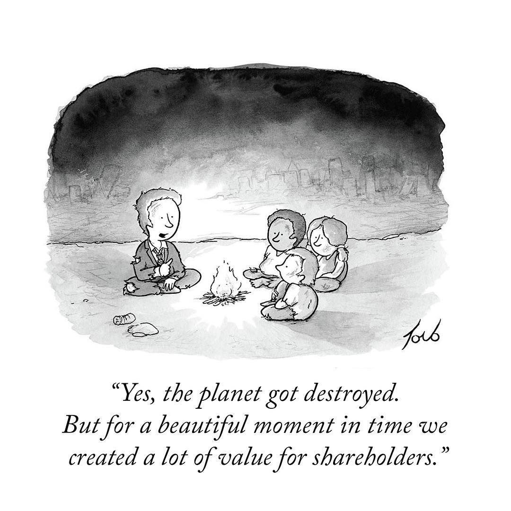

    "La vida sólo puede ser comprendida mirando hacia atrás, pero ha de ser vivida mirando hacia adelante" -- Soren Kierkegaard

Han pasado varias cosas interesantes en Cornershop, algo que seguro varios de ustedes ya saben. El otro día nos avisaron de un hito particular para Chile, en el canal respectivo de Slack, junto con las felicitaciones uno de los comentarios de un compañero fue: "antes too esto era campo" :smile:.

Lo curioso es que cuando leí eso yo estaba literalmente en el campo. 

Ventajas del tele trabajo. 

O producto de la conectividad, porque yo recuerdo cuando "todo esto era campo", al menos en lo referente a telecomunicaciones.

Escribo estas palabras desde "un campito", en la región de Ñuble, disfrutando de la tranquilidad campesina y tratando de capear el frio.

No, no he migrado al campo aún, aunque las posibilidades están, y seguro será costumbre el arrancarnos por estos lados con más frecuencia. Imagino que en algunas décadas más, alguno de nuestros hijos vendrán al terreno de sus padres y comentarán a nuestro descendientes: "¡antes too esto era campo!".

Estoy presenciando el nacimiento de algo nuevo para nuestra familia. Por supuesto que ahora todo es campo, pero en unos meses, esperamos, será un agradable refugio.

Pero muchas cosas están cambiando a mi alrededor. Mi país, por ejemplo, pasa por un momento de tranformaciones profundas y estamos iniciando una etapa de re escritura de las reglas de nuestra convivencia. Hay gente que está expectante, algunos asustados e incluso no faltan los que ven todo con mucho pesimismo. Sospecho que los que más temen es porque no entienden estos movimientos históricos. 

Algo curioso es el hecho que algunos creen que se trata de un simple proceso técnico. Como si fuera cosa de sentarse y escribir un simple algoritmo de comportamiento ciudadano. 

Lo que está ocurriendo es la redacción de una propuesta para la "Constitución **Política** de Chile". Lo dice en el título: "política". ¿Cómo esperan que no sea político el proceso? 

# Caos

Yo estoy tranquilo.

Los mitos griegos nos dicen que el Orden, el Cosmos, surgió del Caos.

Las cosas al principio son así, caóticas, casi sin sentido aparente. 

Hay urgencia por empezar y damos varios pasos en falso, cometemos errores, tomamos decisiones rápidas, quizás no muy meditadas, pero vamos avanzando, a la velocidad que queramos darle, dependiendo de nuestro espíritu y nuestra necesidad. 

Pero no es fácil cuando en una organización participan personas de muchas sensibilidades e intereses. Y aún más cuando están esos que, como decimos en Chile, "atornillan al revés" y quieren que todo fracase.

# E-Programs y el Juego Infinito

Otra cosa interesante son los cambios en mi vida laboral. Tengo que decir que me gusta mucho mi trabajo actual. 

He estado reflexionando mucho en estos meses y una de las conclusiones a las que he llegado es que en mi vida profesional nunca había trabajdo en desafíos como los que me encuentro ahora. No estoy subestimando mis anteriores trabajos, lo que estoy diciendo es que me encuentro frente a una naturaleza distinta de desafíos.

Si recuerdan lo que he escrito sobre las [ideas de Lehman](/blog/lnds/2021/05/08/hablemos-de-entropia-de-software/), ahí vimos que existen ciertos tipos de sistemas, que el autor llama `E-Programs` que corresponden a aquellos soluciones que no sólo evolucionan para atender nuevas necesidades externas, sino que estos sistemas alteran de manera profunda el entorno y a las personas que los operan,  generando un ciclo de retro alimentación que hace aumentar la complejidad intrínseca de los mismos.

Como ingeniero me ha tocado desarrollar muchos sistemas de tipo S o P, como los llama Lehman. En estos programas lo que ocurre es que debemos adaptar nuestra solución a nuevas abstracciones más refinadas del mundo. Esto pasa porque en general estas nuevas abstracciones surgen de normas, leyes, decretos, o nuevos procedimientos dictados por quienes pretenden normar la complejidad de la sociedad humana. No son sistemas evolutivos en si mismos, son sistemas normados. Su complejidad reside en la mayor o menor arbitrariedad de los requisitos. Pero no alteran fundamentalmente ni al entorno ni a las personas.

Pero Cornershop funciona como un  `E-Program`, igual que muchas startups y empresas innovadoras. Sus productos o servicios crean nuevas realidades de operación, otras formas distintas de hacer las cosas, y esto genera nuevas necesidades e impulsa cambios de comportamientos de sociedades enteras. Cornershop nació como una forma de ahorrarle tiempo a las personas. Pero la pandemia también cambió a Cornershop, porque debía responder a los cambios que la pandemia demandaba. Y esos cambios a su vez modificaron hábitos y generaron nuevos comportamientos en las personas que usan el servicio. Esto produce nuevos desafíos y cambios que afectan a la sociedad. 

Zoom, Cornershop, Teams,  Miró, y tantas otras herramientas y servicios que hemos incorporado a nuestras vidas llegaron y nos cambiaron. Son parte de nuestra vida y han cambiado muchas dinámicas que tenemos para organizar nuestra vida y nuestro trabajo. Son fuerzas nuevas que generan nuevos desafíos. El E-Program altera a la sociedad, y la sociedad altera el E-Program. ¿Si ya puedes entregarme el producto en el día, por qué no puedes entregármelo de forma más inmediata? Las barreras se corren. Los objetivos se desplazan. Las reglas cambian y los sistemas E hacen que esos cambios se aceleren.

Viviremos una nueva sociedad, más acostumbrada a las mascarillas en público (aunque esa idea no les guste a los gobiernos). Con vacunas cada seis meses, y anuncios de una nueva pandemia cada dos años. Y estas tecnologías estarán acompañándonos. También surgirán nuevas soluciones. Algunas serán normativas, otras evolutivas. Soluciones tipo P, soluciones tipo E. Hay que estar atentos a las tipo E, esas son las más valiosas. 

Otra forma de verlo es que Cornershop, junto a varias startups, en especial esas que llaman unicornios, juegan lo que algunos llaman un "Juego Infinito".

El concepto de juegos finitos e infinitos fue introducido por James P. Carse en el libro ["Finite and Infinite Games"](https://amzn.to/3AU0jDf).

Están los juegos finitos que se juegan con el propósito de ganar. Es una activdad acotada, donde el juego puede ser finalizado cuando se alcanza el acuerdo mutuo de los jugadores. Muchas actividades humanas se describen en términos de la metáfora de los juegos finitos: las guerras, la política, los deportes, etc. Cuando estás jugando juegos finitos tu única meta es ganar.

Por otro lado, los juegos infinitos son jugados sólo con el propósito de seguir jugando. Nunca ganas en un juego infinito. En esta metáfora caen las activiaddes como el aprendizaje, la cultura, la formación de una comunidad, o cualquier tipo de exploración que no se define por un conjunto de reglas pre acordadas que la limite. La gracia del juego es atraer a nuevos jugadores al juego, de modo que ellos puedan jugar también. Nunca "ganas", el seguir jugando es la recompensa, que se vuelve cada vez más valiosa y apreciada.

Alex Danco, en su artículo ["Why The Canadian Tech Scene Doesn't Work"](https://alexdanco.com/2021/01/11/why-the-canadian-tech-scene-doesnt-work/) explica como esta idea del juego infinito es la que motiva a cierto tipo de emprendedores e inversores ángeles, y es la que distingue a los ecosistemas de emprendimiento exitosos de los que no lo son tanto.

Leyendo el artículo veo mucho de la realidad chilena. Hace poco un economista de derecha trató de hacer un punto político usando el éxito de Cornershop para denostar el rol de estado. Opino que ese economista no entiende nada ([¿cuando han entendido algo?](https://lnds.net/blog/lnds/2011/07/28/expertos-zorros-y-erizos/)). Cornershop tuvo éxito _a pesar_ del entorno privado y público chileno. La clave para entender esto está en entender esta idea del juego infinito. 

El juego infinito no es privilegio de los emprendedores, ni de las empresas unicornios. Tiene que ver con tu decisión de seguir jugando una y otra vez con el fin de crecer, de cultivarte más allá de los límites que te imponen otros o que tu mismo te impones. Es dejar de pensar en ganar, es disfrutar del placer de jugar.

# Sistemas complejos y Caos

Estos últimos  meses en Cornershop han sido muy desafiantes, complejos, pero enriquecedores. Mi mujer dice que se me nota  que lo estoy pasando bien.

Creo que tome una buena decisión. Es una gran empresa y claro, ahora que se ha vuelto famosa, uno recibe felicitaciones y parabienes de varias partes.

Sí, _"es bacán"_, no lo niego. Pero ese éxito tiene mucho que ver con una manera de hacer las cosas, eso que llaman la cultura.

Y lo primero que hay que entender que es la cultura la clave del éxito de cualquier empresa. Si la cultura tiene esa mentalidad de juego finito, como esa idea de "maximizar la utilidad de sus accionistas", sus capacidades serán por lo tanto limitadas y poco motivantes.

En todo sistema complejo el orden aparente surge como una propiedad emergente, producto de la complejidad de las interacciones provocadas por unas pocas reglas sencillas.

Eso ha pasado con Cornershop. Para entender como funciona yo pienso en este concepto un tanto _oximorónico_ del "Caos Controlado".

Voy a tratar de explicarlo a través de uno de los aspectos que más contrasta, y es fácil de explicar.

Antes [les he contado sobre mi vida profesional](https://lnds.net/categories/el-fin-de-la-agilidad/) y en particular de Previred.
Tal como conté antes, en Previred tuve la suerte de formar, con mucha libertad, [mi propia unidad de desarrollo](https://lnds.net/blog/lnds/2019/08/15/el-fin-de-la-agilidad/). Así que pude probar distintos procesos de desarrollo, más o menos ágiles. Con el tiempo algo nos caracterizaba como equipo. 
Aunque eramos un equipo pequeño estabamos enfocados en construir varios productos o servicios nuevos. 

Teníamos algo de esta mentalidad de juego infinito, dentro de un juego finito, por cierto. 

Sin embargo, chocabamos con algunas formas de operación que ya estaban establecidas en el modo de operar que traía la empresa. 

Una de estas ideas era la oposición a ejecutar muchos pasos a producción. Era un concepto que incluso algunos veían como algo inadecuado, desordenado, caótico,  incluso peligroso. Cuando alcanzamos los sesenta pasos al año nos miraron como bichos raros. Pero aún así siempre encontré esa cantidad de cambios anuales como algo insuficiente, e invertí  tiempo y esfuerzo durante los años que pasé en la empresa, en tratar de mostrar lo importante que es la entrega continua.

Al final esta visión fue ganando acogida. Se incorpraron procesos más ágiles y cuando me retiré se logró normalizar la idea de tener algunos cientos de pasos a producción al año. Por supuesto que estoy orgulloso de ese logro, sin embargo, siempre estuve conciente que seguía siendo insuficiente.

Cuando llegué a Cornershop yo ya esperaba ver unas decenas de cambios al día (sí al día). Y la razón para esperar eso que dado que conocía a [Osvaldo Mena](https://twitter.com/omenar), había escuchado esas cifras en sus propias palabras. En 2019 lo había invitado a exponer la experiencia de Cornershop a un grupo de personas en Previred. Recuerdo que en esa charla habló de como lograban varias decenas de cambios en el día. Algo que asombró a algunos de mis colegas y líderes.

Estoy seguro que Osvaldo no sospechaba lo que ocurriría apenas un par de años después.

Cuando al fin llegué a Cornershop me quedé corto, la realidad era que la cantidad de cambios en producción había pasado al siguiente orden de magnitud.

Voy a explicarlo con calma, porque para mi fue un shock. Incluso, lo he comentado en las clases que dicto para alumnos de magister. 

Yo había impulsado un proceso de desarrollo en que logramos alrededor de quinientos cambios en producción **al año**. Cuando ingresé a Cornershop y vi como se operaba con los cambios en producción, toda esa cifra que logramos en una docena de años, en Cornershop lo superaban con creces pero **todos los días**. Y todo eso lo lograron en menos de dos años.

Y esa es sólo una variable a considerar.

Y es que así son los juegos infinitos. Se trata de crecer y crecer para seguir invitando a más gente al juego.

A lo mejor algunos de ustedes han visto ["La Clase"](http://www.laclase.cl), en particular cuando Osvaldo explica cómo opera Cornershop, se los dejo acá, por si no lo han visto:



Les voy a contar un secreto: "las cosas han cambiado". Pero claro, la escala actual es mucho mayor de la que Osvaldo está contando en ese video. Además en estos meses hemos avanzado mucho y se han tenido que realizar cambios organizacionales. Pero la cultura y ese espíritu ágil sigue ahí.

Otra variable: la confianza en los desarrolladores. Los ingenieros de software son los responsables de pasar a producción los cambios que ellos mismos han hecho en el código. Nada de complicados procesos de "gestión de cambios".

Cuando un cambio está listo ellos lo integran a la rama principal y ejecutan el paso a producción. Confiamos en que trabajamos con profesionales responsables que se harán cargo de resolver los problemas que puedan provocar en producción.

Y cuando algo pasa, todos ayudan. Es más, es muy común que en Slack se pida ayuda para abordar algún problema, solicitar  revisar un pull request, o resolver alguna duda puntual, y siempre hay alguien dispuesto a apoyar.

Hay un equipo SRE muy potente. No existe esta figura  del "sysadmin", o del mal llamado "devops", acá son ingenieros que no sólo hacen tooling y soportan la operación, sino que son capaces de corregir bugs, escribir código y aportar con observaciones muy atinadas sobre el código o la arquitectura.

Todo se conversa con mucha franqueza y directo al punto. Nadie te hace perder tiempo en cosas irrelevantes. No hay esos controles sobre controles que sólo sirven para diluir responsabilidades. Acá el [No Bullshit](https://lnds.net/blog/lnds/2013/02/15/el-camino-de-la-innovacion/) es de verdad.

# Show me the Code

En uno de mis primeros proyectos, en los que he participado en estos meses, cometí un error de estimación en la arquitectura propuesta y por supuesto tuvimos problemas. "Back to the whiteboard", o algo por el estilo, fue el comentario que recibí. Sin carga, sin discusión. Sí, la había cagado y se esperaba que aportara en la solución.

La organización fue algo que me costó entender al principio. No, no vas a encontrar un organigrama en Cornershop. Hay líderes, por supuesto, esto no es anarquía. Pero debo comentar, que para mi delicia,  en muchos aspectos la operación tiene mucho de anarquía, pero en el buen sentido de la palabra.

Es esta idea de "caos controlado". Es una organización en que se están ejecutando al mismo tiempo cientos de proyectos. Entonces, un equipo puede estar desarrollando algo que puede interferir con el trabajo de otro equipo, o pueden beneficiarse de la sinergía. Todo esto hace necesario que tengamos que conversar y coordinar mucho. 

Somos bien auto críticos, y respetuosos del trabajo y expertise de otros. Pero sabemos que debemos movernos rápido, aunque tampoco queremos romperlo todo por ir tan rápido, no. No se trata del famoso "move fast and break things". Tenemos una fuerte preocupación por la escalabilidad y la seguridad. Pero los equipos de seguridad no se interponen con el negocio. Adios esas aburridas e inútiles charlas de seguridad. La seguridad es algo de lo que estamos todos concientes, no intentamos diluir esa responsabilidad creando super estructuras y cargos que no aportan valor. Por supuesto que debemos preocuparnos cada vez más del compliance, pero estoy seguro que esos aspectos más "normativos" serán resueltos con inteligencia e ingeniería por sobre la burocracia.

Lo más importante es que los líderes no sólo saben. Nuestro líderes más técnicos no sólo escribieron las primera lineas de código de Cornershop, sino que aún lo siguen haciendo.

Eso a mi me inspira. Para mi es relevante que un líder sea respetado no sólo por su habilidad de alinear al equipo, si además sabe muy bien lo que hay que hacer, y cómo hacerlo, mejor. Pero además lo que importa es que confían en tí, te respetan, te entienden y te escuchan. Mantener eso y crecer al mismo tiempo es un desafío. Pero saben lo que necesitan para lograr escalar y han traido a las personas adecuadas que pueden ayudar a lograr esto. 

Porque estamos creciendo mucho, ya somos cientos de ingenieros aportando miles de líneas de códigos, diseños, arquitecturas, servicios, procesos, documentación, todos los días. Jugando todos el juego infinito. Así que seguiremos creciendo. Estoy seguro que miles de cambios al día será la norma en unos meses más.

Voy a ponerlo de otra forma forma: antes preparaba una presentación power point. Ahora cuando quiero exponer algún punto puedo colocar el código fuente en Python de un spike, o una PoC en un repo en GitHub y ahí está para que podamos aclarar algún punto.

# Caos constructivo

Entonces, estoy en un proceso de cambio y de reinvención, pero en un entorno muy cercano al ideal que siempre he buscado, y por supuesto me siento orgulloso de poder contribuir.

Por todo lo anterior y dada mi experiencia en estos meses en Cornershop, voy a mejorar la definición, más que "Caos Organizado", usaré la expresión "Caos Constructivo".

Estoy en medio de un torbellino de cambios, de crecimiento, de expansión, de integración. De incertezas, de fuerte competencia, de incertidumbres, de temores y esperanzas. 

Entonces sé lo que puede lograr el caos, no le temo al caos. Me anima el caos. 

La gente que le teme al caos, los que abogan por el orden permanente, son personas que no entienden el poder creativo del caos.

El poder del caos constructivo.

No le teman al caos constructivo, recuerden que antes too esto era campo...

