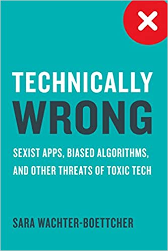

Recordaba hoy que originalmente los blogs eran similares a diarios de vida digitales, o bitácoras personales. El término viene de WebLog, es decir, bitácora en la web que después se abrevió en el neologismo Blog. Entonces como esta es mi bitácora personal, tiene mucho sentido que siga llevando este registro de los libros que he leido.

Claro que originalmente la periodicidad prometida era de un post mensual con mis lecturas del periodo, algo que me ha costado mantener, ya van dos posts que contienen las listas para dos meses. Pero bueno, algo a mejorar, al gual que mi frecuencia escribiendo para esta bitácora. 

Si les interesa revisar la lista de todos libros previos pueden revisarlos en esta enlace a la categoría: https://lnds.net/categories/libros-del-mes/. 

Vamos por la lista de libros leidos estos últimos dos meses.

## Junio 2021

### _"La Historia de Zöe"_ ---   John Scalzi

Esta es la cuarta entrega de las saga de las Fuerzas de Defensa Coloniales, también conocida como "La Vieja Guardia", ya he hablado de los libros previos de esta saga. Acá vemos la historia de "La Colonia Perdida" pero contada desde la perspectiva de otro personaje, Zöe, una adolescente que carga con la tremenda responsabilidad de ser venerada casi como una deidad por toda una especie alienígena. Este libro cuenta la misma historia, pero esclarece un par de aspectos que nos quedan ocultos en "La Colonia Perdida". Es arriesgada la jugada del autor al hacer esto, pero de todas maneras logra mantenerte entretenido al contarte básicamente la misma historia, pero con detalles que no podías saber antes y agregando la perspectiva de otras razas y personajes fuera de los referentes de los primeros libros de la saga. Scalzi sigue entreteniendo y explorando este universo. Así que logra mantener el interés por la saga. 

[Disponible en Amazon >>](https://amzn.to/3C25p0H)

### _"Proyecto Hail Mary"_ --- Andy Weir

Andy Weir alcanzó la fama con el libro "El Marciano", del que se hizo una película dirigida por Ridley Scott y protagonizada por Matt Damon. Su segunda novela, Artemis, fue para mi algo decepcionante. Pero acá vuelve a entretener y fascinar con un thriller apoyado en mucha ciencia. La historia ocupa una fórmula similar a "El Marciano". Un astronauta solitario enfrentado a una situación de vida o muerte extrema. Pero en esta ocasión el astronauta despierta de la hibernación en una nave que está realizando un viaje interestelar. No sólo se encuentra totalmente solo (sus acompañantes han muerto), sino que sufre amnesia y poco a poco va descubriendo que está en una misión para salvar la vida en la Tierra, nada menos. Es muy entretenida, contiene mucha ciencia presentada de forma entretenida al ser usada para resolver los diversos desafíos que va enfrentando el protagonista. La especulación se ve plausible y bastante bien fundamentada. Y con la dosis de humor que caracterizaba a su primera novela. Les recomiendo mucho esta novela, la van a pasar muy bien leyéndola, y seguro se hace una película sobre este libro.

[Disponible en Amazon >>](https://amzn.to/3lkNufM)

### _"La Humanidad Dividida"_ -- John Scalzi

El quinto libro de la saga de "La Vieja Guardia". Acá nos enfrentamos a las consecuencias de los eventos que ocurren en "La Colonia Perdida" y "La Historia de Zöe". La perspectiva acá es de un personaje que aparece como secundario en las primeras novelas de la saga. Este soldado apoya a un equipo diplomático a los que se les asigna una serie de misiones casi imposibles de resolver, "El Equipo B". De a poco este grupo va descubriendo una extraña conspiración que termina afectando a la Tierra misma. Más que una novela es una serie de episodios enlazados alrededor de las aventuras del "Equipo B". Así que uno se queda esperando la llegada de una nueva novela. La calidad de los episodios es un tanto irregular, de todas maneras entretiene y mantiene el interés por el universo de esta saga.

[Disponible en Amazon >>](https://amzn.to/2Vlshrl)

### _"Talking With Tech Leads"_ -- Patrick Kua

Es un conjunto de entrevistas a líderes técnico, de distintos niveles, tal como dice el título: de novicios a avezados. El problema principal de este libro es la falta de variedad de empresas y backgrounds de los entrevistados. No sé si lo recomendaría, me parece que Coders at Work es un libro de este estilo mucho mejor. Sin embargo, hay pocos libros que aborden la perspectiva de los líderes técnicos, así que hay algunas perlas que se pueden extraer de este libro. Recomendable para alguien que está partiendo en el liderazgo técnico, para que entienda que no está solo en muchos aspectos y desafíos en este nuevo rol.

[Disponible en Amazon >>](https://amzn.to/3fe2to8)

## Julio 2021

### _"El final de todas las cosas"_ --- John Scalzi

Otro libro que tampoco es una novela en si misma, sino que cuatro novelas cortas, que finalizan la saga de "La Vieja Guardia". La primera de estas novelas cortas cuenta la historia de un hombre cuyo cerebro es arrancado de su cuerpo para ser incorporado a una nave espacial, tiene muchos elementos de cyberpunk, y es la que más me gustó de las cuatro. Creo que es un final "digno" para la serie, pero sospecho que Scalzi ya estaba algo cansado y falto de ideas para el universo que creó. Igual hay muchas ideas políticas e intriga interesante en los dos últimos capítulos de la saga, pero sospecho que no es un camino que al autor le habría gustado explorar. Creo que es una saga entretenida y que vale la pena leer si sólo buscas eso.

[Disponible en Amazon >>](https://amzn.to/37aBYLJ)

### _"Un verdor terrible"_ --- Benjamin Labatut

El mejor libro que he leido este año, hasta ahora. Me gustó mucho, pero no soy el único. Este libro se hizo famoso porque Obama lo recomendó en su lista de lectura del verano. Es un libro muy corto que se lee casi de una sentada. Está muy bien escrito. Para mi el estilo del autor a veces recuerda los temas que obsesionaban a Jorge Luis Borges y la fascinación histórica y las crónicas de Stefan Zweig. Los relatos giran alrededor de la ciencia, la locura a la que te puede llevar la física o las matemáticas, y del tremendo abismo y desafío que nos presenta el entendimiento profundo de cómo funciona la naturaleza. Realmente es de esos libros que no olvidas nunca y que te impactan más de lo que sospechas.

[Disponible en Amazon >>](https://amzn.to/3fciqLt)

### _"Finite and Infinite Games"_ --- James P. Carse

Este es un libro un tanto "filosófico", que tiene una sola idea muy sencilla: "hay juegos finitos y juegos infinitos", de estos  [hablé en mi anterior post](/blog/lnds/2021/07/11/antes-too-esto-era-campo/). Esta idea es interesante e incluso brillante, pero el libro no tanto. Después del primer capítulo el resto lo encontré aburrido, incluso pretencioso. Pero sospecho que hay gente a las cuales les puede resonar bastante, porque de todas maneras la idea del juego infinito es muy potente. 

[Disponible en Amazon >>](https://amzn.to/3C09e6G)

### _"Super Pumped: The Battle for Uber"_ --- Mike Isaac

Un libro periodístico, escrito por el reportero del Times que siguió muy de cerca el auge y caida de Travis Kalanick, el anterior CEO de Uber. El libro se centra en la historia de cómo Kalanick se hizo del control de la compañía, y la posterior lucha interna para destituirlo.  No lo considero un ibro muy bueno, el autor se apoya en la polémica de la figura de Kalanick, pero teniendo material para escribir un gran libro no lo logra. Podría haber servido como una gran reflexión sobre el efecto de los liderazgos tóxicos, los bemoles de la industria tecnológica en Silicon Valley, pero termina siendo un simple reportaje extendido.

[Disponible en Amazon >>](https://amzn.to/3llopRV)

### _"Technically Wrong"_ --- Sara Watcher-Boettcher

Este libro es una crítica a los algoritmos sesgados, al sexismo en las apps, a la falta de diversidad en el mundo de la tecnología. Tiene varias reflexiones interesantes, así que recomiendo mucho este libro a quienes diseñamos apps o sitios webs, expertos en UX, diseñadores y arquitectos. Su crítica al uso de "Personas" en el diseño de interacciones, por ejemplo, es notable, pero ella propone formas de hacerlo mejor. No es un libro técnico, pero tiene varias recomendaciones de cómo podemos mejorar nuestros diseños para evitar en sesgos o generar experiencias ofensivas o desagradables para nuestros usuarios. Muy recomendable para estar atentos a lo que hacemos mal  en tecnología y que puede tener efectos tóxicos en la sociedad.

[Disponible en Amazon >>](https://amzn.to/3jcy1vJ)

Y esos son los libros que he leido estos dos últimos meses. Me agradaría escuchar de sus lecturas y ojalá me recomendaran libros para leer y reseñar.