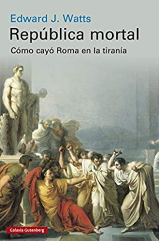
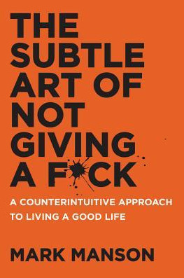

Me ha costado escribir en este blog, creo que debo organizar mi tiempo y encontrar espacio para publicar mis notas e ideas, pero ya estamos trabajando en eso. Mientras tanto, y para ejercitar el músculo acá va el avance de las lecturas mensuales, que prometí que registraría en esta bitácora. 
Si les interesa revisar la lista de todos libros previos pueden revisarlos en esta enlace a la categoría: https://lnds.net/categories/libros-del-mes/. 

## Agosto 2021

### República Mortal -- Edward J. Watts

Este libro cuenta la historia de la caida de la República Romana finalizando con el surgimiento del Imperio con Octaviano (César Augusto). El mensaje central de este libro es "Ninguna república es eterna. Esta viva tanto como lo quieran sus ciudadanos." Y hay una advertencia. Es interesante que este libro sea contemporáneo al gobierno de Trump y a las crisis en varios paises, como Chile. El tema es interesante, pero siento que el autor se da muchas vueltas para plantear su tesis, que tiene que ver con el triunfo del populismo, y lo que el llama el equilibrio de fuerzas entre la élite y el pueblo, que habría logrado Roma en sus primero años. Pero creo que no se hace cargo de que ese equilibrio inicial estaba basado en una tremenda inequidad, la que intentan resolver los caudillos que aparecen posteriormente (ofreciendo tierras a los legionarios, por ejemplo). Un dato, que no conocía, es que Octaviano heredó personalmente todo el reino de Egipto, sin tener que rendir por esa propiedad a Roma, lo que lo convirtió en la persona más rica y poderosa del mundo antiguo. De todas maneras un libro interesante para quien quiera aprender algo de la historia y proyectarlo a la realidad moderna, con algo de cautela por supuesto.

[Disponible en Amazon >>](https://amzn.to/3BcTWdP)

### The Nature of Software Development -- Ron Jeffries

Ron Jeffries es una voz importante dentro de la comunidad ágil. Es uno de los fundadores de Extreme Programming, uno de los firmantes del Manifiesto Ágil. Este libro es de 2015 y pareciera ser una síntesis de la visión de Jeffries sobre lo que importa, donde lo que importa es el valor que entregas en cada iteración. Puede ser visto como un buen texto introductorio a los principios ágiles, independiente de la metodología que adoptes. Si ya sabes de estos temas, no encontrarás mucha novedad, como fue mi caso.

[Disponible en Amazon >>](https://amzn.to/3mpn8s6)

### Time and Again -- Clifford D. Simak

Simak es uno de los autores clásicos de ciencia ficción, recuerdo que me gustó mucho Estación de Tránsito, en su momento, y he leido algunos relatos suyos en el pasado. Quizás habría disfrutado más este libro unos 20 años atrás, hoy me costó mucho terminar de leerlo. No es que no tenga valor, es un buen libro, con algunas cuestiones filosóficas profundas e interesantes, pero todo se empieza a enredar con viajes en el tiempo y una prosa que se toma su tiempo (bueno, es el estilo de Simak). También como lo lei en inglés noté que el estilo del autor también se me hacía anticuado, o inusual, pero eso puede ser más problema mio y de mi falta de exposición a la literatura inglesa en su habla nativa. 

[Disponible en Amazon >>](https://amzn.to/3FlZC83)

### The Go Programming Language -- Alan Donovan, Brian Kernighan

Alan Donovan estuvo involucrado en el desarrollo original del lenguaje de programación Go, y Kernighan, bueno es Kernighan, así que este libro emula el clásico de Kernighan y Ritchie  con C. Seguro es una buena movida haber incluido al procer como co autor (muy astuto Donovan). Tengo este libro desde hace años en mi librero, pero no había pasado de los primeros capítulos. Este últimos dos meses me di el tiempo de leerlo practicando sus ejercicios, es un libro extenso, pero tiene todo lo que necesitas para dominar el lenguaje Go. Muy bien escrito y muy práctico, como todo libro de este estilo requiere tiempo y dedicación para practicar lo aprendido, me permitió rellenar  lagunas que tenía sobre el lenguaje. Muy recomendable y sigue muy vigente, porque por fortuna Go se mantiene bastante estable.

[Disponible en Amazon >>](https://amzn.to/2Ykc0os)

## Septiembre 2021

### New Eden - Kishore Tipirneni

La primera parte de una saga, auto publicada por este autor novato (bien novato). No estamos frente a un Simak, este es un libro de  un aficionado, que quizás pretende emular a Andy Weir, aunque con menos talento. De todas maneras entretiene y plantea un par de propuestas interesantes, mezclando teoría de la información, mecánica cuántica y elucubraciones sobre el origen de la vida, igual consiguió mantenerme enganchado, quizás porque es de las pocas novelas que toma ciertas ideas sobre la información y el software a escala cósmica. El problema están en algunos errores de estructura básicos, un montón de situaciones para nada creibles, dialogos forzados, poca profundización de personajes, y largos diálogos sobre religión que desaceleran y distraen más que nada. Pero he leido cosas de grandes escritores de ciencia ficción, que son peores (no sólo en sus primeras novelas, por ejemplo Arthur Clarke). Si quieres algo liviano, pero con un par de ideas fascinantes y factibles, te puede gustar.

[Disponible en Amazon >>](https://amzn.to/3uIEDqU)

### The Arachnoid -- Kishore Tipirneni

Segunda parte de la saga, con un nombre muy de película B, así que la trama le hace honor y acá hay mete más acción cinematográfica, pero aún así se da un tiempito para ahondar en sus especulaciones sobre la información, la vida y el sentido del universo.  A pesar de ser más ligero en la trama, este libro está mejor desarrollado que el primero. Quien sabe, en una de esas hacen una película de esto. Creo que le he dado mucha oportunidad a este autor, pero que diablos, igual he visto maratones de malas series de ciencia ficción y estos libros son mejores (bueno, tampoco es una vara muy alta).

[Disponible en Amazon >>](https://amzn.to/3uQCJVh)

### The Subtle Art of Not Giving a F*ck -- Mark Manson

El libro de un blogger, y muy apropiado para los que me critiquen por leer sagas de aficionados  que se auto publican en Amazon. Como ser cínico si además eres milenial, o por qué debes abandonar esa idea de que todo debe ser éxito y felicidad. Es un libro de auto ayuda al final, pero de la buena, hay varias cosas que me resuenan porque son en gran medida parte de mi propia forma de afrontar la vida, así que no puedo criticarle mucho al autor. Aún así creo que es mejor leer a Cioran o a un filósofo real para llegar a mejores conclusiones. Pero esa es mi opinión y debería importarte un carajo, toma tu mismo la decisión sobre qué leer.

[Disponible en Amazon >>](https://amzn.to/3mw8ejT)

### Ciencia Ficción. Nueva Guía de lectura -- Miquel Barceló

Yo lei la primera guía que publicó por los noventa, y fue mi guia para leer varios de mis libro favoritos de ciencia ficción, esperaba encontrar novedades, pero veo que he elegido varios de los títulos que menciona acá, así que no me queda mucho espacio para explorar. Pero de todas maneras es una lectura super recomendada para quienes empiezan en este mundo y quieren leer libros o sagas que valgan la pena. Igual creo que me faltaron títulos más modernos (como toda la saga de Expanse), pero está bien.

[Disponible en Amazon >>](https://amzn.to/3uJzm2h)

