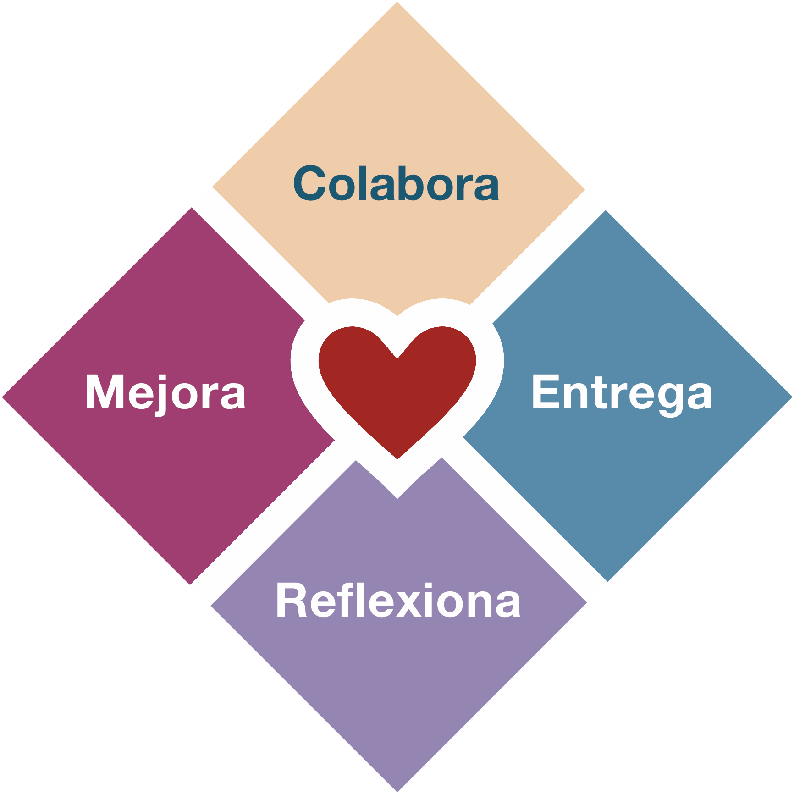
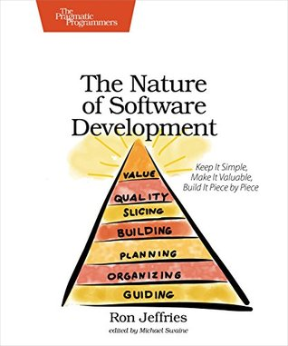

> The principles of lust\
> Are burnt in your mind\
> Do what you want\
> Do it until you find Love\
> -- Enigma

Cuando empezamos a adoptar Agilidad lo usual es enfocarnos en los [cuatro valores](https://agilemanifesto.org/iso/es/manifesto.html), ya saben, esos que dicen:

- Individuos e interacciones sobre procesos y herramientas
- Software funcionando sobre documentación extensiva
- Colaboración con el cliente sobre negociación contractual
- Respuesta ante el cambio sobre seguir un plan

Eso está muy bien, pero he observado que hay organizaciones que pretenden adoptar agilidad sin respetar esos valores. El ejemplo clásico se da con la transgresión del primer valor, en vez de fomentar la interacción entre individuos se les pide a los equipos que adopten SCRUM y usen JIRA, imponiendo un proceso y una herramienta.

Parece divertido, pero a la larga no lo es, aunque es un error bien común. Yo cometí varios errores cuando dirigí equipos de desarrollo tratando de adoptar agilidad. 

Es algo de desesperación, porque la verdad es que cuando estás en posición de liderazgo tienes que responder por tus decisiones y muchos esperan resultados y ojalá rápido. 

Entonces, en esta desesperación, surgen distintos tipos de "agilidad".

- La agilidad ["cargo cult"](https://en.wikipedia.org/wiki/Cargo_cult). Se trata de hacer  "las ceremonias" sin entender por qué. O llenar las ventanas de post-it,  olvidando de pasada que las ventanas son para que pase la luz.

- La agilidad "háganlo ustedes mismos", o anarquía por decreto. Los jefes les dicen a los equipos que ellos mismos deben organizarse, se supone que con esto los empoderan, pero en realidad los dejan abandonados a su suerte, en una de esas si fracasan no será culpa de los líderes y podrán volver a lo que "siempre ha funcionado".

- La agilidad hippie. Acá nos concentramos más en las actividades divertidas o que hacen sentir bien a las personas, donde importa más las "kudo cards" que features pasados a producción.

- La agilidad científica. En donde elaboramos hipótesis y tratamos de validarlas en 
cada iteración, estableciendo métricas que  nos permitirán elaborar nuevas hipótesis y así ad infinitum.

- La agilidad sociológica. Establecemos taxonomías organizacionales y medimos en cada iteración cómo nos hemos movido dentro de algún mapa de ruta, dedicando nuestras retrospectivas a ver en cuál estadio de evolución nos encontramos, en vez de ver cuanto software hemos construido.

Y seguro que hay varias más que ustedes también deben haber identificado.

Es tal la crisis de identidad que los fundadores del movimiento ágil se han dedicado a predicar la vuelta a los orígenes y reorganizar a sus seguidores, creando nuevos movimientos o escribiendo libros.

Alistair Cockburn con su [Heart of Agile](https://heartofagile.com) trata de volver a cuatro estadios que serían la esencia de la agilidad: Colaborar, Entregar, Reflexionar y Mejorar.

Ron Jeffries en su [Nature of Software Development](https://amzn.to/3mpn8s6) nos recuerda que lo importante es la entrega de valor permanente.

Pero estos fundamentos siempre han estado ahí, si  no fueramos tan perezosos para pinchar ese enlace que dice: ["Doce Principios del Software Ágil"](https://agilemanifesto.org/iso/es/principles.html), nos ahorraríamos varios pasos en falso.

Es más fácil aprender y repetir cuatro valores que estudiar los doce principios que los sostienen.

Pero hagamos el esfuerzo, porque esos principios fueron puestos ahí porque resumen las discusiones que tuvieron los firmantes originales del Manifiesto Ágil, algo de experiencia y sabiduría destilada debe haber allí:

## Principio 1: entrega temprana y continua de valor

> "Nuestra mayor prioridad es satisfacer al cliente
> mediante la entrega temprana y continua de software
> con valor."

Software con valor, ese es el objetivo final. 

¿Y qué es valor? 

Ron Jeffries dice que el valor es lo que queremos (what we want). Lo que nosotros, como equipo, queremos (ver principio 4). El valor es simplemente lo que quieres, aquello que te interesa.

Del libro ["The Nature of Software Development"](https://amzn.to/3mpn8s6):

> "Los métodos ágiles nos piden ordenar las cosas que hacemos basados en el valor. A veces decimos _valor para el negocio_ o _valor para el cliente_, como si estas clasificaciones ayudaran. En cierto modo ayudan, porque nos pueden hacer pensar en cosas que valoramos en el sentido de que son "buenas para el negocio" o "buenas para el cliente". Pero están lejos de ser el único tipo de valor que debemos considerar. [...]
> Podemos escoger una dirección estratégica para nuestro producto. Decidimos que necesitamos información sobre lo que los usuarios pueden preferir, así que creamos algunos prototipos y se los mostramos a eventuales usuarios.
>
> Valoramos la información.
> 
> Nuestro producto podría estar salvando vidas, quizás ayuda al despliegue rápido de una vacuna alrededor del mundo. Decidimos escoger las siguientes características a desarrollar basados en la cantidad de vidas salvadas por estas funcionalidades.
> 
> Valoramos la vida humana."

Jeffries nos advierte que podemos valorar más cosas, como el medio ambiente, o el capital, o la velocidad del producto, o el progreso, la felicidad de las personas, o valorar el placer,  la creatividad, el dinero, etc.

La habilidad del lider, del product owner, o como se llame, se pone a prueba cuando decide cuáles de todas estas cosas que apreciamos serán las que desarrollaremos a continuación. 

Debe mirar en profundidad todas estas cosas que son apreciadas para elegir la secuencia de desarrollo que nos de el mejor resultado posible como retorno por nuestra inversión (de tiempo, de dinero, de esfuerzo).

## Principio 2: aceptar el cambio

> "Aceptamos que los requisitos cambien, incluso en etapas 
> tardías del desarrollo. Los procesos Ágiles aprovechan
> el cambio para proporcionar ventaja competitiva al 
> cliente."

Esto es uno de los principios que más encuentra resistencias entre los desarrolladores, sobretodo los más viejos. En parte es porque no hemos aplicado el cuarto principio ni hemos entendido en profundidad el primer y cuarto valor. 

No se trata de establecer un contrato entre un cliente (la gente de negocios) y un proveedor (el equipo de desarrollo). Cada miembro del equipo al trabajar juntos aporta observaciones y valora el cambio, porque saben que pueden responder al mismo, sin dolor, de manera flexible y rápida, pero porque están todos **comprometidos** con el éxito del producto, y ese compromiso ayuda a aceptar el cambio.

## Principio 3: entregar software funcional

> "Entregamos software funcional frecuentemente, entre dos
> semanas y dos meses, con preferencia al periodo de 
> tiempo más corto posible."

Acá aparece este concepto de ciclos cortos de entrega. Hasta se nos dan unos parámetros específicos, entre dos semanas y dos meses (8 a 9 semanas). Pero lo importante, es que entregamos software que funciona al final de estos ciclos cortos. 

Esto es de lo primero que tiende a olvidarse, muchos equipos solo transforman cascadas grandes en mini cascadas, y tienen sprints donde diseñan la base de datos, otro sprint donde diseñan bibliotecas internas, pero el usuario sigue esperando meses para tener algo para usar. Software funcionando, eso es lo que debemos entregar en cada ciclo.

Otra cosa que ocurre es convertir esto en un time box rígido. Puedes hacer dos cosas, estableces el time box rígido y entregas lo que alcanzas a completar en en ese time box, o puedes ser flexible con esto, porque no quieres entregar algo incompleto. Acá lo importante es adaptarse a la realidad, pero no usar esta flexibilidad como excusa para alargar o posponer la entrega. 

## Principio 4: negocio y desarrollo trabajando juntos

> "Los responsables de negocio y los desarrolladores
> trabajamos juntos de forma cotidiana durante todo
> el proyecto."

Esto es muy importante. Ya lo dije arriba. No es una relación cliente/proveedor. Se trata de trabajar juntos, compartir juntos éxitos y fracasos. Es un compromiso mutuo, de trabajar de forma cotidiana durante todo el proyecto. 

No sirve que los "clientes" dejen una lista de requisitos, desaparezcan y vuelvan al final para exigir el cumplimiento.

A lo largo del desarrollo el equipo va descubriendo ambiguedades, definiciones incompletas, imprecisas o contradictorias. Hay que resolverlas en conjunto, si no existe esta interacción cotidiana se pierde tiempo, se pierde agilidad.

## Principio 5: motivación y confianza

> "Los proyectos se desarrollan en torno a individuos 
>  motivados. Hay que darles el entorno y el apoyo que 
> necesitan, y confiarles la ejecución del trabajo."

El empoderamiento no se declara por decreto. 

Si el liderazgo no se compromete con el equipo, y con el cambio, no se obtendrán resultados. Y va más allá de charlas motivacionales, se trata de todo, entorno, herramientas, clima, confianza, apertura, escuchar, acompañar y un montón de cosas difíciles de abordar, pero que son muy necesarias.

## Principio 6: conversar cara a cara

> "El método más eficiente y efectivo de comunicar 
> información al equipo de desarrollo y entre sus 
> miembros es la conversación cara a cara."

Interacciones entre personas, y la mejor es la conversación cara a cara. Eso incluye las conversaciones difíciles. 

Probablemente es la cosa más dificil de conseguir al principio, la confianza para que los miembros del equipo puedan decirse las cosas que deben decirse. Cuidado con la falsa cordialidad. Tampoco se trata de armar un ambiente lleno de conflictos, hay que aceptar que los conflictos van a surgir, pero no dejar que escalen, o que permanezcan ocultos, o latentes. 

Casi como todo en liderazgo, la mejor forma es enseñar con el ejemplo. Un lider lejano, no ayuda a lograr este ambiente, un lider que se abre y que da espacio a que surja la confianza es un gran camino. Nadie quiere esos jefes que se encierran en su oficina a llenar planillas excel, o que se sienten lobos solitarios que no se involucran con sus empleados. 

## Principio 7: la métrica más importante es software funcionando

> "El software funcionando es la medida principal de progreso."

El principio más olvidado. No es cuantos sprints hemos hecho, ni el nivel de madurez, ni cuantos valores ágiles tenemos plasmados en nuestros corazones, ni si somos todos amigos, o felices. Esto siempre se ha tratado de construir software que funcione.

Es cierto que la agilidad se ha tratado de usar en otros ámbitos, pero recordemos que este es el "Manifiesto por el Desarrollo Ágil de Software", no es el manifiesto para mejorar operaciones, restructurar el área legal de la empresa, o para escribir una constitución. 

Hay varios colegas que pretenden que esto se use para todo, yo no estoy tan seguro de que sea posible, tampoco estamos tan seguros de que sirva para desarrollar software (y hay mucho software que tampoco se desarrolla siguiendo procesos ágiles). 

Pueden usar estos principios y valores en otros espacios, pero no está asegurado, esto fue pensado en el ámbito específico del desarrollo de software, así que cuidado con su aplicación a otras actividades, hay que poner un esfuerzo adicional para adaptar estos principios, esa es al menos mi opinión.

## Principio 8: desarrollo sostenible

> "Los procesos Ágiles promueven el desarrollo 
> sostenible. Los promotores, desarrolladores y usuarios
> debemos ser capaces de mantener un ritmo constante 
> de forma indefinida."

Ritmo y rito, decía un profesor de ingeniería de software que tuve. 

Un error clásico que se comete es que cuando un equipo se afianza lo desarman re distribuyendo a sus miembros en otros equipos. Si el equipo es exitoso hay que mantenerlo unido, eso es clave para asegurar la sostenibilidad.

## Principio 9: excelencia técnica

> "La atención continua a la excelencia técnica y al 
> buen diseño mejora la Agilidad."

Se trata de tener gente preparada, competente, hábil, capaz de entender el problema y diseñar soluciones de calidad. Sin excelencia en el diseño, sin calidad en el código, sólo tendremos retrasos. 

Tal cómo nos muestra este gráfico de Martin Fowler[^1], el software de calidad permite crear más funcionalidades en el tiempo:

El software se debe hacer bien desde el principio, no se trata de liberar funcionalidades rápidamente, este software debe ser sólido, de modo que en cada iteración nos concentremos en entregar nuevo valor en vez de corregir errores.

[^1]: Fowler, ["Is High Quality Software Worth the Cost?"](https://martinfowler.com/articles/is-quality-worth-cost.html)

## Principio 10: simplicidad

> "La simplicidad, o el arte de maximizar la cantidad de
> trabajo no realizado, es esencial."

Me gusta decir que "la mejor linea de código es aquella que no se escribe". Hay que saber descartar. Cuando hablan de maximizar la cantidad de trabajo realizado lo que nos están diciendo es que no es necesario hacerlo todo. 

Hay gente que tiene más apetito en sus ojos, y van a un restaurant y ordenan un menú enorme y apetitoso para sólo comer una fracción del alimento, y el resto se pierde. Es común que se pida más de lo que realmente se necesita. O se diseñe con un afán de generalizar que después nunca se da. Aprender a descartar, a resistir la tentación de generalizar, a llenarnos de trabajo que no vale la pena, eso es lo esencial.

## Principio 11: arquitectura

> "Las mejores arquitecturas, requisitos y diseños
> emergen de equipos auto-organizados."

Este punto da para un artículo entero. En muchas organizaciones los arquitectos de software se convierten en los grandes generadores de impedimentos. No estoy diciendo que no debe haber arquitectura, se trata de entender que los que mejor están preparados para generar una arquitectura son los propios miembros del equipo. 

Pero sobre esto voy a reflexionar más adelante, y a propósito, el último principio habla de eso:

## Principio 12: reflexionar

> "A intervalos regulares el equipo reflexiona sobre
> cómo ser más efectivo para a continuación ajustar y
> perfeccionar su comportamiento en consecuencia."

No se trata de convertir la retrospectiva en una reflexión de cómo nos sentimos y expresar nuestros sentimientos, como si esto fuera un reality, o buscáramos llorar y abrazarnos al final. Tampoco es  hacer de la retrospectiva una fiesta para compartir pastel, abrazos y celebrar lo bien que trabajamos en equipo. 

Es el espacio para reflexionar sobre los errores, las lecciones aprendidas, y para valorar nuestras habilidades. Si no aprendemos de nuestras fallas, si no encontramos la causa raiz de nuestros errores entonces poco podemos hacer para mejorar.

# Nunca serás ágil

Estos son los doce principios. Como pueden ver los cuatro valores derivan de estos principios, pero estos principios aclaran el sentido de los valores. No se pueden sostener los valores ágiles sin entender en profundidad sus principios.

La verdad es que no conozco organizaciones totalmente ágiles. 

En los [últimos tiempos de mi gestión con mi equipo en Previred](https://lnds.net/blog/lnds/2019/08/15/el-fin-de-la-agilidad/), yo tenía una presentación que partía con la frase: "NO SOMOS ÁGILES".

Normalmente presentaba eso a futuros proveedores, o a gente que se incorporaba al equipo.
No sólo era una declaración para llamar la atención, era la admisión de una gran verdad. A pesar de todos tus esfuerzos es muy dificil que puedas cumplir con todos los valores y principios de la agilidad. 

Más aún en muchas organizaciones, en las que hay muchos impedimentos estructurales. Lo que ocurre es que todos, en todos los niveles, queremos seguir donde estamos. Lo que llaman "la zona de confort", mal que mal lo que más queremos es seguridad, y cuando llegas a la cima corporativa, ¿vas a querer salir de ahí? Así que esa verdad, tan brutalmente expresada, es algo que debes tener en cuenta. 

Yo creo que nadie va a lograr nunca ser totalmente ágil dentro de un mundo corporativo tradicional, algo que me tomó mucho tiempo aceptar. Y es que para lograrlo habría que cambiar tanto y amenazar la seguridad de tanta gente, que no se va a lograr. Así que mejor asumir, que no vas a ser ágil, pero puedes ver estos principios y valores como una aspiración, una meta utópica, un ideal, y tratar de acomodar, dentro de las restricciones que tienes, lo mejor de cada una. Y si no puedes lograrlo, si sientes que no te apoyan, o que no tiene sentido lo que estás haciendo, bueno, siempre hay lugares que están más cerca de estos ideales que otros.