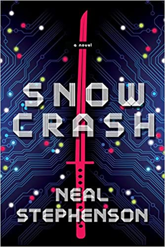

## El mundo libre de IA de Dune

>	"Aprendimos una cosa negativa de las computadoras, que la configuración de las pautas pertenece a los humanos, no a las máquinas"
>	
>	"Finalmente, los humanos se convirtieron en poco más que robots sin decisiones, sin comprender su existencia natural."
>
>	-- Citas tomadas de "Leyendas de Dune: la Jihad Butleriana", por Brian Herbert y Kevin J. Anderson
	
Es una interesante coincidencia temporal el estreno de la nueva versión cinematográfica de Dune y el lanzamiento del Metaverse por parte de Facebook (o Meta).

Para quienes no lo saben, los eventos de Dune transcurren milenios después de la **"Jihad Butleriana"**, una guerra final entre los humanos y las máquinas. Estos sucesos sonmencionados en las novelas originales de Frank Herbert, y detallados años después por su hijo Brian y  Kevin J. Anderson en la serie de las Legends of Dune.

En un reciente clip, el director Dennis Villenueve nos explica cómo le fascinó la idea de empezar su película con una escena en una biblioteca: 
	
> 	"... es un hermoso contrapunto, que nos dice muchas cosas sobre el mundo de Dune. No hay computadoras en este mundo, y la Inteligencia Artificial ha sido prohibida. No hay más inteligencia Artificial. Dune es sobre el triunfo del espíritu humano"



 

## Metaverso

Me pregunto si Mark Zuckerberg tiene una biblioteca, pero una de verdad, no una creada en su mundo de fantasía que el llama MetaVerse[^1]. Tampoco sé si habrá leido ["SnowCrash"](https://amzn.to/3EMSGzx), porque el MetaVerse es un concepto que viene de esa novela. 

Publicada en 1992, y escrita por Neil Stephenson, el título hace un homenaje a [Neuromante](https://amzn.to/3CSmtpS), de William Gibson, otra gran novela cyberpunk, que empieza con esta frase:

> "El cielo sobre el puerto tenía el color de una pantalla de televisor sintonizado en un canal muerto."
	

Los televisores antiguos nos mostraban esta imagen al estar encendidos pero sin señal:

El término snowcrash fue adoptado por los usuarios de los primeros Mac, para referirse a lo que apareceía en la pantalla cuando se producía un fallo en sus equipos[^2]:



 

Fue Gibson quien acuñó el término Ciber Espacio. Pero Stephenson  decidió llamarlo MetaVerso (MetaVerse),el universo más allá del nuestro.

En Snowcrash el protagonista es un repartidor de pizzas, pero en el MetaVerso adopta la personalidad de un príncipe guerrero samurai. A esta identidad virtual el autor la llama "Avatar", término que también hemos adoptado para nuestras personalidades digitales en juegos online, o para referirnos a las imagenes que usamos para identificarnos en redes sociales.

Pero en la novela el término snowcrash se usa para nombrar a un virus, que se distribuye tanto en el mundo real como virtual en la forma de una droga. Este virus quita la capacidad de pensar en forma creativa o independiente a las personas, y las deja limitadas a ejecutar rutinas que no se pueden modificar.

Ahora bien, si estás leyendo esto en tu móvil, seguro que avanzas en el texto  mediante un movimiento con tu dedo índice, de abajo hacia arriba, esa acción repetitiva se llama infinite scrolling. 
Es el mismo movimiento para recorrer las historias e imágenes de  Instagram, o el timeline de sus "amigos" en Facebook o Twitter, o los videos de TikTok.

Este scrolling infinito en las apps móviles está diseñado para hacer estas aplicaciones irresistibles y adictivas. Algo que los sicólogos llaman comportamientos adictivos[^3]. 

Hemos sido contaminados por una versión alpha de snowcrash, una que aún no alcanza todo su potencial. 

Ya pueden extrapolar lo que ocurrirá con el metaverso, que quieren impulsar empresas como Facebook o Microsoft[^4]. Una experiencia totalmente inmersiva y por supuesto más adictiva que en el móvil.



Esta experiencia, que seguro será adictiva, será adoptada masivamente, eso es seguro, gracias al impulso de otro fenónemo: el FOMO.

## FOMO

FOMO viene de Fear Of Missing Out, o miedo a perderse algo. 

El FOMO se refiere a ese sentimiento o percepción de que otro están teniendo más diversión, viviendo mejor, o experimentando mejores cosas que tú.

Genera un profundo sentimiento de envidia y afecta la auto estima, algo que se exacerba con servicios como Facebook o Instagram.

El FOMO ha estado con nosotros por mucho tiempo, es un sentimiento antiguo del que hay traza en antiguos textos. Pero recién se empezó a estudiar hace unas décadas atrás. Fue en 1996 que el término fue acuñado nada menos que por un experto en marketing, Dan Herman, lo que es muy revelador.

En marketing el FOMO se usa para manipular tu intención de compra. En [un estudio de 2013](https://www.sciencedirect.com/science/article/pii/S0747563213000800) el FOMO se define así:

> “…una aprensión generalizada de que otros podrían estar teniendo experiencias gratificantes de las cuales uno está ausente. El FOMO también​ se caracteriza por el deseo de estar continuamente conectado con lo que otros están haciendo.”

Se estima que casi el 70% de los milenials experimentan FOMO, y que realizan sus compras impulsados por este sentimiento. Casi el 60% de los usuarios de redes sociales se ven afectados por este[^5].

En el caso del impacto en redes sociales, lo que ocurre es que las personas comparan su vida con los momentos explendorosos de las vidas de otros (publicitados en sus redes sociales). Entonces la sensación de normalidad se ve afectada porque sienten que lo estan haciendo peor que sus pares (amigos o colegas). 

Cuando estás en redes sociale puedes ver fotos o videos detallados de cómo tus pares se divierten si ti, algo que no ocurría en las generaciones anteriores. Es por eso que este fenómeno es tan peligroso en los más jóvenes. 

La redes sociales han creado una plataforma ideal para presumir. Es el lugar donde las cosas, los eventos, incluso la felicidad en si misma se luce. Los usuarios de redes sociales comparan sus fotogénicas experiencias, y muchos se quedan detrás  pensando en todo lo que les falta.

Lo peor de todo es que las redes sociales saben que esto pasa, pero les importa un carajo. Lo que ellas buscan es aumentar la atención, y por eso venden esta adicción, esta droga, esta versión MVP de Snowcrash.

En el Metaverso se podrán crear nuevas realidades y por supuesto las mejores, las más llenas de detalles, los avatares más poderosos, los espacios virtuales más bellos, estarán accesibles a los que tienen más recursos. La sensación de FOMO será peor.

## El peligro de Facebook

Se sabe que Facebook hizo un experimento para ver si podía manipular los sentimientos positivos y negativos de las personas. En 2014 publicaron sus resultados en en [PNAS](https://www.pnas.org/content/111/24/8788.full), en su presentación dice:

>	Demostramos, a través de un experimento masivo (N = 689,003) en Facebook, que los estados emocionales se pueden transferir a otros a través del contagio emocional, lo que lleva a las personas a experimentar las mismas emociones sin su conciencia. Proporcionamos evidencia experimental de que el contagio emocional ocurre sin interacción directa entre las personas (la exposición a un amigo que expresa una emoción es suficiente) y en ausencia total de señales no verbales.
	
Y todo eso ha sido usado por distintos grupos extremos, terroristas, políticos, para manipular el sentimiento e incluso el comportamiento de las personas, como nos muestran distintas publicaciones recientes, o se puede leer en el libro ["An Ugly Truth: Inside Facebook's Battle for Domination"](https://amzn.to/3nYf02t), de las autoras Sheer Frenkel y Cecilia Kang.

El FOMO, los comportamientos adictivos, la manipulación de sentimientos, son todos aspectos negativos de las redes sociales, son el origen de nuevas enfermedades y trastornos que están afectando a nuestra sociedad. La pregunta es ¿cuánto tiempo más dejaremos que sigan propagándose sin hacer nada al respecto?

Es tiempo al menos de cuestionar el tiempo que pasamos pegados a nuestro celular, pero sobretodo de observar que pasa con los más jóvenes. 

Hay que entender que Facebook sólo actúa motivado por el dinero. Ellos quieren tu atención, quieren tenerte atrapado la mayor cantidad de tiempo posible.

Yo he decidido desinstalar las apps de Instagram, Messenger y Facebook de mi móvil, y limitar el uso de whatsapp (me gustaría que todo el mundo se migrara a otras plataformas de mensajería). 

No quiero eliminar mis cuentas aún,  he pensado en las facetas de seguridad y suplantación de identidad, y prefiero tener la cuenta de Facebook e Instagram en el mínimo posible y cuando llegue a usarlas será a través del PC.

Es un tema preocupante, y creo que es importante que nos informemos sobre los daños que ha hecho Facebook (o Meta) a la sociedad. Y también hacer conciencia sobre estos fenómenos que afectan a las personas, desde el FOMO hasta las ciber dependencias. Por eso que no me gusta mucho la idea del Metaverso, por muy cool que pueda parecer. No niego que es fascinante un mundo virtual al que accedes via realidad virtual, pero el problema es quienes van a controlar ese metaverso, y con qué fines. Finalmente como dicen en el universo de Dune:

> "Aprendimos una cosa negativa de las computadoras, que la configuración de las pautas pertenece a los humanos, no a las máquinas"

El verdadero enemigo no es la IA, son los humanos que ponen las pautas sobre esa IA y todos los otros algoritmos que nos manipulan.

**¿Te gustó?**, [puedes apoyarme con un café](https://ko-fi.com/X8X420K04) 



[^1]: Durante 2015 Zuckerberg publicó 23 recomendaciones de libros, el primero de su lista se agotó en Amazon después que el fundador de Facebook lo recomendara a sus millones de seguidores en la plataforma.

[^2]: Esto lo cuenta Stephenson en su ensayo ["In the Beginning... Was the Command Line"](https://amzn.to/3065bYa).

[^3]: En este artículo en Wired pueden encontrar más información al respecto https://www.wired.com/2017/03/irresistible-the-rise-of-addictive-technology-and-the-business-of-keeping-us-hooked/

[^4]: Sobre lo que planea Microsoft para el Metaverse, pueden leer esta nota de The Verge sobre los planes para Teams 3D  https://www.theverge.com/2021/11/2/22758974/microsoft-teams-metaverse-mesh-3d-avatars-meetings-features

[^5]: Fuentes: https://mumbrella.com.au/fomo-millennials-may-not-ones-missing-462272, https://strategyonline.ca/2015/03/09/the-impact-of-fomo/, https://strategyonline.ca/2015/03/09/the-impact-of-fomo/
