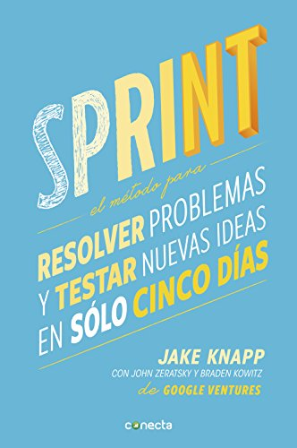
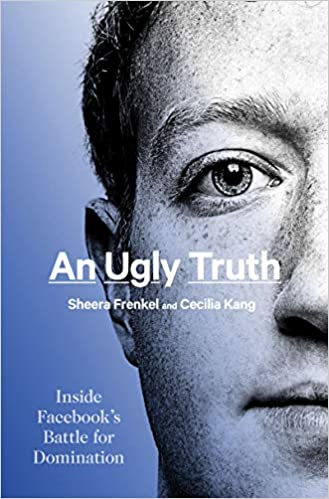
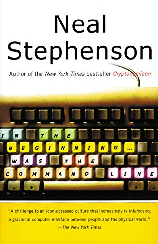

Continuamo con el registro de los libros leidos este año, esta vez cubriendo el mes de octubre. Acá va la lista de libros leidos. He pensado al final del año publicar una lista de libros recomendados, así que atentos.

## Lecturas de Octubre 2021

### Máquinas como yo - Ian McEwan

Ian McEwan es, se supone, uno de los escritores británicos más importantes desde 1945, de acuerdo a The Times. Si es así no se nota con esta novela. Realmente de lo más irregular que he leido en el último tiempo, me sentí casi estafado. Porque hay una promesa interesante. Se trata de una suerte de ucronía, en que Alan Turing no ha muerto y se desarrolla la inteligencia artificial muchas décadas antes, de modo que en 1982 ya existen androides inteligentes. 

Es un mundo donde Inglaterra pierde en Las Malvinas, donde Turing es millonario y vive abiertamente su homosexualidad, y la historia se desarrolla de una manera distinta. Pero el personaje principal es soso, una persona que ha ejercido varios oficios ad hoc para ajustarse a las necesidades de la novela, un hombre de unos treinta y dos, enamorado de una vecina diez años menor, ella con una historia extraña y un tanto escabrosa. Este personaje tiene algo de dinero porque invierte en la bolsa, se supone que a eso se dedica, pero de una manera bien poco profesional, en realidad es como esos personajes de teleseries latinas, en la práctica no trabaja. Bueno, con ese excedente de dinero se compra un androide, y ahí se arma un seudo triángulo, y empiezan dramas de teleserie barata. En realidad podría haber sido interesante, pero incluso el androide y las reflexiones sobre computación e inteligencia artificial son muy básicas y algunas bastante erradas. También se mete en el tema del abuso sexual a mujeres, pero de una manera entre inadecuada y bastante simplista en mi opinión. Habrá gente que le guste, pero creo que tiene profundos fallos narrativos y temáticos, como investigó muy por encima algunos temas.

[Disponible en Amazon >>](https://amzn.to/3H1ZlaV)

### Sprint: El método para resolver problemas y testear nuevas ideas en sólo 5 días - Jake Knapp & John Zeratsky

En realidad es una relectura (en Kindle), de este libro, que adquirí hace un par de años. Hice esta relectura para refrescar la metodología, que es parte de uno de los cursos que imparto en la universidad. Este método, o técnica es super intensivo y promete desarrollar un prototipo en cinco días. Tiene una serie de principios y técnicas muy definidas, que también se han ido ampliando con el tiempo, muy basadas en los principios del Design Thinking. Como toda metodología de este tipo su éxito depende mucho de la capacidad de movilizar a la organización detrás de los objetivos de esta. Pero el libro aparte de ser una introducción a la técnica, contiene ejemplos reales de uso en diversos emprendimientos.

[Disponible en Amazon >>](https://amzn.to/3khcbsp)

### The Ugly Truth: Inside Facebook's Battle for Domination - Sheera Frenkel & Cecilia Kang

El libro es de dos periodistas del New York Times, y muestra una serie de incidentes de Facebook, que han sido cubiertos en distintas fuentes, pero para mi fue interesante leerlas en este libro, porque había algunos que no conocía. Se supone que las autoras se documentaron en cientos de entrevistas y fuentes públicas y anónimas. Encontré el libro breve y que le faltó profundidad. No está totalmente al día, pero si bastante cercano a recientes eventos de fuga de información de empleados de Facebook. La conclusión a la que llegas es que la gestiónde Zuckerberg es pésima, y que le importa un bledo hacerse cargo de esto temas. Es probable que eso sea cierto, a juzgar por lo que está pasando. Recomendable, aunque insisto que me habría gustado algo más extenso y con más detalles.

[Disponible en Amazon >>](https://amzn.to/3kiBU3p)

### In the Begginning... Was the Command Line - Neal Stephenson

Se trata de un ensayo escrito alrededor de 1999, principalmente sobre los sistemas operativos que imperaban en ese momento, y el avance de Linux. Es casi un ensayo para convencerte de usar Linux, o mejor BeOS (sí, así de viejo es el libro). Pero es entretenido igual, porque tiene una parte en que reflexiona sobre las prácticas de las grandes compañías con respecto a la tecnología, y varios de los diagnósticos que el autor aplica a Microsoft y Apple, aplican a muchas de las grandes compañías tecnológicas de la actualidad. Además soy fan de Stephenson y he decidido que voy a leer toda su obra eventualmente, así que me faltaba este.

[Disponible en Amazon >>](https://amzn.to/3khi6O0)

Estos son los libros que he leido este mes, cuéntame, ¿qué estás leyendo tú?
