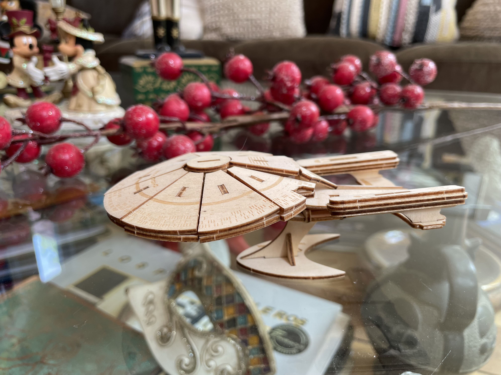

¿Han oído ese adagio que dice que no se le puede enseñar trucos nuevos a un perro viejo? Pues, no es verdad. Claro que se puede aprender, y mucho. 

Yo al menos este año he aprendido montones, y de personas mucho más jóvenes que yo.

Mi padre decía que siempre estamos aprendiendo, incluso en el momento de nuestra muerte aprendemos sobre uno de los mayores misterios de nuestra existencia.

Hay gente que dice que tiene que ver con la neuroplasticidad. La teoría es que a menor edad tienes más neuroplasticidad, y la vas perdiendo al envejecer.

¿Qué es la neuroplasticidad?

Es la capacidad que tienen nuestras neuronas para modificar su estado, de modo que nuestro cerebro crea nuevas estructuras y conexiones neuronales, en función de las condiciones del entorno en que se desarrolla.

Ya saben, entorno fijo y aburrido, poco desarrollo neuronal. Entorno variable y estimulante, mucho desarrollo neuronal.

Siendo pequeño desarrollé estrabismo. La leyenda familiar cuenta que  el oftalmólogo les dijo a mis padres que no necesitaba operación, bastaba con que me taparan un ojo y me estimularan con juegos para que desarrollara la musculatura del ojo que se desviaba. No sé si es cierto eso, pero dice mi madre que pasaba varias horas conmigo jugando con juguetes de colores, bloques y esas cosas.

También tuve muchos legos y juegos similares. Y ahora mis puzles se plasman en lineas de código. Quizás esos estímulos tempranos formaron mi capacidad analítica y espacial, que es útil para desarrollar habilidades lógico-matemáticas, y por consecuencia, capacidad para programar.

La cosa es que desde chico que tengo una afición a los puzzles multidimensionales. Desde los antiguos mecanos hasta los legos. 

Resulta que este año [mi hermano](http://www.ricardodiaz.org) me envió un regalo, un juego para armar de madera precortada con laser, el que después de caer en mis manos resultó en esto:

Lo armé la misma noche de Navidad. Durante una hora fui un niño armando este puzzle. Todos se acostaron y yo me quedé en silencio ensamblando una réplica en madera del Enterprise D. 

Gracias hermano, no tanto por el regalo físico, sino por el momento.

La experiencia ñoña perfecta.

Ahora volvamos a lo de la plasticidad neuronal.

Cuando nuestro cerebro crea un camino neuronal, este puede desaparecer si no se refuerza. Es igual que esos caminos que abrimos en la hierba, en la medida que pasamos por él el terreno se va asentando, se despeja y hemos originado un sendero.

Entonces la mejor forma de mantener  nuestra plasticidad neuronal es seguir produciendo nuevos senderos, que al fin y al cabo son nuevas experiencias.

Conozco gente que dicen que no les gusta probar nuevas comidas, o “comidas extrañas”, no se atreven a probar sabores que no sean los ya conocidos. O personas que no se arriesgan a tomar rutas diferentes, o conocer nuevas personas, a interactuar con gente que piensa distinto, o incluso a cuestionar sus creencias personales. Ahí tenemos a personas que empiezan a atrofiarse.

Lo contrario de la plasticidad es la rigidez.

Se dice que los conservadores quieren que todo se quede como esté (esa es una buena definición de conservador, en realidad). Y si bien es una posición legítima, porque lo que buscan es estabilidad y seguridad, provoca, a la larga una suerte de atrofia neuronal social. Lo mismo pasa en las organizaciones, hay gente que no quiere que se prueben cosas nuevas. Quieren dejar todo como está, porque así han operado por años: “las cosas siempre se han hecho así en estos lados”.

Cada vez que eres rígido estás dejando fuera un montón de oportunidades. Tu mente se atrofia, tu capacidad para enfrentar nuevos desafíos se reduce. He tenido la fortuna de que cuando he sentido que eso empieza a pasarme he tomado cambios drásticos en mi vida, y que siempre me han apoyado. 

En cada cambio he conocido gente asombrosa, y muy inteligente, que me han desafiado y con los cuales he aprendido “nuevos trucos”. Pero eso es suerte también. Aunque hay algunos que dicen que el olfato nos guía hacia nuestros similares, o como decía Hermann Hesse: 

> “Cuando alguien que de verdad necesita algo, lo encuentra, no es la casualidad quien lo procura, sino él mismo. Su propio deseo y su propia necesidad le conducen a ello”

Con el tiempo me he dado cuenta de que soy un optimista. Creo que son muchas más la cosas positivas que las negativas en este mundo. Lo que ocurre es que para lograr las positivas tenemos que arriesgar, dejar de hacer las cosas como las estábamos haciendo, dejar de ser rígidos y conservadores, y al contrario más abierto y confiados. 

Siempre hemos visto que la imagen del rígido es de una persona vieja, atrofiada, pesimista y que ve amenazas en todo y en todas las personas que no son como ella. 

La plasticidad significa lidiar con esas diferencias, convencer más que imponer. Escuchar y entender más que criticar o ningunear. En política por ejemplo, hay gente que se declara progresista o liberal, sin embargo, es la primera que ningunea al pueblo por no votar como ellos. Eso también es rigidez. De hecho, hay un mote, acá en Chile al menos, con el que ningunean al que demuestra más plasticidad en política: amarillo. La rigidez no es un defecto sólo de la derecha conservadora. Hay rígidos en todos lados.

Una persona que tiene un alto grado de plasticidad neuronal sigue aprendiendo toda la vida. Yo estoy seguro de que no es cierto eso de que la plasticidad disminuye con la edad. Creo que la plasticidad neuronal tiende a perderse cuando nos negamos a seguir desarrollándola.  

Empieza un nuevo año, y tengo varios propósitos, supongo que ustedes también. Pero pienso que la clave para tener éxito en esos propósitos es no ser rígidos. La plasticidad puede ser la que nos ayude a enfrentar a este mundo cambiante, tan lleno de amenazas, no obstante repleto de oportunidades. 

Espero que esta pequeña reflexión sobre la plasticidad les sirva para reevaluar sus propósitos, y se abran a nuevas oportunidades que se les presenten en la vida. 

Quiero aprovechar de agradecer a quienes me soportan en [Ko-fi](https://ko-fi.com/lnds), e invitar a quienes no lo hacen a incorporarse. El próximo año pretendo publicar un nuevo libro y su apoyo ayudará a lograr este objetivo. Para apoyarme basta con invitarme a un café en Ko-fi presionando este botón:



Feliz Año Nuevo, larga vida y prosperidad.