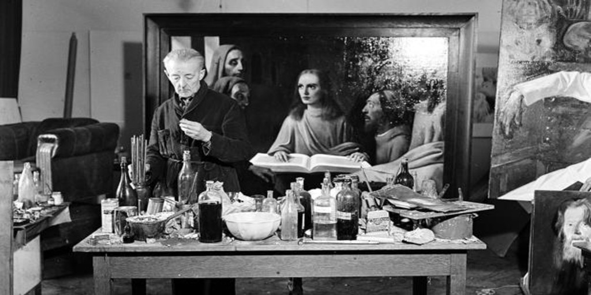
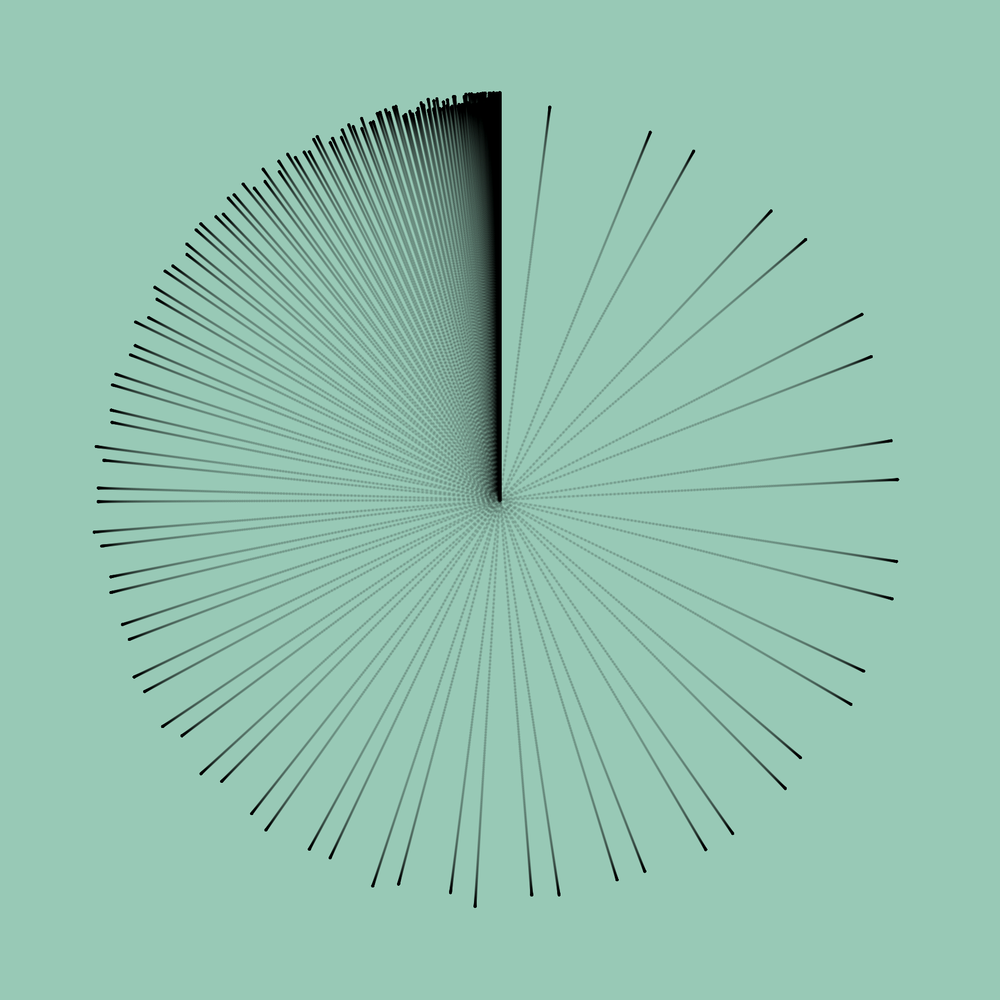

El placer que debe haber sentido Herman Göring al apreciar el cuadro "Cristo y la Mujer Adúltera", de Johannes Vermeer, solo se compara con el escalofrío que debió sentir al desembolsar los casi dos millones de florines que pagó por el mismo (casi siete millones de dólares actuales).

No sabemos si alguna vez colgó la pintura en algún salón u oficina, o si pudo mostrárselo al mismísimo Führer. Quizás pensaba regalárselo o vendérselo. El hecho es que la obra fue escondida en una mina de sal en Austria.

Cuando los aliados recuperaron las diversas obras robadas por el régimen nazi rastrearon la compra del "Cristo y la Mujer Adúltera" hasta **Han van Meegeren**, un célebre comerciante de arte y retirado pintor. La característica especial de este señor era su habilidad de encontrar obras desconocidas del maestro holandés. Años antes, en 1937, había logrado vender "La cena de Emaús" en 520.000 florines (unos 4 millones de dólares actuales) la que finalmente fue donada por un magnate al Museo de Róterdam.

Van Meegeren fue acusado de colaborador de los nazis, por vender esta obra al mismísimo segundo de Hitler. Ante la expectativa de la pena de muerte, el acusado decide confesar que en realidad era un falsificador de arte, que los cuadros mencionados fueron pintados por él mismo. Con esto pasó a convertirse en una especie de héroe nacional al admitir que había engañado al jerarca nazi cobrándole una ridícula suma de dinero.

Durante el juicio Han van Meegeren muestra su técnica de falsificación al tribunal pintando otro cuadro, mostrando de este modo como fue que engaño a los expertos que certificaron las obras.

Fascinante historia contada de forma muy entretenida en el filme de 2019 [«The Last Vermeer»](https://www.imdb.com/title/tt8337320/) dirigido por Dan Friedkin, que les recomiendo ver.

Lo que no sabemos, ni nos cuentan en la historia, es que sintió Göring cuando desembolsó tamaña cifra de dinero. ¿Orgullo? ¿Vanidad? ¿Sentido de superioridad? ¿Poder? Saber que tenía en sus manos una obra única, original, nunca vista porque llevaba perdida muchos años.

¿Qué habrá sentido Van Meegeren al observar el rostro del segundo de Hitler? Es claro que debe haber tenido una sonrisa en su rostro, quizás algún breve gesto burlón. Por dentro risa, y quizás alegría. No creo que haya habido patriotismo, era un hombre vividor adicto al lujo y los placeres mundanos, alejado de esas ideas, aunque no ignorante de lo que pasaba. Igual debe haber sentido desprecio por el bárbaro soldado, ignorante del arte, que trataba de vestirse elegante, saqueando o comprando todo el arte que pudiera encontrar.

Así son los bárbaros cuando acumulan mucha riqueza y nada de cultura. Necesitan adquirir aquello que no pueden entender ni apreciar en profundidad.

Al menos Göring tenía algo que podía esconder en una mina de sal.

Pienso en los que adquieren un [NFT](https://es.wikipedia.org/wiki/Token_no_fungible). Y en quienes los producen. Los Göring y Van Meegeren de nuestra época. Claro que en cierto modo son todos nuevos bárbaros que solo especulan con los excedentes que han generado desde la nada.

En un reciente artículo, el criptógrafo y creador de [Signal](https://signalfoundation.org), Moxie Marlinspike, desvela el problema detrás del NFT.

En ["My first impressions of web 3"](https://moxie.org/2022/01/07/web3-first-impressions.html) nos muestra cómo es capaz de crear un NFT que se comporta distinto según el lugar donde se publique el mismo. Las imágenes a continuación lo demuestran.

Esta imagen se muestra en el sitio de ventas de NFT [Opensea](https://opensea.io):

La siguiente es la versión que verán quienes quieran adquirirlo en [Rarible](https://app-raribles.com):

Y por último lo que verá en su *"wallet"* quien adquiera el NFT:

Con esto nos muestra de forma muy clara que el NFT no es lo que algunos creen que es. Un modo de tener "arte" o lo que sea de manera única. Porque el NFT tiene un fallo fundamental en su implementación, de acuerdo a lo que nos explica Marlinspike en su artículo:

> En lugar de almacenar los datos en la cadena, los NFT contienen una URL que _apunta a_ los datos. Lo que me sorprendió de los estándares fue que no hay ninguna firma hash para los datos ubicados en la URL. Al observar muchos de los NFT en los mercados populares que se venden por decenas, cientos o millones de dólares, esa URL a menudo solo apunta a algún VPS que ejecuta Apache en algún sitio. Cualquiera que tenga acceso a esa máquina, cualquiera que compre ese nombre de dominio en el futuro o cualquier persona que comprometa esa máquina puede cambiar la imagen, el título, la descripción, etc. de la NFT a lo que quiera en cualquier momento (independientemente de si no "poseen" el token). No hay nada en la especificación de NFT que le diga cuál "debería" ser la imagen, o incluso le permita confirmar si algo es la imagen "correcta".

Es decir, podemos publicar una imagen en un sitio, con no sé, digamos que una fotografía, luego vender el NFT y después bajamos el sitio.

Ahora bien, lo que venden en realidad es el NFT, el Non Fungible Token, que no es más que un registro en el blockchain, que tiene una URL, pero solo eso, una cadena de caracteres que corresponde a la URL. 

En rigor pueden decir que no te han estafado, porque te vendieron el token, ese registro en el blockchain, no la imagen, la que después de todo, cualquiera puede descargar.

Quienes entendieron bien esto se dieron cuenta de que es una forma fácil de ganar dinero con sus obras sin desprenderse de ellas. Como por ejemplo, el hijo de John Lennon, [quien subastará NFT de su colección privada de objetos de los Beatles](https://www.elfinanciero.com.mx/espectaculos/2022/01/26/julian-hijo-de-john-lennon-subastara-nft-de-su-coleccion-personal-de-the-beatles/).

Pienso como habría sido la historia si en vez del cuadro Göring hubiese comprado el NFT del "Cristo y la Mujer Adúltera", de ese modo el cuadro nunca habría abandonado Holanda, y quien sabe si algún tribunal se hubiera molestado en hacer un juicio por tan ridícula transacción.