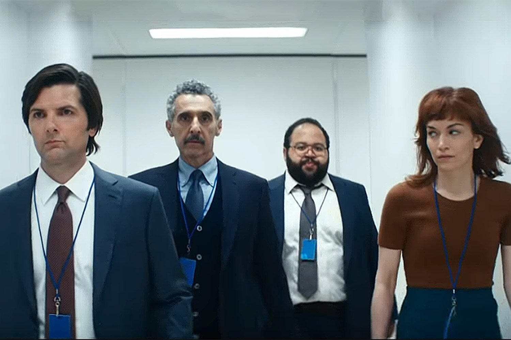

Creímos que la pandemia y el encierro nos llevaba a un mundo distópico, pero esa experiencia sirvió para darnos cuentas que estar encerrados dos o más horas en un auto o en el metro y pasar más tiempo en la oficina que con nuestra familia era la verdadera distopía.

Recuerdo que varios años atrás un colega, o quizás un gerente de donde trabajaba, mencionó que era importante cuidar el clima laboral, y mantener un entorno armonioso porque después de todo pasábamos más tiempo en el trabajo que en nuestra propia casa.

Y si realizabas encuestas de clima laboral, una de las aspiraciones más sentidas de los trabajadores era la necesidad de equilibrar su vida familiar con la laboral.

Más evidencias de que lo que vivíamos era del todo incorrecto.

¿Cómo llegamos a esa situación?

Si ustedes analizan la historia humana, el trabajo y la vida laboral siempre estuvieron cercanas. El herrero tenía su taller en su casa, del mismo modo que el agrícola vivía en el campo que trabajaba, hasta el profesor vivía en la escuela o cerca de ella. Nuestra sociedad se fue complicando y fue la industrialización y la posterior informatización la que llevó a que grandes cantidades de personas se desplazaran de sus hogares a los puestos de trabajo.

Pero ahora nos dimos cuenta de que muchos trabajos no requieren ese desplazamiento, y descubrimos que podíamos vivir y trabajar en el mismo lugar.

Descubrimos que esa división era del todo innecesaria. Claro, tenía que desarrollarse la tecnología de comunicaciones y tuvo que forzarse la "transformación digital" de forma abrupta por la pandemia, pero la conclusión es evidente. 

Por supuesto esto no aplica aún para todos los trabajos, sin embargo, debería ir aumentando en el tiempo, después de todo llegará un momento en que mucho trabajo duro será ejecutado por robots. 

Tampoco está exento de problemas. No todas las personas tienen las posibilidades de armar una infraestructura adecuada en su hogar para trabajar remoto. Además, muchas empresas no han ayudado en este proceso al no darle apoyo en los gastos adicionales que esta nueva situación conlleva, como cubrir los costos de internet y servicios básicos que aumentan en el hogar. 

Es cierto que escribo esto desde una posición privilegiada. Yo vivo en una casa y debido a que mis hijos mayores ya no viven conmigo he podido acomodar una habitación como mi oficina, algo que tuve vetado por mucho tiempo. También trabajo en una industria donde esto es totalmente posible y natural. Es más, trabajo en un equipo que está distribuido en distintas partes del globo. 

Yo creo que si ya dimos el paso debemos avanzar más allá. Debemos volver a lo que me parece más natural para el ser humano.

Sé del caso de un colega que ha trabajado desde distintas ciudades del país en este periodo de pandemia. Yo mismo he alternado mis estancias entre mi casa en Santiago y la propiedad que construimos en el sur. Nos hemos convertido en nómades. O quizás hemos vuelto a serlo, tal como lo éramos hace miles de años.

Se habla del trabajo híbrido y del trabajo remoto como posibilidades que se les deben dar a los trabajadores. Yo pienso que a estas alturas, después de la experiencia probada y demostrada, son más que eso. Ya deberían ser derechos. Es más, opino que el concepto al que deberíamos aspirar es a esta idea del trabajo nómade. El trabajo libre de horarios, ataduras físicas y si me apuran libre de jerarquías, pero quizás me estoy excediendo en mi visión revolucionaria. 

# Separación

La serie de Apple TV+ "Severance" propone una visión distópica interesante y perturbadora. Llevan la realidad a su conclusión casi evidente. 

En la serie los trabajadores se someten a un procedimiento quirúrgico que divide su personalidad. De ese modo, al entrar a su entorno de trabajo, todos sus recuerdos de su mundo familiar y social desaparecen. Incluso desarrollan otra personalidad que solo funciona en el trabajo, se han convertido en unos "innies", perfectos drones laborales que desarrollan actividades aparentemente absurdas.

Pero el ser humano y sus ansias de saber y entender el sentido de su vida siempre surge al final, y es ahí donde nace el conflicto que guía el desarrollo de este show de televisión. 

Hay varios dilemas éticos y filosóficos profundos e interesantes en la de la serie, partiendo por el hecho de que estos trabajadores han optado voluntariamente por aplicarse el proceso de separación.

¿Saben lo que me angustia más de ver esa serie? 

Es que si a las personas se les diera la posibilidad de vivir vidas completamente separadas en su mundo laboral y en su vida personal, muchos aceptarían. 

Vivimos tiempos interesantes, pero tenemos la posibilidad de redefinir nuestra relación con el trabajo, hemos descubierto que hay cosas que pensábamos imposibles, que ya no lo son. Quizás más que redefinir, lo que estamos haciendo es recuperar. Me parece que esta idea de volver a ser nómades es lo más natural del mundo, a lo mejor es la clave para recuperar nuestra libertad, nuestro sentido de desarrollo personal, probablemente hasta sea mejor para el medioambiente.

Hace poco vi pasar en  Twitter una oración que decía más o menos lo siguiente: "estamos perdiendo el trabajo remoto y no estamos haciendo nada para defenderlo".  Y es cierto. 

No estoy en contra de que las empresas tengan oficinas y las pongan a disposición de sus empleados. Me parece bien, sobre todo porque no todos tienen la posibilidad  de poder crear un entorno adecuado para trabajar en su hogar. 

Tampoco todo el mundo tiene la posibilidad de desplazarse a una segunda vivienda, o poder ser un nómade con la capacidad de arrendar alojamiento en cualquier parte. 

Pero talvez las empresas deberían brindar el espacio para que sus trabajadores puedan realizar sus labores de una forma adecuada. No obstante, también debería poder promoverse esta posibilidad de que puedan trabajar desde sus hogares o en ambientes más cercanos a sus casas. Tal como dije al principio, pasar dos horas en una lata con ruedas era la verdadera distopía. 

La solución no puede ser volvamos todos a las oficinas y volvamos a contaminar y arruinar nuestra calidad de vida. Debemos mostrar que algo aprendimos de este tiempo.
