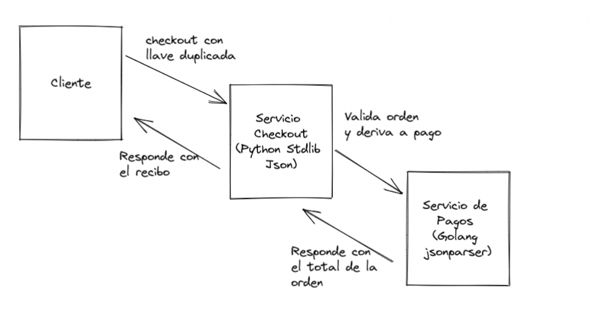

En su charla para "El Congreso del Futuro" el afamado experto [Bruce Schneier](https://www.schneier.com/) nos da seis lecciones sobre ciberseguridad:

1.  La mayor parte del software está mal escrito y es inseguro. Y la principal razón detrás de esto es económica. No se invierte tiempo ni recursos para escribir software de calidad.
2. Internet nunca fue diseñado pensando en la seguridad. Internet era un experimento y era una red con fines académicos y de investigación, que debido al impulso de algunos empresarios de Silicon Valley a fines del siglo pasado se convirtió en la plataforma donde se desarrolló gran parte del comercio electrónico y las redes sociales de ahora. Pero en sus principios no se consideró que sería usada con estos fines, y, por lo tanto, carecía de mucha infraestructura de seguridad, eso ha ido mejorando con el tiempo, pero aún falta.
3. La extensibilidad de sistemas permite nuevos ataques. El software es extensible y muchas veces permitimos esa extensibilidad con el fin de ganar flexibilidad futura, esta propiedad tiene su contracara en que puede ser utilizada para explotar vulnerabilidades.
4. La complejidad hace más fácil el ataque que la defensa. El software es cada vez más complejo e interconectado y esas complejidades solo van en aumento. La superficie de ataque, la cantidad de puntos expuestos que pueden fallar o pueden ser empleados para atacarnos aumenta cada día más.
5. Hay nuevas vulnerabilidades en las interconexiones. Y sobre esto es lo que voy a hablar en detalle en este artículo. Pero es obvio que en un mundo más interconectado y complejo la defensa de esas interconexiones aumente.
6. Los ataques van mejorando haciéndose más fáciles y más rápidos. Hoy en día es posible automatizar estos ataques, subcontratarlos incluso. Hay cada vez más ciberdelincuentes que cuentan con mejores herramientas para desarrollar estos ataques.

Llevo un par de años enseñando un curso de seguridad en aplicaciones web y móviles, para un magíster de ciberseguridad. Junto con enseñar lo clásico de esta materia,  explico a mis alumnos algunos principios que han moldeado el desarrollo de software moderno. En algunos casos, estos fundamentos han tenido consecuencias que se traducen en vulnerabilidades que debemos entender o al menos estar conscientes de que existen, con el fin de tomar los resguardos adecuados.

Un ejemplo de estos principios es el conocido como "backward compatibility", que consiste en respetar antiguas implementaciones de una pieza de software, incluyendo sus fallos o bugs. Veamos esto con uno de los casos que expongo a mis alumnos. 

### El caso de las llaves duplicadas

Hoy en día es muy habitual el uso de API REST que usan JSON como medio para codificar los mensajes.

Consideren  el siguiente objeto JSON:

```javascript
{
"orderId": 10,
"cart": [
   {
    "id": 1, 
    "qty": 10
   },  
   {
    "id": "3", 
    "qty": -1, 
    "qty": 1
   }
]}
```

Se ve bastante normal, salvo por el hecho de que la llave `cart` contiene un arreglo, cuyo segundo elemento tiene duplicada la llave `qty`.

Este objeto es válido y permitido. El problema es cómo se interpreta esta situación por los distintos analizadores de JSON disponibles.

Veamos esto con más detalle. Si tenemos este objeto:

```javascript
obj = {"test": 1, "test": 2}
```

 ¿Qué obtendremos con esta expresión `obj["test"]`? 

 Depende. Algunas implementaciones del analizador de JSON retornarán el primer valor, es decir 1. Pero otras retornarán legitimamente 2. E incluso otras implementaciones generarán un error.

La especificación IETF JSON RPC 8259 dice:

_An object whose names are all unique is interoperable in the sense that all software implementations receiving that object will agree on the name-value mappings. When the names within an object are not unique, the behavior of software that receives such an object is unpredictable. Many implementations report the last name/value pair only. Other implementations report an error or fail to parse the object, and some implementations report all of the name/value pairs, including duplicates._  
  
_JSON parsing libraries have been observed to differ as to whether or not they make the ordering of object members visible to calling software. Implementations whose behavior does not depend on member ordering will be interoperable in the sense that they will not be affected by these differences._

Así que la especificación no se hace cargo de este problema, quizás para no romper la compatibilidad con versiones ya disponibles. El resultado, por lo tanto, depende de la implementación.

Para ver como esto puede afectar la seguridad de una aplicación vamos a tomar un [ejemplo desarrollado por Jake Miller](https://bishopfox.com/blog/json-interoperability-vulnerabilities).

### Explotando esta vulnerabilidad

Consideren la siguiente situación, tenemos un cliente que interactúa con un servicio REST encargado del checkout de una orden de compra. Este servicio está escrito en Python con el framework Flask y usa la biblioteca estándar de este lenguaje para procesar el mensaje  JSON. La función de este servicio es validar que las cantidades solicitadas en el carro de compras esté dentro de un rango válido (positivo), luego deriva el pedido a un servicio de pagos y una vez procesado el pago inicia el despacho de los productos y generar un recibo.

El servicio de pagos está escrito en Go, y utiliza una biblioteca de alto performance para realizar el análisis de los mensajes JSON (buger/jsonparser). 

El siguiente diagrama resume el flujo entre estos servicios, en el caso en que el cliente está enviando un mensaje con llave duplicada:



El requerimiento HTTP enviado por el cliente es el siguiente:

```
POST /cart/checkout HTTP/1.1
...
Content-Type: application/json

{
    "orderId": 10,
    "paymentInfo": {
        //...
    },
    "shippingInfo": {
        //... 
    },
    "cart": [
        {
            "id": 0,
            "qty": 5
        },
        {
            "id": 1,
            "qty": -1,
            "qty": 1
        }
    ]
}
```

El problema surge en que el analizador JSON de Python interpreta las llaves duplicadas tomando el último valor, mientras que la implementación en Go toma el primer valor, cuando estas llaves vienen duplicadas.

En otras palabras, dado el mensaje mostrado recién, para el caso del segundo ítem, el servicio Python tomará  1 como la cantidad solicitada, y el servicio de pagos tomará el valor -1. 

Además, como el primer servicio se encarga de validar las cantidades, el segundo servicio asume que el mensaje tiene los valores que corresponden (positivos) y, por lo tanto, ejecuta ciegamente los cálculos.

Lo que genera este escenario es que la respuesta obtenida al requerimiento anterior es la siguiente:

```
HTTP/1.1 200 OK
...
Content-Type: text/plain

Receipt:
5x Product A @ $100/unit
1x Product B @ $200/unit

Total Charged: $300
```

De este modo, con este mensaje, hemos obtenido 5 productos por un valor total de $ 700 al precio de $ 300.

Si les interesan los detalles técnicos pueden revisar el código fuente de este laboratorio provisto por Jake Miller: https://github.com/BishopFox/json-interop-vuln-labs/tree/master/lab1 y simular por su cuenta este escenario.

## Conclusiones

El ejemplo que les he mostrado reafirma varias de las afirmaciones de Bruce Schneier. Mucho código está mal escrito y hay vulnerabilidades en las interconexiones, producto de ese código mal escrito. Junto con la complejidad de las implementaciones actuales, que aumentan las posibilidades de ataque. El ejemplo expuesto es un escenario que se puede dar en un entorno basado en micro servicios, por ejemplo.

Otra forma de verlo, tiene que ver con el origen de este problema. Un bug introducido en los primeros analizadores JSON en  JavaScript, que permite llaves duplicadas, quedó sin resolver  en las especificaciones que formalizaban este formato de intercambio de información (RFC 8259). 

El resultado es un efecto dominó. Un fallo en una implementación se perpetúa y abre flancos en la interconexión de servicios. En el ejemplo, los dos servicios interpretan un mismo mensaje de modo distinto, lo que abre una brecha de seguridad importante.

Jake Miller da varios consejos sobre cómo mitigar esta vulnerabilidad y muestra otros ejemplos de errores en la especificación JSON que también pueden ser usados para afectar a servicios que lo usan. Les recomiendo la lectura de ese artículo: https://bishopfox.com/blog/json-interoperability-vulnerabilities

Independiente de este caso particular, lo que me interesa que les quede claro es que la seguridad informática es un desafío cada vez más difícil. Los detalles similares al expuesto son muchos. 

Otro problema de este ejemplo, es que el implementador del segundo servicio confía en que el primer servicio se encargará de validar que las cantidades tengan valores correctos. Esta suposición genera todo el problema en este caso. Un estilo de programación defensiva nos obligaría a implementar las mismas validaciones en el segundo servicio, aunque parezcan redundantes, porque siempre que tenemos dos servicios que conversan entre sí debemos sospechar que los mensajes que intercambian pueden ser alterados de una forma u otra. En este caso el mensaje no se altera, pero vemos que la especificación JSON permite crear mensajes ambiguos. 

Además, es seguro que los usos del segundo servicio puedan ser extendidos (lección 3 de Schneier), y es probable que nuevos servicios que quieran usar el servicio de pago no realicen las validaciones que este está esperando.

Es imposible construir sistemas cien por ciento libres de vulnerabilidades y fallos que afecten la tríada de la seguridad: Confidencialidad, Integridad y Disponibilidad. Lo que podemos hacer es gestionar estos riesgos y, por lo tanto, es importante conocer las limitantes de las herramientas que empleamos para desarrollar software. Hay que estar conscientes de que las cosas pueden fallar de la peor manera posible, y desarrollar nuestros sistemas de un modo acorde.

Para finalizar les dejo la charla completa de Scheneier:

